# Interview Strategy Guide: Fresher Rounds, LLD, HLD & Scenario-Based MCQs

*A zero-to-mastery strategy guide, tying together everything covered in this series.*

---

## Table of Contents
**Part 1: OOP + DBMS + SQL Fresher-Round Strategy**
1. [What This Round Actually Tests](#1-what-this-round-actually-tests)
2. [How the Round Is Usually Structured](#2-how-the-round-is-usually-structured)
3. [OOP Sub-Round Strategy](#3-oop-sub-round-strategy)
4. [DBMS Sub-Round Strategy](#4-dbms-sub-round-strategy)
5. [SQL Sub-Round Strategy](#5-sql-sub-round-strategy)
6. [Common Traps in This Round](#6-common-traps-in-this-round)

**Part 2: LLD / Machine Coding Round Strategy**
7. [What This Round Actually Tests](#7-what-this-round-actually-tests)
8. [The Time Budget](#8-the-time-budget)
9. [The Structured Approach, Step by Step](#9-the-structured-approach-step-by-step)
10. [What Separates a Pass from a Fail](#10-what-separates-a-pass-from-a-fail)

**Part 3: Simplified HLD Round Strategy**
11. [What This Round Actually Tests (and How It Differs From LLD)](#11-what-this-round-actually-tests-and-how-it-differs-from-lld)
12. [The Structured Approach, Step by Step](#12-the-structured-approach-step-by-step)
13. [Calibrating Depth to a "Simplified" Round](#13-calibrating-depth-to-a-simplified-round)

**Part 4: Scenario-Based MCQ Strategy (HackerRank/AMCAT/CoCubes)**
14. [What Makes These Different From Normal MCQs](#14-what-makes-these-different-from-normal-mcqs)
15. [A Framework for Approaching Each Question](#15-a-framework-for-approaching-each-question)
16. [Common Question Patterns & How to Recognize Them](#16-common-question-patterns--how-to-recognize-them)

**Wrap-up**
17. [How the Four Rounds Fit Together](#17-how-the-four-rounds-fit-together)
18. [Quick Recall Cheat Sheet](#18-quick-recall-cheat-sheet)

---

# Part 1: OOP + DBMS + SQL Fresher-Round Strategy

## 1. What This Round Actually Tests

This round (common at mass-recruiter and service-based companies, but increasingly also a first-pass filter at product companies) isn't testing whether you can *design* a system — it's testing whether you have **solid, correct fundamentals** that everything later (LLD, HLD) will be built on top of. It's usually a mix of **verbal/written questions** and sometimes a few short coding snippets, rather than an open-ended design problem.

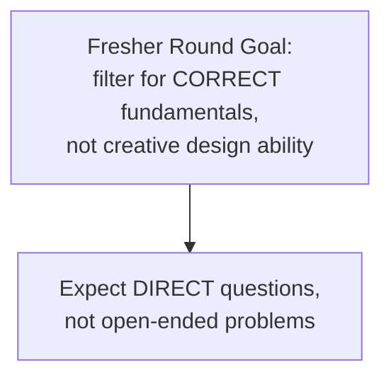

---

## 2. How the Round Is Usually Structured

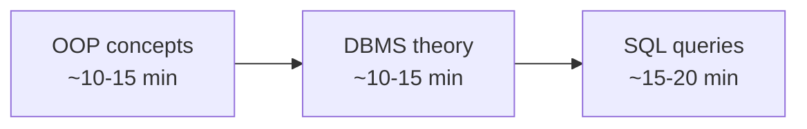

Most fresher interviews blend all three into one 30-45 minute conversation, often starting broad ("tell me about OOP") and narrowing into specifics based on your answers — meaning a vague first answer often invites a much harder follow-up, while a precise, complete first answer sometimes ends that sub-topic quickly.

---

## 3. OOP Sub-Round Strategy

### What gets asked, almost every time
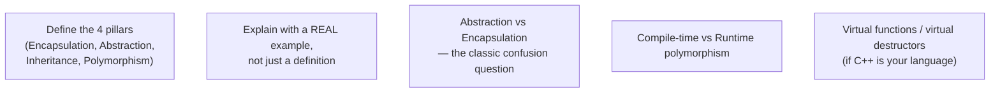

This maps directly onto the **OOP Fundamentals** topic covered earlier in this series — the `BankAccount` (encapsulation) and `PaymentMethod`/`Shape` (abstraction, polymorphism) examples used there are exactly the kind of concrete answer that scores well here, rather than a bare definition.

### The strategy
- **Never answer with just a definition.** "Encapsulation is bundling data and methods" is a weak, incomplete answer on its own — always follow it immediately with a concrete example and, ideally, *why* it matters (e.g., "...which lets me enforce that a bank balance can never go negative, in exactly one place").
- **Anticipate the Abstraction-vs-Encapsulation follow-up.** This is asked so often it's worth having a crisp, rehearsed one-liner ready: *"Encapsulation is about HOW data is protected — private fields, public methods. Abstraction is about WHAT the user of a class needs to know — hiding implementation complexity behind a simple interface."*
- **If asked about virtual destructors**, don't just say "you need them for polymorphism" — explain the *actual failure mode* (a derived class's destructor being silently skipped, causing a resource leak) — this signals real understanding, not memorization.

---

## 4. DBMS Sub-Round Strategy

### What gets asked, almost every time
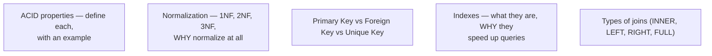

This directly overlaps with Phase 1's **SQL vs NoSQL** and **Database Indexing** topics — the B-Tree explanation and the "why an index avoids a full table scan" reasoning from that topic is exactly the depth expected here.

### The strategy
- For **normalization**, don't just recite "1NF removes repeating groups, 2NF removes partial dependencies, 3NF removes transitive dependencies" — be ready to **normalize a small example table live**, since this is a very common practical follow-up (e.g., "here's a messy table, walk me through normalizing it to 3NF").
- For **ACID**, have one crisp real-world example ready per letter — the bank transfer example from OOP Fundamentals/Concurrency Control ("Atomicity: either both the debit and credit happen, or neither does") works well here too, since it's memorable and precise.
- For **indexes**, the strongest answers mention the actual mechanism (a B-Tree, avoiding a full scan) rather than just "it makes queries faster" — vague answers here almost always invite a "how does it actually work internally?" follow-up.

---

## 5. SQL Sub-Round Strategy

### What gets asked, almost every time
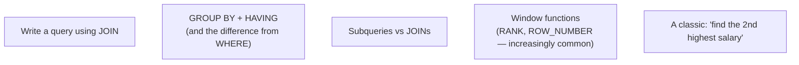

### The strategy
- **WHERE vs HAVING** is a near-guaranteed question: *"WHERE filters rows BEFORE grouping; HAVING filters groups AFTER aggregation — so you can't use an aggregate function like `COUNT()` in a WHERE clause, but you can in HAVING."* Have this exact distinction ready verbatim.
- **The "Nth highest salary" family of questions** shows up constantly across fresher rounds — practicing this pattern once (using `ORDER BY ... LIMIT` with an `OFFSET`, or a window function like `DENSE_RANK()`) covers a large fraction of what actually gets asked, since interviewers frequently reuse this exact template with minor variations.
- **Talk through your query out loud** as you write it — interviewers evaluating written SQL almost always weight your **reasoning process** as much as the final syntax; a correct query explained poorly often scores worse than a nearly-correct query explained with clear logic.

---

## 6. Common Traps in This Round

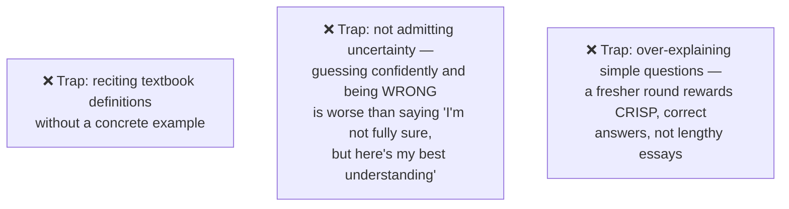

---

# Part 2: LLD / Machine Coding Round Strategy

## 7. What This Round Actually Tests

Unlike the fresher round's fact-recall style, this round tests whether you can take an **ambiguous, open-ended prompt** (like "design a parking lot") and turn it into **working, well-structured code** within a limited time window — exactly the kind of problem walked through in this series' Parking Lot, Elevator, Library, Vending Machine, and ATM topics.

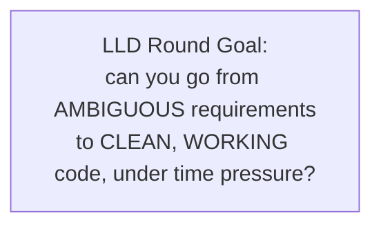

---

## 8. The Time Budget

Most LLD/machine coding rounds run **45-90 minutes**. A rough, reusable time allocation:

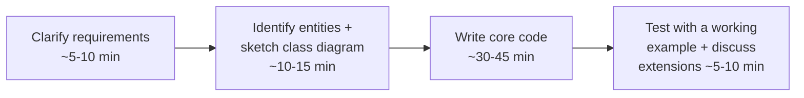

**The single most common time-management mistake:** jumping straight into code at minute 2, without clarifying scope — this almost always leads to either running out of time on an over-engineered solution, or building the wrong thing entirely and needing a costly restart.

---

## 9. The Structured Approach, Step by Step

This is a direct distillation of the process followed for *every* LLD problem in this series — reusing it explicitly, under time pressure, is the actual skill being tested.

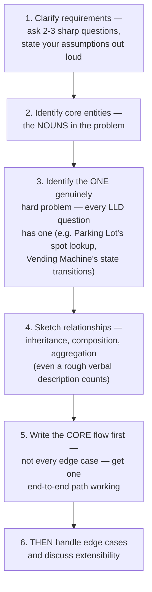

- **Step 1 matters more than it seems.** Asking "should this support multiple vehicle sizes?" or "do we need to handle concurrent bookings?" doesn't just gather information — it **signals** to the interviewer that you think about scope deliberately, which itself is part of what's being evaluated.
- **Step 3 is the differentiator.** Every problem in this series had one standout hard problem (efficient spot lookup, the SCAN algorithm, Book-vs-BookCopy, the State Pattern's fit, cash-dispensing via Chain of Responsibility). Explicitly naming *"I think the interesting part of this problem is X"* out loud shows you can distinguish the core challenge from incidental details — a skill many candidates never demonstrate, even with correct code.
- **Steps 5 before 6 is a deliberate ordering.** A working, simple solution that handles the happy path completely beats a half-finished solution that tried to handle every edge case from the start. Interviewers can always ask "what if X fails?" afterward — you can't recover time lost to premature edge-case handling.

---

## 10. What Separates a Pass from a Fail

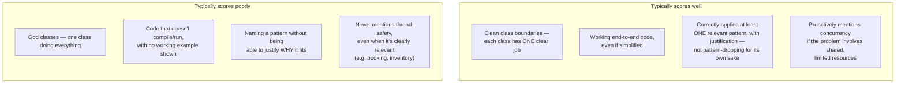

**A specific, high-leverage habit:** whenever the problem involves a shared, limited resource (a parking spot, a seat, an account balance, the last book copy) — and it almost always does — proactively say the words *"this needs to be thread-safe"* and briefly explain how (a mutex, an atomic check-and-set), even if you don't have time to fully implement it. This single habit, demonstrated repeatedly throughout this series' LLD topics, disproportionately signals seniority relative to how much time it costs to mention.

---

# Part 3: Simplified HLD Round Strategy

## 11. What This Round Actually Tests (and How It Differs From LLD)

A "simplified" HLD round (common for SDE-1/fresher-to-early-career interviews, as opposed to a full staff/senior HLD round) tests whether you understand the **big building blocks** covered in this series' Phase 1 and Phase 2 topics — load balancers, caching, databases, basic scaling — and can combine them sensibly for a moderately-scoped system, **without** expecting deep, staff-level tradeoff analysis on every single decision.

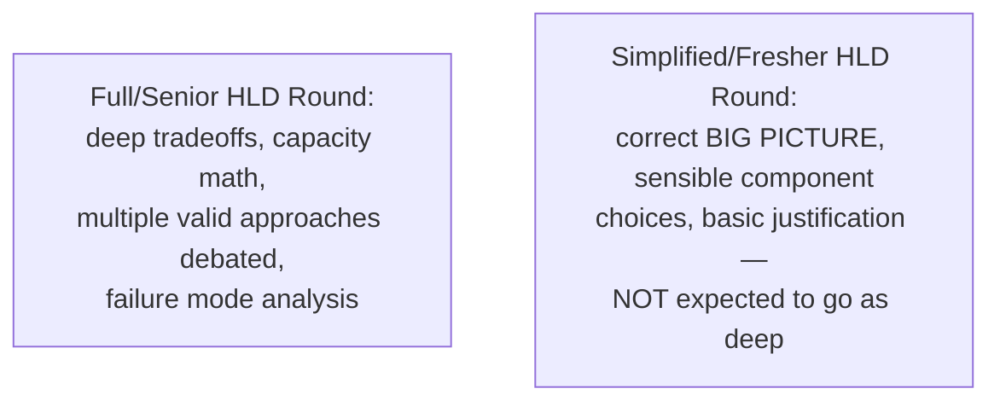

---

## 12. The Structured Approach, Step by Step

The same overall process from this series' Phase 2 HLD topics still applies — just calibrated lighter.

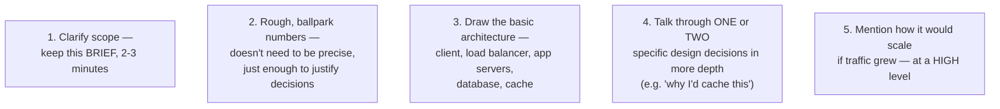

### What to intentionally keep light in this round
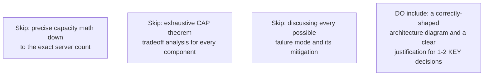

---

## 13. Calibrating Depth to a "Simplified" Round

The single biggest mistake candidates make in a *simplified* HLD round is **either direction of miscalibration**:

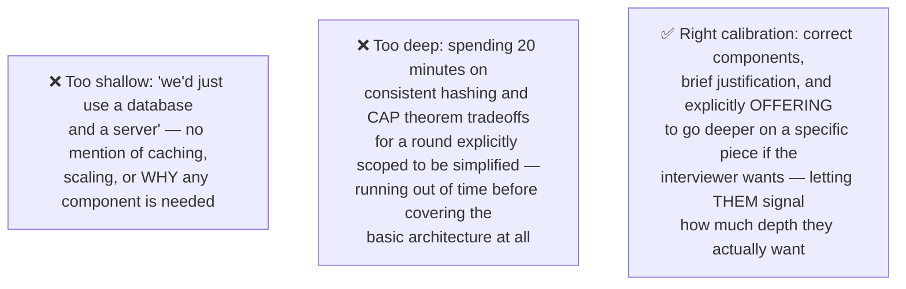

**A genuinely useful tactic:** after sketching the basic architecture, ask *"would you like me to go deeper on any particular part of this — like how I'd scale the database, or the caching strategy?"* This does two things: it respects the round's intended scope by not assuming excessive depth is wanted, and it hands the interviewer explicit control over where the remaining time goes, which interviewers consistently respond well to.

---

# Part 4: Scenario-Based MCQ Strategy (HackerRank/AMCAT/CoCubes)

## 14. What Makes These Different From Normal MCQs

Scenario-based MCQs describe a short situation ("A team is deciding between two caching strategies for a read-heavy system...") and ask you to pick the best option among 4 plausible-sounding choices — testing **applied judgment**, not memorized fact recall. These are common in campus-hiring platforms (HackerRank, AMCAT, CoCubes) specifically because they're easy to auto-grade at scale while still probing real understanding.

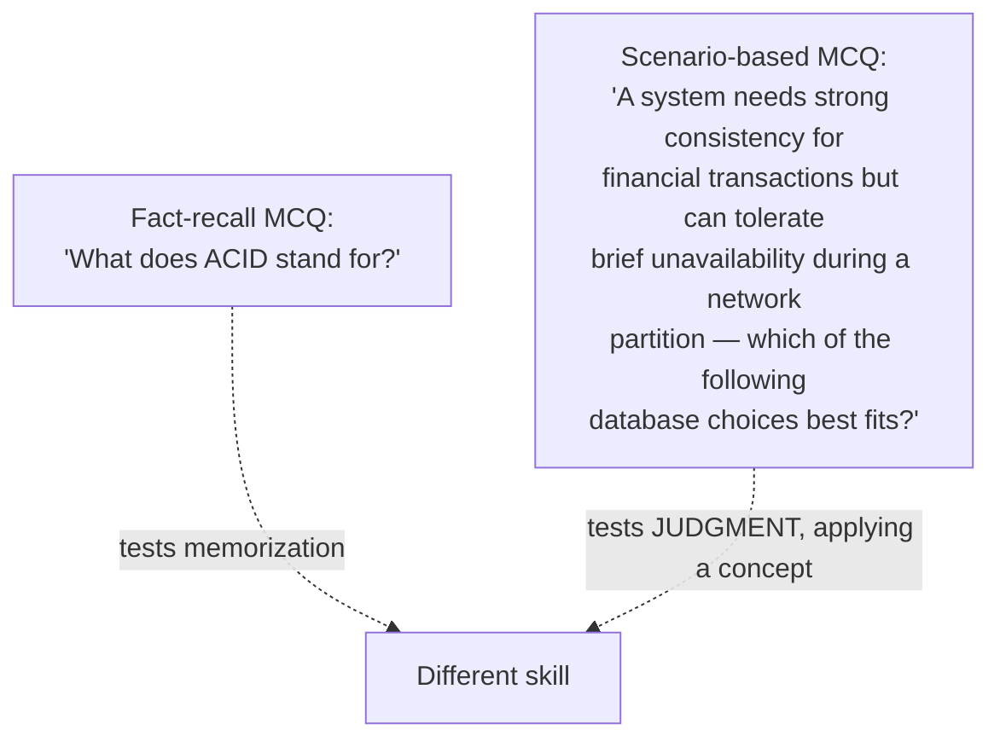

---

## 15. A Framework for Approaching Each Question

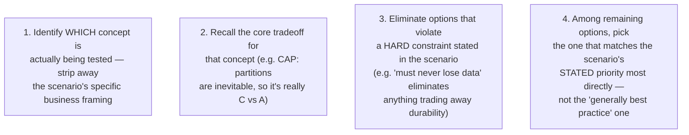

- **Step 1 is the most important, and most-skipped step.** A question describing an e-commerce checkout flow with a payment timeout is really just testing **idempotency** (from this series' API Design and E-commerce Order Flow topics) — recognizing "oh, this is an idempotency question" immediately narrows four plausible-sounding answers down to one correct pattern.
- **Step 3 (elimination via hard constraints) is often faster than evaluating every option from scratch.** Scenario MCQs frequently include 1-2 options that are plausible in general but violate something explicitly stated in the prompt — actively hunting for that violation is usually faster than fully reasoning through all four options independently.
- **Step 4 is a genuine trap for over-preparation.** These questions often reward the choice that fits the **specific scenario's stated priority** (e.g., "prioritizes availability") even when a different choice would be the generally-preferred default in a vacuum — read the scenario's stated constraint as the deciding factor, not your own general preference.

---

## 16. Common Question Patterns & How to Recognize Them

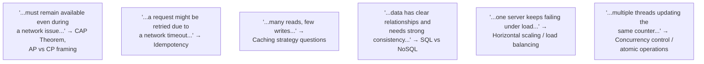

Every single one of these patterns maps directly to a topic already covered in depth across this series — the scenario framing changes, but the underlying concept being tested is drawn from a fairly small, recurring pool (CAP theorem, idempotency, caching, SQL vs NoSQL, scaling, concurrency) that shows up disproportionately often across these platforms.

---

# Wrap-up

## 17. How the Four Rounds Fit Together

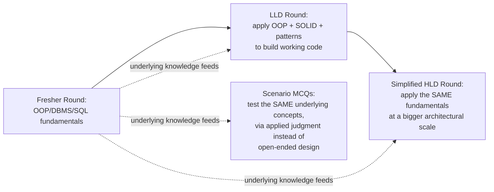

None of these four rounds are testing genuinely separate bodies of knowledge — they're testing the **same core concepts** (encapsulation, indexing, caching, concurrency, scaling, tradeoffs) at different **depths** and through different **formats** (recall, code, architecture, multiple-choice judgment). Preparation that builds real understanding of the underlying concepts — exactly the goal of this entire series — transfers cleanly across all four, rather than needing to be separately memorized per round type.

---

## 18. Quick Recall Cheat Sheet

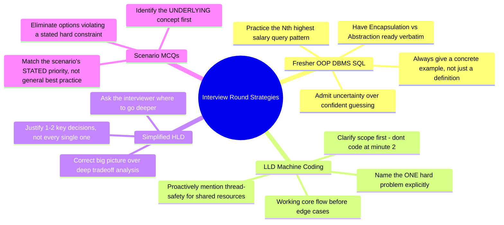

| If you remember only 5 things |
|---|
| 1. Fresher rounds reward concrete examples over textbook definitions — always follow a definition with a real, specific illustration. |
| 2. LLD rounds are won or lost on time management — clarify scope first, name the one genuinely hard problem explicitly, and get a working core flow before chasing edge cases. |
| 3. In a simplified HLD round, get the big picture right and justify 1-2 key decisions well, rather than over-indexing on deep tradeoff analysis the round wasn't scoped for. |
| 4. Scenario MCQs test applied judgment, not recall — identify which underlying concept is really being tested, then eliminate options that violate the scenario's stated hard constraints. |
| 5. All four rounds draw from the same core concept pool (concurrency, caching, scaling, tradeoffs, indexing) — deep understanding of the fundamentals transfers across every round format. |

---

*This file is written in GitHub-flavored Markdown with Mermaid diagrams — it will render natively on GitHub, GitLab, and most modern Markdown viewers.*
