# API Gateway: Role & Responsibilities

*A zero-to-mastery guide for system design interviews and real-world architecture.*

---

## Table of Contents
1. [What Is an API Gateway?](#1-what-is-an-api-gateway)
2. [Why It's Needed](#2-why-its-needed)
3. [Where It Sits in the System](#3-where-it-sits-in-the-system)
4. [Core Responsibilities](#4-core-responsibilities)
5. [Request Routing in Detail](#5-request-routing-in-detail)
6. [Cross-Cutting Concerns Handled Centrally](#6-cross-cutting-concerns-handled-centrally)
7. [The API Gateway Is Also a Single Point of Failure](#7-the-api-gateway-is-also-a-single-point-of-failure)
8. [API Gateway vs Load Balancer — Clearing Up the Confusion](#8-api-gateway-vs-load-balancer--clearing-up-the-confusion)
9. [How to Reason About This in an Interview](#9-how-to-reason-about-this-in-an-interview)
10. [Quick Recall Cheat Sheet](#10-quick-recall-cheat-sheet)

---

## 1. What Is an API Gateway?

An **API Gateway** is a single entry point that sits in front of all your backend services, and handles every incoming request before it reaches the actual application logic.

Think of it like the reception desk at a large corporate office building with dozens of departments. You don't wander the halls trying to find the right department yourself — you walk up to reception, say what you need, and the receptionist checks your ID, figures out which department handles your request, and directs you there. You never talk to the departments directly.

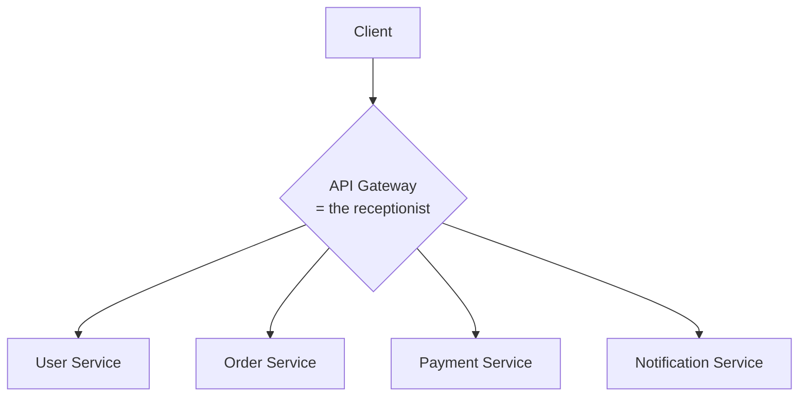

---

## 2. Why It's Needed

This topic connects directly to microservices: once an application is split into multiple independent services, clients face a real problem — how do they know which of the many services to talk to, and how do they avoid repeating the same security/logging logic in every single service?

### Without an API Gateway

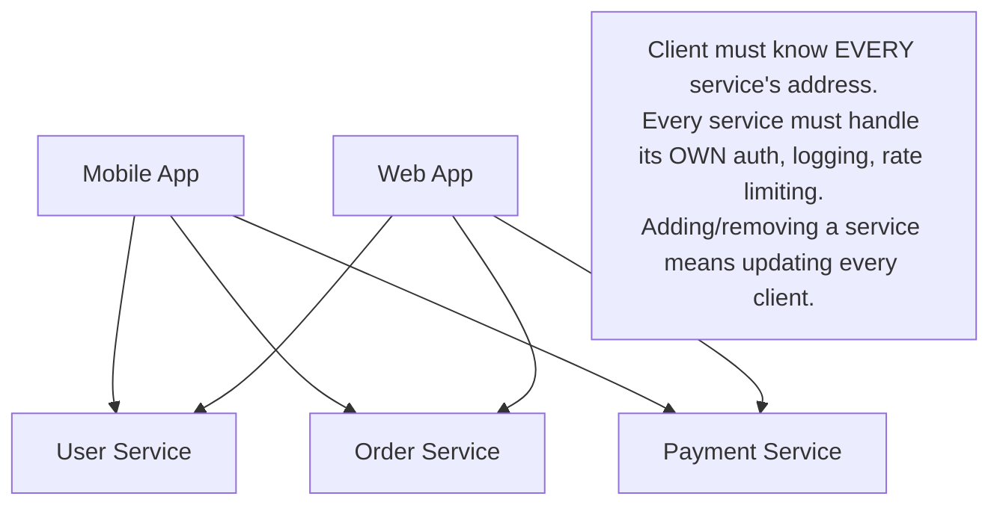

### With an API Gateway

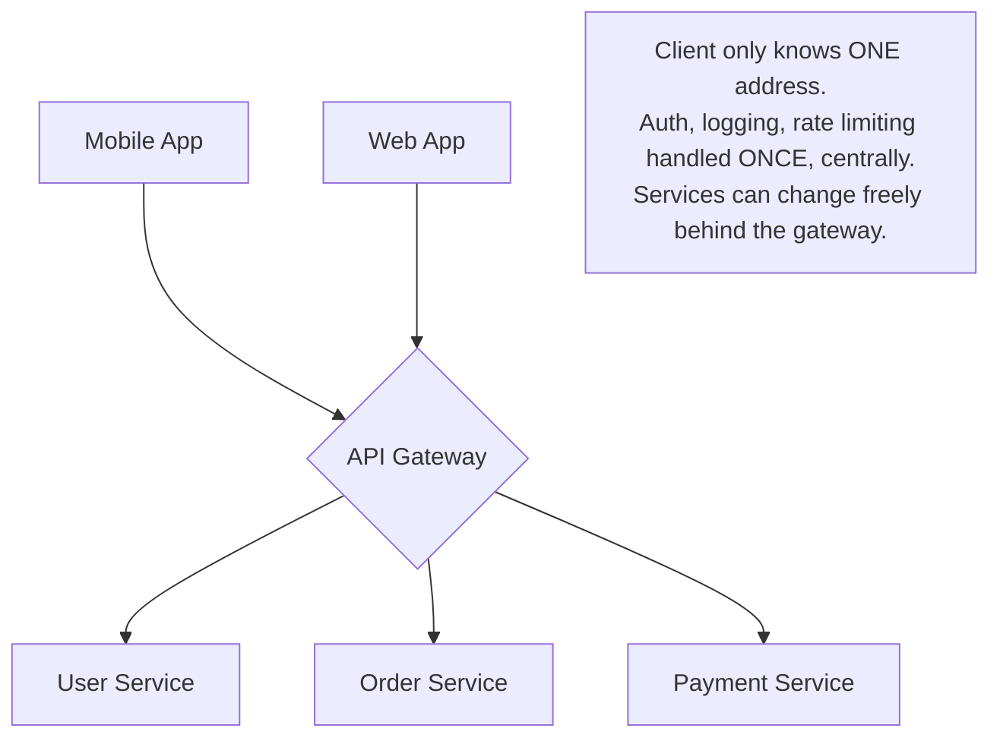

### The core reasons you need one
- **Single entry point** — clients talk to one address instead of tracking dozens of service locations.
- **Avoids duplicated logic** — things like authentication, logging, and rate limiting are written once at the gateway, instead of being reimplemented in every single microservice.
- **Decouples clients from your internal architecture** — you can split, merge, rename, or move services behind the gateway without ever touching client code.
- **Centralized control point** — a single place to enforce security policy, monitor traffic, and roll out changes like rate limits across the entire system.

---

## 3. Where It Sits in the System

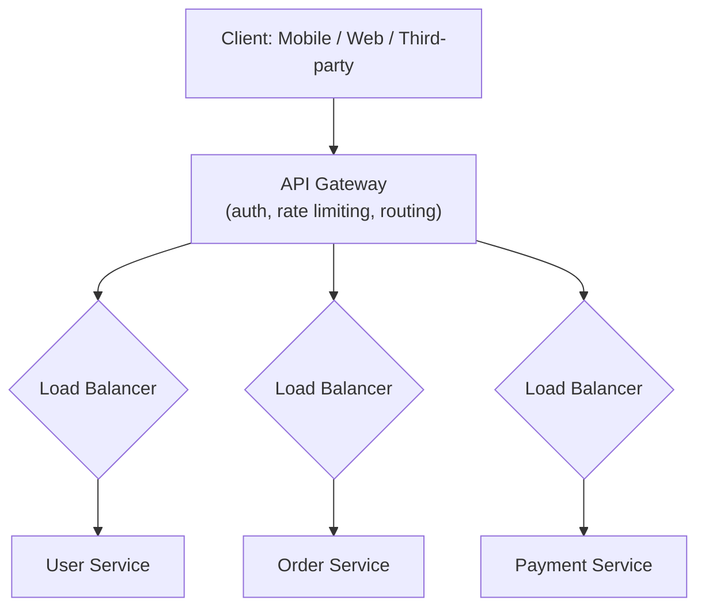

Notice the API Gateway sits **in front of** the load balancers for each service — it's the very first thing a request touches, before any service-specific routing or scaling logic kicks in. (Recall from the Load Balancing topic that a load balancer distributes traffic across *instances of one service*; the gateway operates one level up, deciding *which service* to send a request to in the first place.)

---

## 4. Core Responsibilities

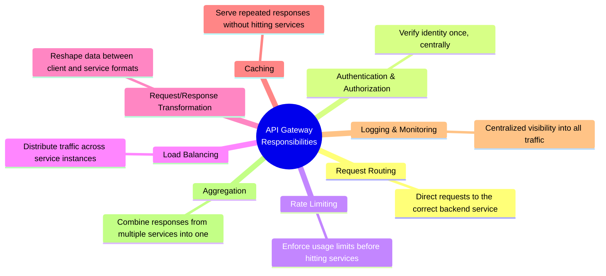

Each of these deserves its own explanation — covered below.

---

## 5. Request Routing in Detail

The most fundamental job of a gateway: look at each incoming request (usually the URL path) and forward it to the correct backend service.

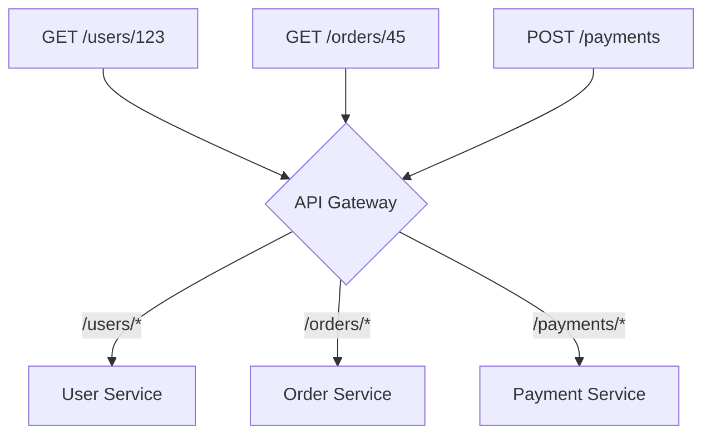

### Request Aggregation — a routing superpower
Sometimes a single client request actually needs data from **multiple** backend services (e.g., a mobile app's "order summary" screen needs order details, payment status, and user info all at once). Instead of making the client call three separate services and stitch the results together itself, the gateway can do this on the client's behalf.

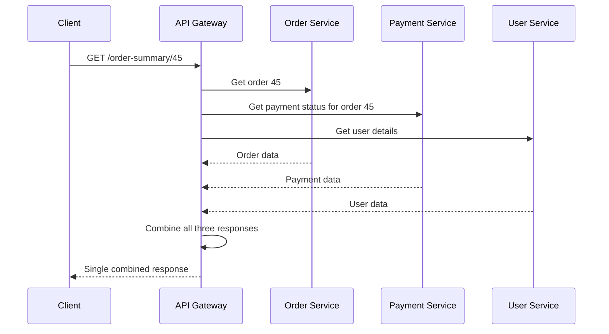

- **Why this matters:** the client makes **one** request instead of three, which is especially valuable for mobile clients on slow/unreliable networks — fewer round trips means a faster, more resilient experience.

---

## 6. Cross-Cutting Concerns Handled Centrally

"Cross-cutting concerns" are things that *every* service would otherwise need to implement individually — the gateway centralizes them so services don't have to.

### Authentication & Authorization
The gateway verifies **who** is making the request (authentication) and checks **what** they're allowed to do (authorization) — often by validating a token — before the request ever reaches a backend service.

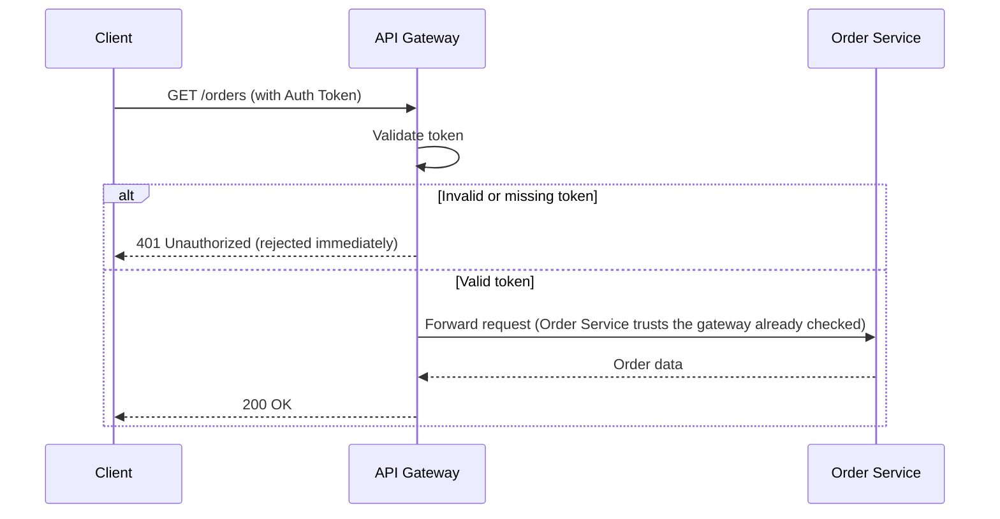

- This means individual services **don't need to reimplement auth logic themselves** — they can trust that anything reaching them has already been verified by the gateway.

### Rate Limiting
The gateway enforces request limits *before* traffic reaches backend services — exactly the concept covered in the Rate Limiting topic, just applied at this specific layer, so abusive traffic never even reaches your actual application logic.

### Request/Response Transformation
The gateway can reshape data in-flight — e.g., converting an older client's expected data format into what a newer backend service actually returns, without requiring the client to update.

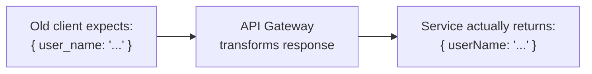

### Caching
The gateway can cache responses for frequently-requested, rarely-changing data (recall the Caching topic), serving repeat requests instantly without even reaching the backend service.

### Logging & Monitoring
Since **every** request passes through the gateway, it's the ideal single place to log traffic, track latency, and monitor errors across the entire system — instead of piecing together logs from a dozen different services.

---

## 7. The API Gateway Is Also a Single Point of Failure

Just like the load balancer discussed earlier, the gateway itself sits directly in the path of *every single request* — if it goes down, nothing gets through, even if every backend service behind it is perfectly healthy.

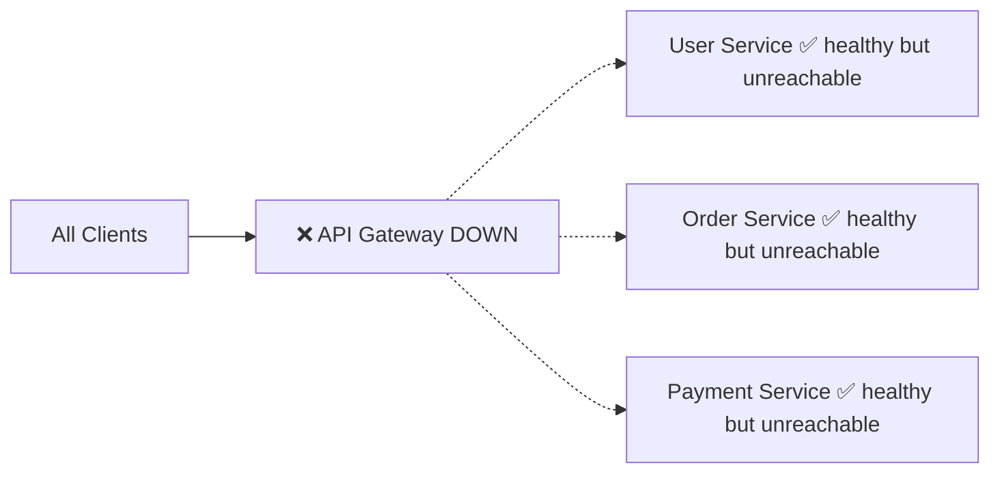

### The fix: redundant gateway instances
Just like any other critical component, production systems run **multiple gateway instances** behind their own load balancer, so no single gateway instance is a fatal point of failure.

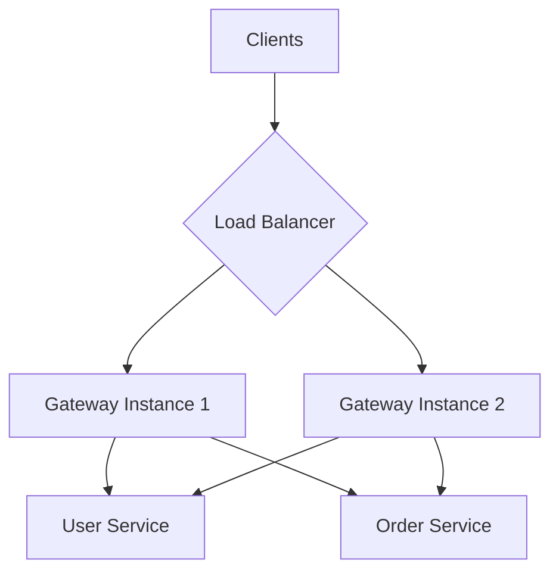

**Takeaway:** this is the same recurring pattern seen with load balancers — every layer added to solve one problem needs its own redundancy plan, or it just becomes the next single point of failure.

---

## 8. API Gateway vs Load Balancer — Clearing Up the Confusion

These two are frequently mixed up, since both sit "in front of" backend services — but they solve different problems.

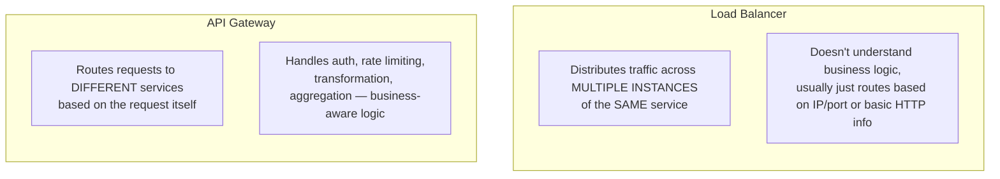

| | Load Balancer | API Gateway |
|---|---|---|
| **Distributes traffic across** | Multiple instances of the *same* service | *Different* services entirely |
| **Awareness** | Mostly network-level (IP, port, basic HTTP) | Application-level (auth, request content, business logic) |
| **Typical responsibilities** | Even traffic distribution, health checks | Routing, auth, rate limiting, transformation, aggregation |
| **Where it sits relative to the other** | Usually *behind* the gateway, in front of each service's instances | Usually the very first thing a client request hits |

**In practice, they work together** — as shown in Section 3, the gateway decides *which service* handles a request, and the load balancer behind it decides *which instance* of that service actually processes it.

---

## 9. How to Reason About This in an Interview

If asked *"how would clients interact with your microservices?"*, a strong answer sounds like this:

> "I'd put an API Gateway in front of all the services, so clients only ever talk to one address, and don't need to know how the backend is internally split up. The gateway would handle authentication centrally — validating tokens once, so individual services can trust that anything reaching them is already verified — and I'd enforce rate limiting there too, so abusive traffic never even reaches the backend services. For any client screen that needs data from multiple services, like an order summary needing order, payment, and user data, I'd use the gateway's aggregation capability to combine those into a single response, reducing round trips for the client. Since the gateway sits in the path of every request, it becomes a critical single point of failure, so I'd run multiple gateway instances behind their own load balancer rather than a single instance. And I'd keep it distinct from the load balancer in my head — the load balancer spreads traffic across instances of one service, while the gateway decides which service handles the request in the first place, and the two typically work together, gateway first, then load balancer per service."

That answer shows: you understand *why* a gateway is needed (especially in a microservices context), you know its *specific responsibilities* beyond just "routing," you catch that it's a *new single point of failure* needing redundancy, and you can clearly *distinguish it from a load balancer* — a very common follow-up/trick question.

---

## 10. Quick Recall Cheat Sheet

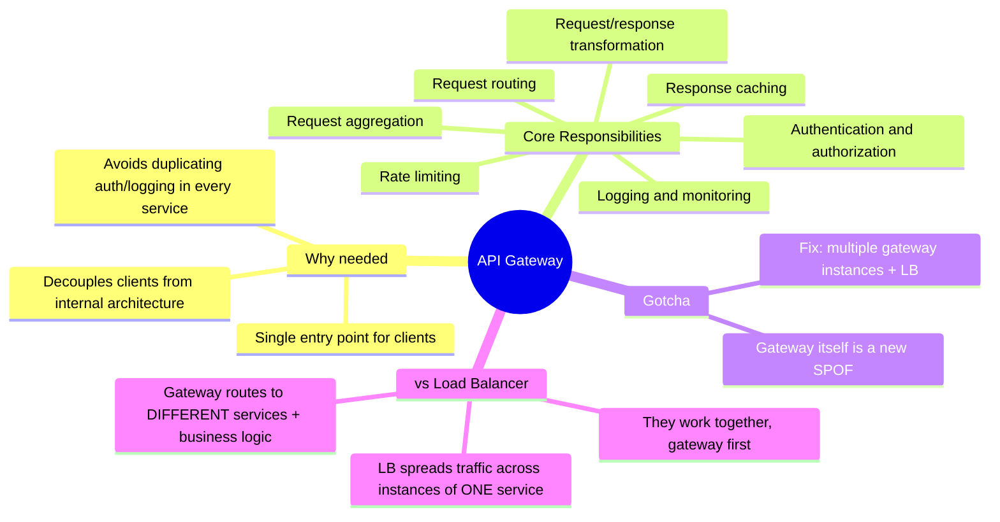

| If you remember only 5 things |
|---|
| 1. An API Gateway is the single entry point clients talk to, sitting in front of all backend services. |
| 2. It centralizes cross-cutting concerns — auth, rate limiting, logging, caching — so individual services don't reimplement them. |
| 3. It can aggregate responses from multiple services into one, reducing round trips for the client. |
| 4. The gateway itself becomes a new single point of failure — production systems run multiple gateway instances behind a load balancer. |
| 5. Gateway ≠ Load Balancer: the gateway routes to *different* services with business-aware logic; the load balancer distributes traffic across *instances of the same* service. |

---

*This file is written in GitHub-flavored Markdown with Mermaid diagrams — it will render natively on GitHub, GitLab, and most modern Markdown viewers.*
