# Performance Metrics: Latency, Throughput, Availability

*A zero-to-mastery guide for system design interviews and real-world architecture.*

---

## Table of Contents
1. [Why These Three Metrics Matter](#1-why-these-three-metrics-matter)
2. [Latency](#2-latency)
3. [Throughput](#3-throughput)
4. [The Latency vs Throughput Trade-off](#4-the-latency-vs-throughput-trade-off)
5. [Availability](#5-availability)
6. [The "Nines" of Availability](#6-the-nines-of-availability)
7. [How All Three Interact Together](#7-how-all-three-interact-together)
8. [How to Reason About This in an Interview](#8-how-to-reason-about-this-in-an-interview)
9. [Quick Recall Cheat Sheet](#9-quick-recall-cheat-sheet)

---

## 1. Why These Three Metrics Matter

Every system design decision you make — caching, sharding, load balancing, scaling — ultimately exists to move one or more of these three numbers in the right direction. Before you can meaningfully discuss *any* system's performance, you need a precise vocabulary for describing it — vague words like "fast" or "reliable" don't hold up in a design discussion.

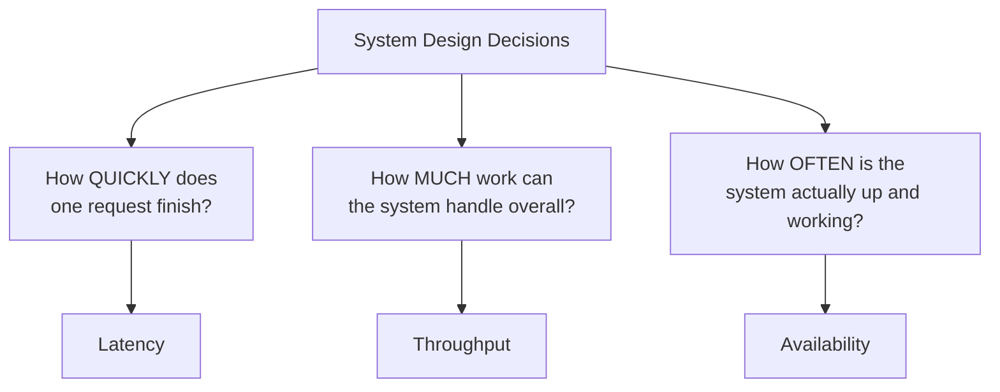

---

## 2. Latency

### The idea
**Latency** is the time it takes for **a single request** to complete — from the moment it's sent to the moment the response comes back. It's measured in time (milliseconds, seconds).

Think of it like ordering one coffee at a cafe: latency is how long *you personally* wait, from placing your order to getting your cup in hand.

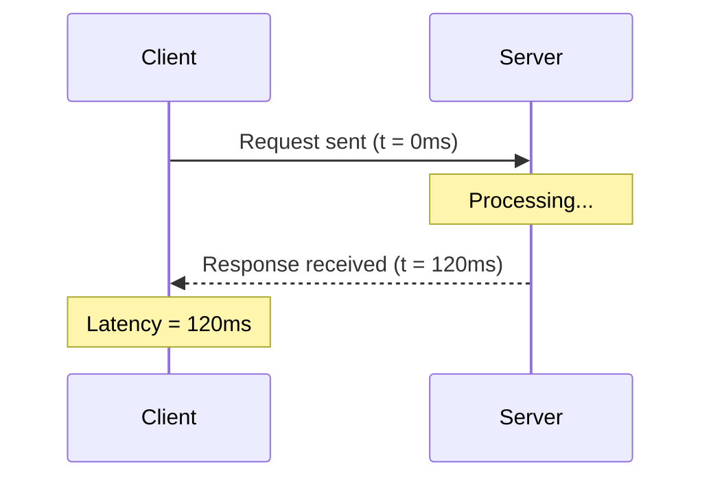

### Where latency actually comes from
A single request's total latency is the sum of several individual delays, each of which is a separate thing to optimize:

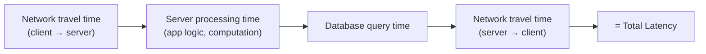

- **Network latency** — physical distance and network conditions between client and server (this is exactly why CDNs and geographic sharding, covered earlier, help — putting servers physically closer to users reduces this).
- **Processing latency** — how long the server's own code takes to run.
- **Database latency** — how long a query takes (this is exactly why caching and indexing exist — to cut this down).

### Average latency can be misleading — enter percentiles
If you only look at *average* latency, you can be badly misled. A system where most requests are fast but a few are extremely slow can have a perfectly good-looking average while actually delivering a terrible experience to a meaningful chunk of users.

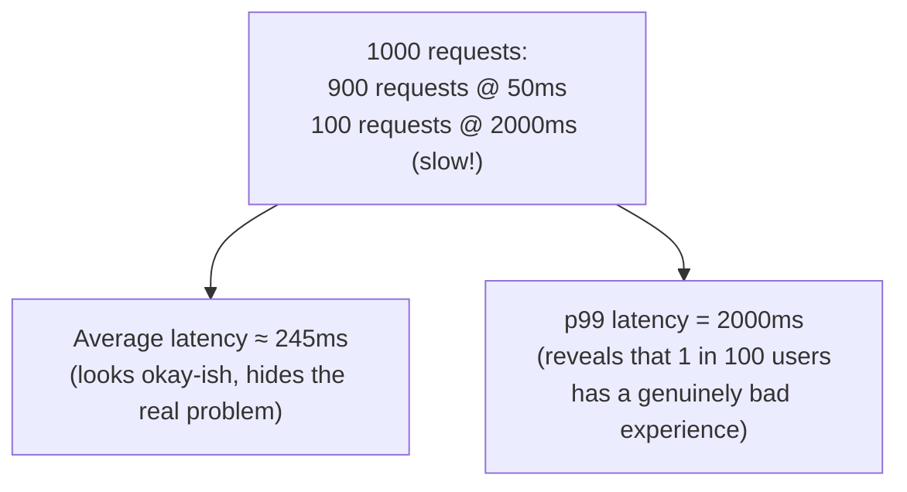

This is why real systems measure **percentiles** instead of (or alongside) averages:

| Metric | Meaning |
|---|---|
| **p50 (median)** | 50% of requests were faster than this value |
| **p95** | 95% of requests were faster than this value (5% were slower) |
| **p99** | 99% of requests were faster than this value (the slowest 1% — often where real problems hide) |

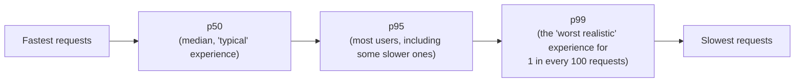

**Interview tip:** always mention p99 (or p95), not just averages — it signals you understand that the "typical" user experience isn't the whole story; the worst-case tail matters a lot at real scale (1% of a million daily requests is still 10,000 bad experiences).

---

## 3. Throughput

### The idea
**Throughput** is how much **total work** a system can handle in a given period of time — commonly measured as requests per second (RPS/QPS) or transactions per second (TPS).

Continuing the cafe analogy: throughput is how many total coffees the cafe can serve *across all customers* in an hour — not how fast any one person's order came out.

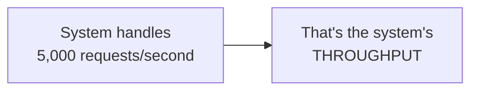

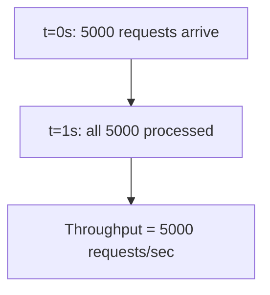

### What determines throughput
Throughput generally improves with the exact techniques already covered in this series:
- **Horizontal scaling** (Day 1) — more servers processing requests in parallel means more total requests handled per second.
- **Load balancing** (Day 2) — ensures that added capacity is actually used evenly, so throughput scales as expected when you add servers.
- **Caching** (Day 3) — requests served from cache don't hit the database at all, freeing up database capacity to handle more of the requests that do need it.

---

## 4. The Latency vs Throughput Trade-off

These two metrics are related, but improving one does **not** automatically improve the other — and sometimes optimizing for one actively hurts the other.

### Analogy: a highway
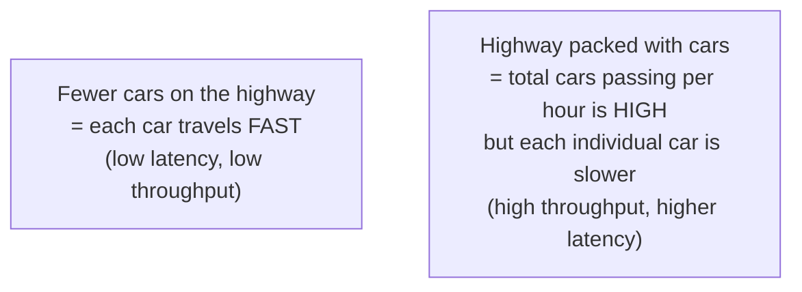

### A concrete technical example: batching
Imagine a system that processes database writes. It *could* write each request immediately (low latency per request), or it could **batch** several requests together and write them all at once every 100ms (better throughput, since batched writes are more efficient overall — but now each individual request waits up to 100ms longer).

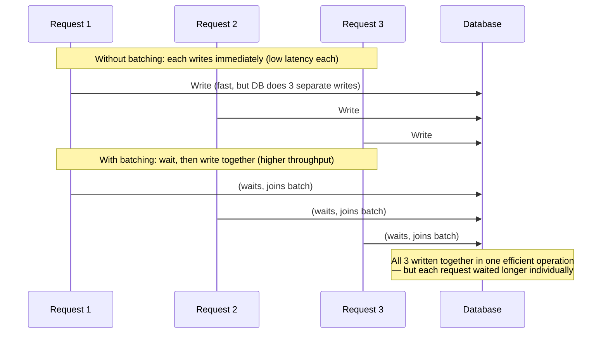

**The takeaway:** you often have to explicitly choose which one matters more for a given system — a real-time chat app cares deeply about low latency (batching messages for 100ms would feel laggy), while a nightly analytics pipeline processing billions of records cares far more about throughput than any single record's latency.

---

## 5. Availability

### The idea
**Availability** is the percentage of time a system is actually **up and successfully responding** to requests, over some period of time (usually measured monthly or yearly).

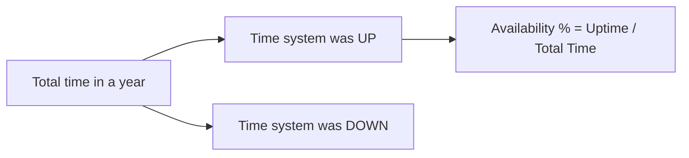

### Why it's distinct from latency and throughput
A system can have **excellent** latency and throughput while it's running, and still have **poor** overall availability if it crashes frequently or has long outages. These three metrics measure genuinely different things — a system needs to be good on all three, not just one.

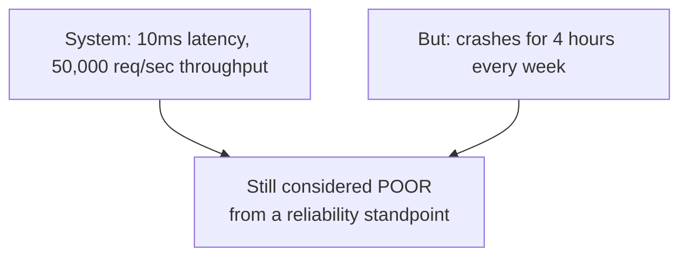

---

## 6. The "Nines" of Availability

Availability is often expressed as a percentage made up of repeating **9**s — and each additional nine represents a dramatically smaller allowed downtime.

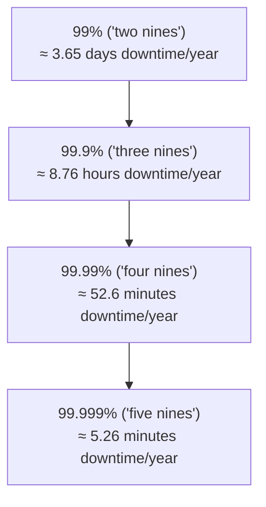

| Availability | Downtime per Year | Downtime per Month |
|---|---|---|
| 99% | ~3.65 days | ~7.3 hours |
| 99.9% | ~8.76 hours | ~43.8 minutes |
| 99.99% | ~52.6 minutes | ~4.4 minutes |
| 99.999% | ~5.26 minutes | ~26 seconds |

**Why this matters practically:** going from 99.9% to 99.99% availability isn't a small, incremental improvement — it typically requires fundamentally different engineering (redundancy at every layer, automated failover, no single points of failure anywhere) and costs significantly more to build and operate. This is why companies explicitly choose a target — an **SLA (Service Level Agreement)** — rather than just chasing "as much as possible," since each additional nine gets exponentially more expensive to achieve.

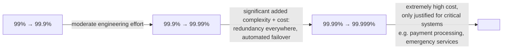

### How availability connects to earlier topics
Every redundancy pattern covered in this series exists specifically to push availability higher:
- **Multiple server instances + load balancing** — one server crashing doesn't take the whole system down.
- **Multiple load balancer / gateway instances** — avoids those components becoming a single point of failure.
- **Database replication** (briefly touched on in the Sharding topic) — a database going down doesn't mean total data loss or downtime.

---

## 7. How All Three Interact Together

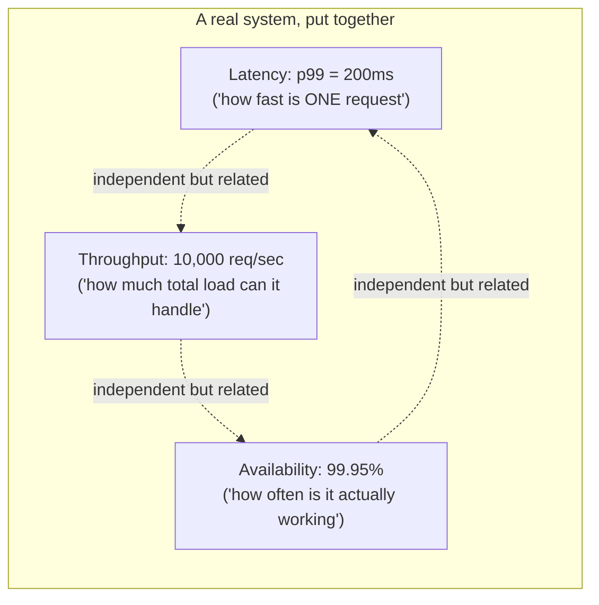

A system can fail on any one of these independently:
- **Good latency, poor throughput:** each request is fast, but the system falls over the moment traffic spikes (can't handle *volume*).
- **Good throughput, poor latency:** the system handles massive total load, but each individual request feels sluggish (e.g., a batch-processing pipeline — fine for its use case, terrible for a live chat app).
- **Good latency AND throughput, poor availability:** the system is fast and handles load well *when it's up* — but it crashes often or has long recovery times, so real-world reliability is bad regardless of how good it performs while running.

A complete performance discussion for any system design answer should touch on all three, not just one.

---

## 8. How to Reason About This in an Interview

If asked *"what are the key performance requirements for this system?"*, a strong answer sounds like this:

> "I'd think about this across three dimensions. Latency — how fast does a single request need to feel, and specifically at p99, not just the average, since the slowest 1% of requests still represents real users having a bad experience at scale. Throughput — how much total load does the system need to handle at peak, which tells me how much I need to horizontally scale and load balance. And availability — how much downtime is actually acceptable, expressed as a target like 99.9% or 99.99%, which directly shapes how much redundancy I need to build in, since each additional nine of availability gets significantly more expensive to achieve. These three aren't the same thing and can trade off against each other — for example, batching writes for better throughput adds latency to individual requests — so I'd figure out which of these three actually matters most for this specific system before optimizing, rather than assuming 'faster and more available' is free."

That answer shows: you use *precise* vocabulary (p99, not just "fast"), you understand these are *genuinely different* dimensions that can trade off against each other, and you connect availability targets to concrete engineering costs rather than treating "99.999%" as a number to casually promise.

---

## 9. Quick Recall Cheat Sheet

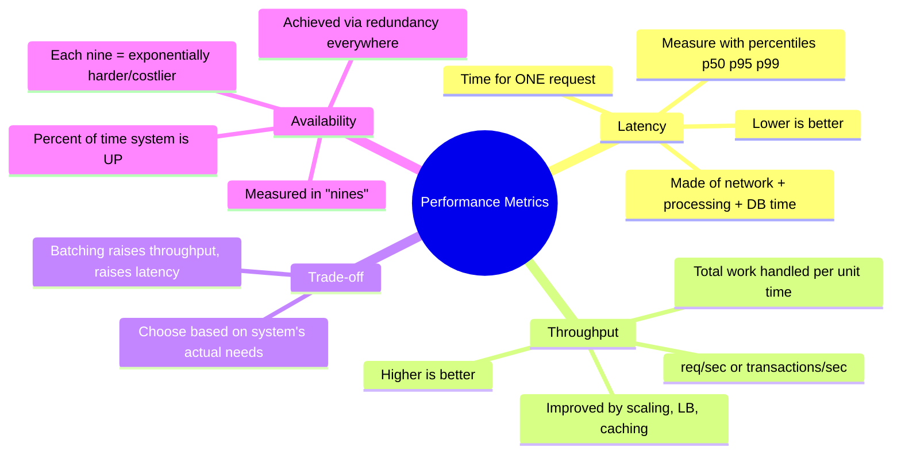

| If you remember only 5 things |
|---|
| 1. Latency = how long ONE request takes. Throughput = how MUCH total work the system handles. Availability = how OFTEN it's actually up. |
| 2. Always talk about latency in percentiles (p99), not just averages — averages hide how bad the worst 1% of requests really is. |
| 3. Latency and throughput can trade off against each other — e.g., batching improves throughput but adds latency to individual requests. |
| 4. Availability is expressed in "nines" — each additional nine (99.9% → 99.99%) means dramatically less downtime and dramatically more engineering effort/cost. |
| 5. A system needs to be good on all three independently — great latency and throughput don't matter if the system is frequently down. |

---

*This file is written in GitHub-flavored Markdown with Mermaid diagrams — it will render natively on GitHub, GitLab, and most modern Markdown viewers.*
