# Database Indexing

*A zero-to-mastery guide for system design interviews and real-world architecture.*

---

## Table of Contents
1. [What Is an Index?](#1-what-is-an-index)
2. [Why It's Needed](#2-why-its-needed)
3. [How an Index Actually Works: B-Trees](#3-how-an-index-actually-works-b-trees)
4. [Types of Indexes](#4-types-of-indexes)
5. [Composite Indexes & Column Order](#5-composite-indexes--column-order)
6. [The Cost of Indexes: It's Not Free](#6-the-cost-of-indexes-its-not-free)
7. [When an Index Won't Help](#7-when-an-index-wont-help)
8. [How to Reason About This in an Interview](#8-how-to-reason-about-this-in-an-interview)
9. [Quick Recall Cheat Sheet](#9-quick-recall-cheat-sheet)

---

## 1. What Is an Index?

A **database index** is a separate, extra data structure that lets the database find rows **without scanning the entire table**, the same way a book's index lets you jump straight to a page instead of reading the whole book to find a topic.


A database table without an index works exactly like that 500-page book with no index — to find a specific row, the database has no choice but to check every single row, one by one.

---

## 2. Why It's Needed

### Without an index: a full table scan

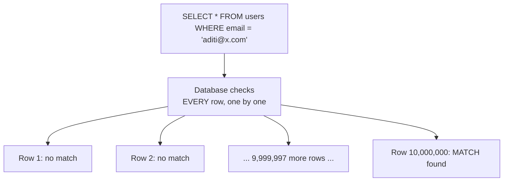

On a table with 10 million rows, finding one specific row this way is painfully slow — and it gets *worse*, not better, as the table grows.

### With an index

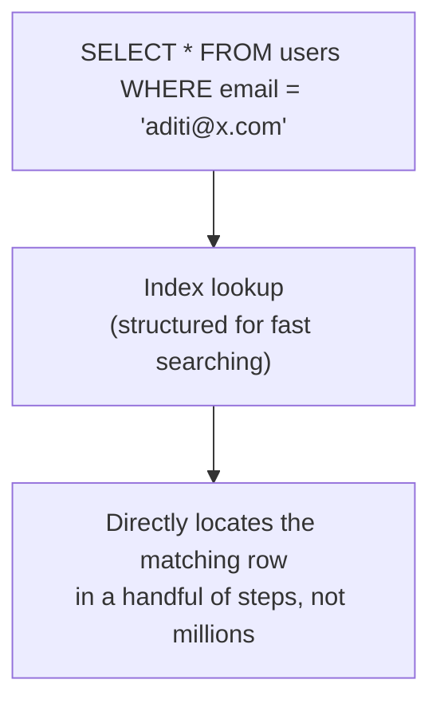

### The core reason you need indexes
- **Query speed** — turning a search that would take seconds (or longer) on a huge table into one that takes milliseconds.
- **This especially matters for `WHERE` clauses, `JOIN`s, and `ORDER BY`** — anything that requires the database to find or sort specific rows quickly, rather than reading the whole table.

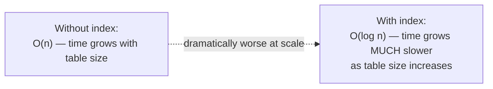

---

## 3. How an Index Actually Works: B-Trees

Most database indexes are built using a data structure called a **B-Tree** (or a close variant). Understanding the *shape* of this structure — even without memorizing every implementation detail — makes it obvious why indexes are so fast.

### The core idea
A B-Tree organizes data in a way that lets you find any value by making a small number of comparisons, repeatedly narrowing down which "branch" to follow — similar to how you'd search a phone book by repeatedly jumping to the middle of a range, rather than checking every name front to back.

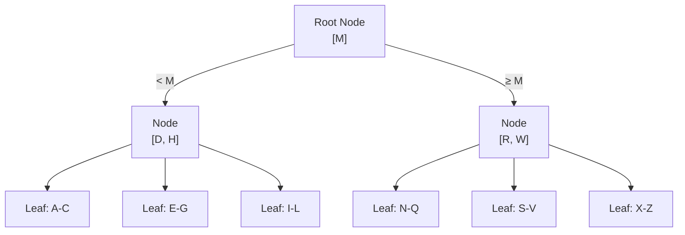

### Why this makes lookups so fast
Searching for a name starting with "T": start at the root, see "T ≥ M," go right. See "T is between R and W," narrow further. In just a few hops, you land on the exact leaf node containing the answer — rather than checking millions of rows individually.

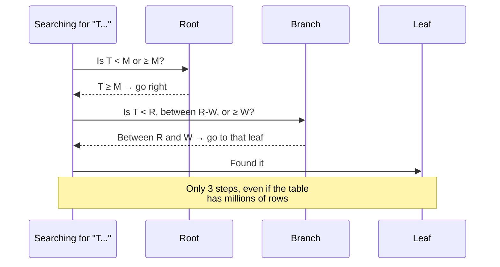

This is why index lookups scale so well — doubling the size of a table barely increases the number of steps needed to find a row, unlike a full scan where doubling the table size *doubles* the search time.

---

## 4. Types of Indexes

### Primary Index (Clustered Index)
Determines the **physical order** in which rows are actually stored on disk. A table typically has exactly **one** clustered index (usually built automatically on the primary key), since data can only be physically sorted one way at a time.

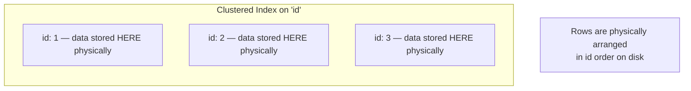

### Secondary Index (Non-Clustered Index)
A separate structure that points **to** the location of the actual row, rather than storing the row's data directly. A table can have **many** secondary indexes.

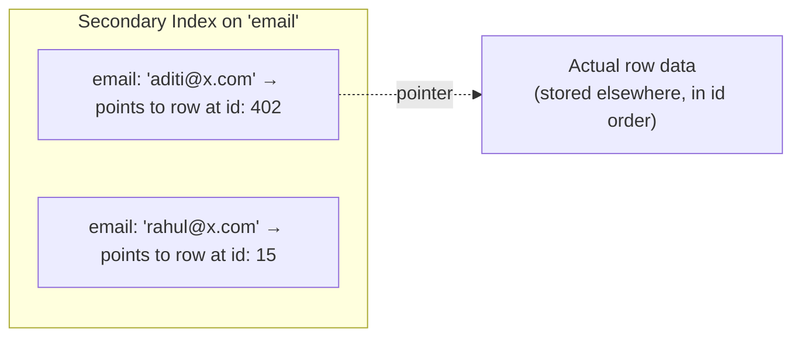

- **Good for:** any column you frequently search or filter by that *isn't* the primary key (e.g., searching users by email instead of by their internal ID).
- There's an extra step involved (follow the pointer to the actual row), making it very slightly slower than a clustered index lookup — but still vastly faster than a full table scan.

### Unique Index
Enforces that no two rows can have the same value in the indexed column(s), while *also* speeding up lookups on that column — commonly used on things like email addresses or usernames.

### Comparison

| Index Type | Physically orders data? | How many per table? | Common use |
|---|---|---|---|
| Clustered (Primary) | Yes | Usually 1 | Primary key lookups |
| Secondary (Non-Clustered) | No — points to data elsewhere | Many | Filtering by non-primary-key columns |
| Unique | No | Many | Enforcing + speeding up unique values (email, username) |

---

## 5. Composite Indexes & Column Order

A **composite index** covers **multiple columns together**, rather than just one. This is powerful, but the **order** of columns in the index matters enormously — it's a common interview gotcha.

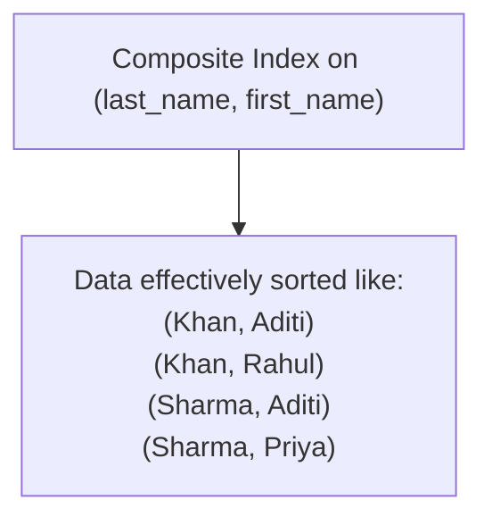

### The key rule: a composite index is only useful left-to-right
Think of it like a phone book sorted by last name, then first name. You can efficiently find "all Khans," or "the Khan named Aditi" — but you **cannot** efficiently find "everyone named Aditi" regardless of last name, since the phone book isn't sorted by first name at all.

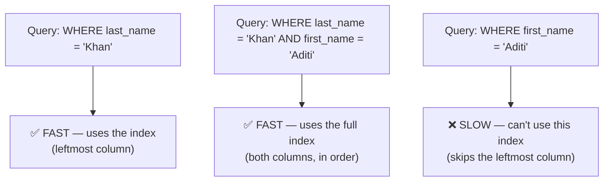

**Takeaway:** when creating a composite index, order the columns based on your actual query patterns — put the column you filter by most often (or most selectively) first.

---

## 6. The Cost of Indexes: It's Not Free

Indexes speed up **reads**, but they come with real costs — this is the part beginners often miss, assuming "more indexes = always better."

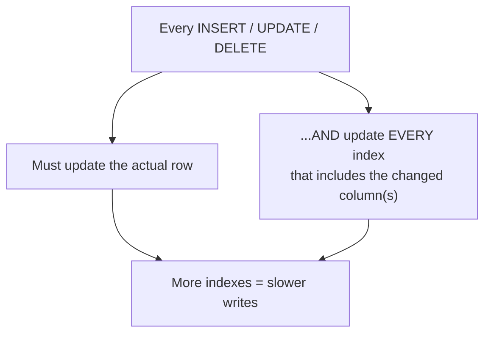

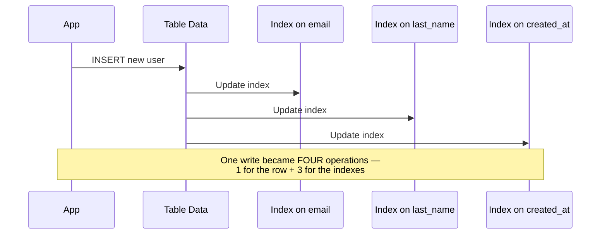

### The real trade-off
- **More indexes** → faster reads/searches, but slower writes (inserts/updates/deletes), and more disk space used to store the index structures themselves.
- **Fewer indexes** → faster writes, but slower reads on unindexed columns.

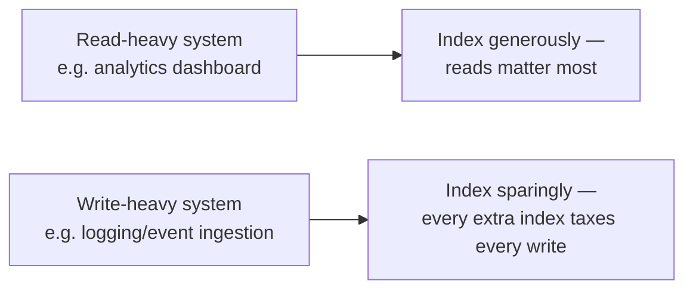

**Rule of thumb:** only index columns that are actually queried often (in `WHERE`, `JOIN`, or `ORDER BY` clauses) — indexing every column "just in case" quietly makes every write slower for little real benefit.

---

## 7. When an Index Won't Help

Indexes aren't a universal fix — they only help under specific conditions.

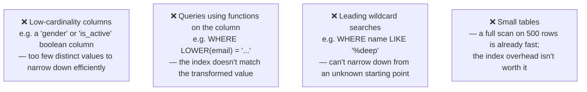

- **Low cardinality:** if a column only has 2-3 possible values (like a boolean), an index barely narrows down the search — the database might still need to check a huge fraction of rows.
- **Leading wildcards:** `LIKE '%deep'` can't use a standard index efficiently, because the index is sorted by the *start* of the string, and this query doesn't know the start.
- **Small tables:** if a table only has a few hundred rows, a full scan is already fast enough that the extra maintenance cost of an index isn't worth it.

---

## 8. How to Reason About This in an Interview

If asked *"this query is slow — how would you speed it up?"*, a strong answer sounds like this:

> "First I'd check if there's an index on the columns used in the `WHERE` clause — if the database is doing a full table scan on a large table, that's usually the biggest win available. I'd add an index on the filtered column, and if the query filters on multiple columns together, I'd use a composite index, ordering the columns based on which one narrows the results down the most, and making sure the leftmost column in the index actually matches what the query filters by first. That said, I wouldn't index every column blindly — every index adds overhead to every write, since the database has to update the index alongside the actual row, so I'd only add indexes for columns that are genuinely queried often. I'd also double check the query isn't doing something that defeats indexing, like applying a function to the column in the WHERE clause, or using a leading wildcard search, since those can't use a standard index efficiently even if one exists."

That answer shows: you understand indexes solve a *specific* problem (full table scans), you know about *composite index column ordering* — a classic gotcha — you're aware indexes have *real costs* on writes, and you know the *specific situations* where an index won't even help.

---

## 9. Quick Recall Cheat Sheet

```mermaid
mindmap
  root((Database Indexing))
    Why needed
      Avoid full table scans
      Speeds up WHERE, JOIN, ORDER BY
      O(log n) instead of O(n)
    How it works
      B-Tree structure
      Narrows search in a few hops
    Types
      Clustered - physical row order, one per table
      Secondary - points to row data, many per table
      Unique - enforces + speeds up uniqueness
    Composite Indexes
      Covers multiple columns
      Only useful LEFT TO RIGHT
      Order columns by query pattern
    Costs
      Slower writes - every index updates too
      More disk space
      More indexes ≠ always better
    When it won't help
      Low cardinality columns
      Functions applied to the column
      Leading wildcard searches
      Small tables
```

| If you remember only 5 things |
|---|
| 1. An index lets the database jump straight to matching rows instead of scanning the entire table — usually built as a B-Tree. |
| 2. A clustered index determines physical row order (usually 1 per table); secondary indexes point to the data and a table can have many. |
| 3. Composite indexes only work left-to-right — a query filtering only on the 2nd column of a (last_name, first_name) index can't use it efficiently. |
| 4. Indexes aren't free — every write must also update every relevant index, so more indexes means slower inserts/updates/deletes. |
| 5. Indexes don't help everywhere — low-cardinality columns, functions applied to columns, leading wildcards, and small tables are all cases where an index won't meaningfully speed things up. |

---

*This file is written in GitHub-flavored Markdown with Mermaid diagrams — it will render natively on GitHub, GitLab, and most modern Markdown viewers.*
