# Load Balancer vs Reverse Proxy vs Forward Proxy + Message Queues

*A zero-to-mastery guide for system design interviews and real-world architecture.*

---

## Table of Contents
**Part 1: Load Balancer vs Reverse Proxy vs Forward Proxy**
1. [What Is a Proxy?](#1-what-is-a-proxy)
2. [Forward Proxy](#2-forward-proxy)
3. [Reverse Proxy](#3-reverse-proxy)
4. [Load Balancer](#4-load-balancer)
5. [All Three, Side by Side](#5-all-three-side-by-side)

**Part 2: Message Queues (Kafka/RabbitMQ Basics)**
6. [What Is a Message Queue?](#6-what-is-a-message-queue)
7. [Why It's Needed](#7-why-its-needed)
8. [Core Concepts](#8-core-concepts)
9. [Queue Model vs Pub/Sub Model](#9-queue-model-vs-pubsub-model)
10. [RabbitMQ vs Kafka](#10-rabbitmq-vs-kafka)
11. [Delivery Guarantees](#11-delivery-guarantees)

**Wrap-up**
12. [How to Reason About This in an Interview](#12-how-to-reason-about-this-in-an-interview)
13. [Quick Recall Cheat Sheet](#13-quick-recall-cheat-sheet)

---

# Part 1: Load Balancer vs Reverse Proxy vs Forward Proxy

## 1. What Is a Proxy?

A **proxy** is simply an intermediary — something that sits between two parties and relays requests on their behalf, instead of them talking directly. The critical question that tells these three apart is: **whose side is the proxy standing on — the client's, or the server's?**

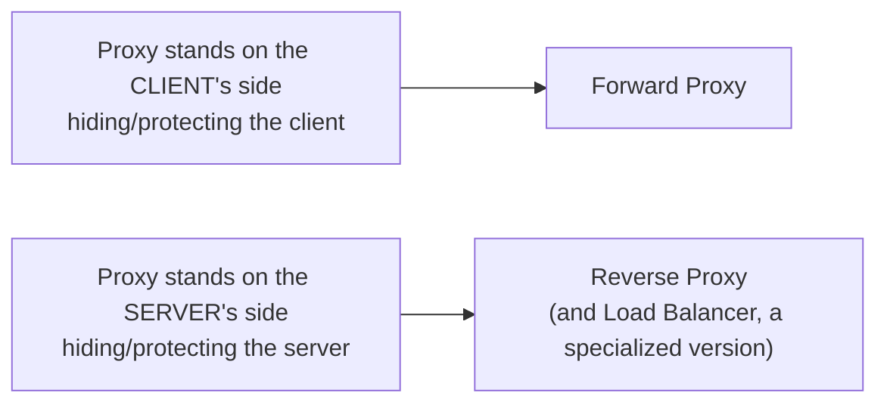

---

## 2. Forward Proxy

### The idea
A forward proxy sits **in front of clients**, forwarding their requests out to the internet. From the server's perspective, it looks like the *proxy* is making the request — the actual client stays hidden.

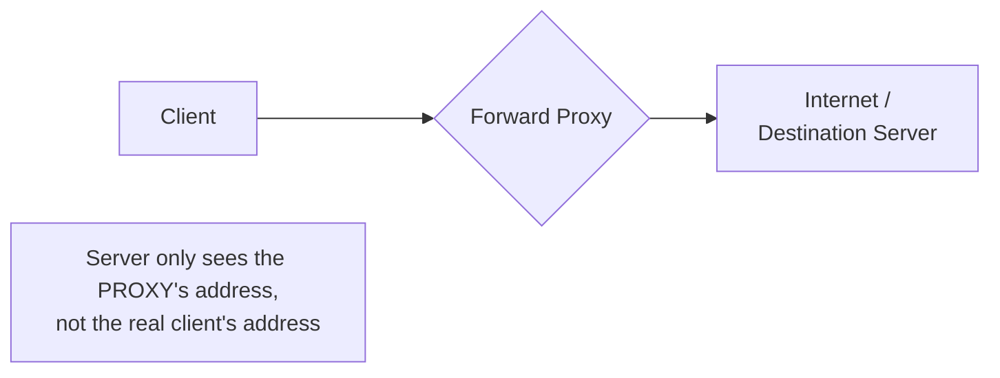

### Real-world examples
- A company's office network routing all employee internet traffic through one proxy (for monitoring, content filtering, or bypassing geo-restrictions).
- A VPN, in many common configurations, functions similarly.

### What it's used for
- **Hiding client identity** from the destination server.
- **Content filtering / access control** — e.g., a school or office blocking certain websites.
- **Bypassing geographic restrictions** — routing traffic to appear as if it's coming from a different location.
- **Caching** frequently-requested external content for all clients behind it.

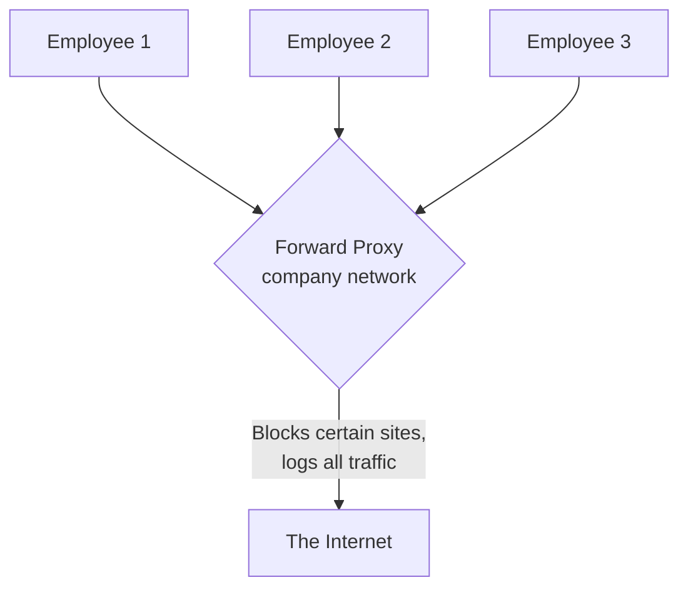

---

## 3. Reverse Proxy

### The idea
A reverse proxy sits **in front of servers**, receiving requests from clients and forwarding them to the appropriate backend server. From the client's perspective, it looks like the *proxy itself* is the server — the actual backend stays hidden.

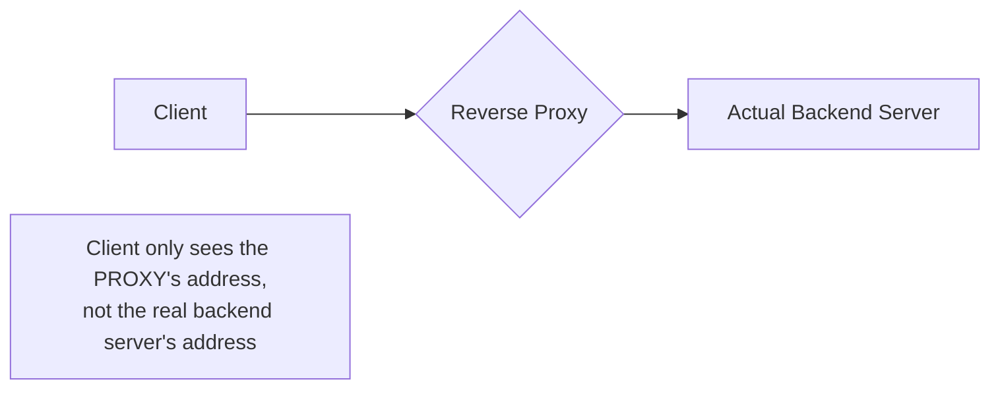

### What it's used for
- **Hiding server infrastructure** — clients never know the real server's IP or how many servers exist behind the proxy.
- **SSL/TLS termination** — handling encryption/decryption once at the proxy, so backend servers don't each need to manage certificates.
- **Caching** responses to reduce load on backend servers.
- **Compression** of responses before sending them to the client.
- **Security** — acting as a shield, absorbing malicious traffic before it reaches actual application servers.

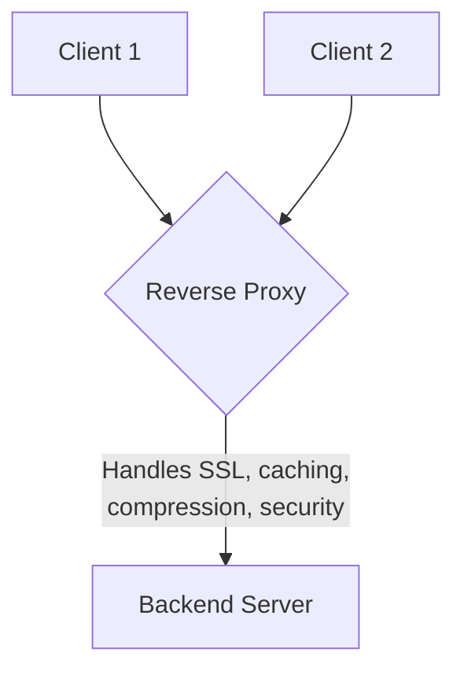

**Note:** an API Gateway (covered earlier) is, in many respects, a specialized, application-aware reverse proxy — it does everything a basic reverse proxy does, plus routing based on business logic, authentication, and aggregation.

---

## 4. Load Balancer

### The idea
A **load balancer** is a *specific type* of reverse proxy — one whose main job is specifically to **distribute traffic across multiple backend server instances**, rather than just forwarding to one server or hiding server details.

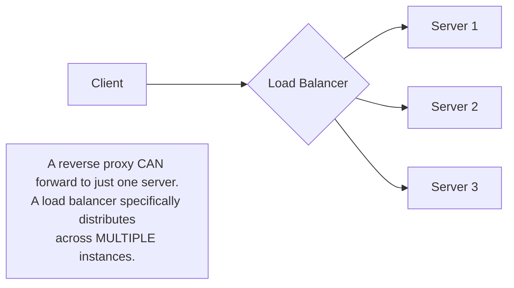

*(This connects directly to the earlier Load Balancing topic — algorithms like Round Robin, Least Connections, etc. all apply here; this section is specifically about how a load balancer relates architecturally to reverse proxies.)*

### The relationship
Every load balancer **is** a reverse proxy (it stands on the server's side, hides backend details) — but not every reverse proxy is a load balancer (a reverse proxy might forward all traffic to just one server, purely for SSL termination or caching, with no distribution logic at all).

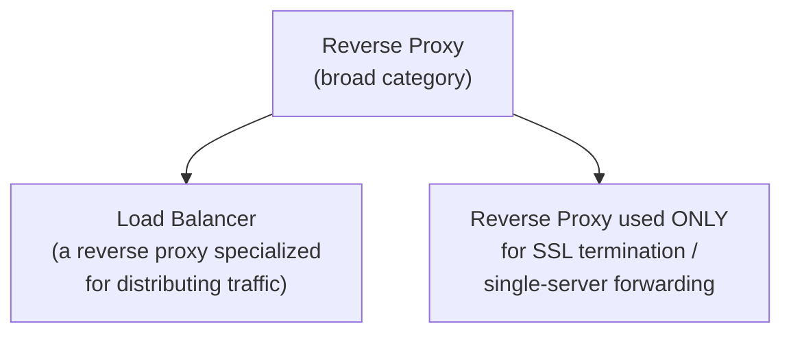

---

## 5. All Three, Side by Side

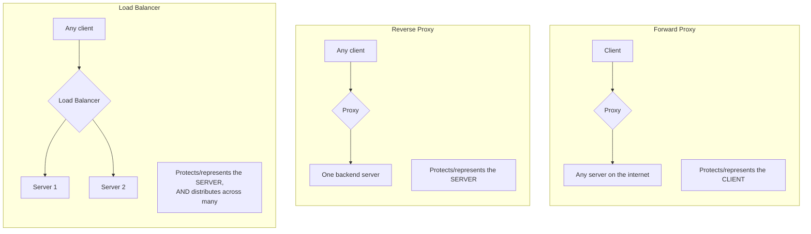

| | Forward Proxy | Reverse Proxy | Load Balancer |
|---|---|---|---|
| **Stands on whose side** | Client's side | Server's side | Server's side |
| **Hides** | The client, from the server | The server, from the client | The servers, from the client |
| **Typical use** | Content filtering, anonymity, bypassing restrictions | SSL termination, caching, security, single-server forwarding | Distributing traffic across multiple server instances |
| **Relationship** | Separate category | Broad category | A *specialized type* of reverse proxy |

---

# Part 2: Message Queues (Kafka/RabbitMQ Basics)

## 6. What Is a Message Queue?

A **message queue** is a component that lets one part of a system send a message to another part **without both needing to be available or fast at the exact same moment.** One service (the "producer") places a message onto the queue; another service (the "consumer") picks it up and processes it whenever it's ready.

Think of it like a restaurant's order ticket rail: the waiter (producer) pins an order ticket up and immediately moves on to the next table, without waiting around for the kitchen. The kitchen (consumer) works through tickets at its own pace, in order, whenever it has capacity.

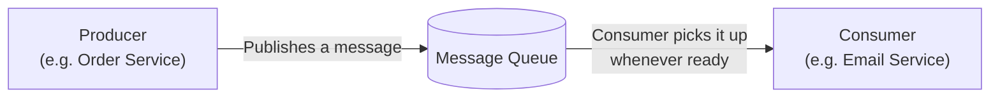

---

## 7. Why It's Needed

This connects directly back to the async communication pattern briefly introduced in the Microservices topic — this section goes deeper into *why* and *how*.

### Without a message queue (direct, synchronous call)

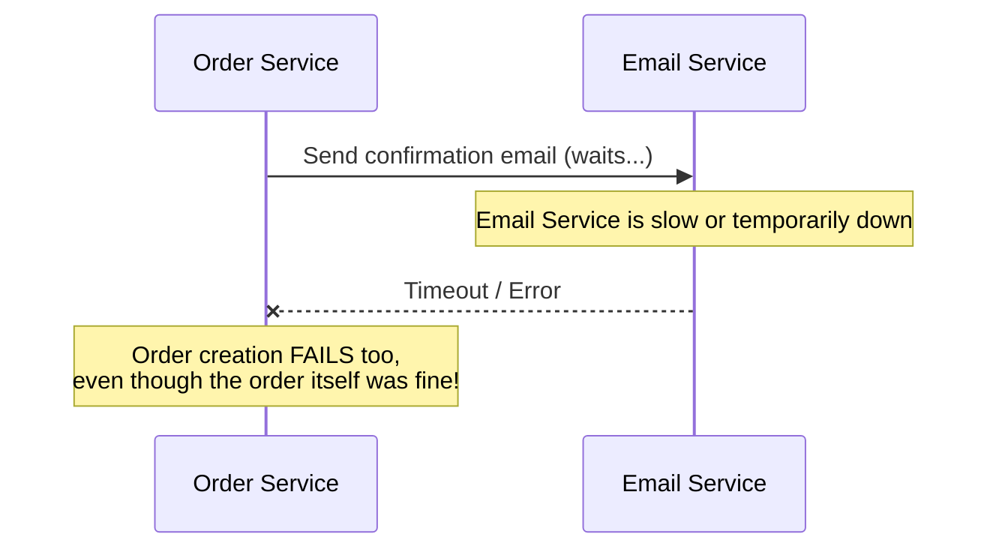

### With a message queue

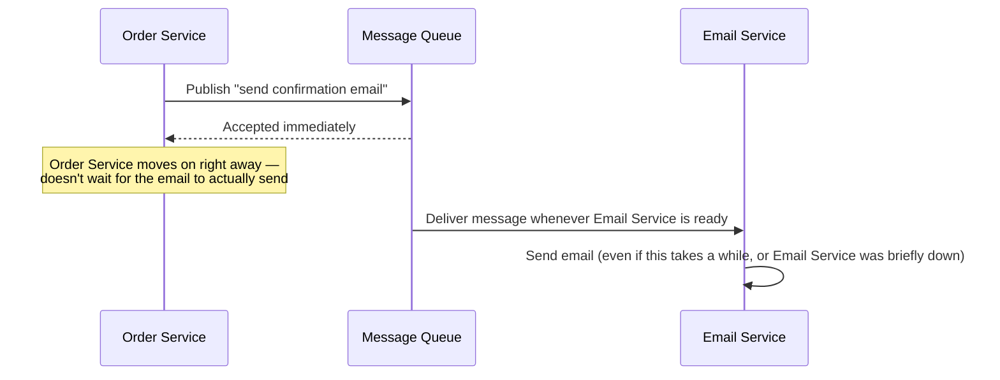

### The core reasons you need one
- **Decoupling** — the producer doesn't need to know or care about the consumer's speed, availability, or even how many consumers exist.
- **Resilience** — if a consumer service crashes, messages simply wait safely in the queue until it recovers, instead of being lost.
- **Absorbing traffic spikes** — a sudden burst of incoming work gets queued up and processed steadily, instead of overwhelming the consumer all at once.
- **Enabling async workflows** — tasks that don't need an immediate response (sending emails, generating reports, processing images) don't need to block the user-facing request.

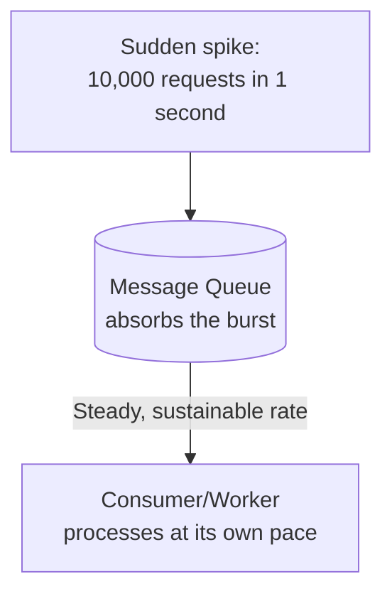

---

## 8. Core Concepts

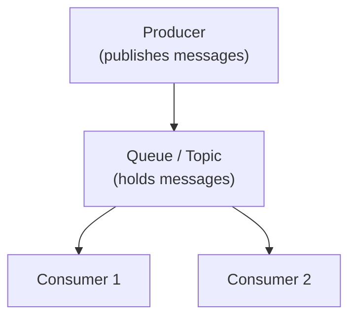

- **Producer** — the service that creates and sends a message.
- **Consumer** — the service that receives and processes a message.
- **Queue / Topic** — the buffer holding messages between producer and consumer.
- **Broker** — the actual messaging system/server that manages queues and delivers messages (this is what Kafka or RabbitMQ *is*).

### Multiple consumers: scaling out processing
Just like scaling app servers horizontally, you can run multiple consumer instances pulling from the same queue to process messages in parallel.

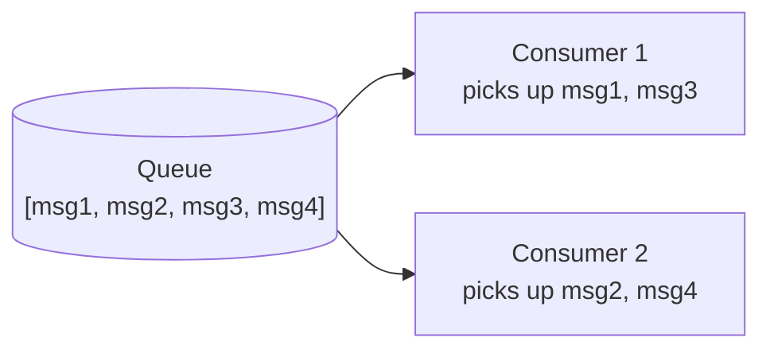

---

## 9. Queue Model vs Pub/Sub Model

There are two fundamentally different delivery patterns, and picking the right one matters a lot.

### Queue Model (point-to-point)
Each message is delivered to **exactly one** consumer. If multiple consumers are listening, they compete for messages, and each message is processed only once, by whichever consumer picks it up.

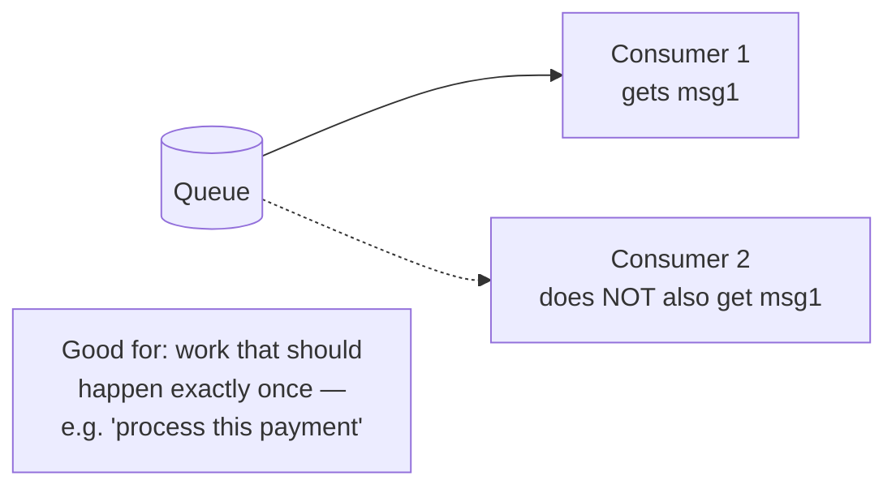

### Pub/Sub Model (publish-subscribe)
Each message is delivered to **every** subscriber independently — all interested consumers get their own copy of every message.

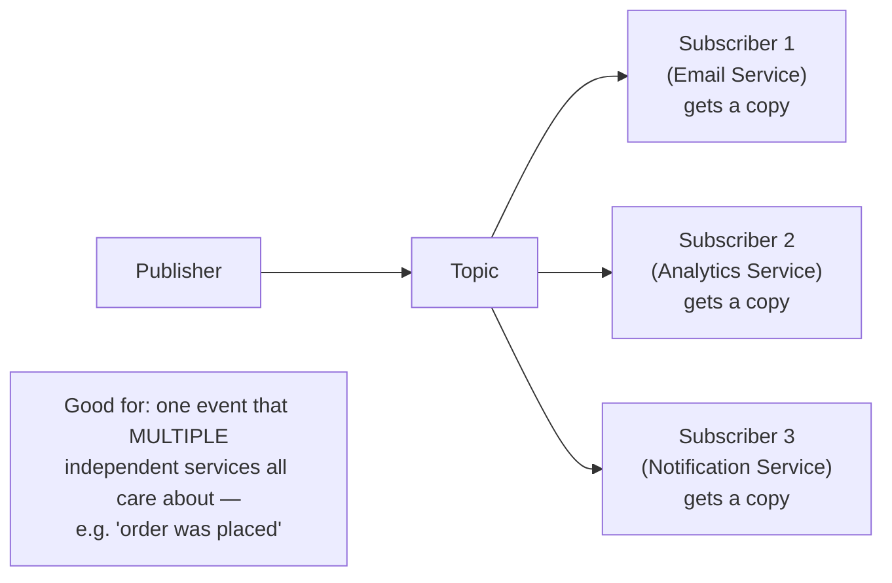

---

## 10. RabbitMQ vs Kafka

These are the two most commonly discussed message brokers in interviews, and while both move messages from producers to consumers, they're built with different priorities.

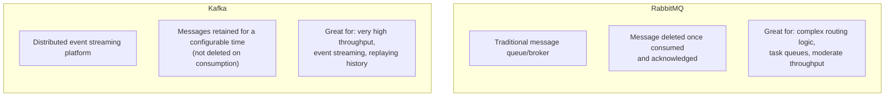

### The key conceptual difference: message retention
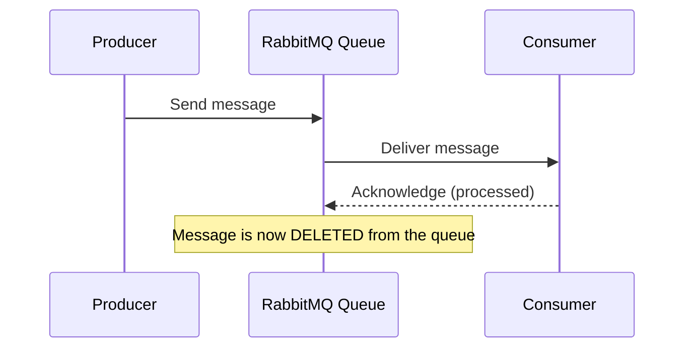

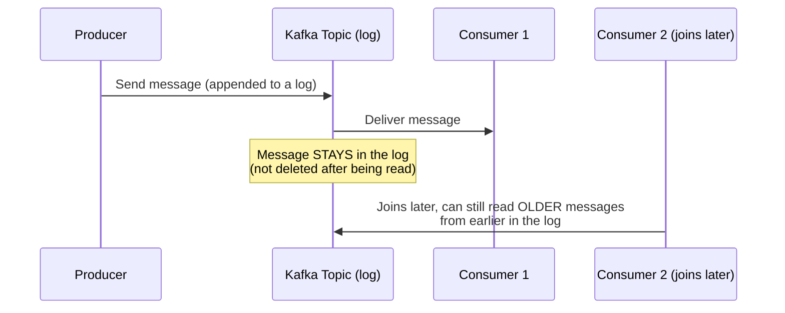

- **RabbitMQ** treats messages like a to-do list — once done, it's crossed off and gone.
- **Kafka** treats messages like a permanent, ordered log/ledger — consumers read through it (and can even **replay** past messages, or have brand-new consumers start reading from the beginning), while the log itself sticks around based on a configured retention period.

### When to pick which

| Scenario | Better Fit |
|---|---|
| Complex routing (send to different queues based on message content) | RabbitMQ |
| Simple task queue (e.g., "process this image") | RabbitMQ |
| Extremely high-throughput event streaming (millions of events/sec) | Kafka |
| Need to replay historical events, or have multiple independent consumers reading the same stream at different times | Kafka |
| Building an event-driven architecture / data pipeline | Kafka |

---

## 11. Delivery Guarantees

An important nuance: how *certain* can you be that a message is delivered, and delivered **exactly once**?

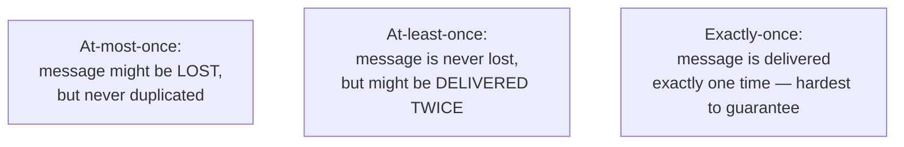

- **At-most-once** — fastest, but risks silently losing messages (acceptable for things like non-critical metrics/logs).
- **At-least-once** — the most common real-world default; guarantees nothing is lost, but the consumer must be designed to handle occasionally processing the *same* message twice (this property is called **idempotency** — the same concept covered in the API Design topic's discussion of PUT/DELETE).
- **Exactly-once** — the ideal, but genuinely hard to guarantee across a distributed system; usually achieved through a combination of careful design and idempotent consumers rather than a magic setting.

**Practical takeaway:** most real systems design for **at-least-once delivery** and make their consumers **idempotent** (safe to process the same message multiple times without bad side effects, e.g., "mark order as shipped" is safe to run twice; "charge the credit card" is not, unless it explicitly checks if it already ran) — rather than chasing a perfect exactly-once guarantee everywhere.

---

## 12. How to Reason About This in an Interview

If asked *"how would you handle sending a confirmation email after an order is placed?"*, a strong answer sounds like this:

> "I wouldn't send the email synchronously as part of the order request, since that would make order creation depend on the email service being fast and available — if the email service is slow, the user waits longer to see 'order placed,' and if it's down entirely, the order might fail even though it was actually fine. Instead, I'd publish an event to a message queue once the order is saved, and have a separate Email Service consume it independently. This decouples the two — the order request returns immediately, and the email gets sent whenever the Email Service is ready, even if it's briefly down. If multiple services care about this event — say, Email, Analytics, and Notifications all need to know an order happened — I'd use a pub/sub model so each gets its own copy, rather than a plain queue where only one consumer would get it. For the broker, RabbitMQ would be enough for this kind of task-queue use case; I'd reach for Kafka specifically if this needed to scale to very high throughput or if multiple services needed to replay historical events. And since message delivery is typically at-least-once, I'd make sure the Email Service is idempotent — safe to process the same 'order placed' event twice without sending a duplicate email."

That answer shows: you know *when* to decouple with a queue (not just "always use one"), you can distinguish *queue vs pub/sub* based on the actual scenario, you can justify *RabbitMQ vs Kafka* based on real requirements, and you understand *delivery guarantees and idempotency* — a frequent, important follow-up.

---

## 13. Quick Recall Cheat Sheet

```mermaid
mindmap
  root((Proxies + Message Queues))
    Forward Proxy
      Stands on client's side
      Hides the client
      Content filtering, anonymity
    Reverse Proxy
      Stands on server's side
      Hides the server
      SSL termination, caching, security
    Load Balancer
      Specialized reverse proxy
      Distributes across multiple servers
    Message Queues
      Decouples producer and consumer
      Absorbs traffic spikes
      Enables async workflows
    Models
      Queue - one consumer per message
      Pub/Sub - every subscriber gets a copy
    Kafka vs RabbitMQ
      RabbitMQ - deletes after consumption
      Kafka - retains log, allows replay
    Delivery Guarantees
      At-most-once - may lose messages
      At-least-once - may duplicate, most common
      Exactly-once - hardest to guarantee
      Idempotent consumers handle duplicates safely
```

| If you remember only 5 things |
|---|
| 1. Forward proxy protects/represents the client; reverse proxy protects/represents the server; a load balancer is a specialized reverse proxy that distributes across multiple servers. |
| 2. Message queues decouple producer and consumer — the producer doesn't wait for the consumer to be fast or even available. |
| 3. Queue model = one consumer per message (work distribution). Pub/Sub model = every subscriber gets its own copy (event broadcasting). |
| 4. RabbitMQ deletes messages after they're consumed; Kafka retains messages as a log, enabling replay and very high throughput. |
| 5. Most real systems design for at-least-once delivery and make consumers idempotent, rather than chasing a perfect exactly-once guarantee. |

---

*This file is written in GitHub-flavored Markdown with Mermaid diagrams — it will render natively on GitHub, GitLab, and most modern Markdown viewers.*
