# CDN Basics + Concurrency Control (Locking, Isolation Levels, MVCC)

*A zero-to-mastery guide for system design interviews and real-world architecture.*

---

## Table of Contents
**Part 1: CDN Basics**
1. [What Is a CDN?](#1-what-is-a-cdn)
2. [Why It's Needed](#2-why-its-needed)
3. [How a CDN Actually Works](#3-how-a-cdn-actually-works)
4. [Push vs Pull CDNs](#4-push-vs-pull-cdns)
5. [What CDNs Are (and Aren't) Good For](#5-what-cdns-are-and-arent-good-for)

**Part 2: Concurrency Control**
6. [What Problem Is Concurrency Control Solving?](#6-what-problem-is-concurrency-control-solving)
7. [The Classic Problem: Lost Updates](#7-the-classic-problem-lost-updates)
8. [Locking](#8-locking)
9. [Isolation Levels](#9-isolation-levels)
10. [MVCC (Multi-Version Concurrency Control)](#10-mvcc-multi-version-concurrency-control)
11. [Optimistic vs Pessimistic Concurrency Control](#11-optimistic-vs-pessimistic-concurrency-control)

**Wrap-up**
12. [How to Reason About This in an Interview](#12-how-to-reason-about-this-in-an-interview)
13. [Quick Recall Cheat Sheet](#13-quick-recall-cheat-sheet)

---

# Part 1: CDN Basics

## 1. What Is a CDN?

A **CDN (Content Delivery Network)** is a network of servers, physically spread out across many geographic locations, that store cached copies of your content — so users can fetch it from a server that's physically **close to them**, instead of always reaching back to your one, possibly-far-away origin server.

Think of it like a chain of local bakeries carrying the same signature cake, versus one single bakery in one city trying to ship that cake to customers all over the world — obviously the local branch gets it to the customer faster and fresher.

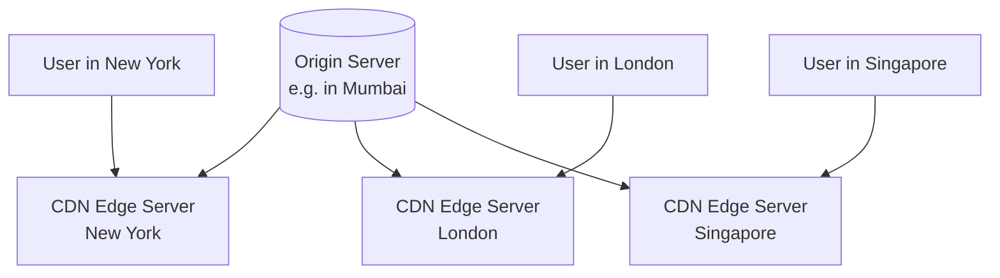

---

## 2. Why It's Needed

### Without a CDN

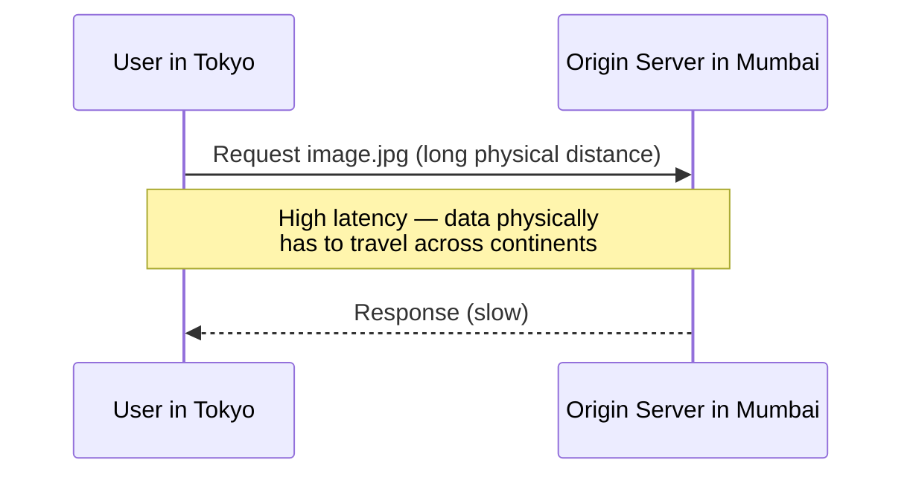

### With a CDN

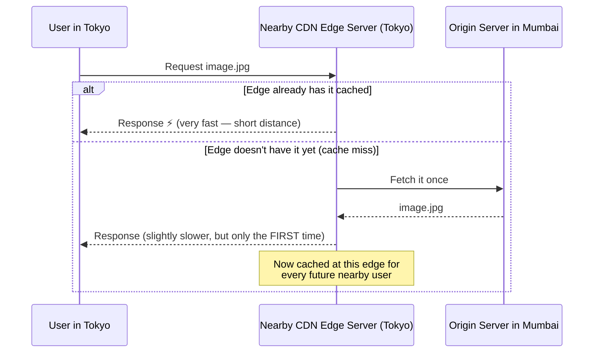

### The core reasons you need one
- **Lower latency** — physical distance is a real, hard cost (recall from the Performance Metrics topic — network travel time is a direct component of total latency), and a CDN minimizes it by serving from a nearby location.
- **Reduced origin server load** — every request served by an edge server never even reaches your origin server, freeing it up (this is the exact same load-reduction principle as caching, covered earlier, just applied geographically).
- **Better handling of traffic spikes** — a CDN's distributed capacity can absorb sudden bursts of traffic (e.g., a viral post) far better than a single origin server could alone.
- **Improved reliability** — if the origin server briefly struggles, cached content at the edges can often still be served to users.

---

## 3. How a CDN Actually Works

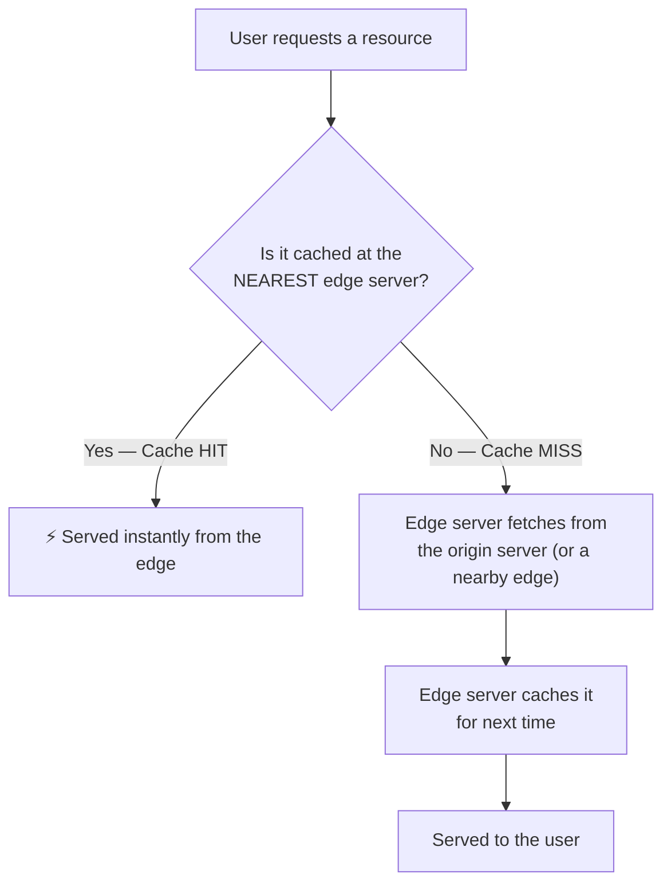

### DNS-based routing
When a user requests your domain, the CDN's DNS system automatically directs them to the **nearest available edge server**, based on the user's geographic location — this routing decision happens transparently, before the actual content request is even made.

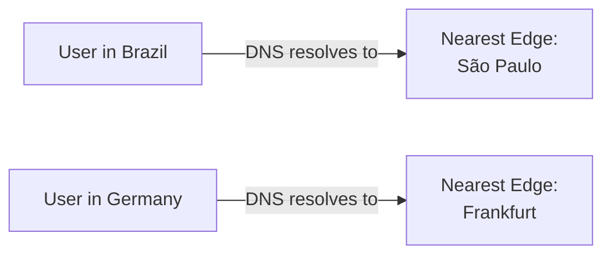

---

## 4. Push vs Pull CDNs

### Pull CDN (the common default)
The CDN only fetches content from the origin **the first time** it's requested at a given edge location (a cache miss) — exactly as shown in Section 2's diagram. Content is "pulled" on demand.

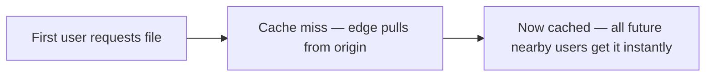
- **Good for:** most typical websites — simple to set up, and only caches what's actually being requested.

### Push CDN
Content is proactively **uploaded** to all CDN edge servers ahead of time, before any user ever requests it — the origin "pushes" the content out.

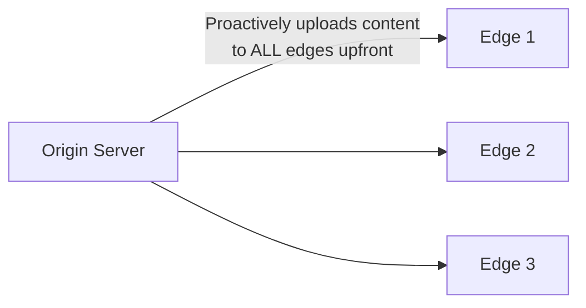
- **Good for:** sites with less frequently-changing content, or where you want to guarantee content is available at every edge immediately (e.g., a major software release going live at a precise moment everywhere at once).

---

## 5. What CDNs Are (and Aren't) Good For

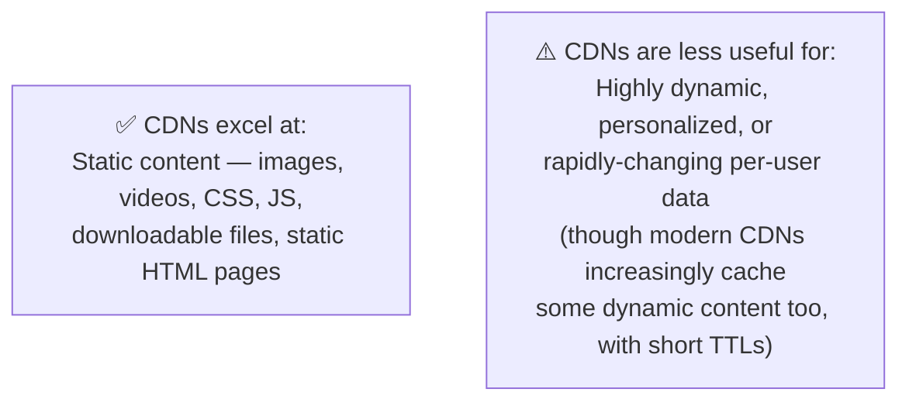

- CDNs are extremely effective for **static assets** that are the same for every user (an image, a JS bundle) — cache once, serve to millions.
- They're less naturally suited for **highly personalized, real-time data** (like a user's private, constantly-updating notification feed) — though modern CDNs do increasingly support caching some dynamic content with short expiration times.

---

# Part 2: Concurrency Control

## 6. What Problem Is Concurrency Control Solving?

**Concurrency control** is the set of techniques a database uses to make sure that when **multiple operations happen at the same time**, the data stays correct — instead of the operations stepping on each other and corrupting the result.

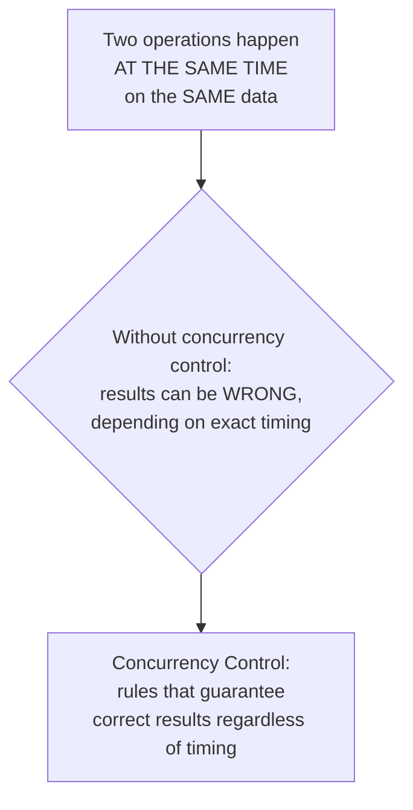

This becomes unavoidable the moment a system has more than one user, or more than one server (recall horizontal scaling from Day 1) — multiple requests genuinely can, and will, try to read and write the same data simultaneously.

---

## 7. The Classic Problem: Lost Updates

This single example makes the whole topic concrete.

**Scenario:** A bank account has ₹1000. Two withdrawal requests of ₹100 each arrive at nearly the same instant.

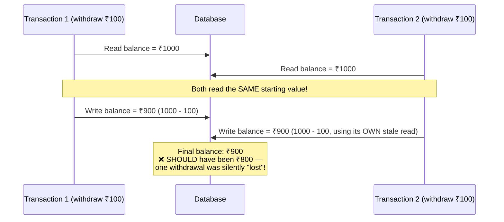

Both transactions read the same starting balance before either one had written its update, so the second write **overwrote** the first one's result, instead of building on top of it. This is called a **lost update**, and it's exactly the kind of bug concurrency control exists to prevent.

---

## 8. Locking

### The idea
A **lock** prevents other transactions from reading and/or modifying a piece of data while one transaction is currently working with it — forcing operations to happen one at a time on that specific piece of data, rather than simultaneously.

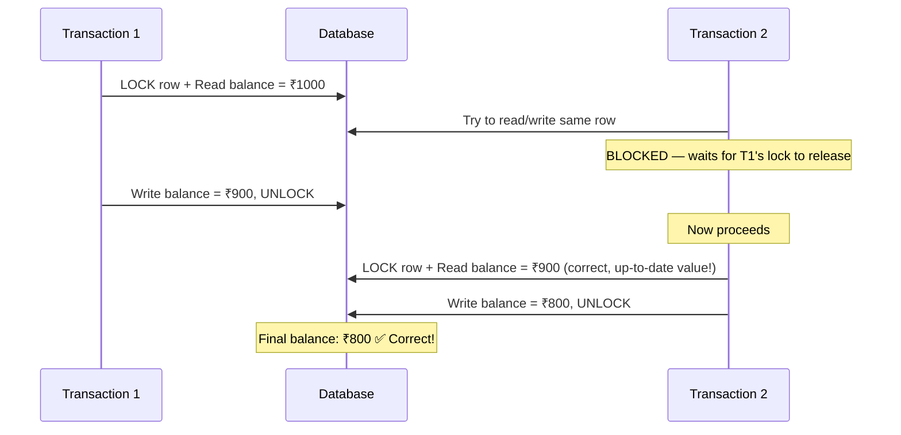

### Types of locks

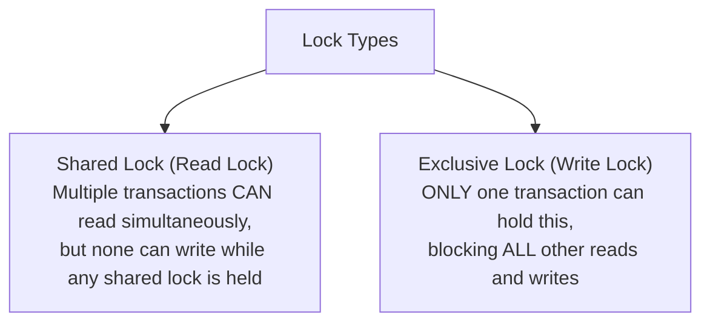

- **Shared lock:** many readers can proceed at once (reading doesn't conflict with other reading).
- **Exclusive lock:** a writer needs sole access — no one else can read or write until it's done.

### The downside of locking: deadlocks
If Transaction 1 locks Row A and waits for Row B, while Transaction 2 locks Row B and waits for Row A, neither can ever proceed — this is a **deadlock**.

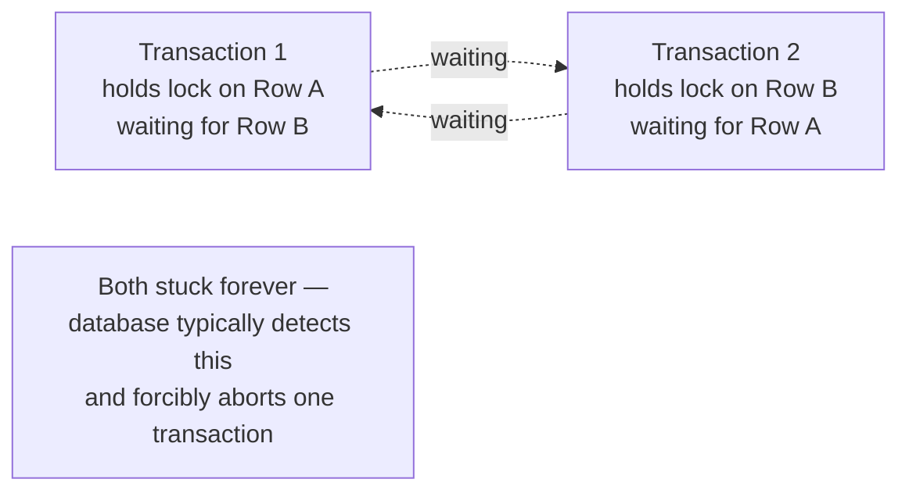

Databases typically detect deadlocks automatically and resolve them by forcibly rolling back one of the transactions, letting the other proceed.

---

## 9. Isolation Levels

**Isolation** is one of the four ACID properties (recall the SQL vs NoSQL topic) — it defines exactly how much concurrent transactions are allowed to "see" of each other's in-progress, uncommitted changes. Databases let you choose **how strict** this isolation should be, because stricter isolation is safer but slower.

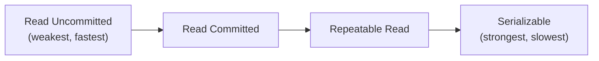

### The problems each level protects against

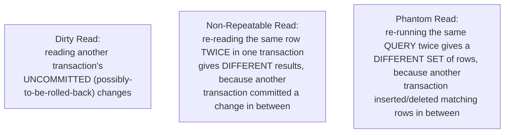

### Level by level

**Read Uncommitted** — transactions can see other transactions' uncommitted changes.
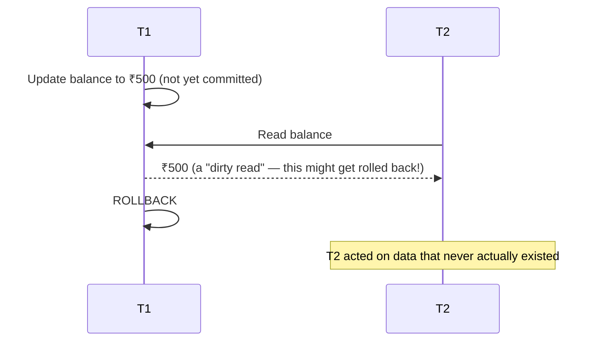

**Read Committed** — transactions only ever see committed data (no dirty reads), but re-reading the same row twice within one transaction can still return different values if another transaction commits in between.

**Repeatable Read** — guarantees that if you read the same row twice within one transaction, you'll get the same value both times — but new rows matching a query's filter (inserted by someone else) can still appear on a re-run (a "phantom").

**Serializable** — the strictest level: transactions behave as if they ran one at a time, completely sequentially, with zero overlap — eliminates all three problems above, at the cost of the most reduced concurrency (and therefore the slowest performance under heavy simultaneous load).

### Comparison table

| Isolation Level | Dirty Read | Non-Repeatable Read | Phantom Read | Performance |
|---|---|---|---|---|
| Read Uncommitted | Possible | Possible | Possible | Fastest |
| Read Committed | Prevented | Possible | Possible | Fast |
| Repeatable Read | Prevented | Prevented | Possible | Moderate |
| Serializable | Prevented | Prevented | Prevented | Slowest |

**Practical takeaway:** most applications default to **Read Committed** (PostgreSQL, Oracle) or **Repeatable Read** (MySQL/InnoDB) — Serializable is reserved for situations where correctness is absolutely critical and the performance cost is acceptable, like certain financial operations.

---

## 10. MVCC (Multi-Version Concurrency Control)

### The problem MVCC solves
Locking (Section 8) works, but it can be a performance bottleneck — readers and writers blocking each other means less concurrency overall. **MVCC** is a clever alternative approach used by most modern databases (PostgreSQL, MySQL/InnoDB) that avoids much of this blocking.

### The idea
Instead of locking a row so only one transaction can touch it, the database keeps **multiple versions** of each row. When a transaction starts, it gets a consistent "snapshot" view of the data as it existed at that moment — writers create a *new version* of a row rather than overwriting the old one in place, so readers never have to wait for writers, and writers don't have to wait for readers.

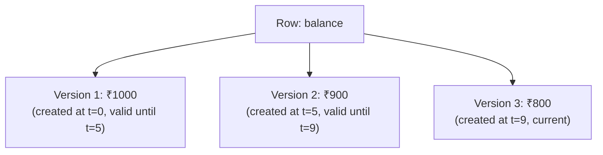

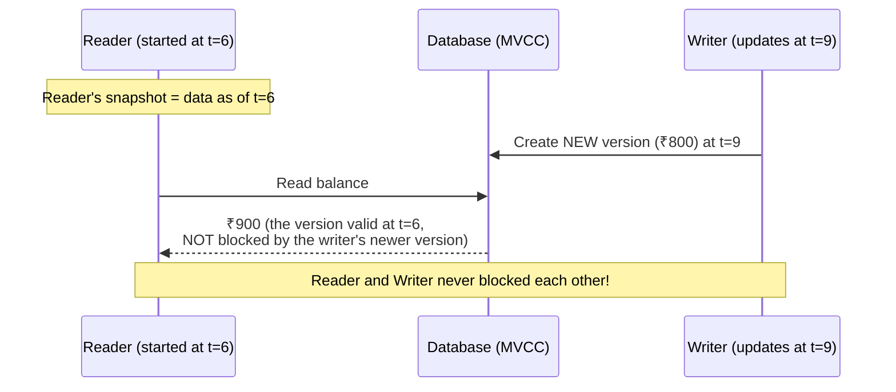

### Why this is powerful
- **Readers never block writers, and writers never block readers** — a huge concurrency win compared to pure locking, since read and write operations can genuinely happen in parallel on the same row.
- **This is exactly how databases achieve isolation levels like Repeatable Read efficiently** — each transaction just keeps reading from its own consistent snapshot, rather than needing to hold locks the entire time.
- Old row versions are eventually cleaned up by a background process once no active transaction still needs them (in PostgreSQL, this process is called "vacuuming").

---

## 11. Optimistic vs Pessimistic Concurrency Control

This is a useful higher-level framing that ties locking and MVCC together.

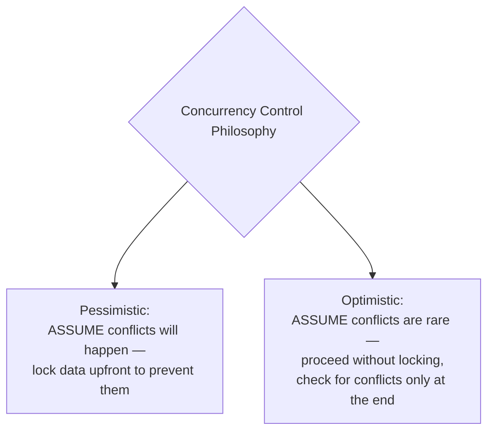

### Pessimistic (locking-based)
Lock the data *before* working with it, blocking anyone else from touching it in the meantime — as covered in Section 8. Safe by default, but reduces concurrency, since other transactions must wait even if a conflict would never have actually occurred.

### Optimistic (check-at-the-end)
Proceed without locking anything, but before committing the final write, check whether the data changed since you first read it (often via a version number or timestamp column). If it changed, reject the write and let the application retry.

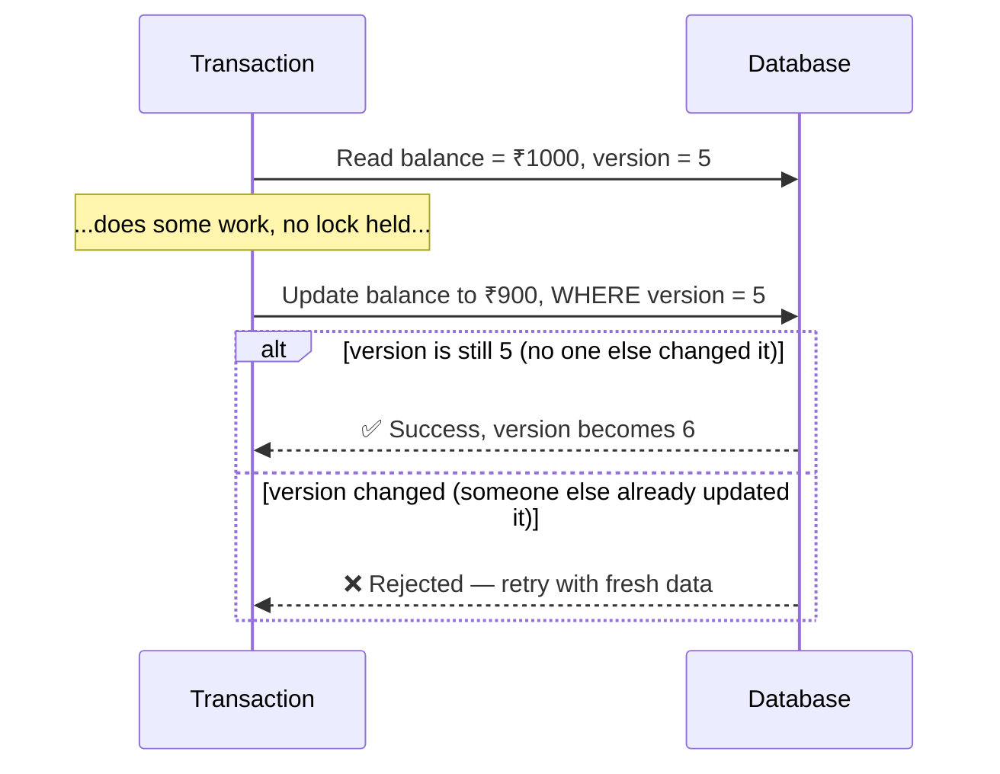

- **Good for:** systems with mostly non-conflicting operations (e.g., most users editing *different* rows) — avoids the overhead of locking when conflicts are genuinely rare.
- **Bad for:** high-contention scenarios (many transactions frequently fighting over the exact same row) — leads to a lot of wasted work and retries.

---

## 12. How to Reason About This in an Interview

If asked *"how would you handle two users updating the same record at the same time?"*, a strong answer sounds like this:

> "First I'd figure out how contested this data actually is — if conflicts on the same row are rare, like most users editing their own separate profile, I'd use optimistic concurrency control: read the data along with a version number, and only commit the write if the version hasn't changed, retrying otherwise. This avoids locking overhead for the common case where there's no real conflict. But if this is high-contention data — like a limited-inventory item where many users are genuinely racing for the same row — I'd use pessimistic locking instead, taking an exclusive lock before reading, so the second transaction simply waits and works from the up-to-date value rather than risking a lost update. For the isolation level, I'd default to Read Committed or Repeatable Read for general use, and only reach for Serializable if this specific operation is critical enough that even phantom reads could cause real problems, accepting the performance cost. I'd also mention that most modern databases use MVCC under the hood, which lets readers and writers avoid blocking each other in the common case, so a lot of this concurrency safety comes 'for free' without needing to hand-roll locking everywhere."

That answer shows: you can choose between optimistic and pessimistic based on the *actual contention pattern* rather than picking one by default, you know the *specific problems* each isolation level prevents (not just their names), and you understand *why* MVCC exists as the practical mechanism behind a lot of this.

---

## 13. Quick Recall Cheat Sheet

```mermaid
mindmap
  root((CDN + Concurrency Control))
    CDN
      Caches content at geographically close edge servers
      Reduces latency and origin load
      Pull CDN - cache on first request
      Push CDN - proactively uploaded
      Best for static content
    Concurrency Control
      Solves: multiple operations on same data at once
      Lost Update - the classic failure case
    Locking
      Shared read vs Exclusive write locks
      Risk: deadlocks
    Isolation Levels
      Read Uncommitted - dirty reads possible
      Read Committed - common default
      Repeatable Read - common default
      Serializable - strictest, slowest
    MVCC
      Multiple versions per row
      Readers don't block writers, vice versa
      Used by PostgreSQL, MySQL InnoDB
    Optimistic vs Pessimistic
      Optimistic - check version at commit time
      Pessimistic - lock upfront
      Choose based on contention level
```

| If you remember only 5 things |
|---|
| 1. A CDN caches content at edge servers close to users, cutting latency and reducing load on the origin server — best for static content. |
| 2. Concurrency control prevents bugs like "lost updates" when multiple operations touch the same data at the same time. |
| 3. Locking (shared for reads, exclusive for writes) prevents conflicts but can cause blocking and deadlocks. |
| 4. Isolation levels (Read Uncommitted → Read Committed → Repeatable Read → Serializable) trade correctness guarantees for performance — stricter is safer but slower. |
| 5. MVCC (used by PostgreSQL, MySQL) keeps multiple row versions so readers and writers don't block each other — it's how most modern databases achieve good concurrency without constant locking. |

---

*This file is written in GitHub-flavored Markdown with Mermaid diagrams — it will render natively on GitHub, GitLab, and most modern Markdown viewers.*
