# Consistent Hashing + Fault Tolerance & High Availability

*A zero-to-mastery guide for system design interviews and real-world architecture.*

---

## Table of Contents
**Part 1: Consistent Hashing**
1. [The Problem It Solves](#1-the-problem-it-solves)
2. [The Naive Approach and Why It Breaks](#2-the-naive-approach-and-why-it-breaks)
3. [The Consistent Hashing Idea: A Ring](#3-the-consistent-hashing-idea-a-ring)
4. [Adding and Removing a Server](#4-adding-and-removing-a-server)
5. [The Uneven Distribution Problem — Virtual Nodes](#5-the-uneven-distribution-problem--virtual-nodes)

**Part 2: Fault Tolerance & High Availability**
6. [What's the Difference Between Fault Tolerance and High Availability?](#6-whats-the-difference-between-fault-tolerance-and-high-availability)
7. [Redundancy — The Core Technique](#7-redundancy--the-core-technique)
8. [Replication](#8-replication)
9. [Failover](#9-failover)
10. [Detecting Failure: Heartbeats & Health Checks](#10-detecting-failure-heartbeats--health-checks)
11. [Avoiding Cascading Failures](#11-avoiding-cascading-failures)
12. [Redundancy at Every Layer](#12-redundancy-at-every-layer)

**Wrap-up**
13. [How to Reason About This in an Interview](#13-how-to-reason-about-this-in-an-interview)
14. [Quick Recall Cheat Sheet](#14-quick-recall-cheat-sheet)

---

# Part 1: Consistent Hashing

## 1. The Problem It Solves

This topic directly continues from the earlier Database Sharding topic, where **resharding** (adding or removing a shard) was flagged as a genuinely painful process with naive hashing. Consistent Hashing is the standard solution to exactly that problem — and it applies just as well to distributing cache servers, not just database shards.

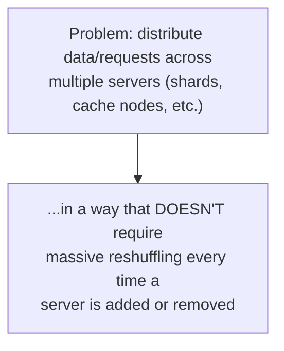

---

## 2. The Naive Approach and Why It Breaks

The simplest way to distribute keys across N servers is: `server = hash(key) % N`.

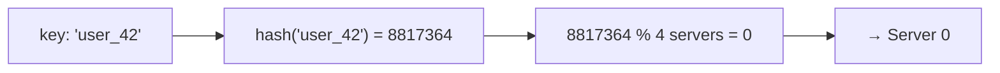

This works fine — **until the number of servers changes.**

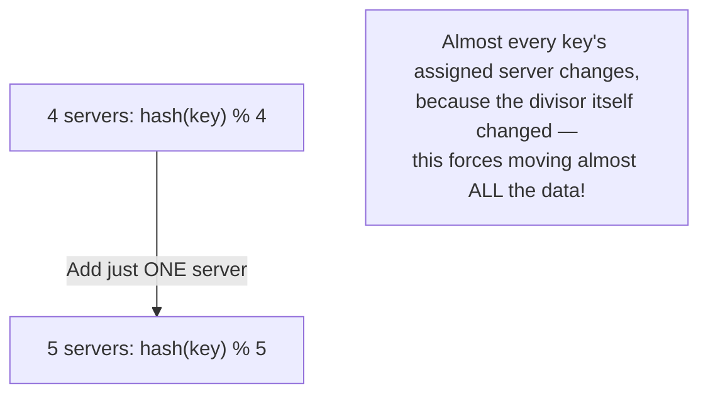

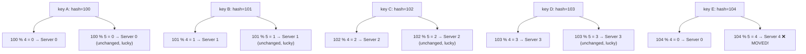

In practice, adding or removing even a single server typically forces **the vast majority** of keys to move to a different server — meaning a massive, disruptive data migration (or a flood of cache misses, if this is a cache) every time your cluster size changes.

---

## 3. The Consistent Hashing Idea: A Ring

### The core idea
Instead of using modulo arithmetic on the number of servers, imagine a **circular ring** of possible hash values (from 0 to some large maximum, then wrapping back to 0). Both **servers** and **keys** are hashed onto this same ring. A key is assigned to the **first server found by moving clockwise** from the key's position on the ring.

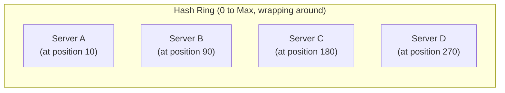

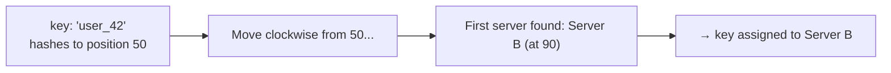

Every key on the ring is simply owned by whichever server is the "next one clockwise" from that key's position — like assigning mail to the nearest mailbox found while walking clockwise around a circular street.

---

## 4. Adding and Removing a Server

This is where the entire benefit of Consistent Hashing becomes clear — compare this directly to Section 2's naive approach.

### Removing a server

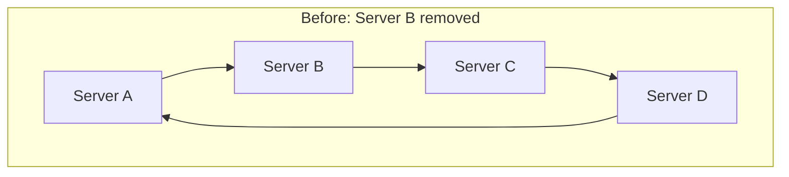

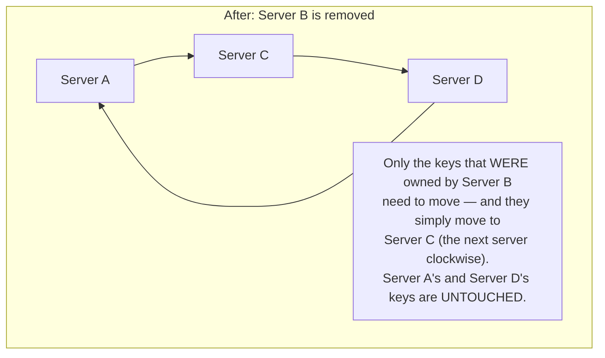

### Adding a server

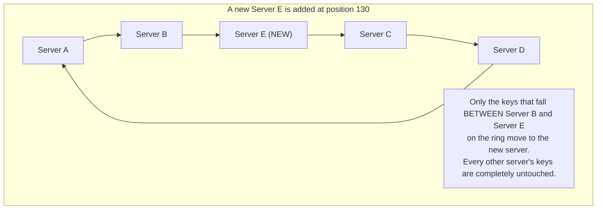

### The key insight
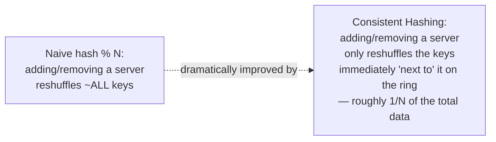

This is *why* it's the standard solution for distributed caches (like Memcached clusters) and database sharding at scale — servers can be added or removed with only a small, proportional amount of data movement, instead of a disruptive full reshuffle.

---

## 5. The Uneven Distribution Problem — Virtual Nodes

With only a few actual servers placed on the ring, the amount of "ring space" each one owns can be wildly uneven purely by chance — one server might end up owning a huge arc of the ring, while another owns a tiny sliver.

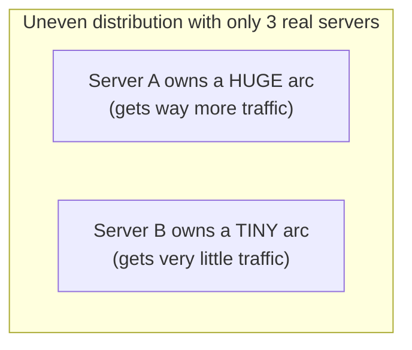

### The fix: Virtual Nodes
Instead of placing each physical server at just **one** point on the ring, place it at **many** points (virtual nodes), scattered around the ring. Each physical server might correspond to, say, 100 virtual points instead of just 1.

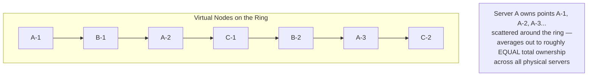

With enough virtual nodes per physical server, the law of averages kicks in and each physical server ends up owning a roughly equal, evenly-scattered total share of the ring — solving the uneven distribution problem while keeping all the benefits from Section 4.

---

# Part 2: Fault Tolerance & High Availability

## 6. What's the Difference Between Fault Tolerance and High Availability?

These two terms are closely related and often used together, but they mean slightly different things.

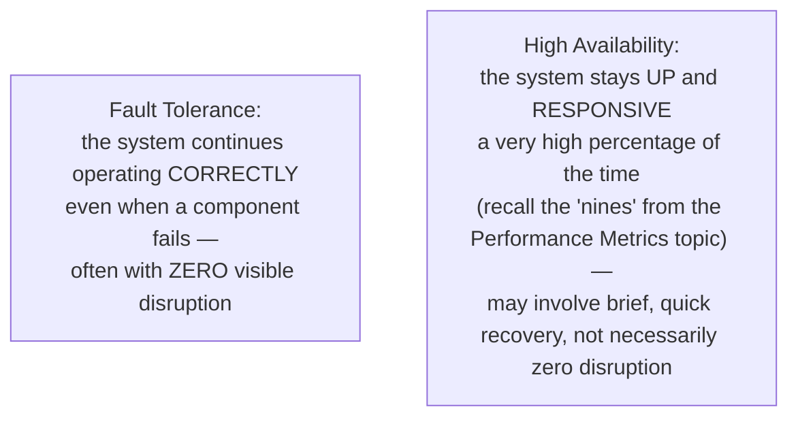

- **Fault tolerance** is about **surviving failure gracefully**, often completely transparently to the user (e.g., one server in a cluster of five crashes, and users never notice anything at all).
- **High availability** is the broader **outcome/goal** — the system is available (up and working) nearly all the time — which fault tolerance is one of the main techniques used to achieve.

In short: fault tolerance is a *technique*; high availability is the *result* you're aiming for. A system can be highly available even if it briefly experiences a fault, as long as it recovers fast enough that the overall uptime percentage stays high.

---

## 7. Redundancy — The Core Technique

Nearly everything in this topic boils down to one core idea, already seen repeatedly across earlier topics (load balancers, API gateways, message queues): **don't rely on a single instance of anything critical.**

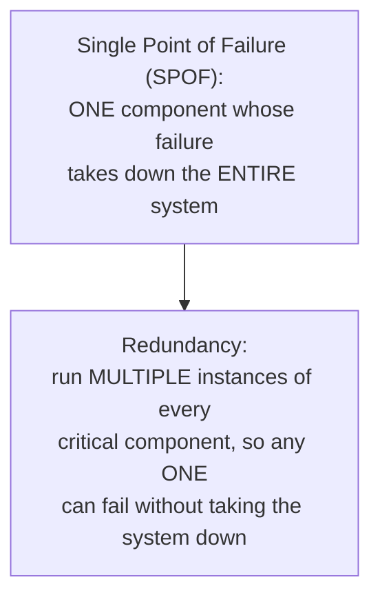

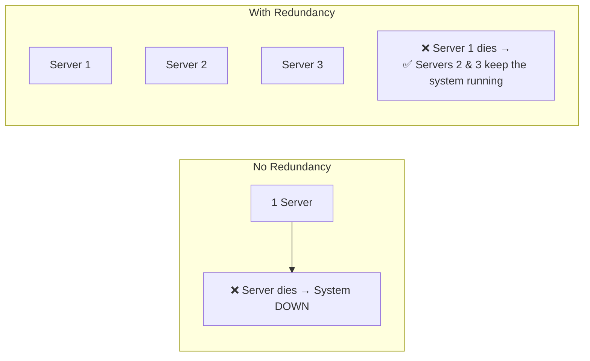

This single principle — redundancy — is the foundation underneath everything else in this section.

---

## 8. Replication

**Replication** is redundancy applied specifically to **data** — keeping copies of the same data on multiple servers, so that losing one server doesn't mean losing the data itself.

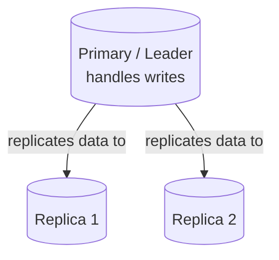

### Two common patterns

**Leader-Follower (Primary-Replica) Replication:** one node handles all writes and propagates changes to the others, which typically serve reads.

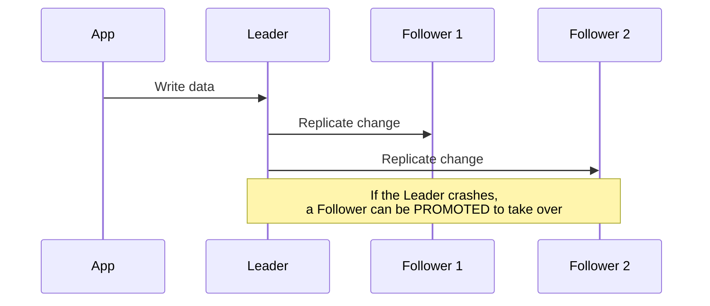

**Multi-Leader / Leaderless Replication:** multiple nodes can each accept writes directly (more complex to keep consistent, but avoids a single node being the only writable copy — ties back to the AP-leaning end of the CAP Theorem topic).

### Synchronous vs Asynchronous replication
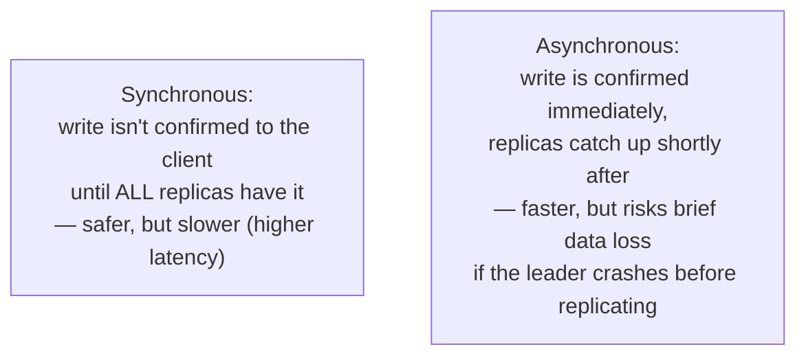

---

## 9. Failover

**Failover** is the automatic process of switching to a backup/replica when the primary component fails, ideally with minimal or zero disruption to users.

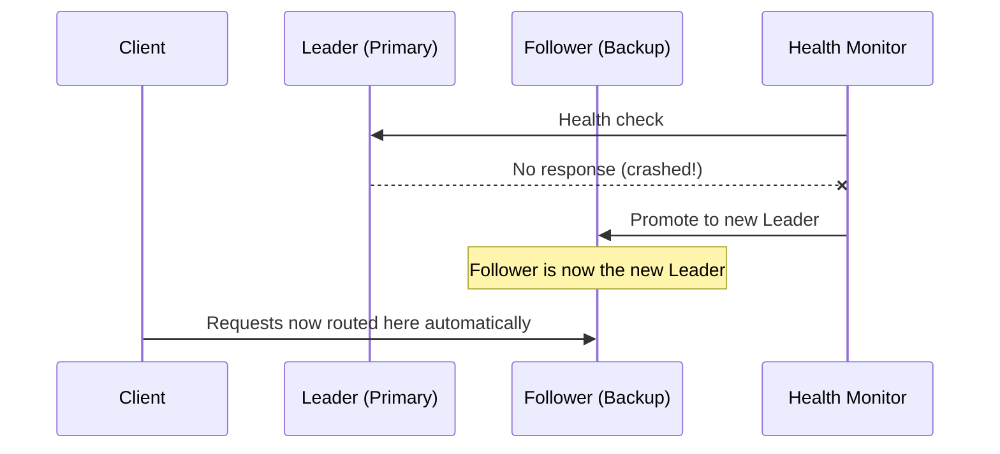

### Failover strategies
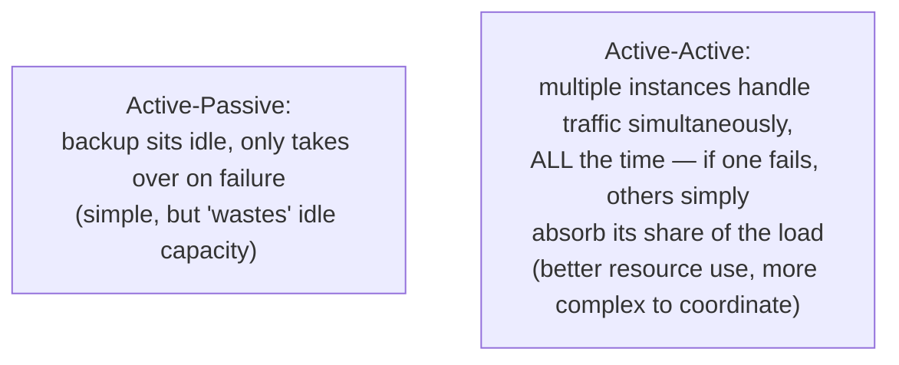

---

## 10. Detecting Failure: Heartbeats & Health Checks

Redundancy and failover are only useful if the system can actually **detect** a failure quickly. This connects directly back to the health checks covered in the Load Balancing topic — the same underlying mechanism applies system-wide, not just for load balancers.

```mermaid
sequenceDiagram
    participant Monitor as Health Monitor
    participant NodeA as Node A

    loop Every few seconds
        Monitor->>NodeA: "Are you alive?" (heartbeat)
        NodeA-->>Monitor: "Yes, I'm fine" ✅
    end
    Note over Monitor,NodeA: Missed heartbeats (e.g. 3 in a row)<br/>→ Node A declared failed → Failover triggered
```

A single missed heartbeat usually isn't enough to declare failure (it could just be a brief network blip) — most systems require **several consecutive** missed heartbeats before triggering failover, balancing fast detection against avoiding false alarms.

---

## 11. Avoiding Cascading Failures

A subtle, important danger: when one component fails, the *extra load* it was handling doesn't disappear — it gets redirected to the remaining components, which can overload **them** too, causing a chain reaction.

```mermaid
flowchart TB
    A["Server 1 of 3 crashes"] --> B["Its traffic redirects to<br/>Servers 2 and 3"]
    B --> C["Servers 2 and 3 are now<br/>each handling 50% MORE load"]
    C --> D{"Can they handle the extra load?"}
    D -->|"No — they were already near capacity"| E["Server 2 ALSO crashes from overload"]
    E --> F["Remaining load piles onto Server 3 alone"]
    F --> G["💥 Total cascading failure —<br/>started with ONE server dying,<br/>ended with the ENTIRE system down"]
```

### Mitigations
- **Keep spare capacity** — don't run every server at 100% utilization; leave headroom to absorb another node's failure without tipping over.
- **Circuit breakers** — if a downstream service is failing or overloaded, stop sending it traffic temporarily (rather than continuing to hammer an already-struggling system), giving it room to recover.
- **Graceful degradation** — under extreme load, deliberately turn off non-critical features (e.g., temporarily disable "recommended for you" while keeping core checkout functionality alive) rather than letting the whole system collapse.

```mermaid
flowchart LR
    A["Downstream service failing"] --> B{"Circuit Breaker"}
    B -->|"Trips OPEN — stop sending traffic"| C["Downstream service gets breathing room to recover"]
    B -->|"After a cooldown, tries again"| D["If healthy, resumes normal traffic"]
```

---

## 12. Redundancy at Every Layer

This is really a running theme across this entire series — nearly every topic covered has its own single-point-of-failure risk, and its own redundancy fix.

```mermaid
flowchart TB
    LB["Load Balancer — run multiple instances"]
    GW["API Gateway — run multiple instances"]
    App["App Servers — multiple instances behind LB"]
    DB["Database — replication + failover"]
    Cache["Cache — clustered, e.g. Redis with replicas"]
    Queue["Message Queue — clustered brokers (e.g. Kafka replication)"]
```

**The pattern that repeats throughout this whole series:** every layer you add to solve one reliability problem can become the next single point of failure — so true high availability means applying redundancy **consistently, at every layer**, not just the one that happens to be top of mind.

---

## 13. How to Reason About This in an Interview

If asked *"how would you make this system highly available?"*, a strong answer sounds like this:

> "I'd start by eliminating single points of failure at every layer — multiple app server instances behind a load balancer, multiple load balancer instances themselves, and database replication with a leader and followers, so a failover can promote a follower if the leader goes down. For detecting failure, I'd use heartbeats/health checks with a few consecutive missed checks before triggering failover, to avoid overreacting to a brief network blip. I'd also make sure there's spare capacity across the remaining nodes, so if one does fail, the redirected load doesn't overload the survivors and cause a cascading failure — and I'd add circuit breakers so a struggling downstream service gets temporarily cut off from more traffic instead of being piled onto further. If this system also needs to distribute data or cache entries across many nodes, I'd use consistent hashing rather than naive hash-mod-N, so that adding or removing a node — which happens naturally during failover and scaling — only requires moving a small fraction of the data instead of a massive reshuffle."

That answer shows: you treat redundancy as a *system-wide* principle, not a one-off fix; you understand *failure detection* isn't instantaneous or naive; you're aware of the *cascading failure* risk, which is a common, important follow-up; and connecting to *consistent hashing* shows you see how these topics reinforce each other.

---

## 14. Quick Recall Cheat Sheet

```mermaid
mindmap
  root((Consistent Hashing +<br/>Fault Tolerance/HA))
    Consistent Hashing
      Solves naive hash % N resharding pain
      Servers and keys placed on a ring
      Key belongs to next server clockwise
      Adding/removing a server moves only ~1/N of data
      Virtual Nodes fix uneven distribution
    Fault Tolerance vs HA
      Fault Tolerance - technique, survive failure gracefully
      High Availability - outcome, high uptime percentage
    Core Technique
      Redundancy - never rely on ONE instance
    Replication
      Leader-Follower vs Multi-Leader
      Synchronous safer, slower
      Asynchronous faster, risk of data loss
    Failover
      Active-Passive vs Active-Active
      Triggered by health checks/heartbeats
    Cascading Failures
      One failure overloads survivors
      Fix: spare capacity, circuit breakers, graceful degradation
```

| If you remember only 5 things |
|---|
| 1. Consistent Hashing places servers and keys on a ring; a key belongs to the next server clockwise — adding/removing a server only moves a small fraction of data, unlike naive hash % N. |
| 2. Virtual Nodes fix uneven ring distribution by giving each physical server many scattered points on the ring instead of just one. |
| 3. Fault tolerance is a technique (surviving failure gracefully); high availability is the outcome (high uptime overall) — redundancy is the core technique underlying both. |
| 4. Replication keeps data on multiple nodes; failover automatically promotes a backup when the primary fails, detected via heartbeats/health checks. |
| 5. A single failure can trigger a cascading failure if survivors get overloaded by redirected traffic — mitigate with spare capacity, circuit breakers, and graceful degradation. |

---

*This file is written in GitHub-flavored Markdown with Mermaid diagrams — it will render natively on GitHub, GitLab, and most modern Markdown viewers.*
