# Database Replication + API Versioning + Circuit Breaker + SSO + Cloud Basics

*A zero-to-mastery guide for system design interviews and real-world architecture.*

---

## Table of Contents
**Part 1: Database Replication**
1. [What Is Replication?](#1-what-is-replication)
2. [Replication Topologies](#2-replication-topologies)
3. [Synchronous vs Asynchronous Replication](#3-synchronous-vs-asynchronous-replication)
4. [Replication Lag](#4-replication-lag)

**Part 2: API Versioning**
5. [Why APIs Need Versioning](#5-why-apis-need-versioning)
6. [Versioning Strategies](#6-versioning-strategies)
7. [Deprecation — Retiring Old Versions Gracefully](#7-deprecation--retiring-old-versions-gracefully)

**Part 3: Circuit Breaker**
8. [What Is a Circuit Breaker?](#8-what-is-a-circuit-breaker)
9. [The Three States](#9-the-three-states)
10. [Circuit Breaker in a Request Flow](#10-circuit-breaker-in-a-request-flow)

**Part 4: SSO (Single Sign-On)**
11. [What Is SSO?](#11-what-is-sso)
12. [How SSO Actually Works](#12-how-sso-actually-works)
13. [SAML vs OAuth/OIDC — A Quick Orientation](#13-saml-vs-oauthoidc--a-quick-orientation)

**Part 5: Cloud Basics (AWS/Azure/GCP)**
14. [What Does "The Cloud" Actually Mean?](#14-what-does-the-cloud-actually-mean)
15. [IaaS vs PaaS vs SaaS](#15-iaas-vs-paas-vs-saas)
16. [Core Service Categories, Mapped Across Providers](#16-core-service-categories-mapped-across-providers)
17. [Regions and Availability Zones](#17-regions-and-availability-zones)

**Wrap-up**
18. [How to Reason About This in an Interview](#18-how-to-reason-about-this-in-an-interview)
19. [Quick Recall Cheat Sheet](#19-quick-recall-cheat-sheet)

---

# Part 1: Database Replication

## 1. What Is Replication?

**Replication** means keeping copies of the same database on multiple servers, so the system doesn't depend on just one machine holding the only copy of your data.

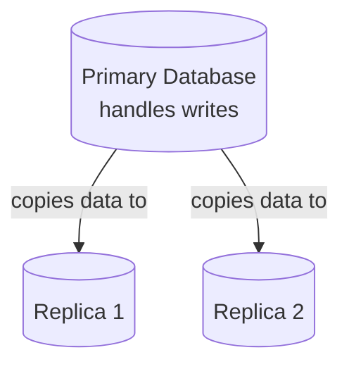

### Why it's needed
- **Fault tolerance** — if the primary dies, a replica can take over instead of losing the data entirely.
- **Read scaling** — replicas can serve read queries, spreading read load across multiple machines (recall from the SQL vs NoSQL topic — read replicas were shown as a natural next scaling step).
- **Geographic distribution** — placing replicas closer to users in different regions reduces read latency (similar in spirit to how a CDN, covered earlier, brings content physically closer to users).

---

## 2. Replication Topologies

### Leader-Follower (Primary-Replica)
One node (the leader) accepts all writes; changes propagate out to one or more followers, which typically serve read traffic.

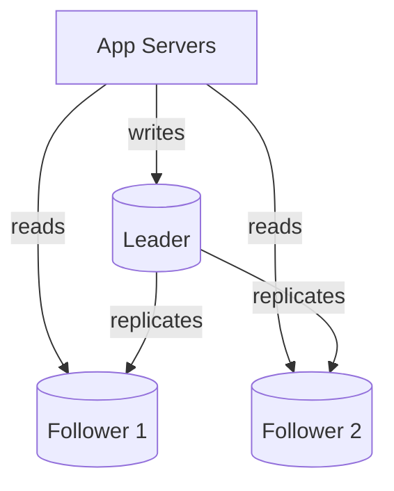
- **Simple to reason about** — there's only ever one place writes can happen, so there's never a conflict about which write "wins."

### Multi-Leader
More than one node can accept writes, and each propagates its changes to the others.

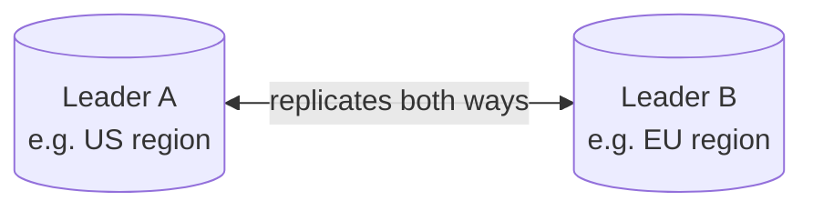
- **Good for:** systems with writes happening in multiple geographic regions, where forcing every write through one single leader would add too much latency.
- **Downside:** if the same data is written differently on both leaders before they sync, there's a genuine **conflict** to resolve (e.g., "last write wins," or custom application logic).

### Leaderless
Any node can accept a write directly from a client, and the write propagates to other nodes; reads may check multiple nodes and reconcile differences.
- **Good for:** very high availability during network partitions (this ties directly to the AP side of the CAP Theorem topic) — used by databases like Cassandra and DynamoDB.

---

## 3. Synchronous vs Asynchronous Replication

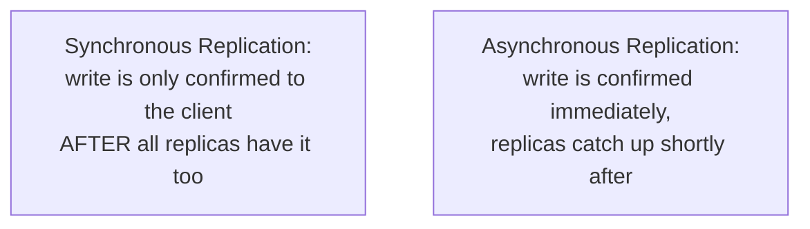

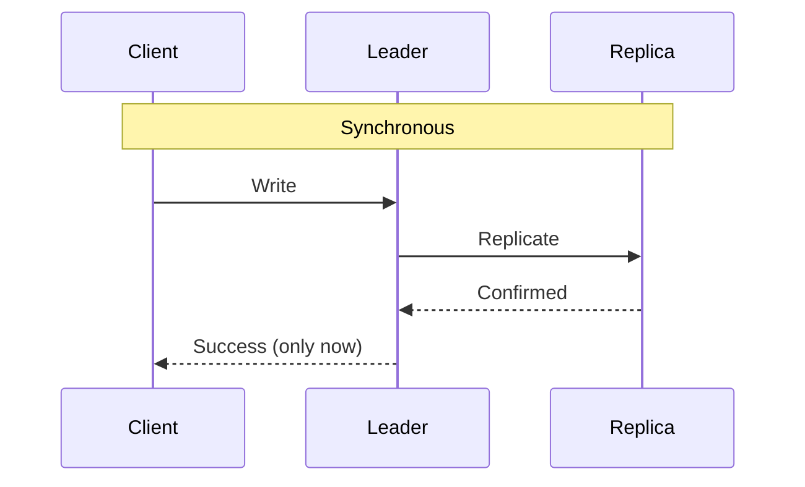

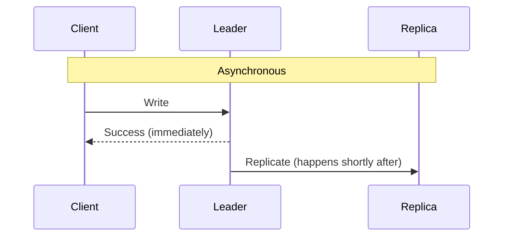

- **Synchronous:** stronger durability guarantee (a confirmed write is genuinely safe on multiple machines), but higher latency, since every write waits on the slowest replica.
- **Asynchronous:** faster, but there's a small window where a leader crash could lose the most recent write(s) before they replicated.

---

## 4. Replication Lag

**Replication lag** is the delay between when data is written to the leader and when it actually shows up on a follower — this is the real-world consequence of asynchronous replication, and a very common source of confusing bugs.

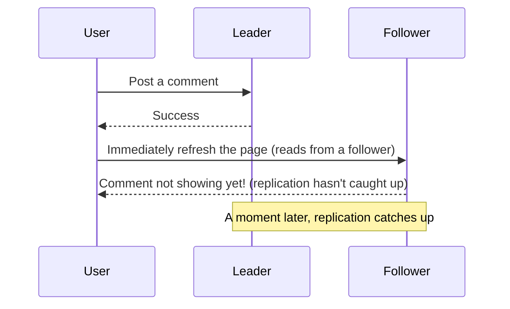

- **Mitigation:** for actions where a user needs to immediately see their own write (like posting a comment and seeing it appear), route that specific read back to the leader, or to a replica known to be fully caught up — a pattern often called **"read-your-writes" consistency**.

---

# Part 2: API Versioning

## 5. Why APIs Need Versioning

Once an API has real clients depending on it (mobile apps, third-party integrations, other internal services), you can't simply change its behavior overnight — a breaking change would break every client that hasn't updated yet.

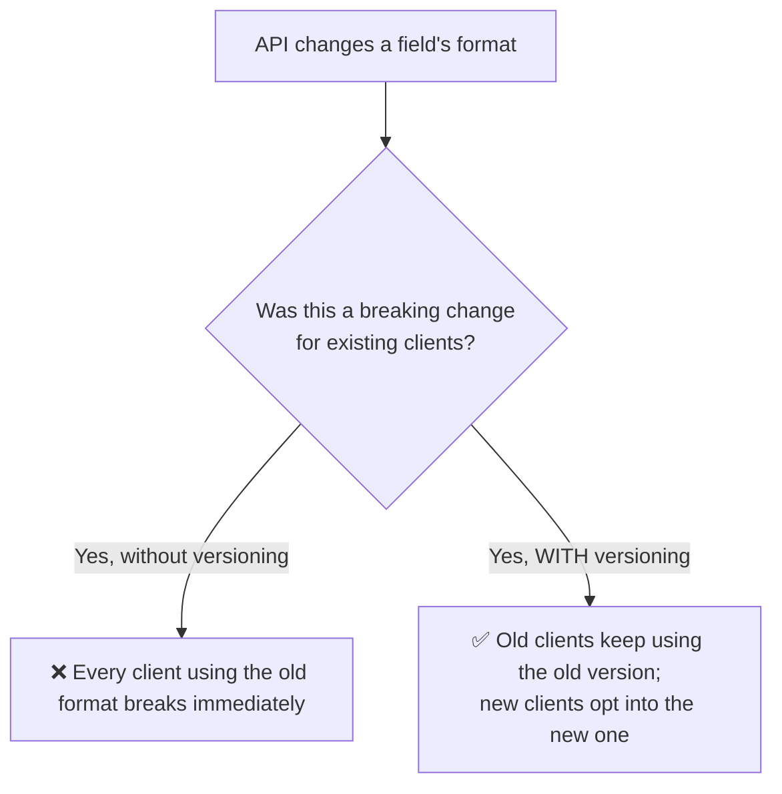

This connects directly back to the API Design Basics topic, where versioning was flagged as a common mistake to avoid — this section covers *how* to actually do it.

---

## 6. Versioning Strategies

### URI/Path Versioning (most common)
The version number is embedded directly in the URL.

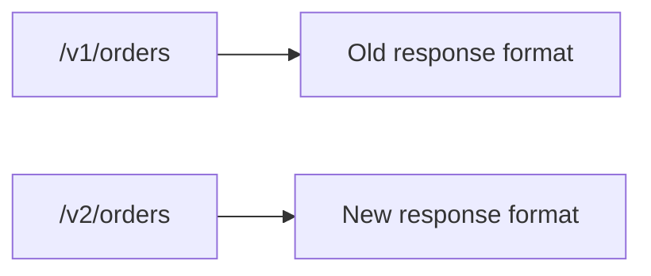
- **Pros:** simple, visible, easy to test directly in a browser or with `curl`.
- **Cons:** technically, the URL is supposed to represent a *resource*, not a version of it — some consider this philosophically "impure" REST, though it's overwhelmingly the most common approach in practice.

### Header Versioning
The version is specified in a custom request header, while the URL stays the same.

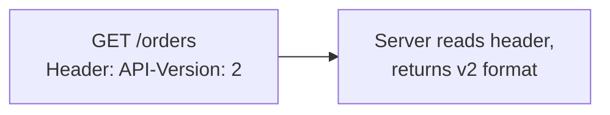
- **Pros:** keeps URLs clean, seen as more "correct" REST.
- **Cons:** less visible/discoverable — you can't just see the version by looking at the URL.

### Query Parameter Versioning
The version is passed as a query parameter.

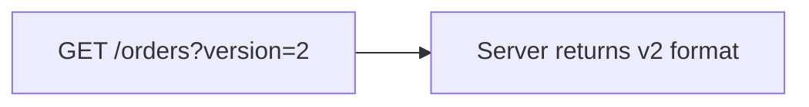
- **Pros:** simple to add.
- **Cons:** query parameters are typically meant for filtering/sorting data, not for something as structural as an API version — mixes concerns.

### Comparison

| Strategy | Visibility | REST "purity" | Common Usage |
|---|---|---|---|
| URI/Path (`/v1/...`) | High | Debated | Most widely used in practice |
| Header (`API-Version: 2`) | Low | Higher | Common in stricter API design shops |
| Query param (`?version=2`) | Medium | Lower | Less common, seen as a hybrid/quick option |

---

## 7. Deprecation — Retiring Old Versions Gracefully

Versioning isn't just about launching `/v2` — it's also about eventually retiring `/v1`, without breaking clients who haven't migrated yet.

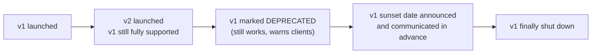

- A well-behaved deprecation includes a **clear timeline**, and often a `Deprecation` or `Sunset` response header warning clients ahead of the actual shutdown — giving them time to migrate rather than breaking without warning.

---

# Part 3: Circuit Breaker

## 8. What Is a Circuit Breaker?

A **circuit breaker** is a pattern that stops a service from repeatedly calling another service that's already failing or overloaded — protecting both the caller (from wasting time on doomed requests) and the struggling downstream service (from being hit with even more traffic while it's trying to recover).

The name comes directly from **electrical circuit breakers** — when there's a dangerous surge of current, the breaker "trips" and cuts the circuit, preventing damage, rather than letting the surge keep flowing.

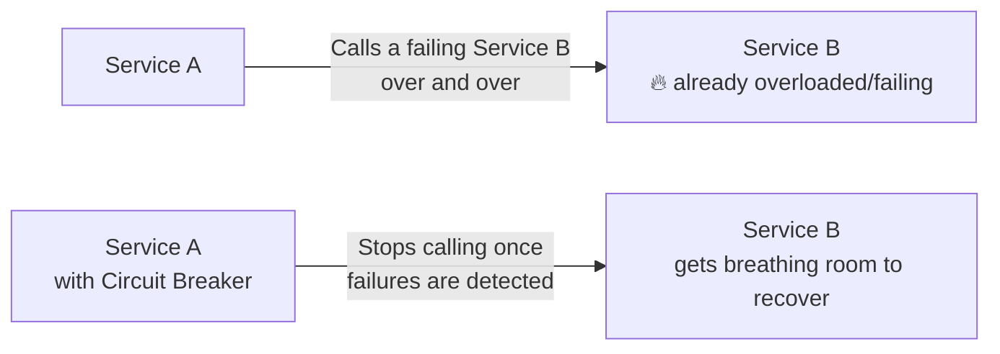

This directly builds on the "avoiding cascading failures" idea from the Fault Tolerance topic — a circuit breaker is the concrete mechanism that implements that protection.

---

## 9. The Three States

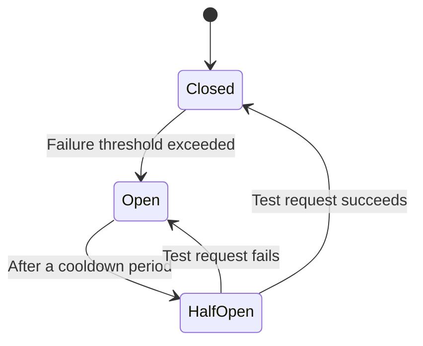

### Closed (normal operation)
Requests flow through normally. The circuit breaker quietly counts failures in the background.

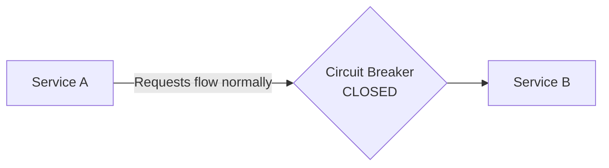

### Open (tripped — blocking requests)
Once failures exceed a threshold (e.g., "50% of the last 20 requests failed"), the breaker "trips" open. Further requests are **immediately rejected** without even attempting to call Service B — failing fast instead of waiting on a timeout.

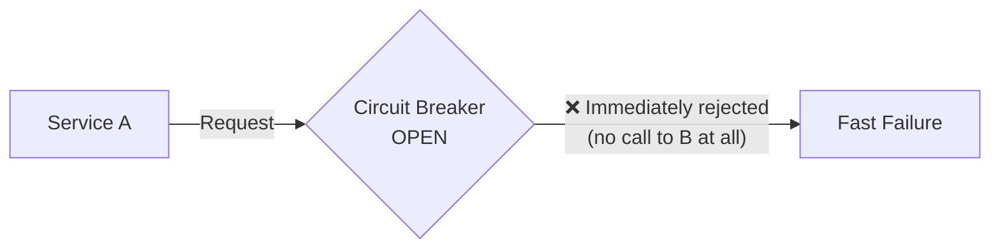

### Half-Open (cautiously testing recovery)
After a cooldown period, the breaker allows a **small number of test requests** through, to check if Service B has recovered.

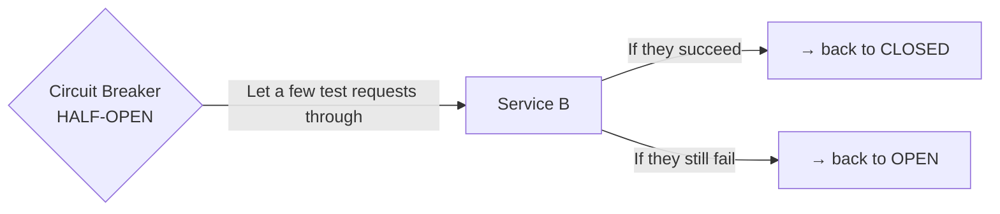

---

## 10. Circuit Breaker in a Request Flow

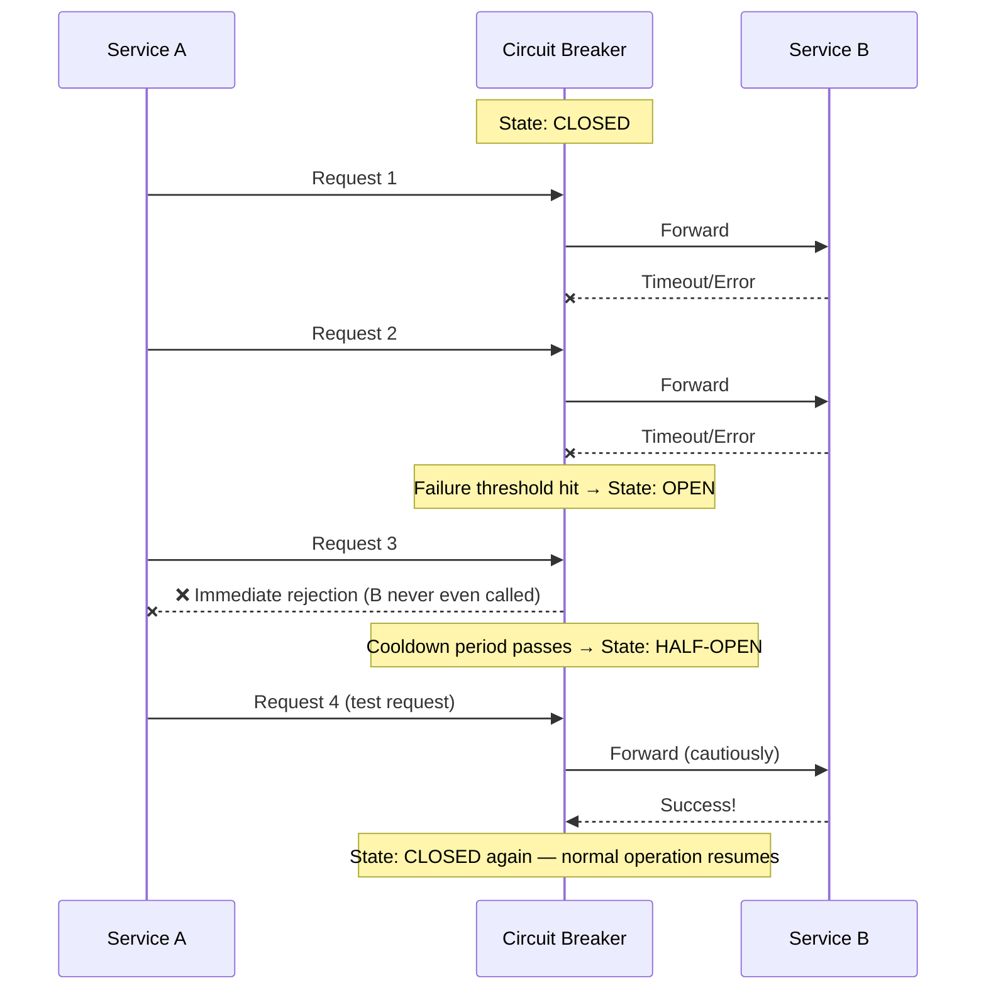

- **Why "fail fast" matters:** without a circuit breaker, Service A might wait for a full timeout on every request to a dead Service B, wasting time and resources on every single call. The circuit breaker skips straight to rejection once it's confident B is down, freeing Service A to respond quickly (e.g., with a fallback/cached response) instead of hanging.

---

# Part 4: SSO (Single Sign-On)

## 11. What Is SSO?

**SSO (Single Sign-On)** lets a user log in **once** and gain access to multiple, otherwise-separate applications, without having to log in again for each one individually.

Think of it like a single wristband at a multi-venue festival: you show your ID once at the main gate, get a wristband, and every stage/venue inside just checks the wristband — no need to show ID again at each one.

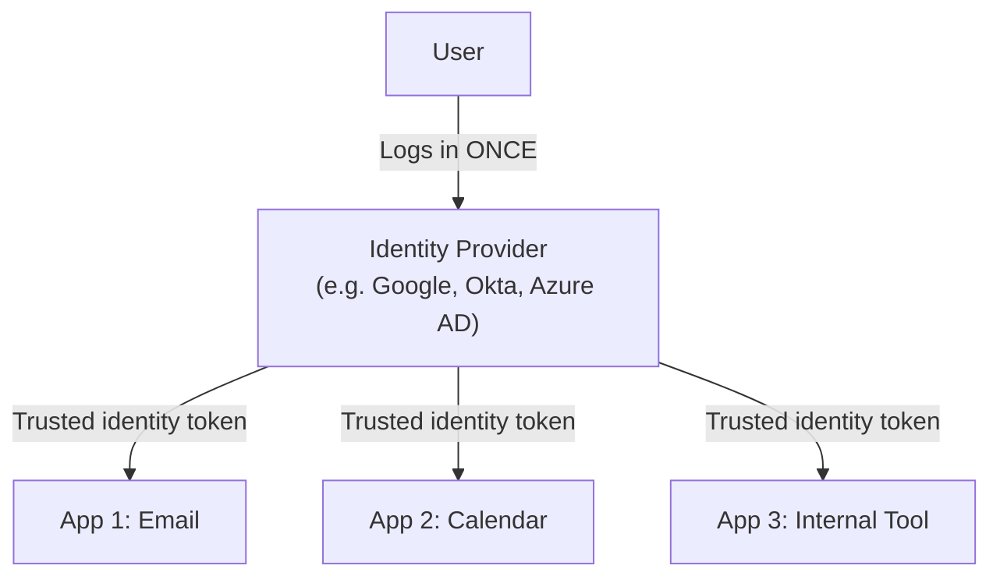

---

## 12. How SSO Actually Works

The key player is the **Identity Provider (IdP)** — a central, trusted service that verifies who a user is. Individual applications (called "Service Providers") don't verify passwords themselves; they trust the IdP's confirmation instead.

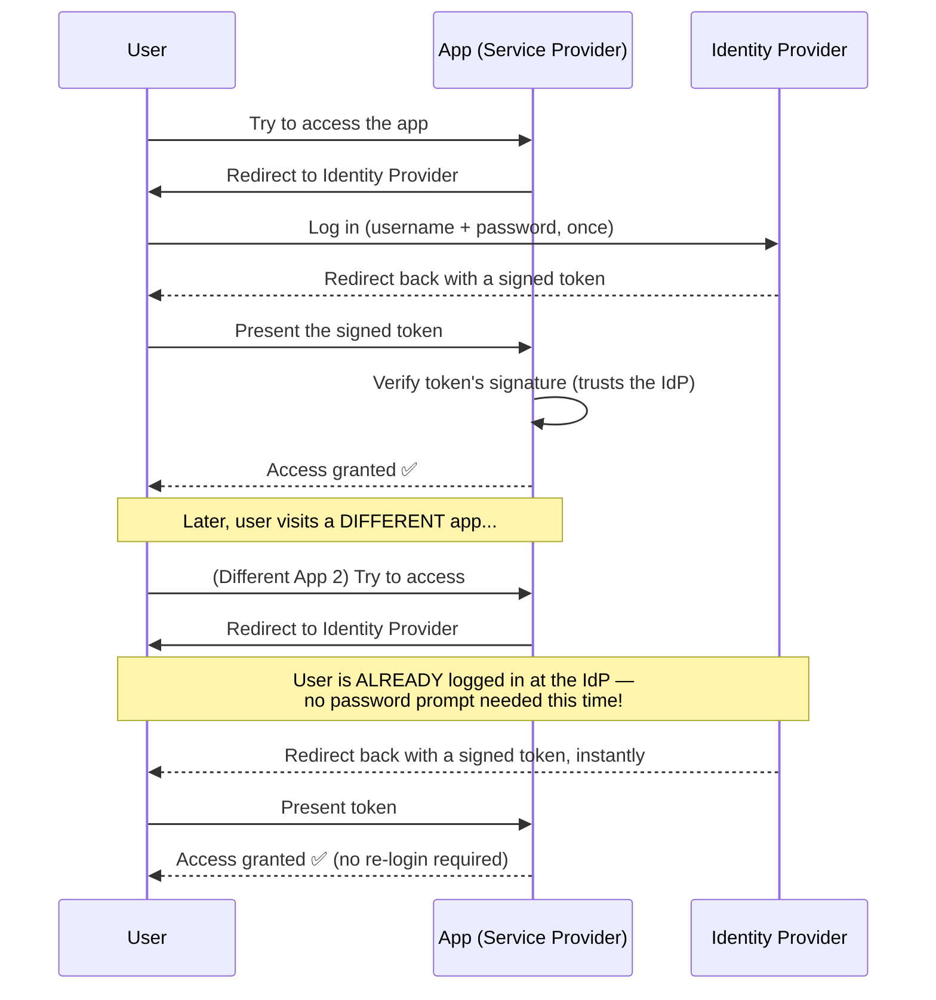

- The critical detail: the **second app never saw the user's password at all** — it only trusts a signed token issued by the Identity Provider, which is exactly what keeps this both convenient and secure. Individual applications don't need to build or maintain their own authentication system.

---

## 13. SAML vs OAuth/OIDC — A Quick Orientation

Two common underlying standards implement SSO-style flows, and they're often confused:

```mermaid
flowchart TB
    SAML["SAML<br/>(Security Assertion Markup Language)<br/>Older, XML-based,<br/>common in enterprise/corporate SSO"]
    OIDC["OpenID Connect (OIDC)<br/>built on top of OAuth 2.0,<br/>JSON-based, common for modern web/mobile apps<br/>('Sign in with Google' style flows)"]
```

| | SAML | OIDC (built on OAuth 2.0) |
|---|---|---|
| **Format** | XML | JSON |
| **Common in** | Enterprise/corporate environments | Modern consumer web & mobile apps |
| **Feel** | Older, more verbose | Lighter weight, more current standard |

*(This is a deep topic on its own — the key takeaway for now is knowing they exist and roughly where each is typically used, rather than mastering every protocol detail.)*

---

# Part 5: Cloud Basics (AWS/Azure/GCP)

## 14. What Does "The Cloud" Actually Mean?

"The cloud" simply means **renting computing resources** (servers, storage, databases, networking) from a provider over the internet, instead of buying and physically maintaining your own hardware.

```mermaid
flowchart TB
    Old["Old way:<br/>Buy physical servers,<br/>run them in your own data center,<br/>maintain the hardware yourself"]
    New["Cloud way:<br/>Rent servers/storage/services from<br/>AWS, Azure, or GCP,<br/>pay only for what you use"]
    Old -.replaced largely by.-> New
```

The three dominant providers: **AWS (Amazon Web Services)**, **Azure (Microsoft)**, and **GCP (Google Cloud Platform)** — each offering broadly similar categories of services, under different product names.

---

## 15. IaaS vs PaaS vs SaaS

This describes **how much** of the underlying stack the cloud provider manages for you, versus how much you manage yourself.

```mermaid
flowchart TB
    A["IaaS<br/>Infrastructure as a Service<br/>You manage: OS, runtime, app code<br/>Provider manages: physical hardware, networking"]
    B["PaaS<br/>Platform as a Service<br/>You manage: just your app code<br/>Provider manages: OS, runtime, infrastructure"]
    C["SaaS<br/>Software as a Service<br/>You manage: nothing —<br/>just USE the finished application"]
```

```mermaid
flowchart LR
    IaaS["IaaS example:<br/>AWS EC2 (a virtual server<br/>you install your own software on)"]
    PaaS["PaaS example:<br/>AWS Elastic Beanstalk /<br/>Google App Engine<br/>(deploy your code, platform handles the rest)"]
    SaaS["SaaS example:<br/>Gmail, Salesforce<br/>(fully finished product, just log in and use it)"]
```

- **More control, more responsibility** as you move toward IaaS.
- **Less control, less operational burden** as you move toward SaaS.

---

## 16. Core Service Categories, Mapped Across Providers

Rather than memorizing every product name, it's far more useful to understand the **category** of service — since all three major providers offer equivalents for each.

```mermaid
flowchart TB
    Compute["Compute<br/>(run your application code)"]
    Storage["Storage<br/>(store files/objects)"]
    Database["Managed Databases"]
    Networking["Networking<br/>(load balancers, CDN, DNS)"]
    Serverless["Serverless / Functions<br/>(run code without managing servers at all)"]
```

| Category | AWS | Azure | GCP |
|---|---|---|---|
| Virtual servers (compute) | EC2 | Virtual Machines | Compute Engine |
| Object storage | S3 | Blob Storage | Cloud Storage |
| Managed relational DB | RDS | Azure SQL Database | Cloud SQL |
| Managed NoSQL DB | DynamoDB | Cosmos DB | Firestore / Bigtable |
| Serverless functions | Lambda | Azure Functions | Cloud Functions |
| Content Delivery Network | CloudFront | Azure CDN | Cloud CDN |
| Load Balancing | ELB | Azure Load Balancer | Cloud Load Balancing |

**Interview tip:** you don't need to memorize every product name — what matters is recognizing the underlying category (compute, storage, managed database, serverless, CDN) and knowing that all three major clouds offer some equivalent, since the *concepts* transfer directly across providers, even when the product names don't.

### Serverless — worth calling out specifically
Serverless (e.g., AWS Lambda) lets you deploy just a function of code, which the provider automatically runs **only when triggered** (e.g., by an API call or an event), scaling it up and down completely automatically — you never provision or manage a server at all.

```mermaid
flowchart LR
    Event["Event occurs<br/>(e.g. HTTP request, file uploaded)"] --> Fn["Cloud Function/Lambda<br/>runs briefly, does its job"]
    Fn --> Done["Shuts down automatically<br/>— you only pay for the exact time it ran"]
```
- **Good for:** unpredictable or spiky workloads, small independent tasks — you don't pay for idle server time (unlike a traditional always-on server), and it scales automatically without any manual intervention.

---

## 17. Regions and Availability Zones

This connects directly to the Fault Tolerance & High Availability topic — cloud providers structure their infrastructure specifically to support exactly the kind of redundancy discussed there.

```mermaid
flowchart TB
    Region["Region<br/>(a broad geographic area, e.g. 'US East')"]
    Region --> AZ1["Availability Zone 1<br/>(an isolated data center)"]
    Region --> AZ2["Availability Zone 2<br/>(a separate, isolated data center)"]
    Region --> AZ3["Availability Zone 3<br/>(a separate, isolated data center)"]
```

- **Region** — a large geographic area (e.g., "US East," "EU West") containing multiple, physically separate data centers.
- **Availability Zone (AZ)** — an individual, isolated data center within a region, with its own independent power/networking/cooling — so a failure in one AZ (e.g., a power outage) doesn't take down the others.

**Practical takeaway:** deploying redundant servers across **multiple Availability Zones** (not just multiple servers in the *same* data center) is exactly how cloud-based systems achieve the redundancy discussed in the Fault Tolerance topic — protecting against not just a single server failing, but an entire data center having a problem.

---

## 18. How to Reason About This in an Interview

If asked to combine these ideas — e.g., *"design a reliable, versioned API that talks to other services and supports enterprise login"* — a strong answer sounds like this:

> "For the data layer, I'd use leader-follower replication so reads can scale across replicas and a follower can be promoted if the leader fails — accepting that asynchronous replication means a small amount of replication lag, and using 'read-your-writes' routing for anything where a user needs to immediately see their own change. For the API itself, I'd version it using the URL path, like `/v1/...`, since it's the most common, visible approach, and plan a clear deprecation timeline before ever removing an old version. For calls to other internal services, I'd wrap them in a circuit breaker, so if a downstream service starts failing, we fail fast and stop hammering it further, giving it room to recover, rather than risking a cascading failure. For enterprise login, I'd integrate SSO through the company's Identity Provider, so users log in once and our app just verifies a signed token rather than managing passwords ourselves. And for infrastructure, I'd deploy across multiple Availability Zones within a region, so an entire data center having an issue doesn't take the whole system down — using managed services like a cloud provider's managed database and load balancer rather than reinventing that infrastructure ourselves."

That answer shows: you can combine multiple concepts into one coherent design, you understand the *tradeoffs* within each (sync vs async replication, versioning strategy choice), and you connect infrastructure choices (AZs) back to the reliability goals from earlier topics.

---

## 19. Quick Recall Cheat Sheet

```mermaid
mindmap
  root((5 Topics))
    Database Replication
      Leader-Follower most common
      Multi-Leader for multi-region writes
      Sync safer/slower, Async faster/riskier
      Replication lag - read-your-writes fix
    API Versioning
      URI path most common /v1/
      Header versioning cleaner REST
      Deprecate gracefully with sunset dates
    Circuit Breaker
      Closed - normal
      Open - fails fast, blocks calls
      Half-Open - cautious test requests
    SSO
      Login once via Identity Provider
      Apps trust signed tokens, not passwords
      SAML enterprise/XML, OIDC modern/JSON
    Cloud Basics
      IaaS - you manage OS+app
      PaaS - you manage just app code
      SaaS - fully managed product
      Regions - broad areas
      Availability Zones - isolated data centers within a region
```

| If you remember only 5 things |
|---|
| 1. Replication keeps data on multiple nodes for fault tolerance and read scaling; async replication is faster but introduces replication lag. |
| 2. Version APIs (commonly via `/v1/` in the URL) so breaking changes don't instantly break existing clients — deprecate old versions gracefully with a clear timeline. |
| 3. A circuit breaker fails fast once a downstream service is clearly struggling, giving it room to recover instead of piling on more requests. |
| 4. SSO lets a user log in once via a trusted Identity Provider; individual apps verify a signed token rather than handling passwords themselves. |
| 5. Cloud providers offer the same core categories (compute, storage, managed DBs, serverless) under different names; deploying across multiple Availability Zones is how cloud systems achieve real redundancy. |

---

*This file is written in GitHub-flavored Markdown with Mermaid diagrams — it will render natively on GitHub, GitLab, and most modern Markdown viewers.*
