# SQL vs NoSQL Databases: When to Use Which

*A zero-to-mastery guide for system design interviews and real-world architecture.*

---

## Table of Contents
1. [What Is a Database, Really?](#1-what-is-a-database-really)
2. [SQL Databases (Relational)](#2-sql-databases-relational)
3. [NoSQL Databases (Non-Relational)](#3-nosql-databases-non-relational)
4. [The Core Difference: Schema](#4-the-core-difference-schema)
5. [The Types of NoSQL Databases](#5-the-types-of-nosql-databases)
6. [ACID vs BASE](#6-acid-vs-base)
7. [Scaling: Why NoSQL Is Often Easier to Scale Out](#7-scaling-why-nosql-is-often-easier-to-scale-out)
8. [Side-by-Side Comparison](#8-side-by-side-comparison)
9. [When to Use Which — Decision Guide](#9-when-to-use-which--decision-guide)
10. [How to Reason About This in an Interview](#10-how-to-reason-about-this-in-an-interview)
11. [Quick Recall Cheat Sheet](#11-quick-recall-cheat-sheet)

---

## 1. What Is a Database, Really?

A **database** is just a system for storing data in an organized way so it can be reliably saved, searched, and updated later. The big question every system design decision comes down to is: **how do you organize that data, and what tradeoffs come with that choice?**

That's really the entire SQL vs NoSQL debate — two different philosophies for organizing and storing data, each suited to different kinds of problems.

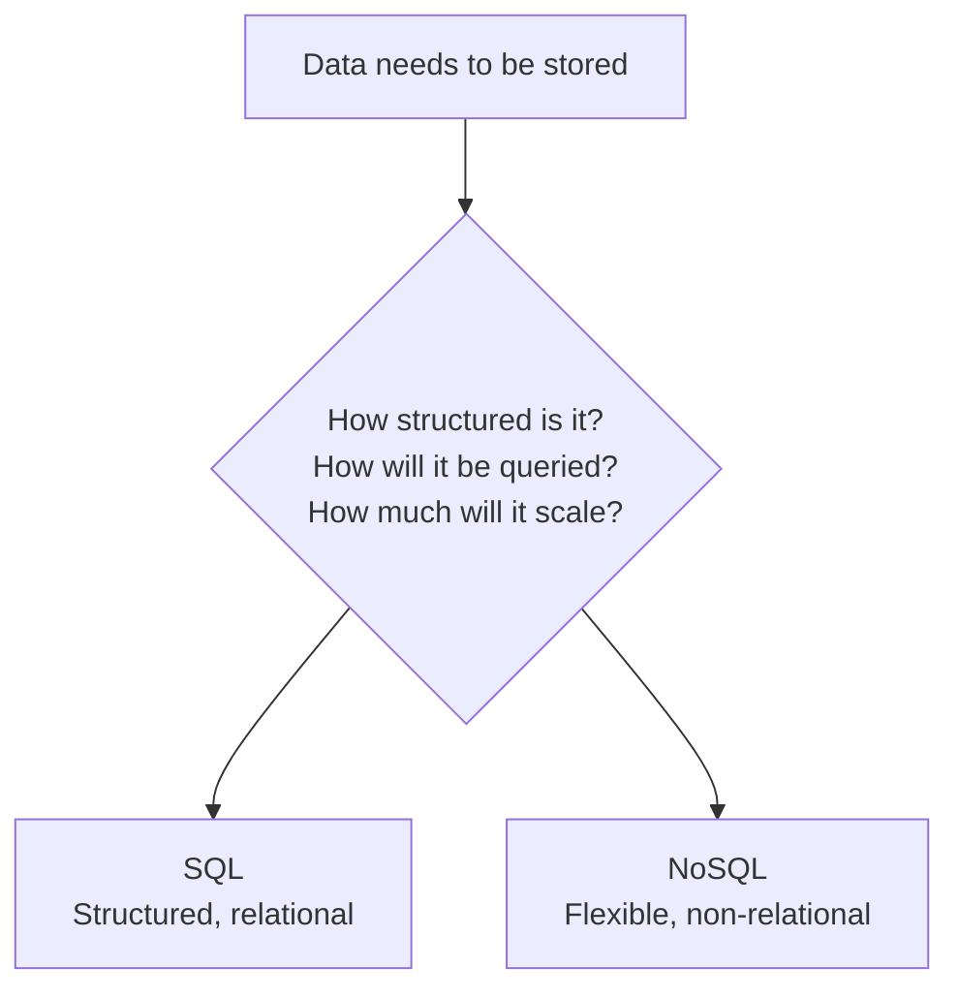

---

## 2. SQL Databases (Relational)

### The idea
Data is organized into **tables**, made up of **rows** and **columns**, similar to a spreadsheet. Every row in a table has the exact same set of columns. Tables can be linked to each other through **relationships** (e.g., an `orders` table referencing a `users` table by user ID).

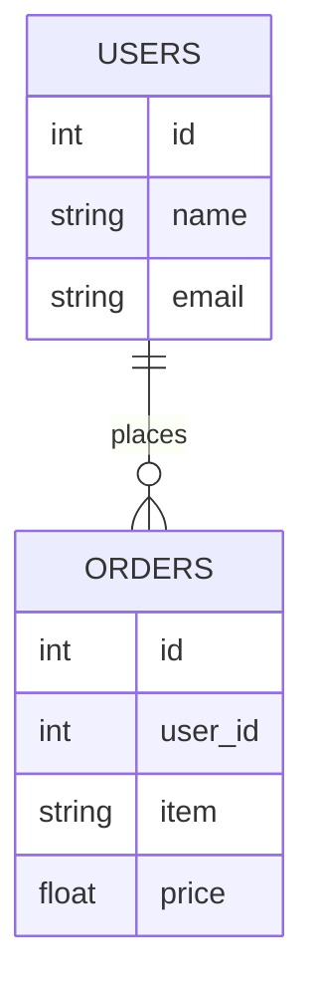

### Example: what a table actually looks like

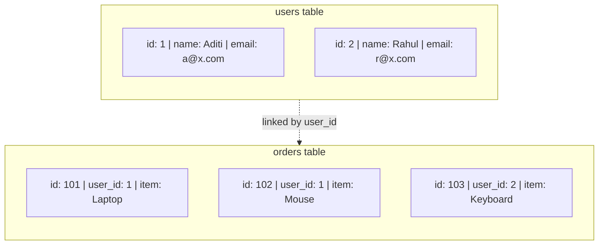

### Examples
MySQL, PostgreSQL, Oracle DB, Microsoft SQL Server.

### Key traits
- **Fixed schema** — you must define the structure (columns, types) upfront, and every row must follow it.
- **SQL (Structured Query Language)** — a powerful, standardized language for querying, including complex joins across multiple tables.
- **Strong consistency** — built for accuracy: relationships and constraints (like "this order must belong to a real user") are enforced by the database itself.

---

## 3. NoSQL Databases (Non-Relational)

### The idea
Data does **not** need to fit into rigid rows and columns. Instead, it's stored in more flexible formats — documents, key-value pairs, wide columns, or graphs (see Section 5). Different records can have different structures, and there's typically no requirement to define a fixed schema upfront.

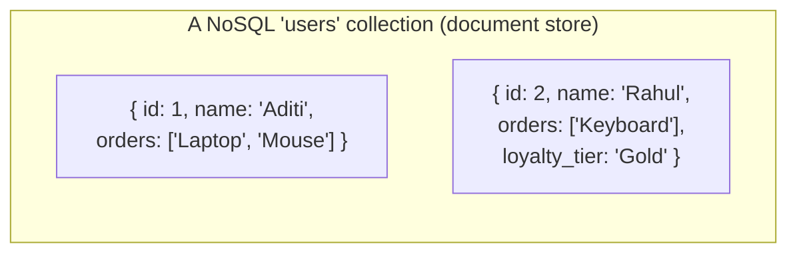

Notice: Document D2 has an extra field (`loyalty_tier`) that D1 doesn't have. In SQL, this would be impossible without adding that column to *every* row. In NoSQL, it's completely normal — each record can carry exactly the fields it needs.

### Examples
MongoDB (document), Redis (key-value), Cassandra (wide-column), Neo4j (graph).

### Key traits
- **Flexible/dynamic schema** — records don't all need to look the same.
- **Built for horizontal scaling** — designed from the ground up to spread data across many servers (more on this in Section 7).
- **Often trades some consistency for speed and scale** — more on this in Section 6.

---

## 4. The Core Difference: Schema

This is the single most important distinction to internalize before anything else.

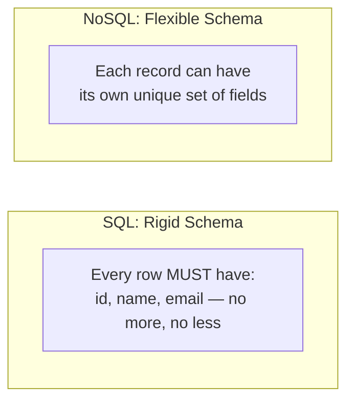

- **SQL:** you decide the structure *before* you have data — like designing a form with fixed fields that everyone must fill in the same way.
- **NoSQL:** the structure can *emerge* from the data itself — like a notebook where each entry can be shaped differently depending on what you're recording.

---

## 5. The Types of NoSQL Databases

"NoSQL" isn't one thing — it's an umbrella term covering several different data models, each suited to a different kind of problem.

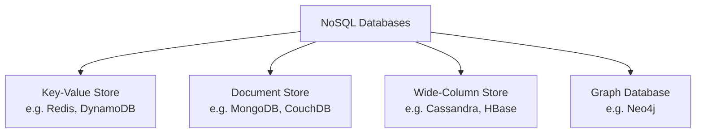

### Key-Value Store
The simplest model: every piece of data is just a key mapped to a value, like a giant dictionary/hash map.

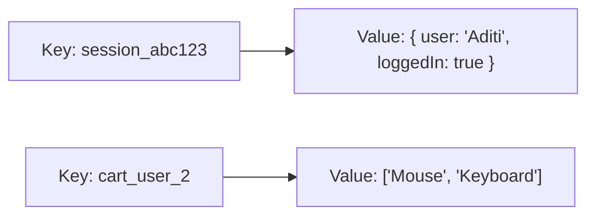
- **Best for:** caching, session storage, super fast lookups by a known key.

### Document Store
Data is stored as self-contained "documents" (usually JSON-like), each with their own structure.
- **Best for:** content management, product catalogs, user profiles — data that's naturally nested and varies in shape.

### Wide-Column Store
Data is stored in tables, but unlike SQL, each row can have a different, very large number of columns, and columns are grouped for efficient reads/writes at massive scale.
- **Best for:** time-series data, huge write-heavy workloads (e.g., IoT sensor data, activity logs).

### Graph Database
Data is stored as **nodes** (entities) and **edges** (relationships between them) — built specifically to make relationship-heavy queries fast.

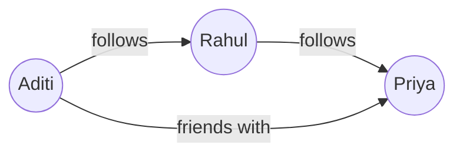
- **Best for:** social networks, recommendation engines, fraud detection — anything where the *relationships* between data points matter as much as the data itself.

---

## 6. ACID vs BASE

This is *why* SQL and NoSQL tend to behave so differently under the hood — they're built around two different guarantees.

### SQL: ACID
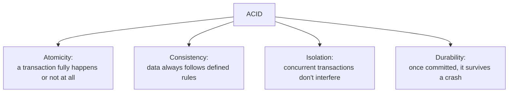

Example: transferring money between two bank accounts. Atomicity guarantees that if the "subtract from Account A" step succeeds but the "add to Account B" step fails, the *entire* transaction rolls back — money can't vanish into thin air.

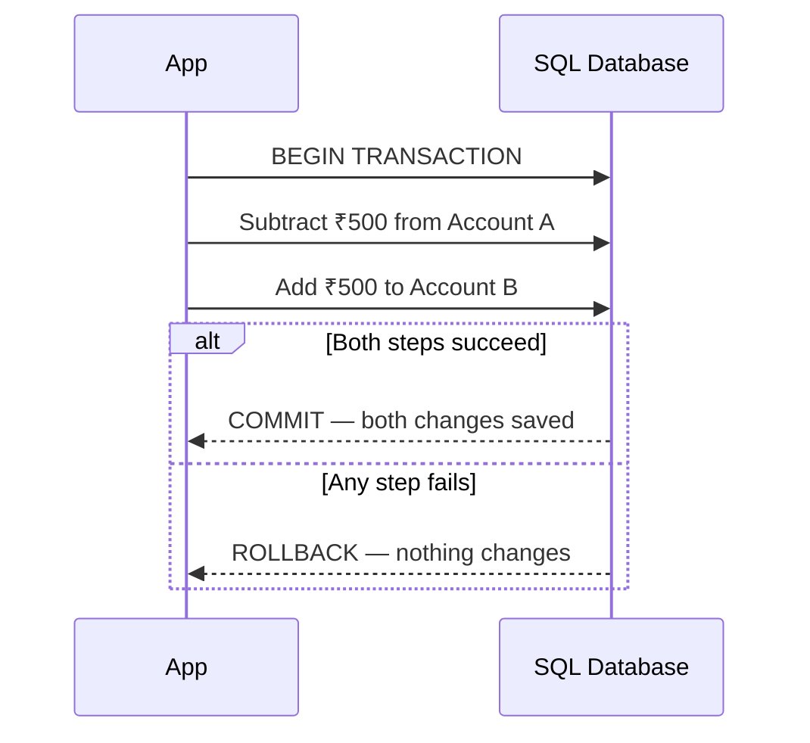

### NoSQL: BASE
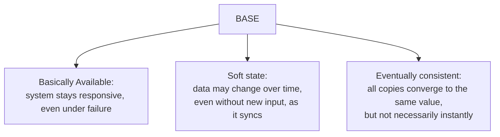

Example: you post a photo, and for a brief moment, a friend viewing from a server in another region still sees your old profile picture — but within a few seconds, it catches up.

**The tradeoff in one line:** ACID prioritizes correctness even if it costs some speed/availability. BASE prioritizes availability and speed, accepting that different copies of the data might briefly disagree.

---

## 7. Scaling: Why NoSQL Is Often Easier to Scale Out

SQL databases were historically designed to run on **one powerful machine**, with relationships and joins that are hard to split across multiple servers cleanly. NoSQL databases were built from day one assuming they'd run across **many machines**.

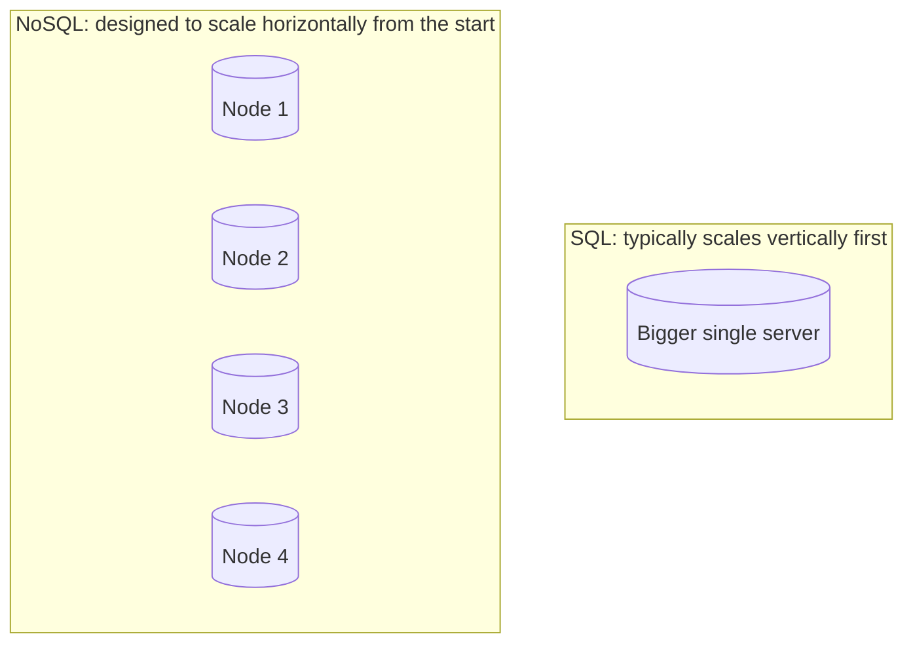

This is because a **join** across tables (a core SQL feature) is expensive to compute when the related data lives on different physical machines. NoSQL databases avoid this problem by design — documents/records are typically self-contained (recall Section 3's example, where a user's orders lived *inside* their own document rather than a separate linked table), so there's nothing that needs to be joined across machines.

**Important nuance:** modern SQL databases *can* scale horizontally too (via sharding and read replicas), and it's a well-solved problem at companies like Google (Spanner) and others — but it takes deliberate, non-trivial engineering. NoSQL databases give you that horizontal scalability more "out of the box."

---

## 8. Side-by-Side Comparison

| Dimension | SQL | NoSQL |
|---|---|---|
| **Schema** | Fixed, defined upfront | Flexible, dynamic |
| **Data model** | Tables with rows/columns, relationships | Documents / key-value / wide-column / graph |
| **Query language** | SQL — standardized, powerful joins | Varies by database, usually simpler queries |
| **Consistency model** | ACID — strong consistency | BASE — eventual consistency (usually) |
| **Scaling** | Vertical first; horizontal takes engineering effort | Horizontal by design |
| **Best data shape** | Structured, relationship-heavy data | Unstructured / semi-structured, high-volume data |
| **Examples** | PostgreSQL, MySQL, Oracle | MongoDB, Redis, Cassandra, Neo4j |

---

## 9. When to Use Which — Decision Guide

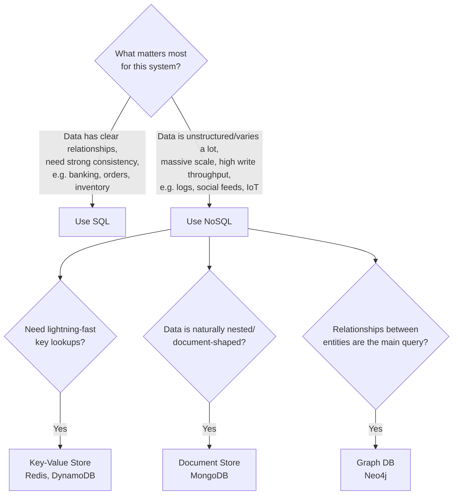

### Choose SQL when:
- Your data has clear, important **relationships** (users → orders → payments).
- You need **strong consistency guarantees** — money, inventory counts, anything where "eventually correct" isn't good enough (e.g., you can't sell the same last item to two people).
- Your query patterns involve complex joins and aggregations.

### Choose NoSQL when:
- Your data is **unstructured or evolves rapidly** in shape (e.g., different products having wildly different attributes).
- You need to handle **massive scale** and high write throughput (e.g., logging every click on a high-traffic site).
- Your access pattern is simple (e.g., "get this document by its ID") rather than relationship-heavy joins.
- Brief inconsistency between replicas is acceptable for your use case.

### In practice: most real systems use both
A large system rarely picks just one. E.g., an e-commerce platform might use SQL for orders and payments (needs strong consistency), Redis for session/cart caching (needs speed), and a document store for the product catalog (varies a lot per product category).

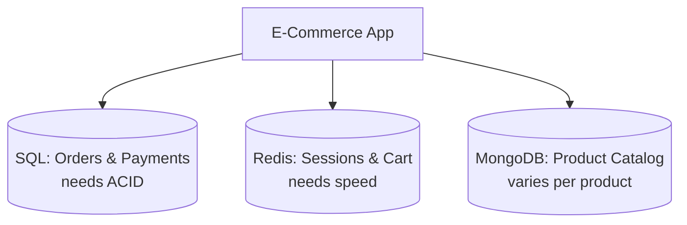

---

## 10. How to Reason About This in an Interview

If asked *"would you use SQL or NoSQL for this system?"*, a strong answer sounds like this:

> "It depends on the data's shape and the consistency needs. If the data has strong relationships and correctness is critical — like financial transactions or inventory — I'd lean SQL, since ACID guarantees prevent things like double-spending or overselling. If the data is unstructured, high-volume, or the shape varies per record — like user activity logs or a product catalog with wildly different attributes per category — I'd lean NoSQL, likely a document store, since forcing that into a rigid schema would be awkward and horizontal scaling would be easier. In most real systems I wouldn't pick just one — I'd use SQL for the core transactional data and a NoSQL store like Redis for caching or a document store for flexible content, depending on what each part of the system actually needs."

That answer shows: you understand the *underlying tradeoff* (schema rigidity and consistency vs flexibility and scale) rather than just naming databases, and you recognize that real systems are usually **polyglot** — using multiple database types together.

---

## 11. Quick Recall Cheat Sheet

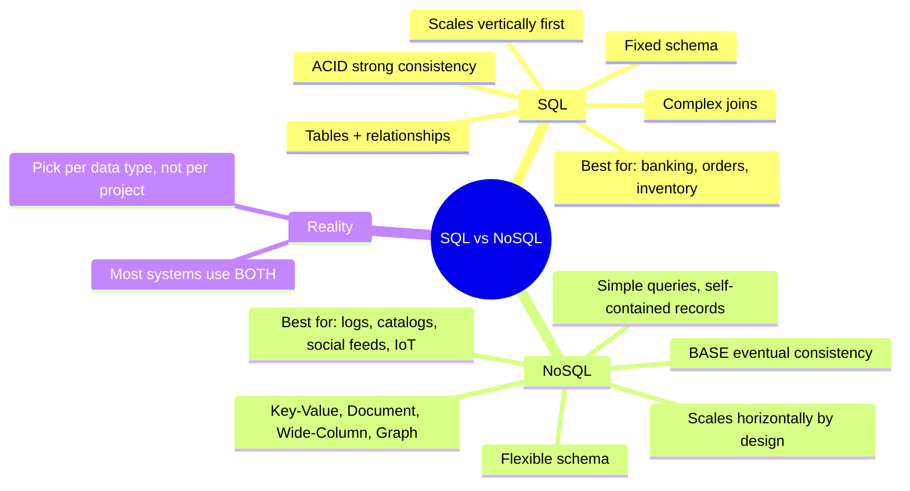

| If you remember only 5 things |
|---|
| 1. SQL = fixed schema, tables, relationships. NoSQL = flexible schema, various data models. |
| 2. SQL follows ACID (strong consistency); NoSQL typically follows BASE (eventual consistency). |
| 3. NoSQL comes in 4 main flavors: Key-Value, Document, Wide-Column, Graph — each suited to different access patterns. |
| 4. SQL scales vertically more naturally; NoSQL is built for horizontal scaling from the start. |
| 5. Real-world systems almost always use both — pick the database type per piece of data, not one database for the whole system. |

---

*This file is written in GitHub-flavored Markdown with Mermaid diagrams — it will render natively on GitHub, GitLab, and most modern Markdown viewers.*
