# API Design Basics: REST Principles & Status Codes

*A zero-to-mastery guide for system design interviews and real-world architecture.*

---

## Table of Contents
1. [What Is an API?](#1-what-is-an-api)
2. [What Does REST Actually Mean?](#2-what-does-rest-actually-mean)
3. [The Core REST Principles](#3-the-core-rest-principles)
4. [Resources & URLs — Naming Things Correctly](#4-resources--urls--naming-things-correctly)
5. [HTTP Methods (Verbs)](#5-http-methods-verbs)
6. [HTTP Status Codes](#6-http-status-codes)
7. [Putting It All Together: A Full Request Lifecycle](#7-putting-it-all-together-a-full-request-lifecycle)
8. [Common REST API Mistakes](#8-common-rest-api-mistakes)
9. [How to Reason About This in an Interview](#9-how-to-reason-about-this-in-an-interview)
10. [Quick Recall Cheat Sheet](#10-quick-recall-cheat-sheet)

---

## 1. What Is an API?

An **API (Application Programming Interface)** is a defined way for two pieces of software to talk to each other. Think of it like a restaurant menu: you (the client) don't need to know how the kitchen (the server) actually cooks the food — you just need to know what you're allowed to order, and what you'll get back.

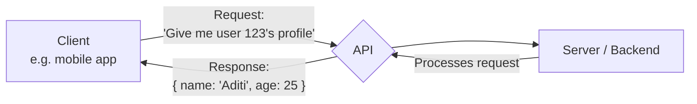

A **web API** typically works over HTTP — the same protocol your browser uses to load web pages — and **REST** is simply the most common *style* of designing that API.

---

## 2. What Does REST Actually Mean?

**REST** stands for **RE**presentational **S**tate **T**ransfer. That name sounds intimidating, but the idea is simple: the client and server exchange **representations** (usually JSON) of a **resource's state** (e.g., "here is the current state of user 123").

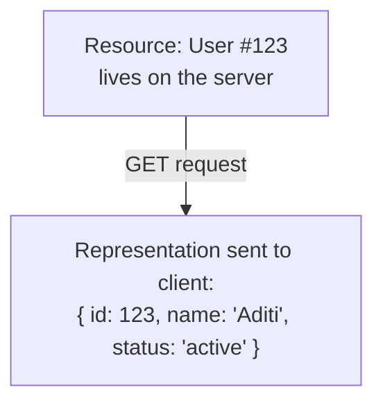

REST isn't a strict protocol or a piece of software — it's a **set of architectural guidelines** for building APIs in a predictable, scalable way. An API that follows these guidelines is called "RESTful."

---

## 3. The Core REST Principles

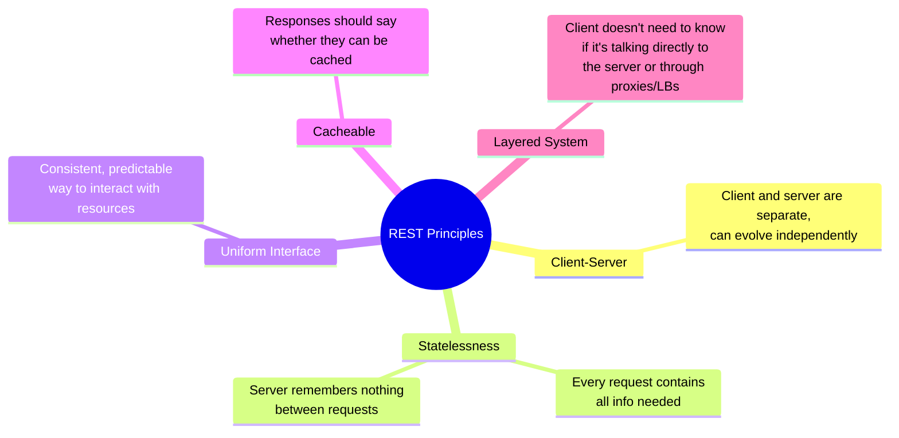

### 3.1 Client-Server Separation
The client (e.g., a mobile app or website) and the server (backend logic + data) are independent. The client only needs to know the API contract — it doesn't care if the backend is rewritten from Python to Go tomorrow, as long as the API behaves the same.

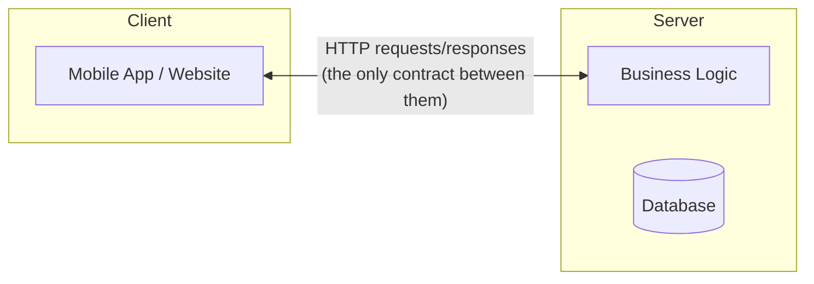

### 3.2 Statelessness
This is the most important — and most misunderstood — principle. **Every single request must contain all the information the server needs to process it.** The server does not store any memory of the client between requests.

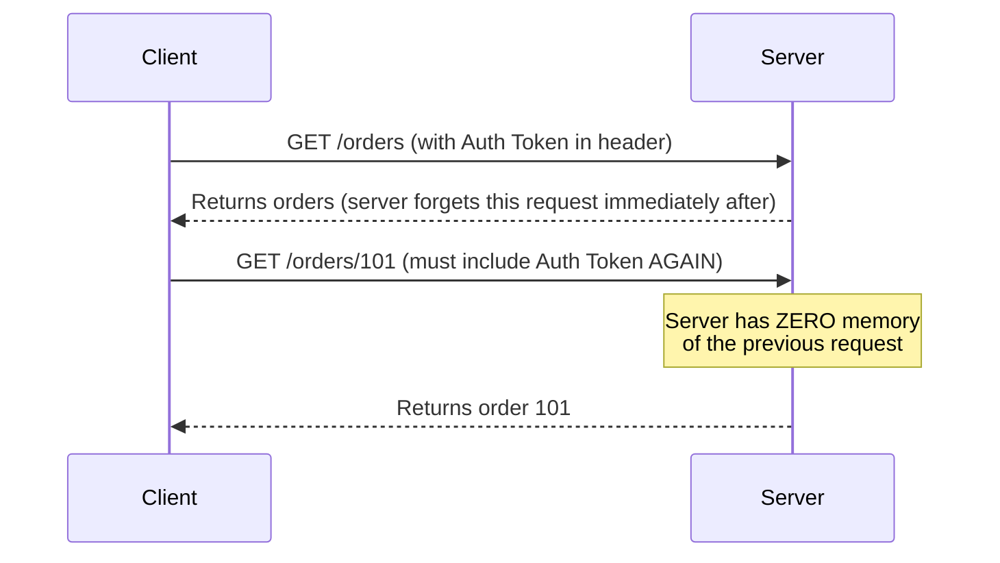

*Note: this ties back to the same statelessness concept relevant to horizontal scaling — a stateless API is exactly what allows any server behind a load balancer to handle any request, since no server needs to "remember" a client.*

### 3.3 Uniform Interface
Every resource is accessed in a consistent, predictable way — same style of URLs, same meaning for each HTTP method, same response format. This is what makes REST APIs easy to learn once you understand the pattern (covered fully in Section 4 & 5).

### 3.4 Cacheable
Responses should explicitly indicate whether they can be cached and for how long (e.g., via HTTP cache headers), so clients and intermediate systems (like CDNs) can avoid repeating unnecessary requests.

### 3.5 Layered System
A client talking to an API shouldn't need to know (or care) if it's hitting the actual server directly, or going through a load balancer, cache, or gateway along the way — the interface stays the same regardless of what's happening behind the scenes.

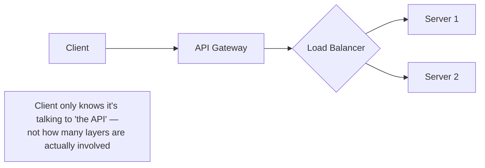

---

## 4. Resources & URLs — Naming Things Correctly

In REST, everything is thought of as a **resource** — a "thing" that can be created, read, updated, or deleted (e.g., a user, an order, a product). URLs should represent these resources as **nouns**, never actions/verbs.

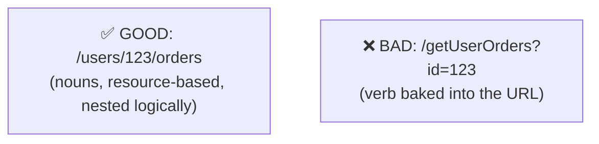

### Common conventions
| Convention | Example |
|---|---|
| Use plural nouns | `/users` not `/user` |
| Nest related resources | `/users/123/orders` (orders belonging to user 123) |
| Use path parameters for specific items | `/users/123` (a specific user) |
| Use query parameters for filtering/sorting | `/orders?status=shipped&sort=date` |
| Never put verbs in the URL | `/orders/101/cancel` ❌ → use `PATCH /orders/101` with a status change instead |

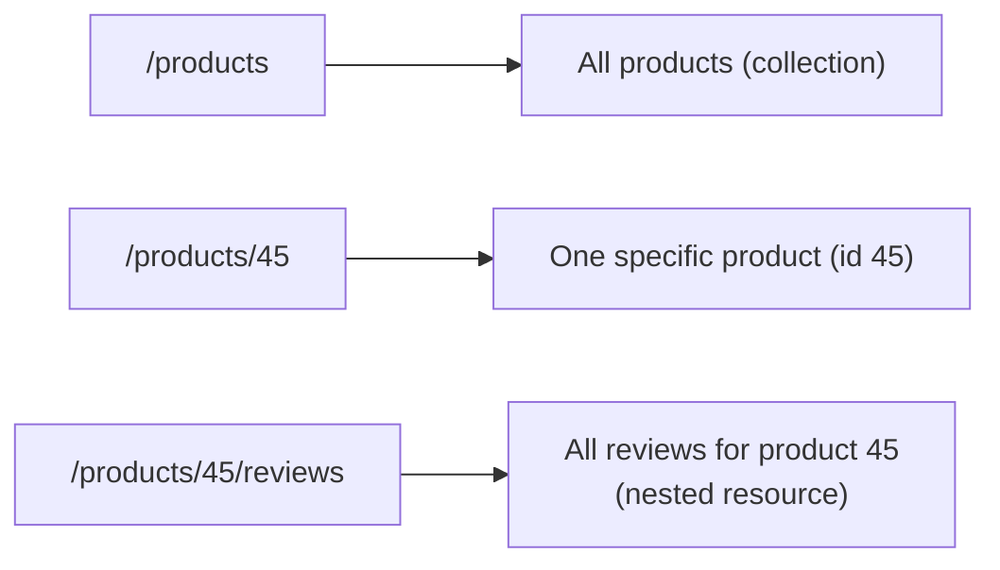

---

## 5. HTTP Methods (Verbs)

The **method** (verb) tells the server *what action* to perform on a resource. The URL says *what* resource; the method says *what to do* with it.

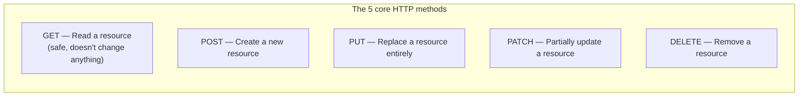

### Example: a full set of endpoints for "orders"

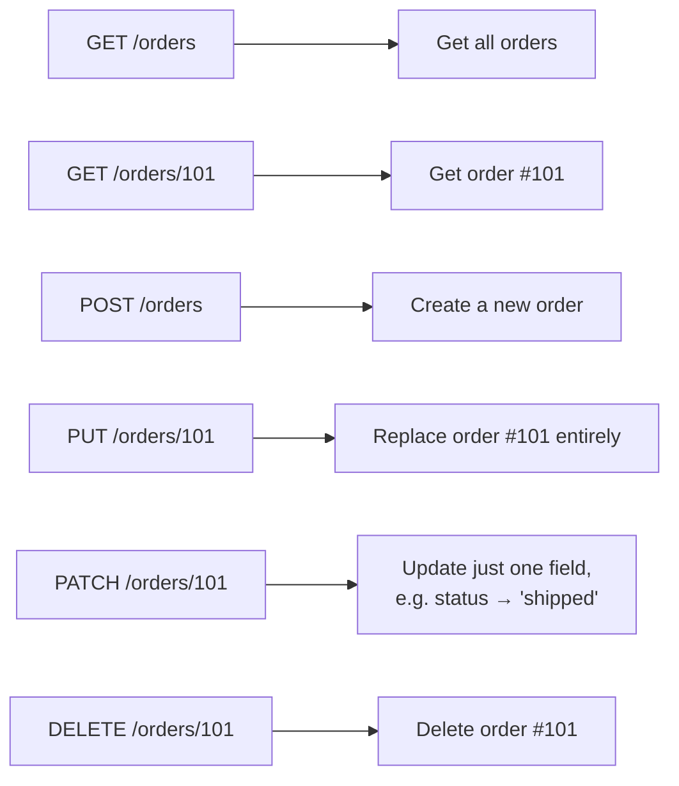

### PUT vs PATCH — the distinction people forget
- **PUT** expects the *entire* resource in the request body — anything you don't include gets overwritten/wiped.
- **PATCH** only updates the specific fields you send — everything else stays untouched.

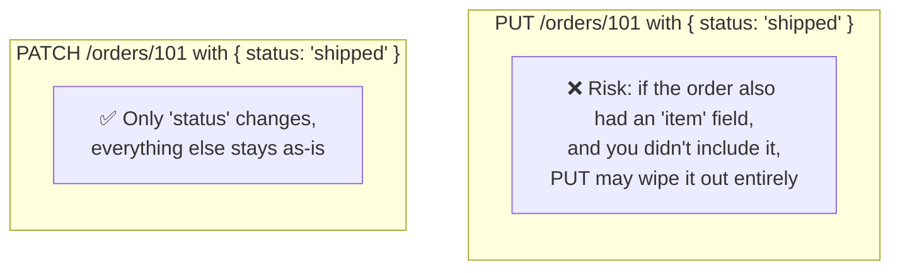

### Idempotency — an important related concept
An operation is **idempotent** if calling it multiple times has the same effect as calling it once. This matters a lot for retry logic (e.g., if a request times out and the client retries, you don't want duplicate side effects).

| Method | Idempotent? |
|---|---|
| GET | ✅ Yes |
| PUT | ✅ Yes (replacing with the same data again = same result) |
| DELETE | ✅ Yes (deleting something already deleted = still deleted) |
| PATCH | ⚠️ Not guaranteed (depends on what's being patched) |
| POST | ❌ No (calling it twice typically creates two resources) |

---

## 6. HTTP Status Codes

Every response includes a **status code** — a 3-digit number telling the client, at a glance, what happened. They're grouped into 5 categories based on the first digit.

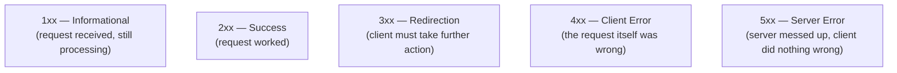

### The status codes you'll actually use 95% of the time

| Code | Meaning | When to use it |
|---|---|---|
| **200 OK** | Success | Standard successful GET/PUT/PATCH response |
| **201 Created** | Resource created | After a successful POST that creates something new |
| **204 No Content** | Success, nothing to return | After a successful DELETE |
| **400 Bad Request** | Client sent malformed data | Missing required field, invalid JSON |
| **401 Unauthorized** | Not authenticated | Missing/invalid credentials — client needs to log in |
| **403 Forbidden** | Authenticated, but not allowed | Logged in, but lacks permission for this action |
| **404 Not Found** | Resource doesn't exist | `/orders/999` when order 999 was never created |
| **409 Conflict** | Request conflicts with current state | Trying to create a duplicate resource |
| **429 Too Many Requests** | Rate limit exceeded | Client is calling the API too fast |
| **500 Internal Server Error** | Something broke on the server | Unhandled exception, bug in server code |
| **503 Service Unavailable** | Server temporarily can't handle it | Server overloaded or down for maintenance |

### 401 vs 403 — the distinction people mix up most

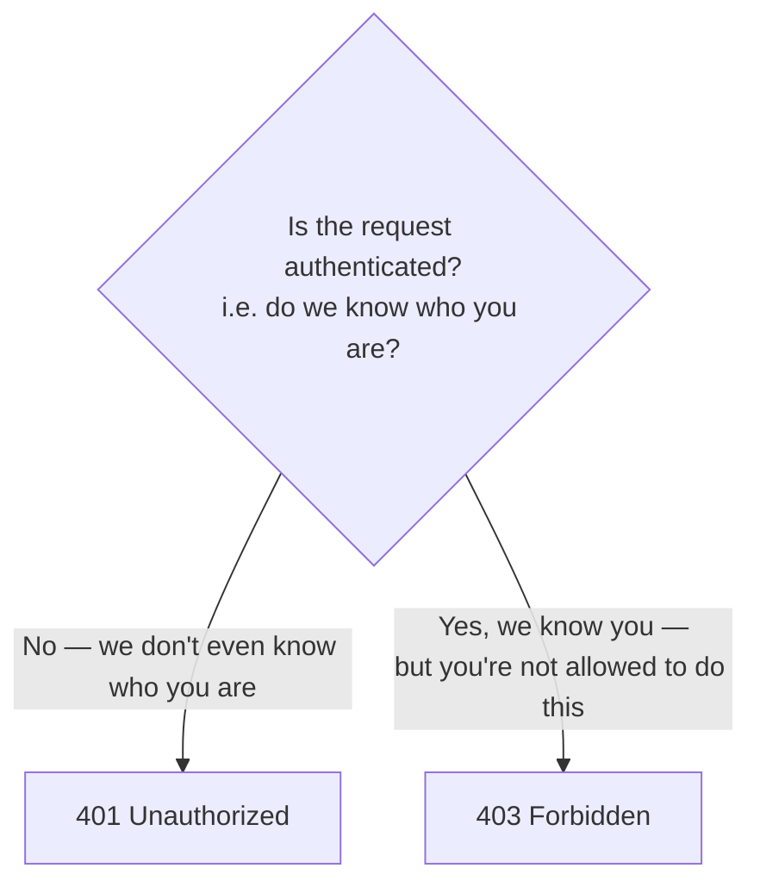

Example: trying to view another user's private profile.
- If you're not logged in at all → **401** (we don't know who you are).
- If you *are* logged in, but this profile isn't yours to see → **403** (we know exactly who you are, and the answer is no).

---

## 7. Putting It All Together: A Full Request Lifecycle

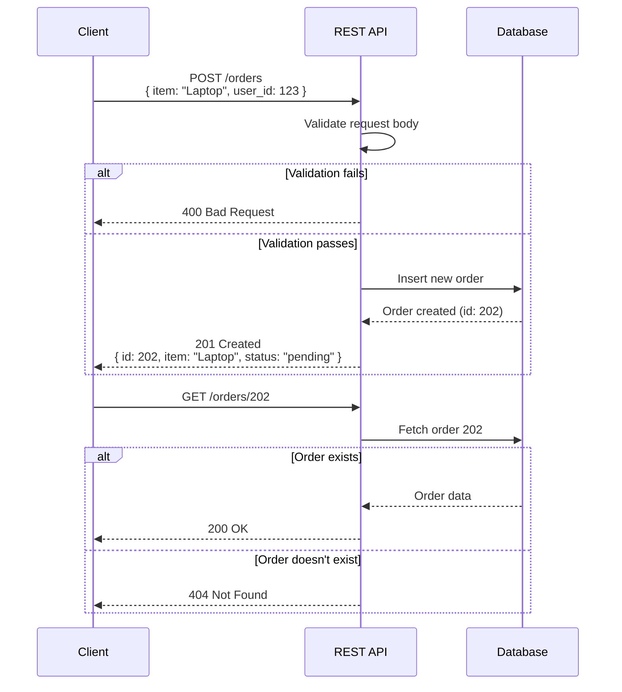

---

## 8. Common REST API Mistakes

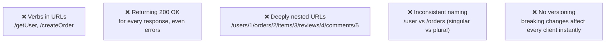

- **Mistake 1: Verbs in URLs.** `/getUserOrders` — the URL should be a noun (`/orders`); the *method* (GET) already tells you it's a read.
- **Mistake 2: Wrong or lazy status codes.** Returning `200 OK` with `{ "error": "not found" }` in the body forces clients to parse the body just to know if something failed — use `404` instead.
- **Mistake 3: Over-nesting URLs.** Keep nesting to 1-2 levels; beyond that, it becomes unreadable and fragile.
- **Mistake 4: Inconsistent naming.** Pick plural nouns everywhere and stick to it.
- **Mistake 5: No API versioning.** If you need to make a breaking change, version your API (e.g., `/v1/orders`, `/v2/orders`) so existing clients don't break overnight.

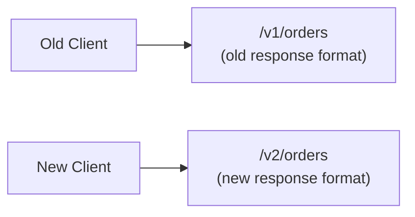

---

## 9. How to Reason About This in an Interview

If asked *"design the API for this feature"*, a strong answer sounds like this:

> "I'd model each entity as a resource with plural noun URLs — so `/orders`, `/orders/{id}` — and use HTTP methods to express the action: GET to read, POST to create, PATCH for partial updates, DELETE to remove. I'd keep the API stateless, meaning every request carries its own auth token rather than relying on server-side session memory, so it works cleanly behind a load balancer. For responses, I'd use proper status codes — 201 on creation, 404 when a resource doesn't exist, 400 for bad input, 401 vs 403 depending on whether the issue is 'who are you' or 'you're not allowed' — so clients can handle outcomes programmatically instead of parsing error strings. And I'd version the API from day one, like `/v1/...`, so future breaking changes don't affect existing clients."

That answer shows: you understand resources vs actions, you use the *right* status codes for the *right* reasons (not just 200/404), you know *why* statelessness matters, and you're thinking ahead about versioning — a detail many candidates miss.

---

## 10. Quick Recall Cheat Sheet

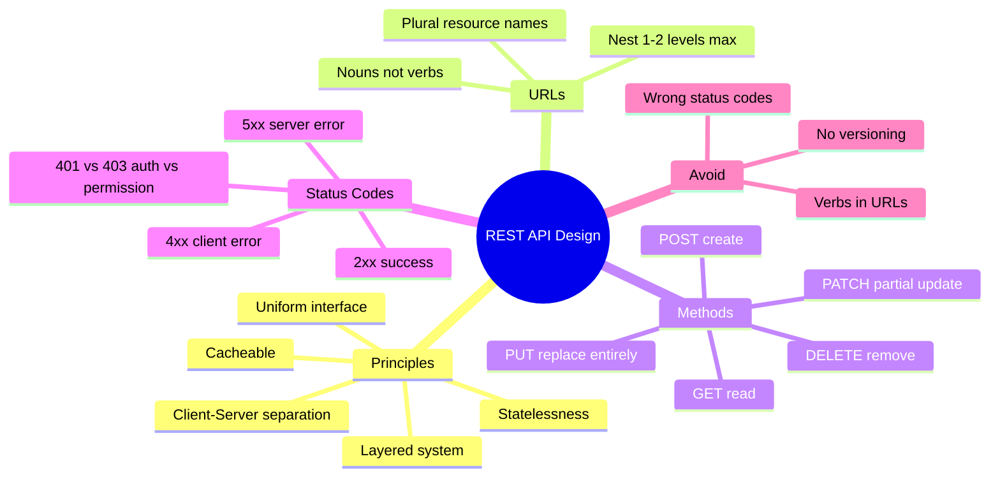

| If you remember only 5 things |
|---|
| 1. URLs are nouns (resources), HTTP methods are the verbs (actions) — never mix the two. |
| 2. REST APIs must be stateless — every request carries everything the server needs, with zero memory between requests. |
| 3. Use the right status code for the right situation: 201 for creation, 404 for missing resources, 400 for bad input. |
| 4. 401 = "we don't know who you are." 403 = "we know who you are, but you can't do this." |
| 5. Version your API from day one (`/v1/...`) so future breaking changes don't blow up existing clients. |

---

*This file is written in GitHub-flavored Markdown with Mermaid diagrams — it will render natively on GitHub, GitLab, and most modern Markdown viewers.*
