# Rate Limiting

*A zero-to-mastery guide for system design interviews and real-world architecture.*

---

## Table of Contents
1. [What Is Rate Limiting?](#1-what-is-rate-limiting)
2. [Why It's Needed](#2-why-its-needed)
3. [Where Rate Limiting Sits in a System](#3-where-rate-limiting-sits-in-a-system)
4. [Rate Limiting Algorithms](#4-rate-limiting-algorithms)
5. [How the Client Finds Out It's Been Limited](#5-how-the-client-finds-out-its-been-limited)
6. [Rate Limiting in Distributed Systems](#6-rate-limiting-in-distributed-systems)
7. [What to Limit By](#7-what-to-limit-by)
8. [How to Reason About This in an Interview](#8-how-to-reason-about-this-in-an-interview)
9. [Quick Recall Cheat Sheet](#9-quick-recall-cheat-sheet)

---

## 1. What Is Rate Limiting?

**Rate limiting** is a technique for controlling *how many requests* a client (a user, an IP address, an app) is allowed to make to a system within a given time window — and rejecting the rest.

Think of it like a nightclub bouncer with a strict capacity rule: "only 100 people allowed in per hour." It doesn't matter how many people show up — once the count hits 100, the bouncer turns people away until the next hour's quota opens up.

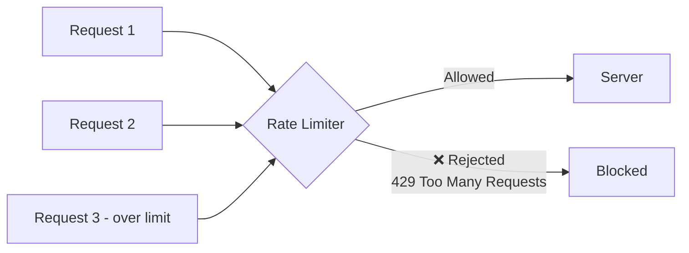

---

## 2. Why It's Needed

Without limits, a system has no defense against a client (malicious or just buggy) sending an overwhelming number of requests.

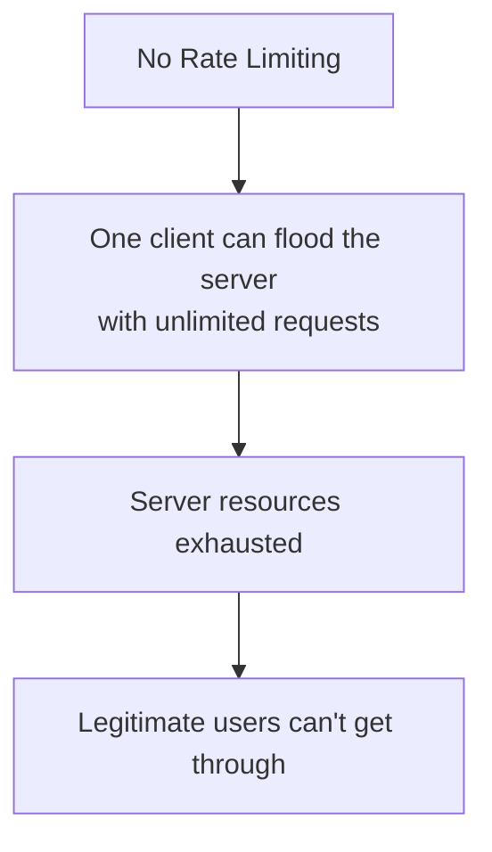

### The core reasons you need it
- **Protect against abuse** — a malicious actor could hammer your API to brute-force passwords, scrape all your data, or intentionally overload your servers (a Denial of Service attack).
- **Protect against bugs** — a client-side bug (e.g., a broken retry loop) can accidentally send thousands of requests per second with zero malicious intent.
- **Fair usage** — prevents one heavy user from consuming all the system's capacity and starving everyone else.
- **Cost control** — every request usually costs something (compute, third-party API calls, bandwidth) — limiting requests limits your bill.
- **Protecting downstream systems** — if your API calls a database or a third-party service that has its own limits, your rate limiter protects those systems too.

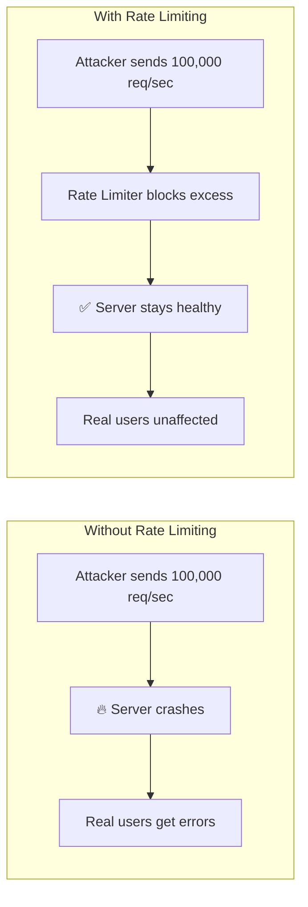

---

## 3. Where Rate Limiting Sits in a System

Rate limiting can be enforced at different points, and in real systems it's often applied at more than one layer.

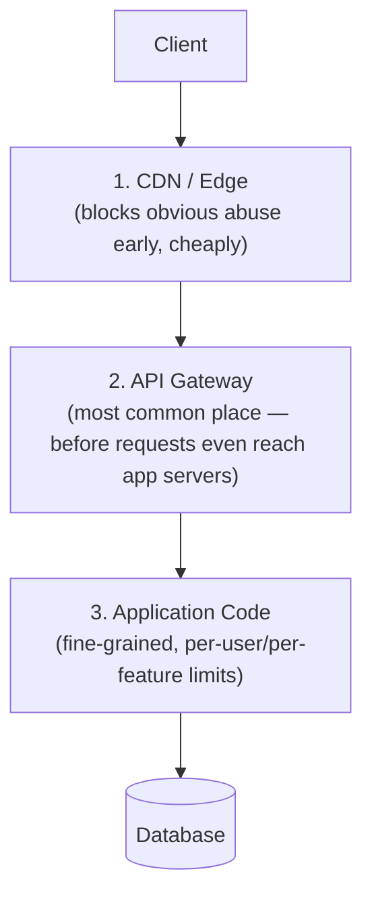

- **Applying it as early as possible** (e.g., at the edge/gateway) is generally preferred — it's cheaper to reject a request before it consumes app server or database resources.
- **Applying it in application code** allows for more nuanced rules (e.g., "free-tier users get 100 requests/day, paid users get 10,000").

---

## 4. Rate Limiting Algorithms

This is the core engineering decision: *how* do you actually track and enforce the limit? There are several standard algorithms, each with different tradeoffs.

### 4.1 Fixed Window Counter
Divide time into fixed windows (e.g., every 1-minute block), and count requests within each window. Once the count hits the limit, reject further requests until the next window starts.

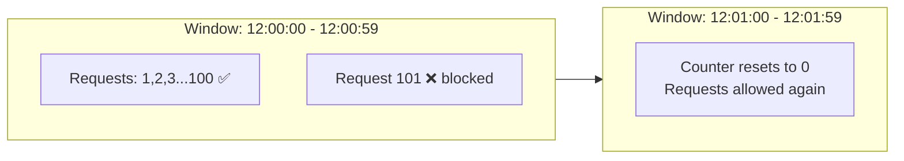

- **Simple to implement**, but has a flaw: a burst of traffic right at the boundary between two windows can let through *almost double* the intended limit.

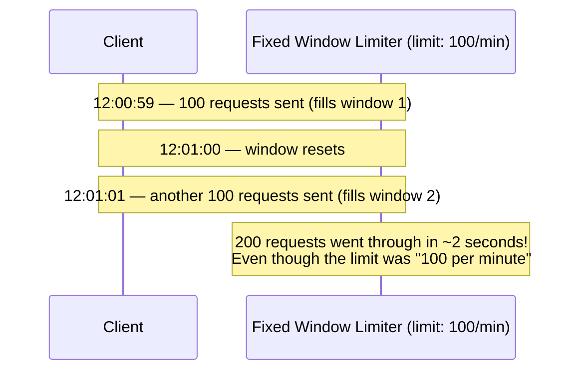

### 4.2 Sliding Window Log
Instead of fixed blocks, keep a timestamped log of every request. To check if a new request is allowed, count how many requests happened in the *last* 60 seconds, sliding continuously — not tied to a fixed clock boundary.

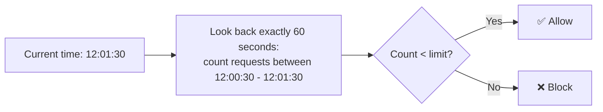

- **Very accurate** — completely solves the boundary-burst problem from Fixed Window.
- **Downside:** needs to store a timestamp for every single request, which can get memory-intensive at high volume.

### 4.3 Sliding Window Counter
A practical middle ground: combines the simplicity of Fixed Window with better accuracy, by taking a **weighted average** of the current and previous window's counts.

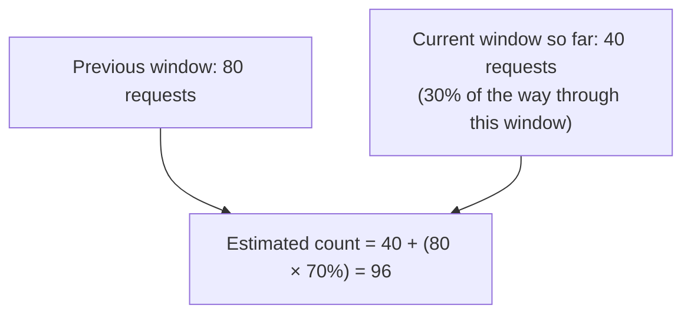

- **Good balance** of accuracy and memory efficiency — this is what many real-world systems (like Cloudflare) actually use.

### 4.4 Token Bucket
Imagine a bucket that holds tokens, refilled at a steady rate (e.g., 10 tokens/second) up to some maximum capacity. Every request consumes one token. If the bucket is empty, the request is rejected.

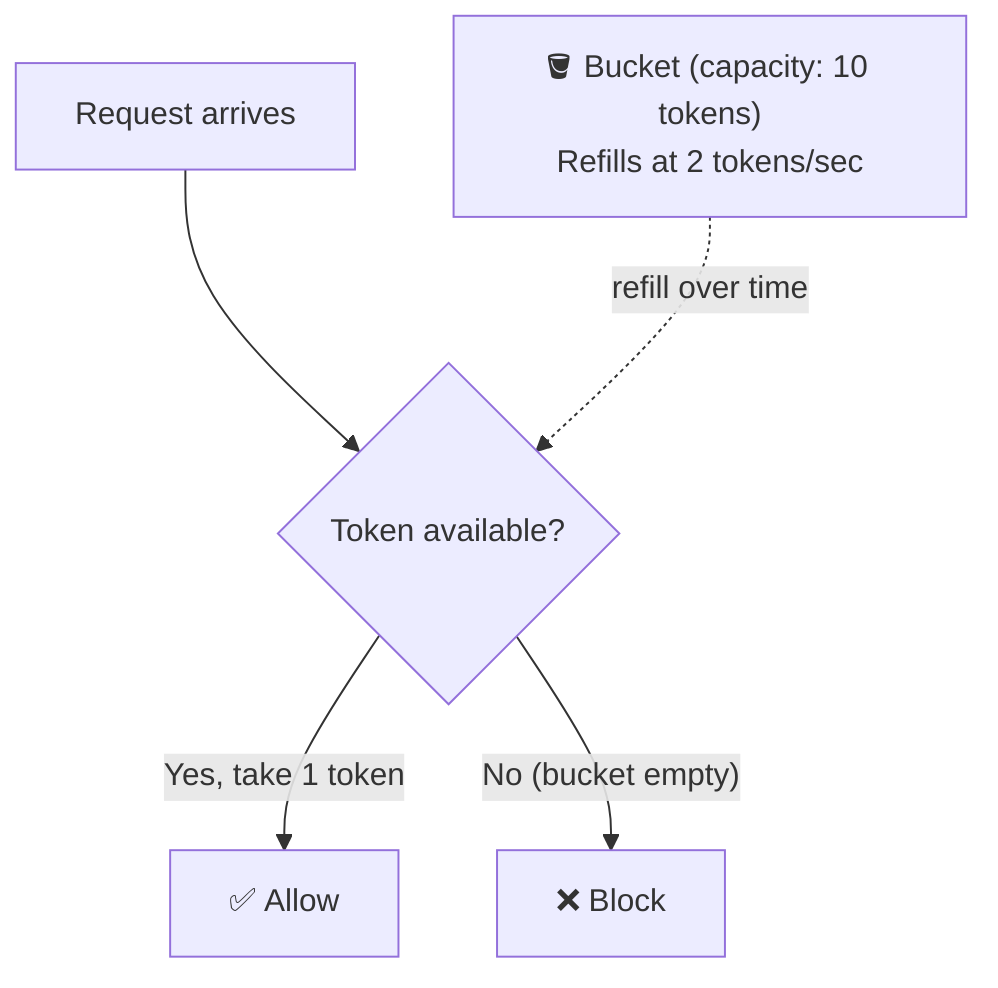

- **Key advantage:** allows short **bursts** of traffic (as long as tokens have accumulated), while still enforcing a steady average rate over time — this matches real traffic patterns much better than a hard per-second cap.
- **Very widely used** in practice (e.g., AWS API Gateway uses this model).

### 4.5 Leaky Bucket
Similar setup, but instead of tokens being consumed, incoming requests are added to a queue (the "bucket") and processed ("leaked out") at a fixed, constant rate — regardless of how bursty the incoming traffic is.

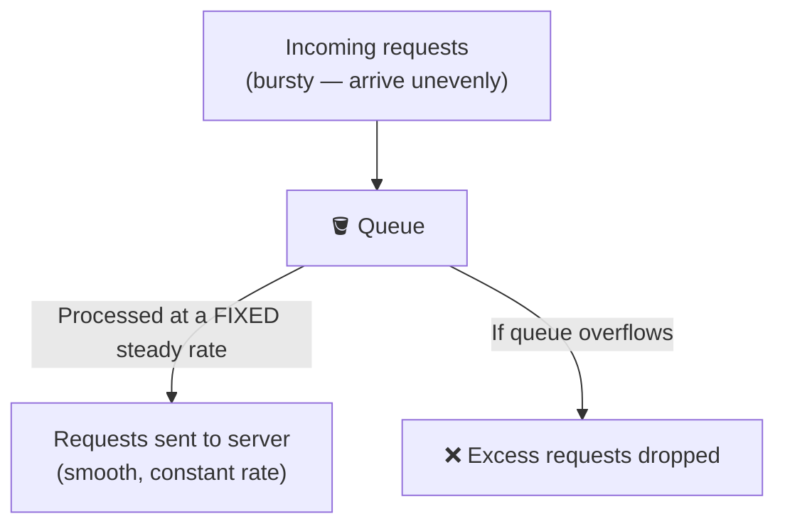

- **Key advantage:** smooths out bursts into a steady, predictable outflow — great when the downstream system (e.g., a fragile third-party API) needs a constant, non-spiky load.
- **Difference from Token Bucket:** Token Bucket allows bursts to pass through immediately if tokens are available; Leaky Bucket always outputs at a fixed rate, queuing anything extra.

### Algorithm comparison

| Algorithm | Handles Bursts? | Accuracy | Memory Cost | Common Use |
|---|---|---|---|---|
| Fixed Window | Poorly (boundary issue) | Low | Very low | Simple, non-critical limits |
| Sliding Window Log | N/A (very precise) | Very high | High | When precision really matters |
| Sliding Window Counter | Good | High | Low-medium | Common production default |
| Token Bucket | Yes, by design | High | Low | APIs expecting bursty traffic |
| Leaky Bucket | No — smooths everything out | High | Low | Protecting fragile downstream systems |

---

## 5. How the Client Finds Out It's Been Limited

When a request is rejected, the server should respond with a clear status code and (ideally) tell the client when it can try again.

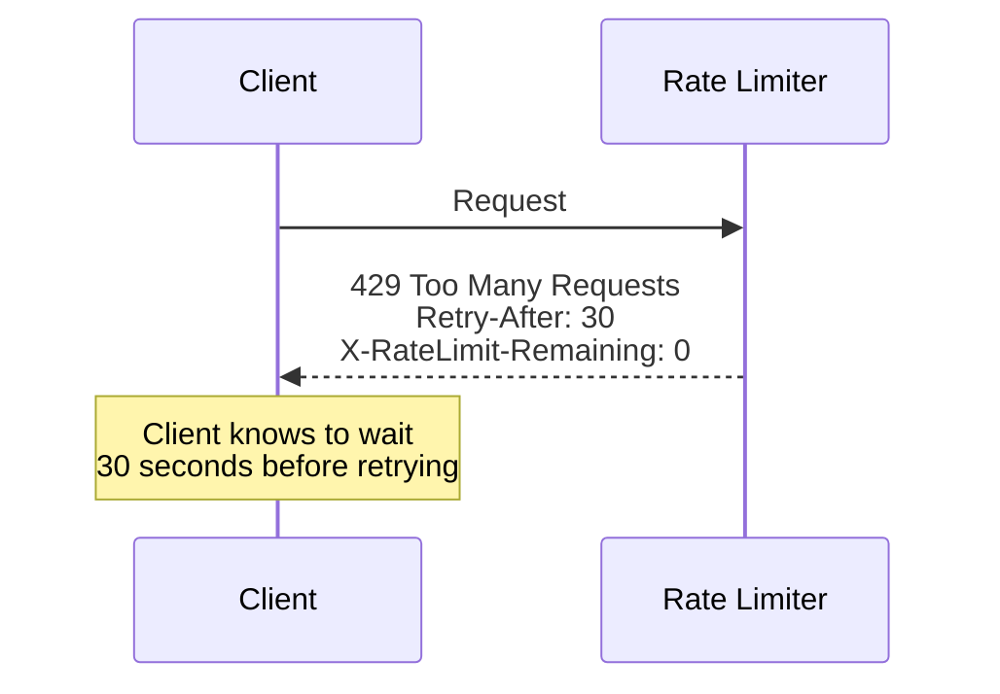

- **429 Too Many Requests** — the standard HTTP status code for this.
- **Helpful response headers:**
  - `Retry-After` — how many seconds to wait before trying again.
  - `X-RateLimit-Limit` — the total allowed requests in the current window.
  - `X-RateLimit-Remaining` — how many requests are left.
  - `X-RateLimit-Reset` — when the limit resets.

This lets well-behaved clients back off gracefully instead of hammering the API blindly.

---

## 6. Rate Limiting in Distributed Systems

Here's a subtlety that trips people up: if your app runs on **multiple servers** behind a load balancer (as covered when discussing horizontal scaling), where does the request *count* actually get stored?

### The naive (broken) approach: count locally on each server

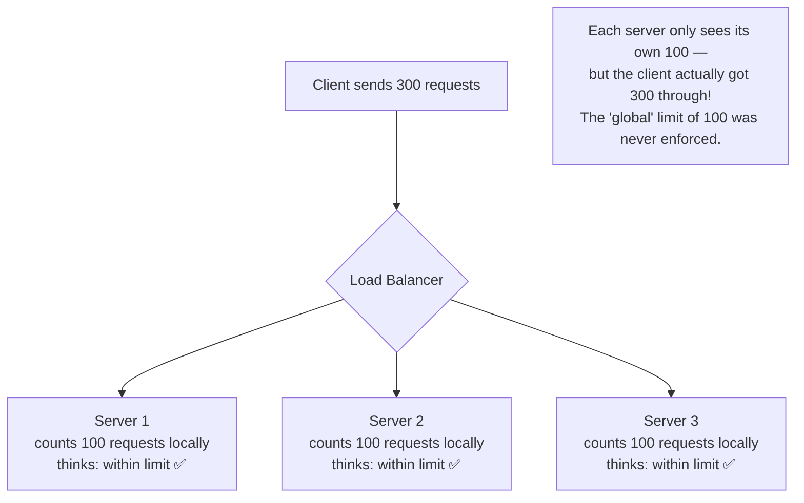

### The fix: a shared, centralized counter

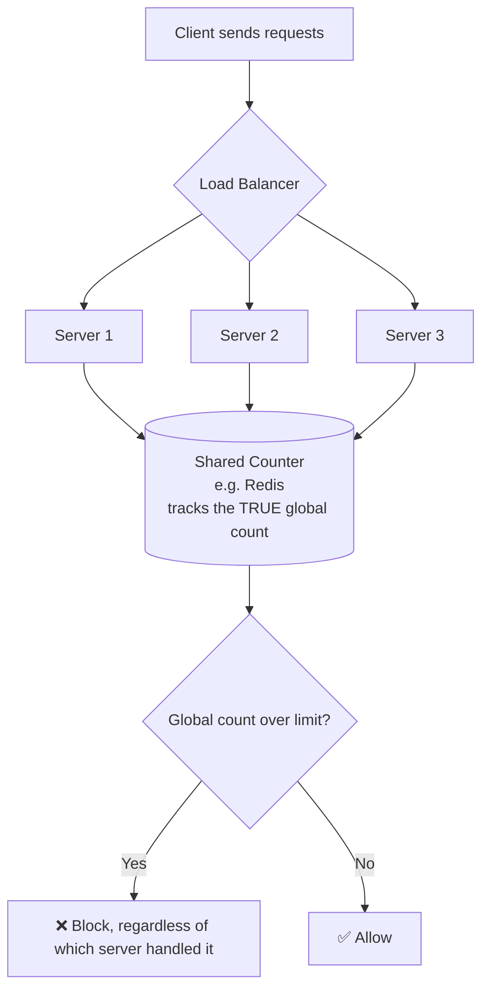

- A fast, shared, in-memory store (commonly **Redis**, using atomic increment operations) is used so every app server checks and updates the *same* count — this is the exact same "shared state" pattern used to fix the session problem discussed for horizontal scaling.

---

## 7. What to Limit By

Rate limits can be applied based on different keys, depending on what you're trying to protect against.

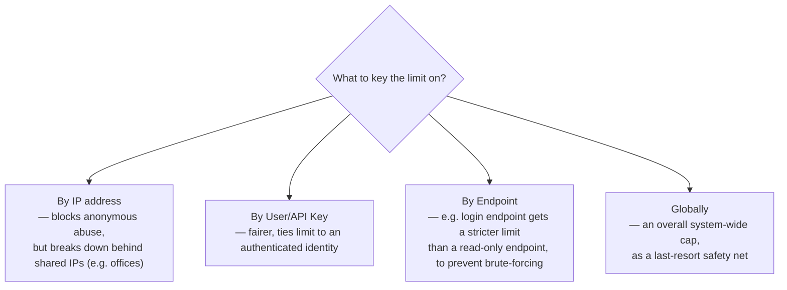

Often, systems combine several of these — e.g., a strict per-IP limit on the login endpoint specifically (to prevent password brute-forcing), plus a broader per-user limit across the whole API.

---

## 8. How to Reason About This in an Interview

If asked *"how would you protect this API from abuse?"*, a strong answer sounds like this:

> "I'd add rate limiting, ideally enforced as early as possible — at the API gateway, before requests even reach the app servers, so we're not wasting compute on requests we're going to reject anyway. For the algorithm, I'd lean toward Token Bucket since real traffic is bursty and it allows short spikes while still enforcing a steady average rate — Fixed Window is simpler but has a boundary problem where nearly double the limit can slip through right at the edge of two windows. Since the app runs on multiple servers behind a load balancer, I can't track the count locally on each server — I'd use a shared store like Redis with atomic increments so the count is consistent globally, no matter which server handles a given request. I'd key the limit by authenticated user for general fairness, but apply a stricter, separate limit by IP specifically on sensitive endpoints like login, to prevent brute-force attempts. And I'd return 429 with a Retry-After header so well-behaved clients know exactly when to try again."

That answer shows: you know rate limiting is a real *system-wide* concern (not just a single line of code), you can justify an *algorithm choice* based on traffic patterns, you catch the *distributed counting problem* (a very common follow-up question), and you think about *what to key limits on* rather than treating it as one-size-fits-all.

---

## 9. Quick Recall Cheat Sheet

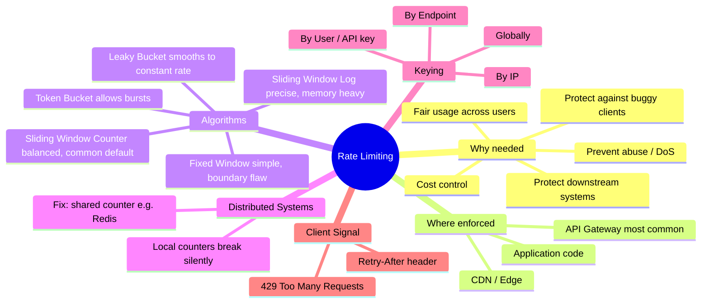

| If you remember only 5 things |
|---|
| 1. Rate limiting caps how many requests a client can make in a time window, protecting the system from abuse, bugs, and overload. |
| 2. Token Bucket is the most commonly used algorithm in practice — it allows short bursts while enforcing a steady average rate. |
| 3. Fixed Window is simple but has a boundary flaw — nearly double the limit can slip through right at the edge of two windows. |
| 4. In a multi-server system, counting locally on each server silently breaks the limit — use a shared store like Redis for a true global count. |
| 5. A blocked request should return 429 Too Many Requests with a Retry-After header, so clients know exactly when to try again. |

---

*This file is written in GitHub-flavored Markdown with Mermaid diagrams — it will render natively on GitHub, GitLab, and most modern Markdown viewers.*
