# CAP Theorem

*A zero-to-mastery guide for system design interviews and real-world architecture.*

---

## Table of Contents
1. [What Is the CAP Theorem?](#1-what-is-the-cap-theorem)
2. [The Three Properties, One at a Time](#2-the-three-properties-one-at-a-time)
3. [Why You Can't Have All Three](#3-why-you-cant-have-all-three)
4. [The Real Trade-off: CP vs AP](#4-the-real-trade-off-cp-vs-ap)
5. [Walking Through a Network Partition](#5-walking-through-a-network-partition)
6. [Real Databases, Classified](#6-real-databases-classified)
7. [Common Misunderstandings](#7-common-misunderstandings)
8. [PACELC — The Extension Worth Knowing](#8-pacelc--the-extension-worth-knowing)
9. [How to Reason About This in an Interview](#9-how-to-reason-about-this-in-an-interview)
10. [Quick Recall Cheat Sheet](#10-quick-recall-cheat-sheet)

---

## 1. What Is the CAP Theorem?

The **CAP Theorem** states that any **distributed data system** (one where data lives on more than one machine) can only guarantee **two out of three** properties at the same time:

- **C**onsistency
- **A**vailability
- **P**artition Tolerance

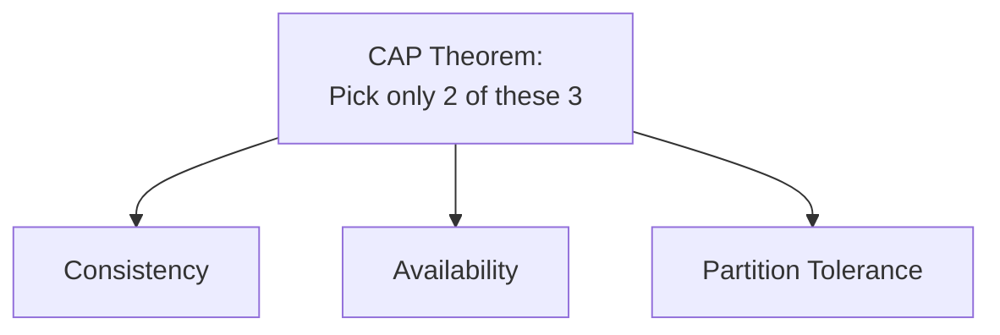

Think of it like ordering food during a kitchen mishap: the two chefs (servers) preparing your dish have momentarily lost the ability to talk to each other (a network partition). You can either **wait** until they sync up so both plates come out identical (consistency), or you can **get served immediately** by whichever chef is ready, accepting the small risk the two plates might differ slightly (availability). You cannot magically have instant, perfectly identical plates from two chefs who can't currently communicate — that's the whole theorem in one sentence.

---

## 2. The Three Properties, One at a Time

### Consistency (C)
Every read receives the **most recent write** — or an error. All nodes in the system see the exact same data at the exact same time, no matter which node you ask.

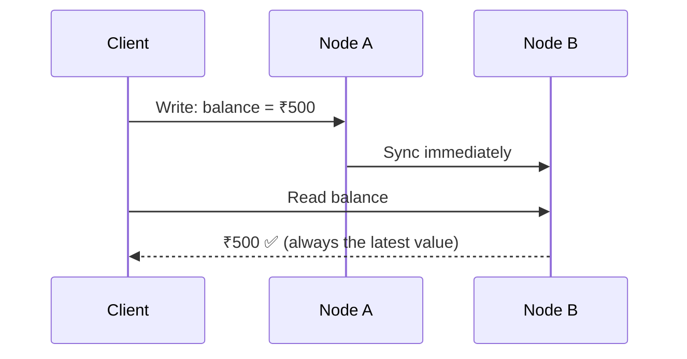

### Availability (A)
Every request receives a **non-error response** — without the guarantee that it contains the most recent write. The system always responds, even if a node hasn't synced yet.

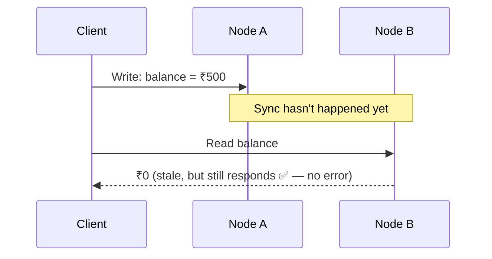

### Partition Tolerance (P)
The system **continues to operate** even if network communication breaks down between nodes (a "partition" — messages between servers are delayed, dropped, or lost).

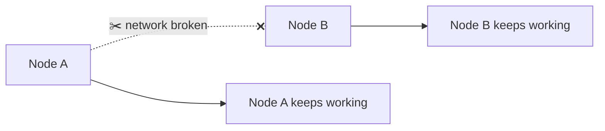

A partition isn't a rare edge case — in real distributed systems (servers across data centers, regions, or even just an unreliable network link), some degree of network failure is **inevitable**. This one fact is what makes the whole theorem practically important.

---

## 3. Why You Can't Have All Three

Here's the actual crux of the theorem: in **any real distributed system, network partitions will eventually happen** — cables fail, routers glitch, regions lose connectivity. So Partition Tolerance isn't really an optional choice you get to skip; it's a fact of life you must design around.

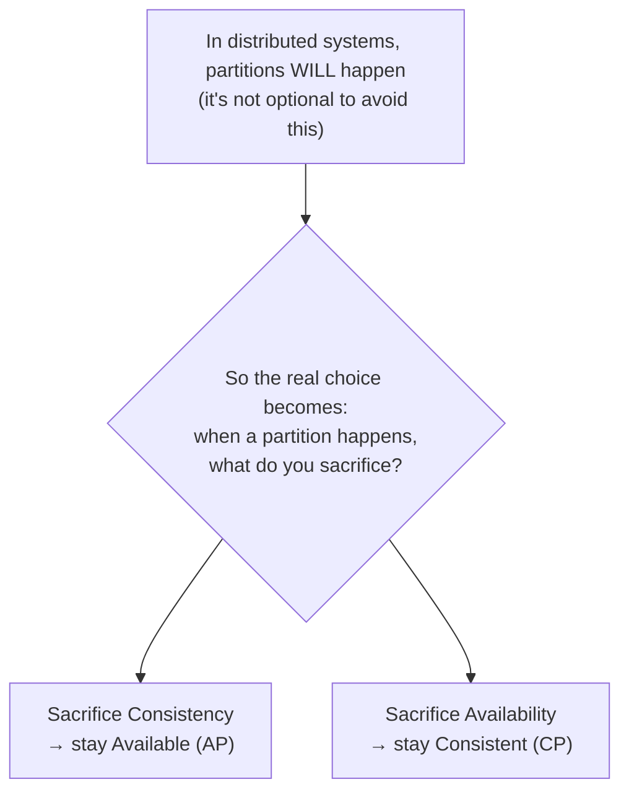

This is why the CAP Theorem is often restated more usefully as: **"P is a given. So during a partition, do you choose C or A?"** — that's really the entire decision system designers face.

---

## 4. The Real Trade-off: CP vs AP

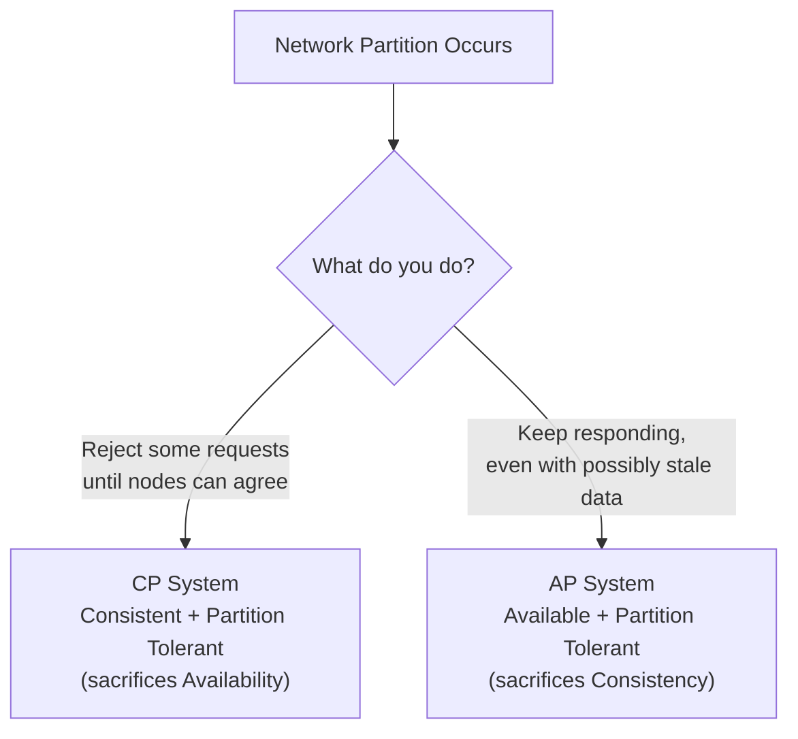

### CP (Consistency + Partition Tolerance)
During a partition, the system will **refuse to respond** (or return an error) rather than risk giving out incorrect/stale data. It prioritizes correctness over uptime.

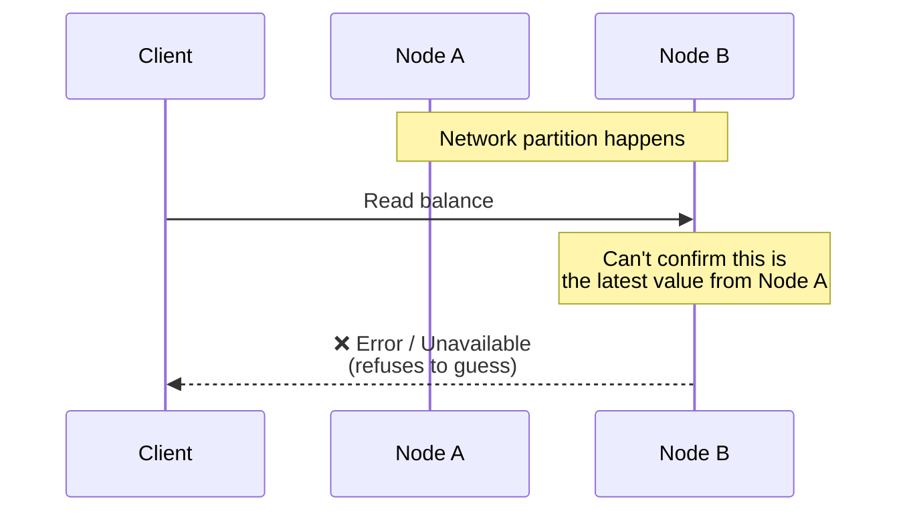

- **Best for:** data where being wrong is worse than being unavailable — banking balances, inventory counts, booking systems (you'd rather show "try again" than let two people book the last seat).

### AP (Availability + Partition Tolerance)
During a partition, the system **keeps responding** to every request, even if it means some nodes serve slightly outdated data. It prioritizes uptime over perfect correctness, usually reconciling differences later ("eventual consistency").

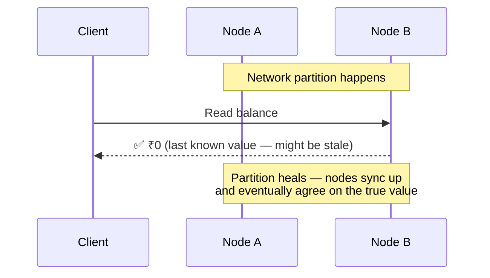

- **Best for:** data where staying online matters more than perfect freshness — social media likes/comments, product recommendations, activity feeds (a slightly outdated like-count is harmless; the app going down is not).

*Note: "CA" (Consistent + Available, but not Partition Tolerant) is theoretically the third combination, but it only makes sense for a system running on a **single node** — the moment you have more than one node, partitions become possible, so true CA doesn't exist in real distributed systems.*

---

## 5. Walking Through a Network Partition

This step-by-step example makes the abstract idea concrete.

**Before the partition — everything is normal:**

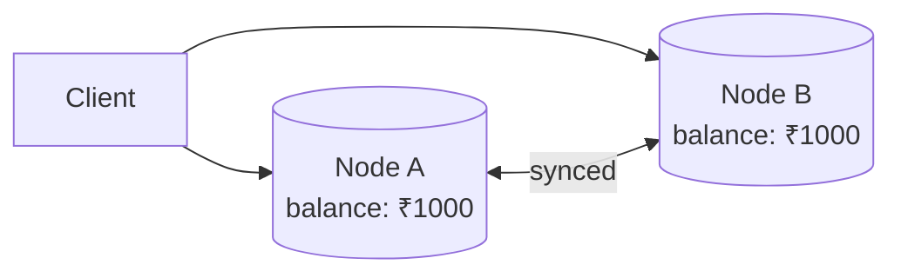

**A partition occurs — Node A and Node B can no longer talk to each other:**

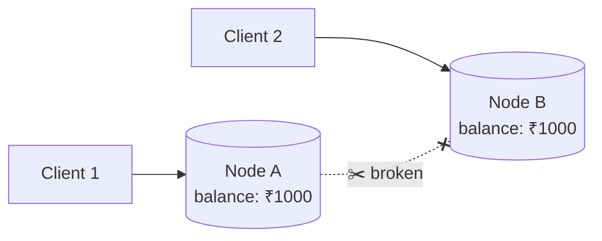

**Client 1 writes to Node A during the partition:**

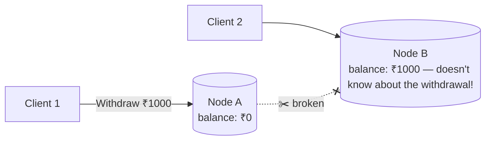

**Now Client 2 tries to read the balance from Node B. What happens depends on the system's choice:**

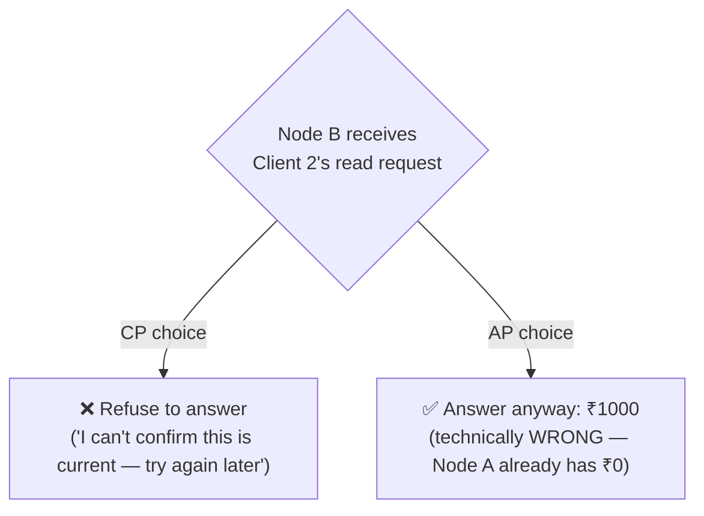

This is the exact moment the CAP tradeoff becomes real: a CP system protects Client 2 from seeing wrong data by refusing to respond; an AP system keeps the lights on by responding anyway, accepting the risk that the answer might be stale.

---

## 6. Real Databases, Classified

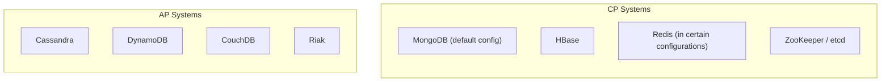

| Database | Typical Classification | Why |
|---|---|---|
| MongoDB | CP | Prioritizes consistent reads from the primary node; unreachable nodes error out rather than serve stale data |
| Cassandra | AP | Designed for always staying available across data centers, accepting eventual consistency |
| DynamoDB | AP (tunable) | Defaults toward availability, but lets you request stronger consistency per-query |
| ZooKeeper | CP | Used specifically for coordination tasks where correctness must never be compromised |

**Important nuance:** many modern databases are **tunable** — e.g., DynamoDB lets you choose "eventually consistent" (faster, AP-leaning) or "strongly consistent" (slower, CP-leaning) *per individual query*. So classifying a whole database as strictly "CP" or "AP" is a simplification — in practice, it's often a dial, not a fixed label.

---

## 7. Common Misunderstandings

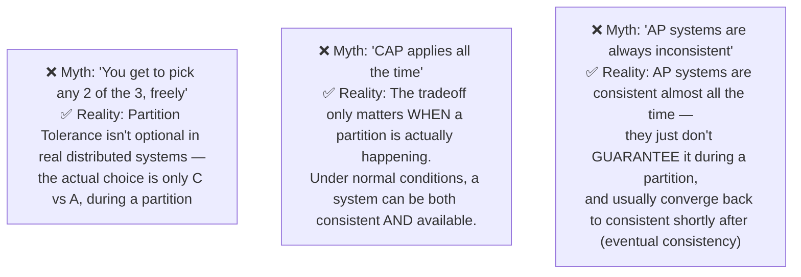

- **Myth 1:** People often say "CAP means pick 2 of 3" as if it's a free choice at all times. In reality, partitions are unavoidable in distributed systems, so it's really "pick C or A, specifically during a partition."
- **Myth 2:** CAP only kicks in *during* an actual network partition. The rest of the time, a well-designed system delivers both consistency and availability — CAP is about handling the failure case, not a permanent, everyday sacrifice.
- **Myth 3:** AP doesn't mean "always wrong" — it means the system chooses to keep responding during a partition, accepting a brief window of possible staleness, which usually resolves quickly once the partition heals.

---

## 8. PACELC — The Extension Worth Knowing

CAP only describes what happens **during a partition**. But there's a tradeoff that exists even when there's **no partition at all**, which the **PACELC theorem** captures — it's worth mentioning if you want to show depth in an interview.

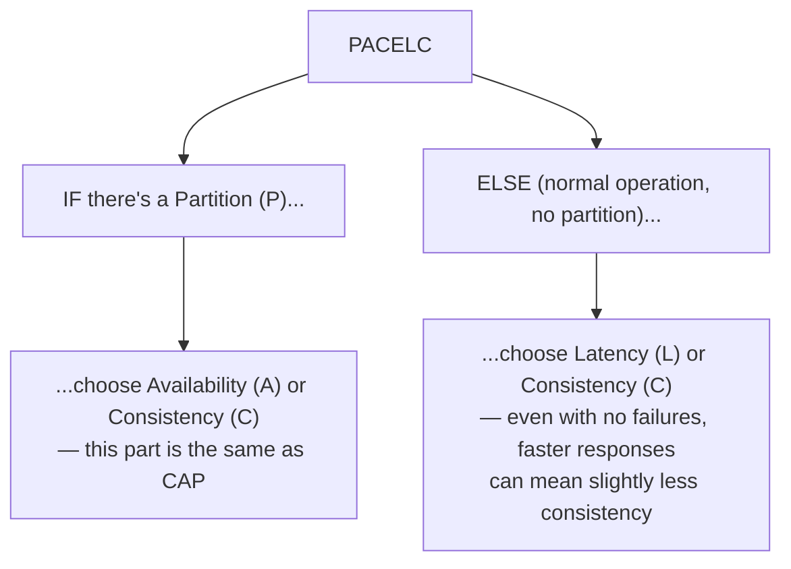

In short: even when everything is working perfectly, there's still a tradeoff between how **fast** you respond and how **consistent** the data is (e.g., waiting to confirm all replicas agree takes longer than just answering from the nearest replica). PACELC captures both the failure-time tradeoff (from CAP) *and* this everyday tradeoff in one framework.

---

## 9. How to Reason About This in an Interview

If asked *"how would this system behave during a network partition?"*, a strong answer sounds like this:

> "Since this is a distributed system, network partitions are inevitable — so partition tolerance isn't really optional, the real question is what we sacrifice when one occurs: consistency or availability. For something like a payments or inventory system, I'd lean CP — during a partition, I'd rather return an error and ask the client to retry than risk approving two conflicting writes, like overselling the same item. For something like a social media feed or a comment count, I'd lean AP — I'd rather show a slightly stale like-count than take the feature down entirely, since the cost of being wrong here is low and the cost of being unavailable is a worse user experience. It's also worth noting this tradeoff only really matters during an actual partition — most of the time, the system delivers both. And even outside of partitions, there's a related tradeoff between latency and consistency, which is what PACELC captures beyond just CAP."

That answer shows: you understand partition tolerance is a given, not a choice; you can make a **data-specific** judgment call between CP and AP rather than picking one dogmatically; and mentioning PACELC signals deeper-than-surface understanding.

---

## 10. Quick Recall Cheat Sheet

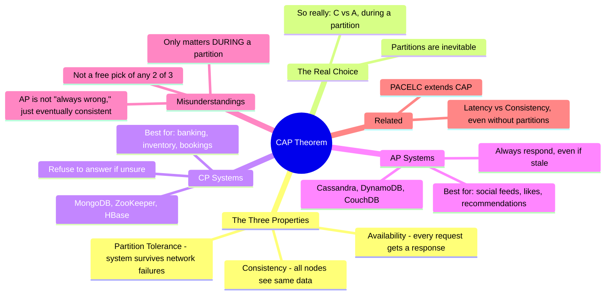

| If you remember only 5 things |
|---|
| 1. CAP says a distributed system can only guarantee 2 of 3: Consistency, Availability, Partition Tolerance. |
| 2. In real distributed systems, partitions are unavoidable — so the actual choice is really just C vs A, during a partition. |
| 3. CP systems refuse to respond during a partition rather than risk stale/incorrect data — good for banking, inventory, bookings. |
| 4. AP systems keep responding during a partition, accepting temporary staleness — good for social feeds, likes, recommendations. |
| 5. CAP only applies *during* an actual partition — the rest of the time, systems can and do deliver both consistency and availability. |

---

*This file is written in GitHub-flavored Markdown with Mermaid diagrams — it will render natively on GitHub, GitLab, and most modern Markdown viewers.*
