# Microservices vs Monolithic Architecture

*A zero-to-mastery guide for system design interviews and real-world architecture.*

---

## Table of Contents
1. [What Is "Architecture" Here, Really?](#1-what-is-architecture-here-really)
2. [Monolithic Architecture](#2-monolithic-architecture)
3. [Microservices Architecture](#3-microservices-architecture)
4. [How a Single Feature Flows Through Each](#4-how-a-single-feature-flows-through-each)
5. [Communication Between Microservices](#5-communication-between-microservices)
6. [Side-by-Side Comparison](#6-side-by-side-comparison)
7. [The Hidden Costs of Microservices](#7-the-hidden-costs-of-microservices)
8. [The Middle Ground: When and How Companies Actually Migrate](#8-the-middle-ground-when-and-how-companies-actually-migrate)
9. [When to Use Which — Decision Guide](#9-when-to-use-which--decision-guide)
10. [How to Reason About This in an Interview](#10-how-to-reason-about-this-in-an-interview)
11. [Quick Recall Cheat Sheet](#11-quick-recall-cheat-sheet)

---

## 1. What Is "Architecture" Here, Really?

**Architecture**, in this context, just means: **how is your application's code organized and deployed?** Is it one single program that does everything, or is it split into several independent programs that each do one thing and talk to each other?

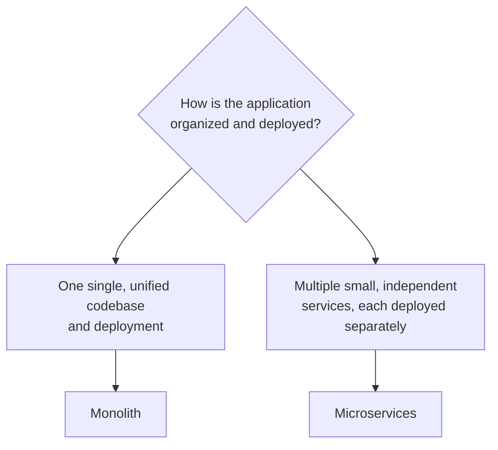

---

## 2. Monolithic Architecture

### The idea
**All** the functionality of an application — user accounts, orders, payments, notifications, everything — lives in **one single codebase**, and is deployed as **one single unit**.

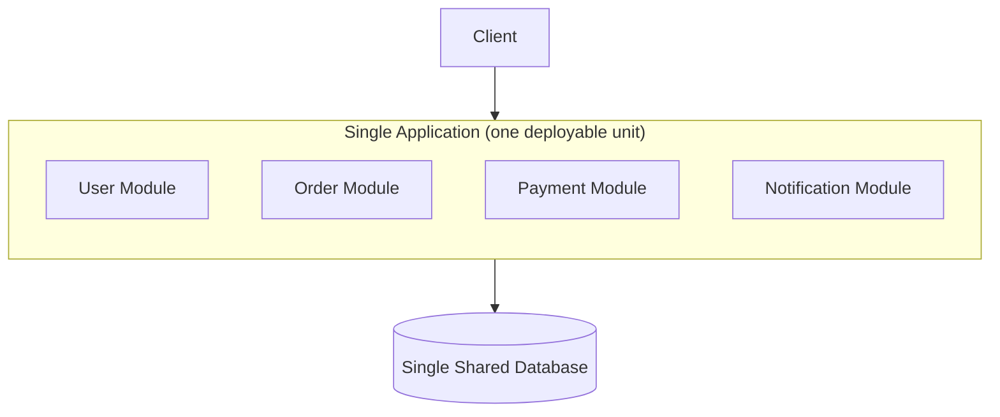

All these modules run **inside the same process**, on the same server(s), and are deployed together — even if you only changed one line of code in the Notification module, the *entire* application gets rebuilt and redeployed.

### Key traits
- **One codebase** — everything lives in a single repository.
- **One deployment** — the whole app ships together, as one unit.
- **In-process communication** — modules call each other through normal function calls (fast, no network involved).
- **Usually one shared database** for the whole application.

### Why it's a great starting point
- **Simple to develop** — no network calls between modules, easy debugging (everything's in one place, one log file).
- **Simple to deploy** — one build, one deployment pipeline, one thing to monitor.
- **Simple to test** — you can run the whole thing locally and test it end-to-end easily.
- This is why almost every successful company — including ones now famous for microservices, like early Amazon or early Netflix — started as a monolith.

### Why it breaks down at scale
- **Scaling is all-or-nothing.** If only the Payment module is under heavy load, you still have to scale the *entire* application (recall Day 1's horizontal scaling — you'd be duplicating User, Order, and Notification modules too, even though only Payments needed more capacity).
- **One bug can take down everything.** A memory leak in the Notification module can crash the entire process — including Users, Orders, and Payments.
- **Slow to deploy as the team grows.** Every team's changes go through the same build/deploy pipeline — a large team pushing frequent changes creates a bottleneck, and one team's bug can block everyone else's release.
- **Codebase becomes hard to understand over time** as it grows — a change in one area can have unexpected ripple effects elsewhere, since everything is tightly interconnected.

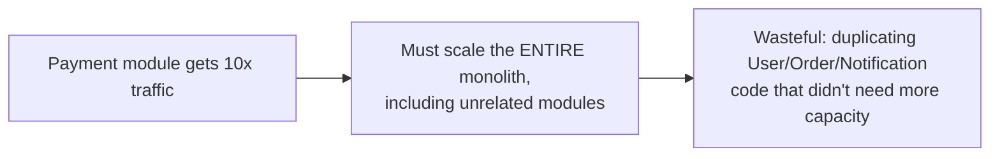

---

## 3. Microservices Architecture

### The idea
The application is broken into **multiple small, independent services**, each responsible for one specific piece of business functionality, each with its **own codebase**, **own deployment**, and often its **own database**.

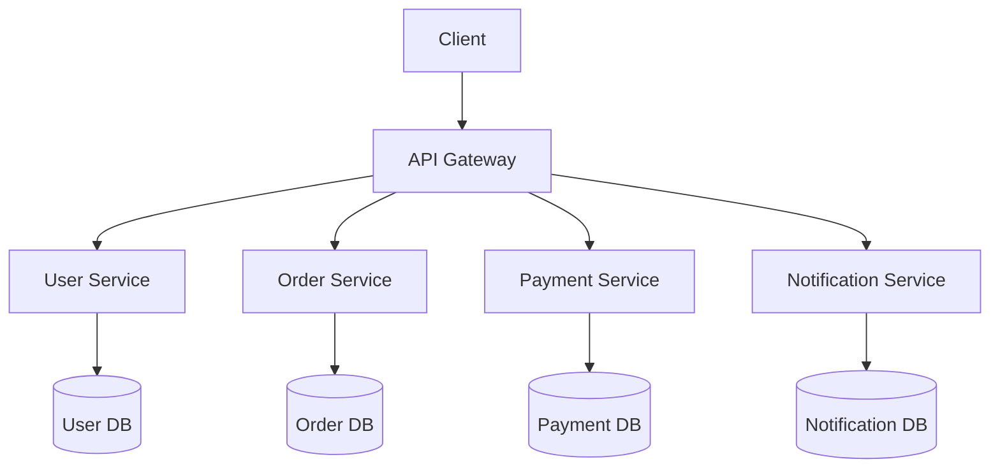

Each service is essentially its **own tiny application** — it can be built, deployed, scaled, and even rewritten in a completely different programming language, entirely independently of the others.

### Key traits
- **Independent codebases** — each service is its own repository (or clearly separated within a repo).
- **Independent deployment** — you can redeploy the Payment service without touching anything else.
- **Network communication** — since services run as separate processes (often on separate servers), they must talk to each other over the network (APIs, message queues — see Section 5).
- **Often independent databases** — each service typically owns its own data, and other services aren't allowed to directly touch it.

### Why it's powerful at scale
- **Independent scaling.** Only the Payment service is under load? Scale *just* that service horizontally, leaving the others untouched.

- **Fault isolation.** If the Notification service crashes, Users, Orders, and Payments keep working perfectly fine — the failure is contained.
- **Independent, faster deployments.** Different teams can build, test, and deploy their own services on their own schedule, without waiting on or blocking each other.
- **Technology flexibility.** The Payment service could be written in Java for its mature libraries, while the Notification service uses Node.js for its async I/O strengths — each team picks the best tool for their specific job.

### Why it's harder
- **Distributed systems complexity.** Every inter-service call is now a network call, which can fail, time out, or be slow — problems that simply don't exist inside a single process.
- **Data consistency across services is hard.** If an Order service and a Payment service each have their own database, keeping them in sync (e.g., "only mark the order as paid if the payment actually succeeded") requires careful coordination (see distributed transactions / the Saga pattern — a deeper topic beyond today's scope).
- **Operational overhead.** You now need to monitor, log, and deploy *many* services instead of one — this requires solid infrastructure (service discovery, centralized logging, container orchestration).
- **Harder to debug.** A single user request might touch five different services — tracing what actually went wrong requires distributed tracing tools, not just reading one log file.

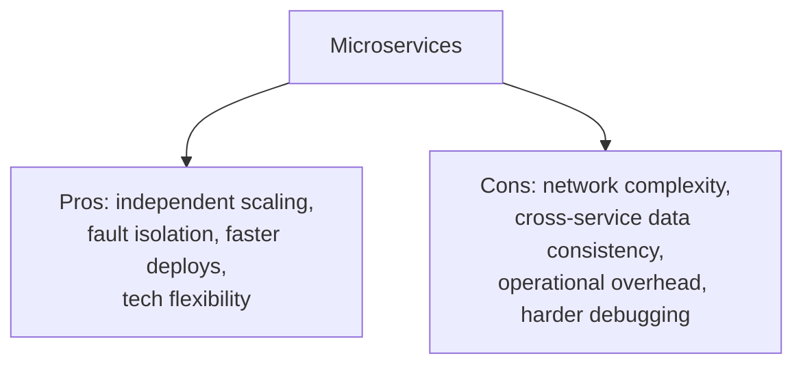

---

## 4. How a Single Feature Flows Through Each

Let's trace "a user places an order" through both architectures to make the difference concrete.

### In a Monolith

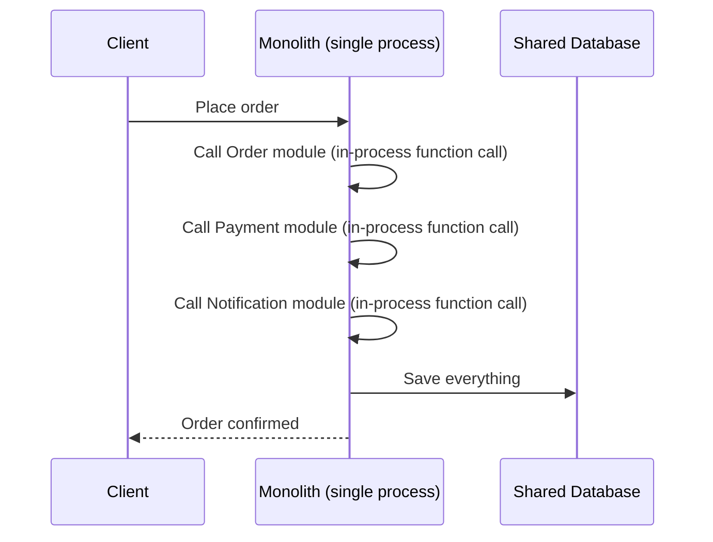

Notice: every step is just a normal function call within the same running program — fast, and if anything fails, it's one stack trace in one log.

### In Microservices

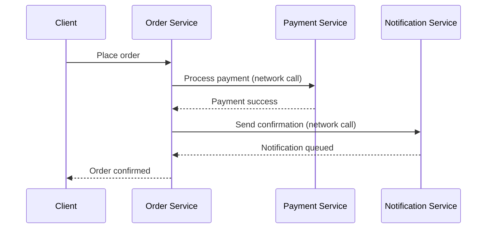

Notice: the same feature now involves **three separate network calls** across three separate services — each one is a new opportunity for latency, timeouts, or partial failure (e.g., what if the payment succeeds but the notification call times out?).

---

## 5. Communication Between Microservices

Since services run as separate processes, they need a way to talk to each other. There are two broad patterns:

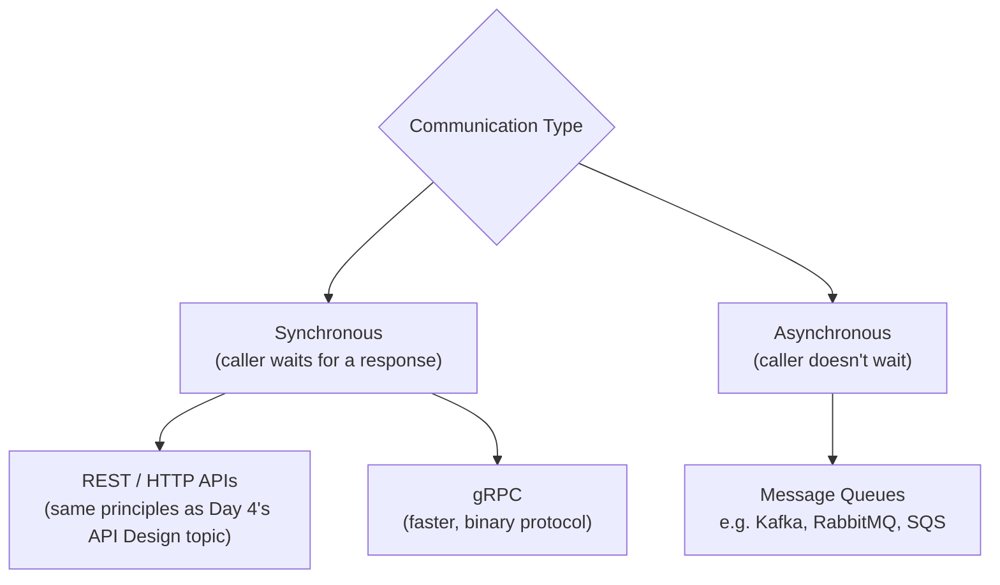

### Synchronous (e.g., REST calls)
The calling service sends a request and **waits** for a response before continuing.

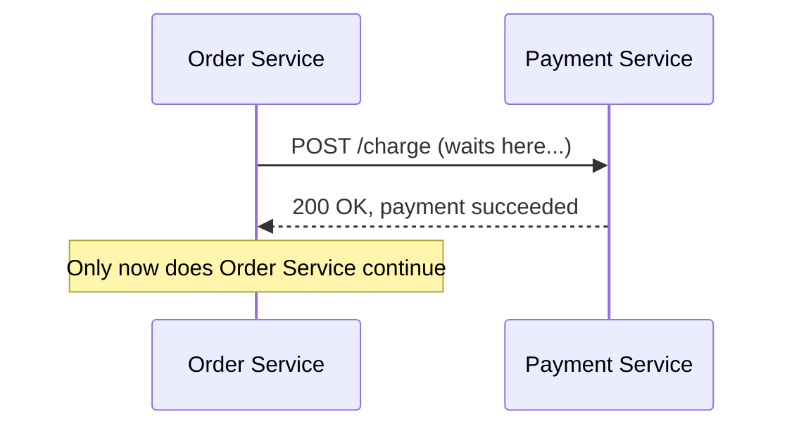
- **Simple to reason about**, but creates tight coupling — if Payment Service is slow or down, Order Service is blocked too.

### Asynchronous (e.g., a message queue)
The calling service publishes a message and moves on immediately, **without waiting** for the other service to process it.

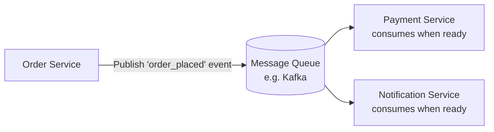
- **Looser coupling** — Order Service doesn't need Payment or Notification Service to be up *right now*; they'll process the event whenever they're ready.
- **Best for:** operations that don't need an immediate response, and for improving resilience — if Notification Service is briefly down, the message just waits in the queue instead of failing the whole request.

---

## 6. Side-by-Side Comparison

| Dimension | Monolith | Microservices |
|---|---|---|
| **Codebase** | Single, unified | Multiple, independent |
| **Deployment** | One unit, all at once | Independent, per service |
| **Scaling** | All-or-nothing | Per-service, targeted |
| **Communication** | In-process function calls (fast) | Network calls (slower, can fail) |
| **Fault impact** | One crash can affect everything | Failures are isolated to that service |
| **Development speed (early on)** | Fast — simple setup | Slower initially — more infrastructure needed |
| **Development speed (at scale, many teams)** | Slows down — teams block each other | Faster — teams ship independently |
| **Operational complexity** | Low | High (monitoring, orchestration, tracing) |
| **Data consistency** | Easy (one shared database, one transaction) | Hard (data spread across services) |
| **Best for** | Startups, small teams, early-stage products | Large-scale systems, large/multiple teams, independently-scaling components |

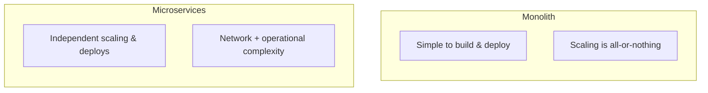

---

## 7. The Hidden Costs of Microservices

This is the part that's often glossed over — microservices are frequently pitched as the "advanced, better" option, but they come with real costs that many companies underestimate.

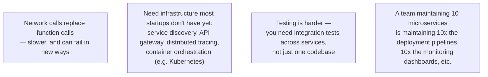

**A blunt but important truth:** a small team building an early-stage product with microservices often moves *slower*, not faster — they're paying the full operational tax of distributed systems before they have the traffic or team size that actually needs it.

---

## 8. The Middle Ground: When and How Companies Actually Migrate

Most successful companies don't start with microservices — they start as a monolith, and **split it apart gradually**, once specific parts of the system genuinely need independent scaling or independent teams.

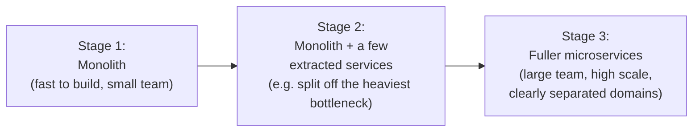

A common first step is identifying the **one module causing the most pain** (e.g., a Payment module that needs different scaling and security requirements than the rest) and extracting *just that one* into its own service — not rewriting everything overnight.

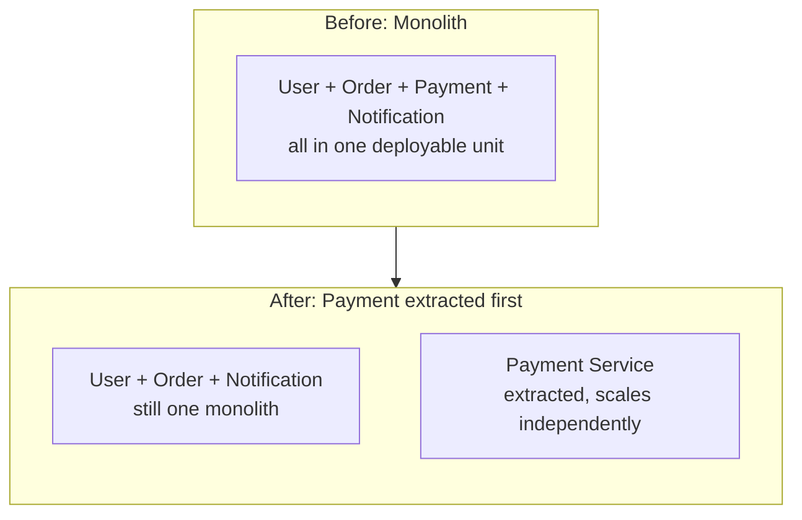

---

## 9. When to Use Which — Decision Guide

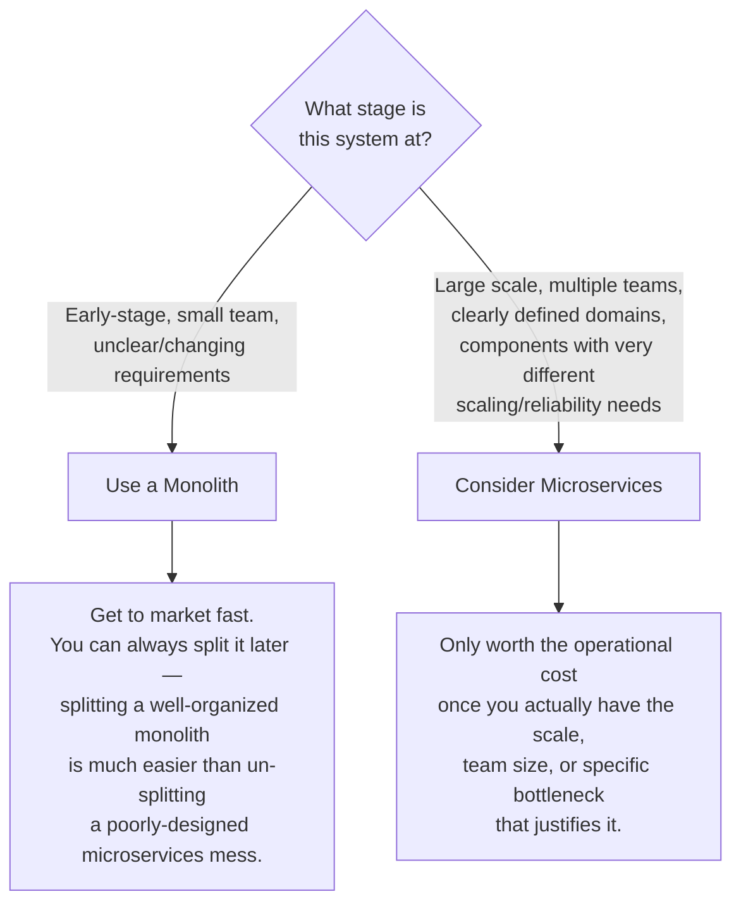

### Choose Monolith when:
- You're early-stage, still figuring out the product, and requirements change often.
- You have a small team (splitting into microservices with a 3-person team usually just adds overhead, not speed).
- You need to move fast and keep things simple to debug and deploy.

### Choose Microservices when:
- Different parts of your system have **very different scaling needs** (e.g., a video-processing feature vs a simple user-profile lookup).
- You have **multiple teams** that need to ship independently without blocking each other.
- Specific components need **different reliability/security requirements** (e.g., payments needing stricter isolation than a blog comments feature).
- You've already identified real, specific pain points in a monolith (not hypothetical future ones).

---

## 10. How to Reason About This in an Interview

If asked *"would you build this as a monolith or microservices?"*, a strong answer sounds like this:

> "I'd start with a monolith, especially if this is early-stage or the team is small — it's simpler to build, deploy, and debug, and it lets us move fast while requirements are still evolving. I'd keep the code well-organized internally, with clear module boundaries, so that if we later need to split something out, it's a clean extraction rather than untangling a mess. I'd consider moving to microservices once there's a concrete reason — like one specific component needing very different scaling than the rest, or multiple teams starting to block each other on deployments. Even then, I'd extract incrementally, starting with the module causing the most pain, rather than rewriting everything into microservices upfront, since that adds real operational cost — network calls that can fail, cross-service data consistency, and needing infrastructure like service discovery and distributed tracing — before we actually have the scale or team size to justify it."

That answer shows: you don't treat microservices as automatically "better," you understand the *real operational costs*, and you know that most real systems evolve from monolith → microservices incrementally, rather than choosing one on day one and never revisiting it.

---

## 11. Quick Recall Cheat Sheet

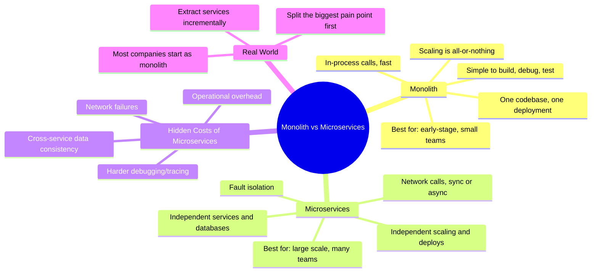

| If you remember only 5 things |
|---|
| 1. Monolith = one codebase, one deployment, everything communicates via fast in-process function calls. |
| 2. Microservices = independent services, each with its own deployment (often its own database), communicating over the network. |
| 3. Monolith scaling is all-or-nothing; microservices let you scale just the component that actually needs it. |
| 4. Microservices trade simplicity for real operational costs: network failures, cross-service data consistency, and much higher infrastructure overhead. |
| 5. Most successful systems start as a monolith and extract specific services incrementally, once a real, specific pain point justifies it — not microservices from day one. |

---

*This file is written in GitHub-flavored Markdown with Mermaid diagrams — it will render natively on GitHub, GitLab, and most modern Markdown viewers.*
