# Database Sharding / Partitioning

*A zero-to-mastery guide for system design interviews and real-world architecture.*

---

## Table of Contents
1. [What Is Sharding?](#1-what-is-sharding)
2. [Why It's Needed](#2-why-its-needed)
3. [Partitioning vs Sharding — Clearing Up the Terminology](#3-partitioning-vs-sharding--clearing-up-the-terminology)
4. [Vertical Partitioning vs Horizontal Partitioning](#4-vertical-partitioning-vs-horizontal-partitioning)
5. [Sharding Strategies (How to Decide Which Row Goes Where)](#5-sharding-strategies-how-to-decide-which-row-goes-where)
6. [The Hardest Part: Querying Across Shards](#6-the-hardest-part-querying-across-shards)
7. [The Hot Shard Problem](#7-the-hot-shard-problem)
8. [Resharding — What Happens When You Need to Add More Shards](#8-resharding--what-happens-when-you-need-to-add-more-shards)
9. [How to Reason About This in an Interview](#9-how-to-reason-about-this-in-an-interview)
10. [Quick Recall Cheat Sheet](#10-quick-recall-cheat-sheet)

---

## 1. What Is Sharding?

**Sharding** means splitting one large database into **multiple smaller databases** (called "shards"), where each shard holds only a **portion** of the total data — instead of one giant database trying to hold everything.

Think of it like a massive library with 10 million books. Instead of cramming every book onto one impossibly long shelf that takes forever to search, you split the collection into 10 separate rooms — Room 1 has books A-C, Room 2 has D-F, and so on. Each room is smaller, faster to search, and can be managed independently.

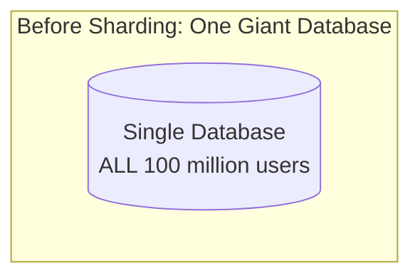

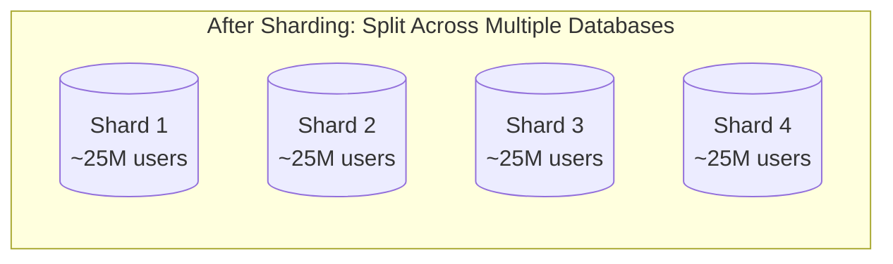

---

## 2. Why It's Needed

A single database server has hard physical limits — just like a single application server (recall Day 1's vertical scaling ceiling). At some point, no matter how powerful the machine, one database simply cannot hold all the data or handle all the traffic.

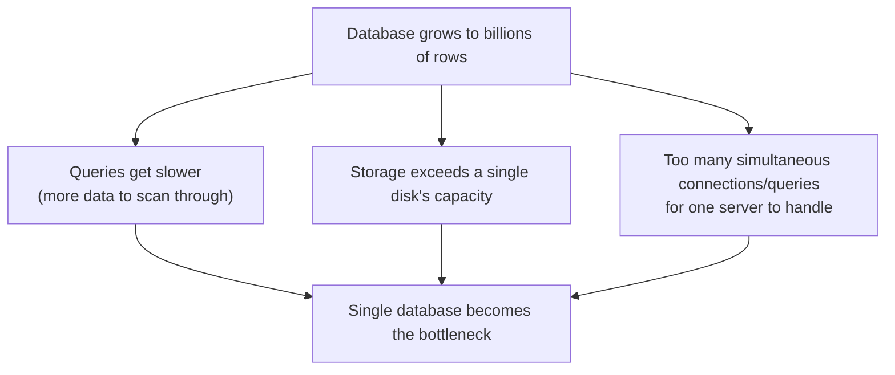

### The core reasons you need it
- **Storage limits** — a single machine's disk can only hold so much data.
- **Performance** — smaller datasets per shard mean faster queries (less data to scan, smaller indexes).
- **Write throughput** — spreading writes across multiple independent database servers means far higher total write capacity than any single server could handle alone.
- **This is how you truly horizontally scale a database** — recall from the SQL vs NoSQL topic that this is exactly the kind of engineering effort SQL databases need to scale out; sharding is that effort.

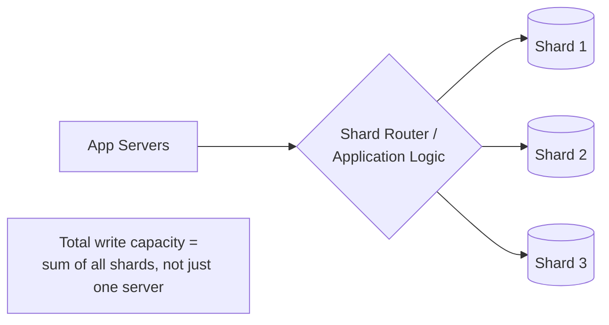

---

## 3. Partitioning vs Sharding — Clearing Up the Terminology

These two terms are often used loosely and interchangeably, which confuses beginners. Here's the precise distinction:

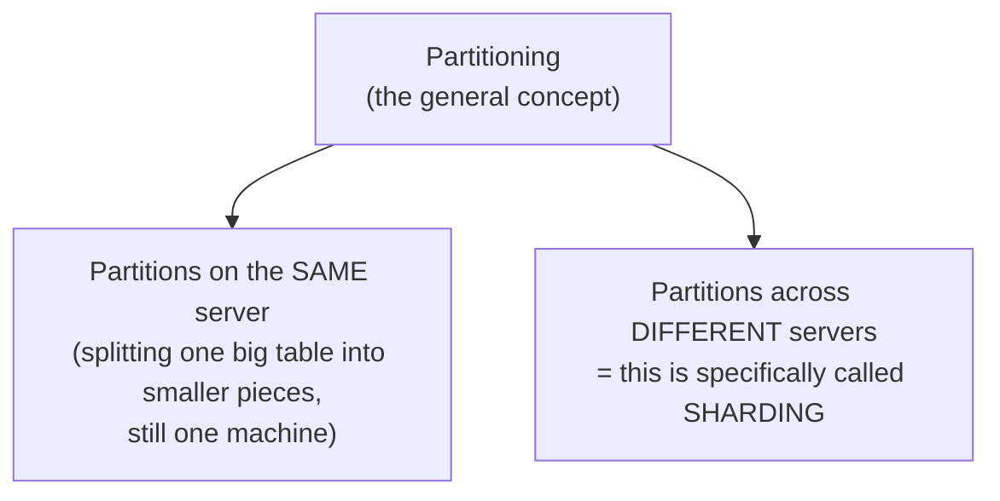

- **Partitioning** is the broad umbrella term: splitting a large table into smaller, more manageable pieces — this can happen even on a single server (e.g., splitting one huge `orders` table into `orders_2024`, `orders_2025` for easier management).
- **Sharding** is a *specific type* of partitioning where those pieces live on **separate physical servers**. Every shard is a partition, but not every partition is a shard.

**In casual conversation (including most interviews), people often use "sharding" and "partitioning" interchangeably** — but knowing this precise distinction shows real depth of understanding.

---

## 4. Vertical Partitioning vs Horizontal Partitioning

This is a *different* axis from the previous section — it's about **what** gets split, not **where** it lives.

### Horizontal Partitioning (splitting by rows)
Different **rows** of the same table go to different shards. Every shard has the exact same columns/schema, just a different subset of the rows.

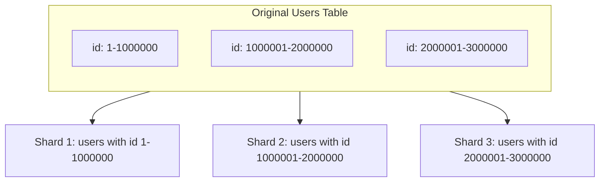

- This is what people usually mean when they say "sharding" — it's the more common of the two.

### Vertical Partitioning (splitting by columns)
Different **columns** of the same table go to different databases/servers, based on how they're used.

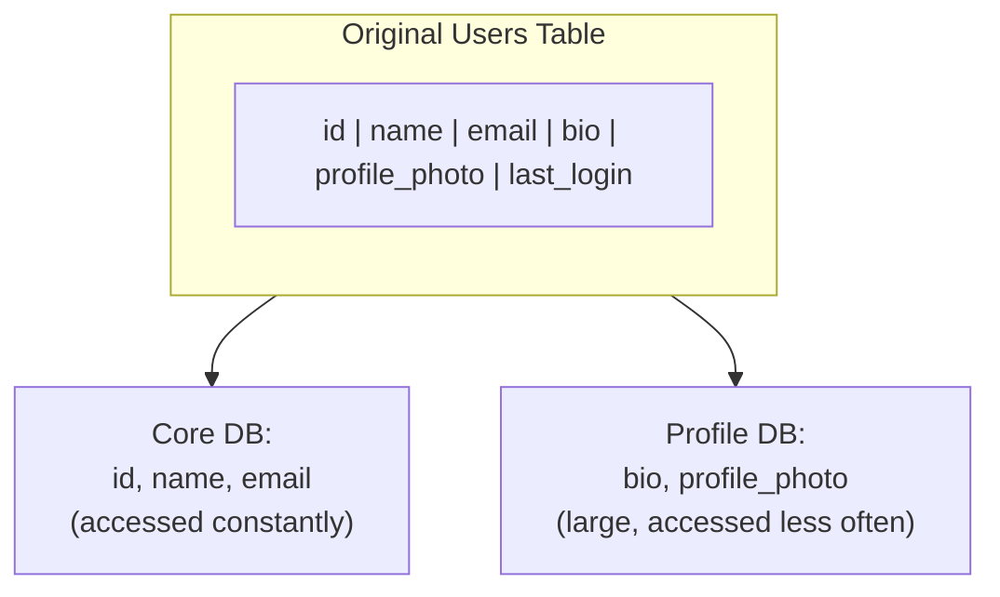

- **Good for:** separating frequently-accessed, small columns from rarely-accessed or large columns (like images/text blobs), so the "hot" data stays fast and compact.

---

## 5. Sharding Strategies (How to Decide Which Row Goes Where)

This is the core engineering decision: given a piece of data, **which shard does it belong on?** This decision is made using a **shard key** (a chosen column, e.g., `user_id`) and a strategy for mapping that key to a shard.

### 5.1 Range-Based Sharding
Data is split based on **ranges** of the shard key — e.g., user IDs 1-1,000,000 go to Shard 1, 1,000,001-2,000,000 go to Shard 2, and so on.

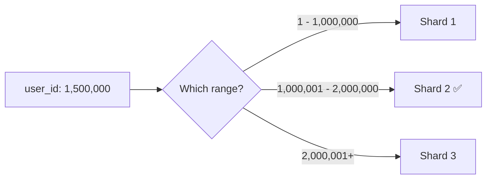

- **Good for:** range queries (e.g., "get all users created between March and June") — since related data sits together, this is fast.
- **Downside:** uneven distribution risk — if user IDs are assigned sequentially and most *new* signups are recent, Shard 3 (holding the newest ID range) gets hammered with traffic while Shard 1 sits mostly idle. This directly causes the "hot shard" problem covered in Section 7.

### 5.2 Hash-Based Sharding
Run the shard key through a **hash function**, then use the result (e.g., `hash(user_id) % number_of_shards`) to decide the shard.

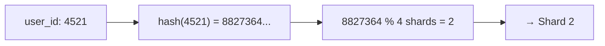

- **Good for:** even distribution — hashing scrambles the keys so they spread roughly evenly across all shards, avoiding the hot shard problem from range-based sharding.
- **Downside:** range queries become painful — "all users created between March and June" no longer sit together, so you'd have to query *every* shard and merge the results.

### 5.3 Geographic / Directory-Based Sharding
Data is routed to a shard based on a real-world attribute, like the user's region — e.g., all European users go to a shard hosted in an EU data center.

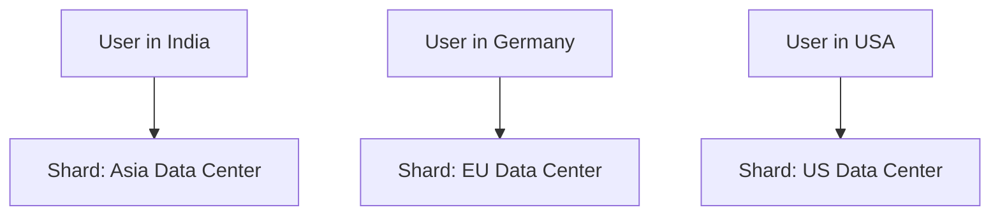

- **Good for:** reducing latency (users are served from a nearby data center) and satisfying data residency/legal requirements (e.g., regulations requiring EU user data to physically stay in the EU).

### Strategy comparison

| Strategy | Distribution | Range Queries | Common Risk |
|---|---|---|---|
| Range-Based | Can be uneven | Fast | Hot shards (recent/popular ranges overloaded) |
| Hash-Based | Even | Slow (must query all shards) | Losing locality of related data |
| Geographic | Depends on user distribution | N/A | Uneven if users cluster in one region |

---

## 6. The Hardest Part: Querying Across Shards

Sharding solves the scaling problem, but it introduces a very real new problem: what if a query needs data that's spread across **multiple** shards?

### Simple case: query includes the shard key
If you're looking up `user_id: 4521` and your shard key *is* `user_id`, the application knows exactly which single shard to query — fast and simple.

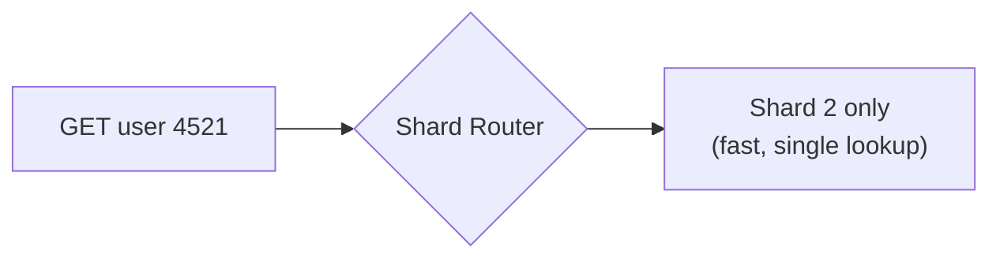

### Hard case: query doesn't include the shard key
If you need "all orders placed in the last 24 hours across all users," and orders are sharded by `user_id`, that data is scattered across every shard.

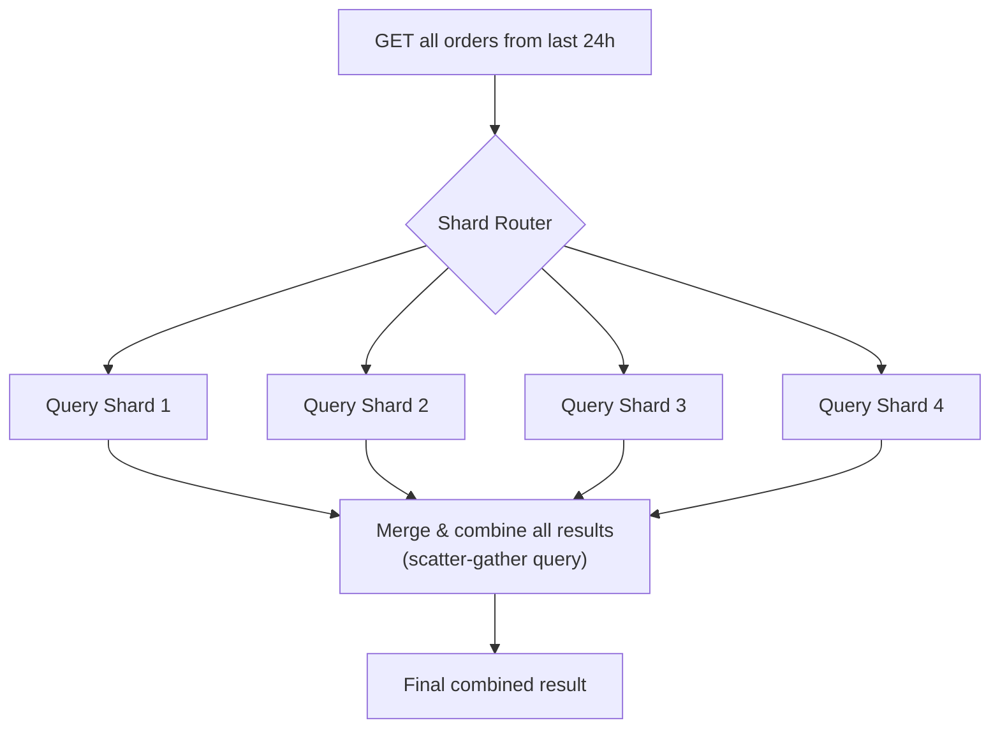

This is called a **scatter-gather query** — it has to hit every shard and merge the results in the application layer, which is far slower and more complex than a single-shard lookup. This is exactly why **choosing the right shard key matters so much upfront** — it should match your most common and most performance-critical query pattern.

### Another hard case: joins across shards
In a non-sharded database, joining two related tables is a single, fast query. Once those tables live on different shards, a "join" now requires fetching data from multiple shards separately and combining it in application code — the database can no longer do this for you automatically.

---

## 7. The Hot Shard Problem

Even with a sharding strategy in place, one shard can end up receiving disproportionately more traffic than the others — this is called a **hot shard** (or "hotspot").

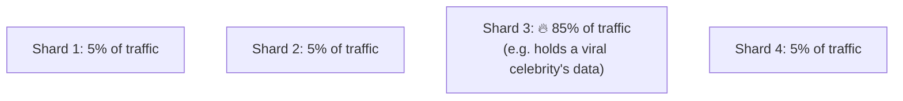

### Common causes
- **Range-based sharding with sequential keys** — newest data (often the most actively accessed) all lands on the same "latest" shard.
- **A single, disproportionately popular entity** — e.g., a celebrity's social media account generating far more reads/writes than an average user, and that one row happens to live on one shard.
- **Poor shard key choice** — a key that doesn't distribute activity evenly (e.g., sharding by `country` when 90% of your users are in one country).

### Mitigations
- Switch to (or combine with) hash-based sharding to spread load more evenly.
- Add a random "salt" to the shard key for extremely hot individual records, to spread that single entity's data across multiple shards.
- Cache the hot data aggressively (recall Day 3's caching topic) to reduce direct load on that shard.

---

## 8. Resharding — What Happens When You Need to Add More Shards

Eventually, even sharded systems outgrow their current shard count and need to add more shards. This process is called **resharding**, and it's notoriously painful.

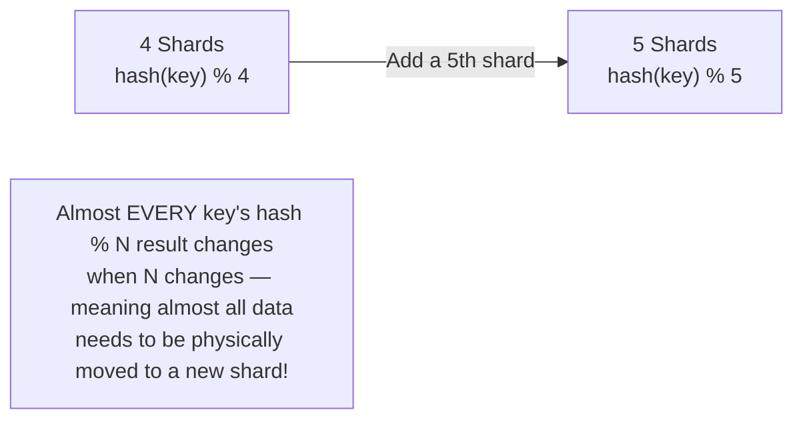

With simple `hash % N` sharding, adding just one new shard changes the target shard for the vast majority of existing keys, requiring a massive, disruptive data migration.

### The common fix: Consistent Hashing
A more advanced hashing technique specifically designed so that adding or removing a shard only requires moving a **small fraction** of the data, not nearly all of it. *(This is a deep topic on its own — worth knowing it exists and solves exactly this resharding pain, even without covering the full mechanism here.)*

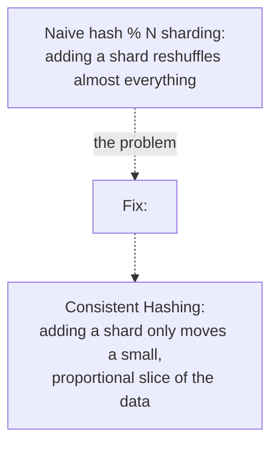

---

## 9. How to Reason About This in an Interview

If asked *"this database is becoming a bottleneck — how would you scale it?"*, a strong answer sounds like this:

> "Since we're past what a single, more powerful machine can handle, I'd shard the database — splitting it across multiple servers, each holding a subset of the data. I'd pick a shard key based on our most common query pattern — if most queries look up a single user's data, sharding by `user_id` keeps those lookups fast and confined to one shard. I'd lean toward hash-based sharding for even distribution, accepting that range queries become harder, unless range queries are actually common for us, in which case range-based sharding with careful monitoring for hot shards would make more sense. I'd also watch out for the hot shard problem — if one entity, like a viral post, gets disproportionate traffic, I'd consider adding a salt to spread that specific data across shards, or caching it aggressively. And since resharding with naive hash-mod-N sharding requires moving almost all the data every time we add a shard, I'd use consistent hashing from the start to make future resharding far less disruptive."

That answer shows: you understand *why* sharding is needed, you can justify a *shard key and strategy* based on actual query patterns (not just picking one arbitrarily), you're aware of the *hot shard* and *cross-shard query* problems, and you're thinking ahead to *resharding* — a detail that signals real depth.

---

## 10. Quick Recall Cheat Sheet

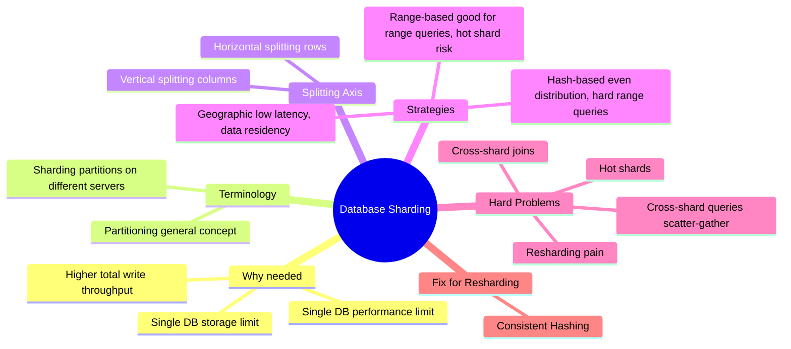

| If you remember only 5 things |
|---|
| 1. Sharding splits one large database into multiple smaller databases (shards) across different physical servers. |
| 2. Choose your shard key based on your most common query pattern — it determines whether lookups stay fast and single-shard, or become slow scatter-gather queries. |
| 3. Hash-based sharding gives even distribution but sacrifices fast range queries; range-based sharding is the opposite. |
| 4. A "hot shard" happens when one shard gets disproportionate traffic — often from sequential keys or one very popular entity. |
| 5. Naive hash-mod-N sharding makes resharding painful (moves almost all data); consistent hashing solves this by only moving a small fraction when shards are added or removed. |

---

*This file is written in GitHub-flavored Markdown with Mermaid diagrams — it will render natively on GitHub, GitLab, and most modern Markdown viewers.*
