# HLD: Design a URL Shortener (TinyURL / Bitly)

*Phase 2 — High-Level Design. A zero-to-mastery, interview-style walkthrough.*

---

## Table of Contents
1. [What Are We Actually Building?](#1-what-are-we-actually-building)
2. [Step 1: Clarify Requirements](#2-step-1-clarify-requirements)
3. [Step 2: Capacity Estimation](#3-step-2-capacity-estimation)
4. [Step 3: API Design](#4-step-3-api-design)
5. [Step 4: The Core Challenge — Generating the Short Code](#5-step-4-the-core-challenge--generating-the-short-code)
6. [Step 5: Database Design](#6-step-5-database-design)
7. [Step 6: High-Level Architecture](#7-step-6-high-level-architecture)
8. [Step 7: The Redirect Flow in Detail](#8-step-7-the-redirect-flow-in-detail)
9. [Step 8: Scaling the System](#9-step-8-scaling-the-system)
10. [Step 9: Handling Edge Cases](#10-step-9-handling-edge-cases)
11. [Step 10: Analytics (Bonus Feature)](#11-step-10-analytics-bonus-feature)
12. [Full System, Put Together](#12-full-system-put-together)
13. [How to Walk Through This in an Interview](#13-how-to-walk-through-this-in-an-interview)
14. [Quick Recall Cheat Sheet](#14-quick-recall-cheat-sheet)

---

## 1. What Are We Actually Building?

A **URL shortener** takes a long URL and produces a short, unique alias for it — when someone visits the short URL, they get automatically redirected to the original long URL.

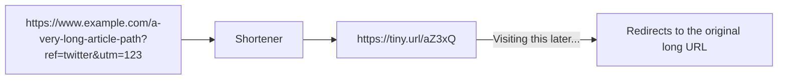

That's the entire product in one sentence. Everything from here is about **how** to build this so it's fast, reliable, and works at massive scale — this is exactly what a system design interview is testing: not whether you know *what* a URL shortener does (everyone does), but whether you can reason through the engineering decisions to build one properly.

---

## 2. Step 1: Clarify Requirements

Before designing anything, a real system design interview always starts here — jumping straight to architecture without this step is the most common beginner mistake.

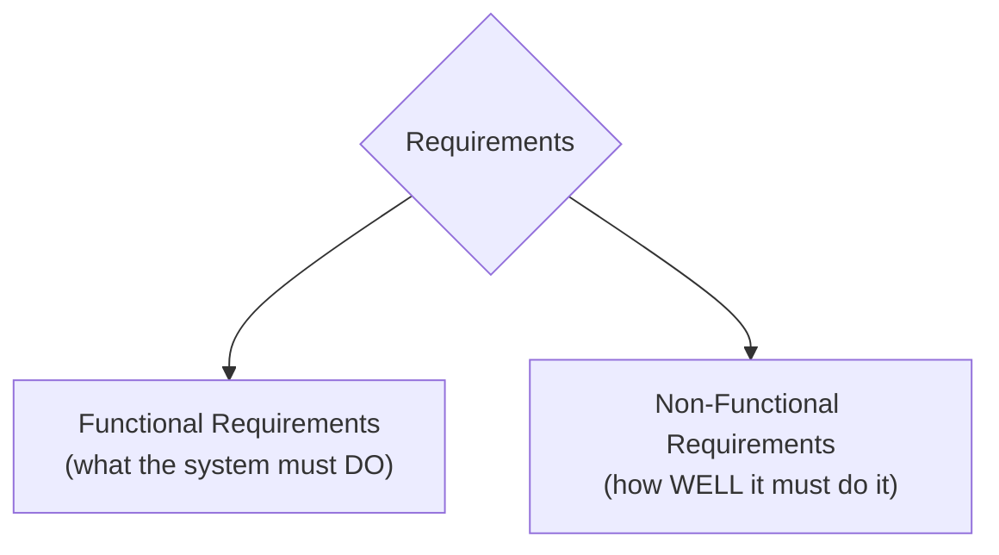

### Functional Requirements
- Given a long URL, generate a **unique** short URL.
- Given a short URL, **redirect** the user to the original long URL.
- (Optional/bonus) Let users pick a **custom** short alias.
- (Optional/bonus) Short URLs can **expire** after a set time.
- (Optional/bonus) Track basic **analytics** (click counts).

### Non-Functional Requirements
- **High availability** — redirects must work almost all the time; a URL shortener being down means every shared link across the internet breaks.
- **Low latency** — the redirect should feel instant.
- **Read-heavy** — far more people will *click* short links than *create* them (a link created once might be clicked thousands of times).
- **Uniqueness** — no two long URLs should ever collide on the same short code (unless intentionally reusing one).

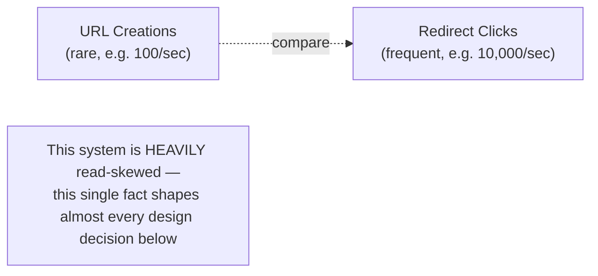

---

## 3. Step 2: Capacity Estimation

This step is about getting rough, order-of-magnitude numbers — interviewers don't expect precision, just that you can reason about **scale**, since scale directly drives architecture decisions (recall: a system serving 100 users a day needs none of the complexity a system serving 100 million users does).

### Assumptions (reasonable, made-up numbers for this walkthrough)
- 100 million new short URLs created per month.
- Read:Write ratio of 100:1 (100 clicks for every 1 URL created).

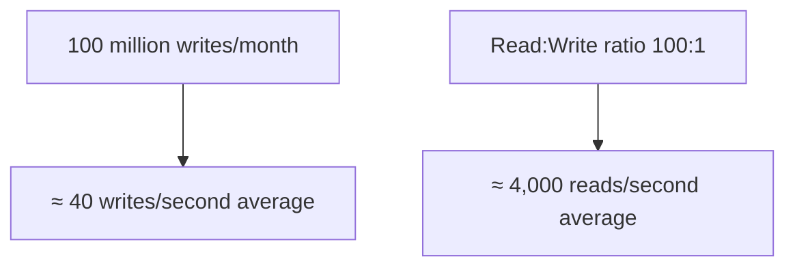

### Storage estimation
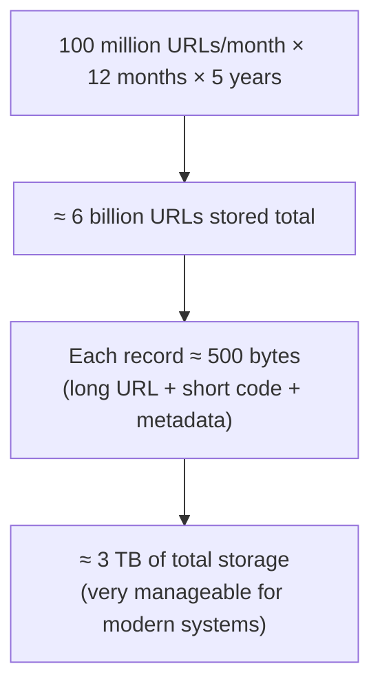

**Why this step matters:** these numbers directly justify later decisions — e.g., "4,000 reads/second" is exactly why caching becomes essential (Step 9), and "6 billion URLs" is exactly why the short code needs enough possible combinations to avoid running out (Step 4).

---

## 4. Step 3: API Design

Following the REST principles from Phase 1's API Design topic:

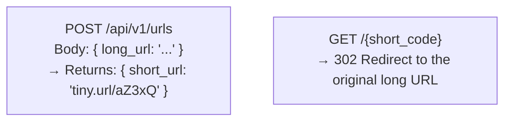

- **POST /api/v1/urls** — creates a new short URL. Uses POST (not GET) since it creates a new resource with a side effect (recall: POST is not idempotent, which is expected here — each call could reasonably create a distinct short code, even for the same long URL, unless we explicitly design for reuse).
- **GET /{short_code}** — this is the redirect endpoint. Notice it's *not* under `/api/` — it needs to be a short, clean top-level path, since the whole point is a short, shareable URL.

---

## 5. Step 4: The Core Challenge — Generating the Short Code

This is the heart of the entire system — the one problem that makes this design question interesting rather than trivial.

### Requirement: the short code needs enough possible combinations
Using letters (a-z, A-Z) and digits (0-9) gives **62 possible characters** per position.

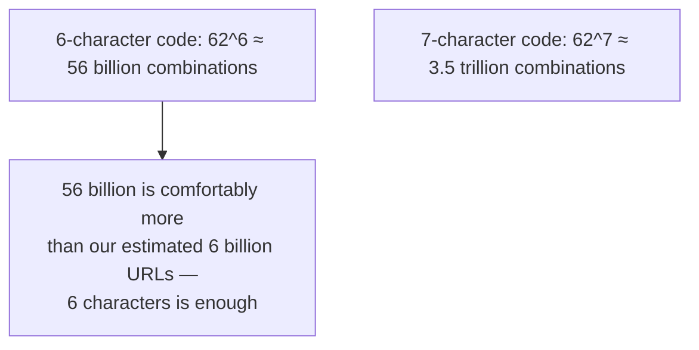

### Approach 1: Hash the long URL
Run the long URL through a hash function (e.g., MD5), then take the first 6-7 characters of the result.

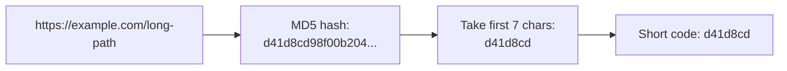
- **Problem: collisions.** Two *different* long URLs can occasionally hash to the *same* short code (especially once you truncate to just a few characters). This requires a collision-handling strategy — e.g., checking if the code is already taken, and if so, appending a small variation and re-hashing.

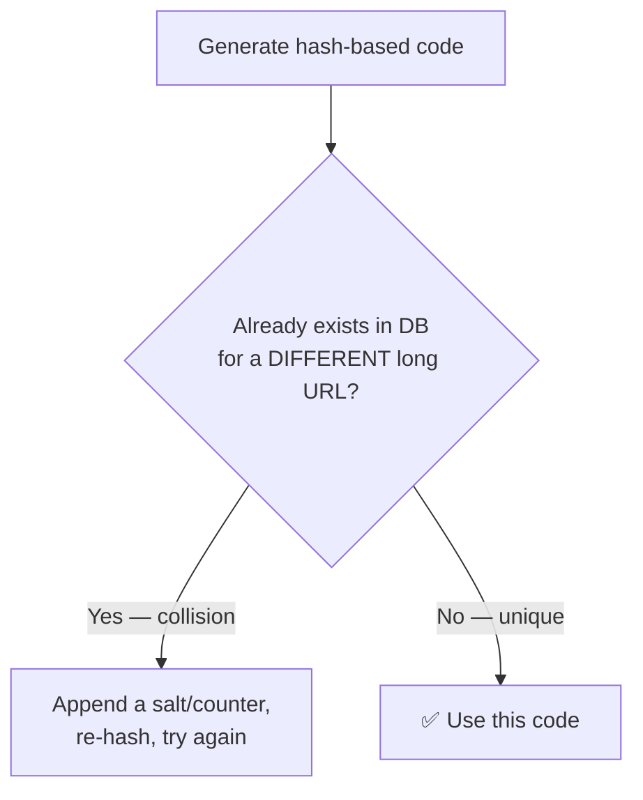

### Approach 2: Base62 Encoding of an auto-incrementing ID (the more common, cleaner solution)
Instead of hashing, use a simple **auto-incrementing counter** (like a database's auto-increment ID: 1, 2, 3, 4...) and convert that number into a short string using **Base62 encoding** (using all 62 letters+digits as "digits" of a number system, the same way we normally use 10 digits for decimal).

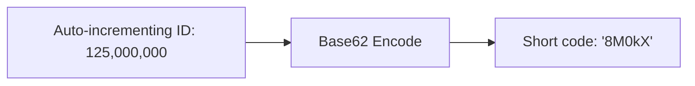

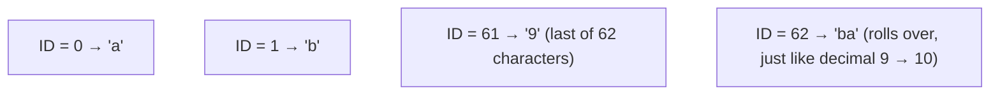
- **No collisions possible, by design** — since every ID is unique (guaranteed by the database), every resulting short code is automatically unique too. No need to check for collisions or retry.
- **This is why it's the generally preferred approach** for this exact problem — it sidesteps the entire collision-handling complexity of the hashing approach.

### The scaling wrinkle: a single counter doesn't scale to multiple servers
If multiple app servers are each trying to generate the "next" ID independently (recall horizontal scaling from Phase 1), they can't just keep a counter in their own local memory — two servers could easily generate the same ID at the same time.

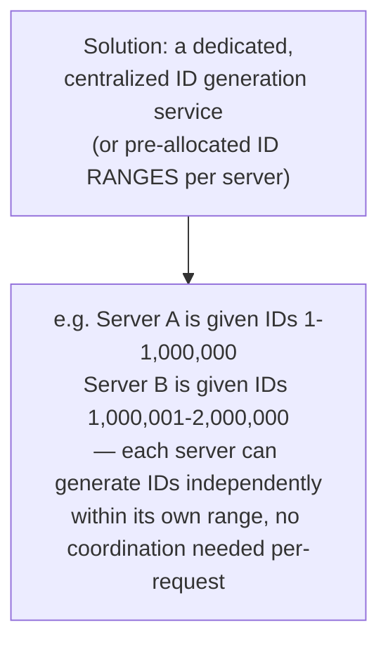

This is a very common, elegant fix: instead of every single ID generation requiring a network round-trip to a central counter, each app server periodically requests a **batch/range** of IDs upfront and hands them out locally until that batch runs out — dramatically reducing coordination overhead.

---

## 6. Step 5: Database Design

### The core table

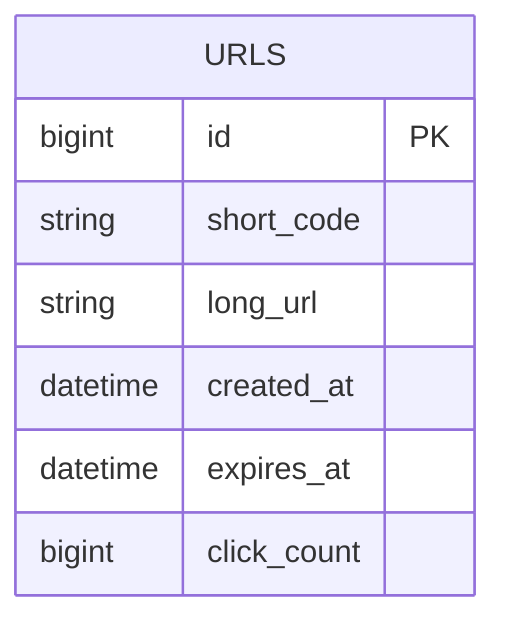

| Column | Purpose |
|---|---|
| `id` | Auto-incrementing primary key (used to generate the short code, as covered above) |
| `short_code` | The actual short code shown to users (indexed for fast lookup — recall the Indexing topic) |
| `long_url` | The original destination URL |
| `created_at` | When the short URL was created |
| `expires_at` | Optional expiration time |
| `click_count` | A simple running counter for basic analytics |

### Which type of database?
Recalling the SQL vs NoSQL topic's decision framework: this data is **simple, self-contained records** (a short code maps to a long URL) with **no complex relationships** between them, and needs to handle **massive scale and high read throughput**.

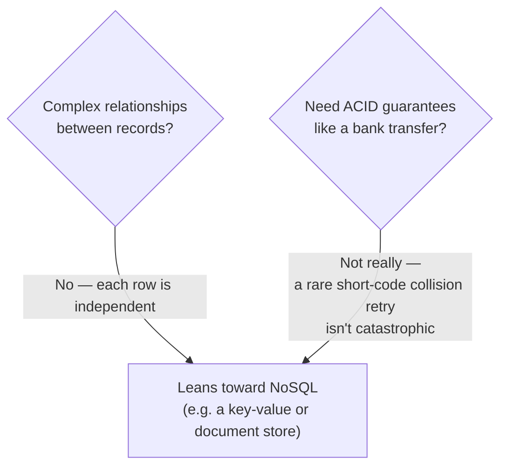
- A **key-value store** (e.g., DynamoDB) or wide-column store fits this well — the access pattern is almost always "look up by short_code," which is exactly what key-value stores are optimized for. That said, a well-indexed SQL database also works perfectly fine at moderate scale — this is a case where **either choice is defensible**, and the right answer in an interview is explaining the tradeoff, not just naming one database dogmatically.

---

## 7. Step 6: High-Level Architecture

Putting the pieces together:

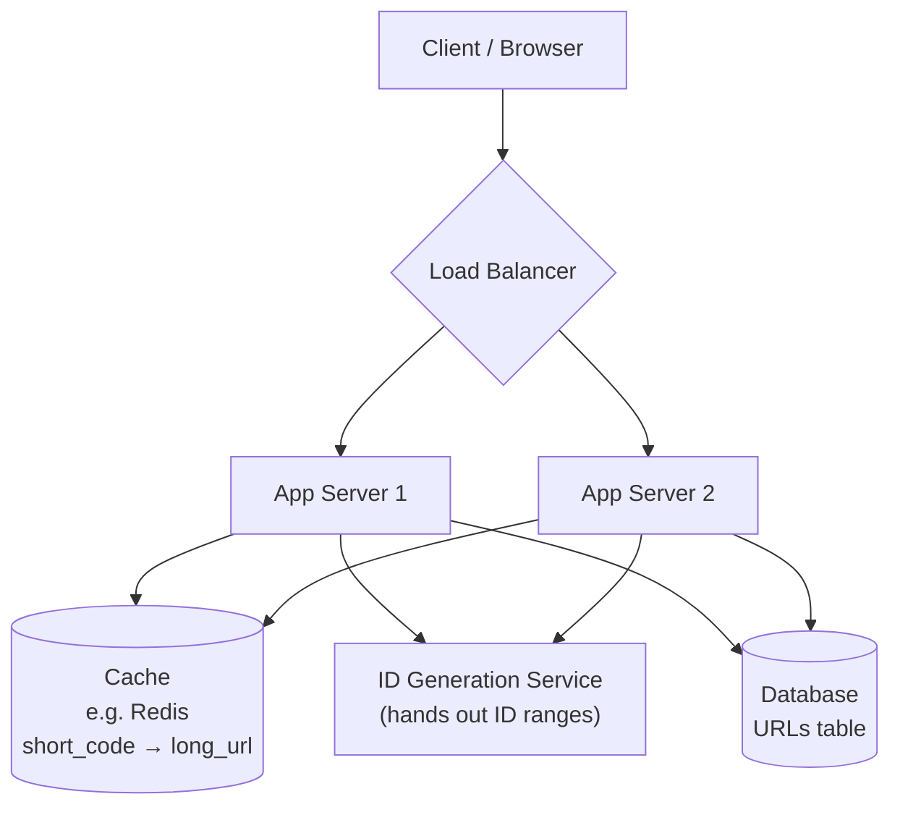

Every component here is something covered in Phase 1 — this design is genuinely just those building blocks assembled to solve this specific problem:
- **Load Balancer** — distributes traffic across app servers.
- **App Servers** — handle the create and redirect logic, kept stateless so any server can handle any request.
- **Cache** — since reads vastly outnumber writes (Step 2), caching short_code → long_url lookups avoids hitting the database for the vast majority of redirect requests.
- **ID Generation Service** — solves the distributed unique-ID problem from Step 4.
- **Database** — the durable source of truth.

---

## 8. Step 7: The Redirect Flow in Detail

This is the **hot path** — the one that needs to be blazing fast, since it happens far more often than URL creation.

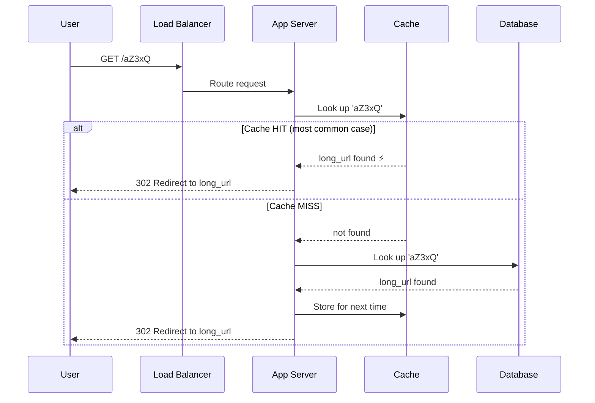

- **301 vs 302 redirect:** a subtle but real design choice. **301 (Permanent Redirect)** gets cached by the *user's browser*, meaning future clicks on the same link skip your server entirely — great for reducing server load, but means you **lose the ability to update click analytics** for cached visits, and can't change the destination later. **302 (Temporary Redirect)** always hits your server, giving you full analytics control and flexibility, at the cost of slightly more server load. Most real-world shorteners use **302**, specifically to preserve analytics tracking.

### The URL creation flow

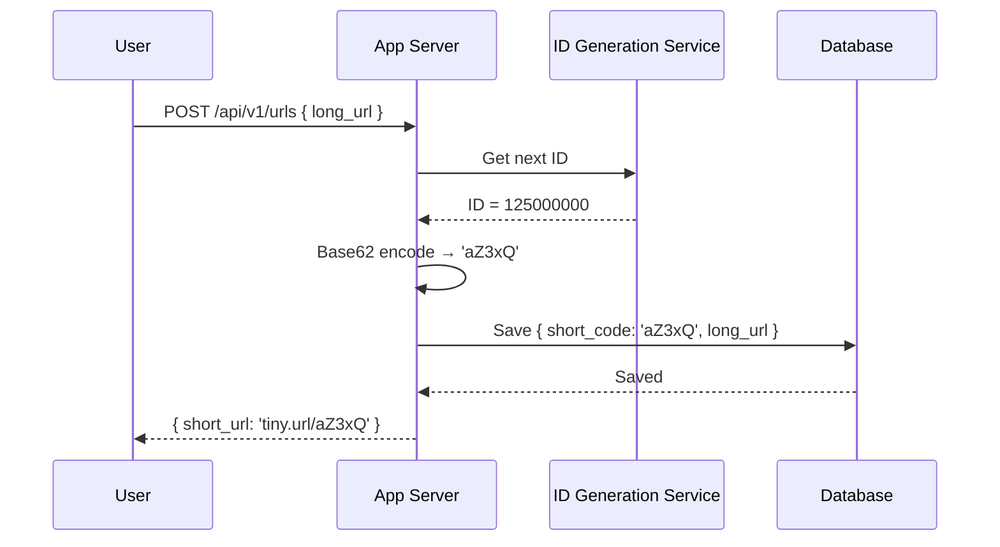

---

## 9. Step 8: Scaling the System

Walking through each Phase 1 concept as it applies specifically here:

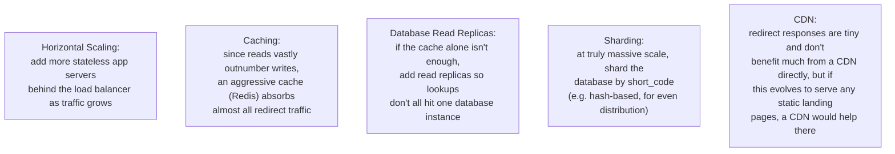

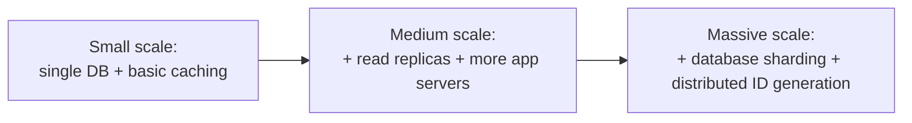

This progression directly mirrors the "Real System Evolution" walkthrough from Phase 1's Scalability topic — start simple, add complexity only as actual bottlenecks appear.

---

## 10. Step 9: Handling Edge Cases

A strong design also anticipates the messy realities:

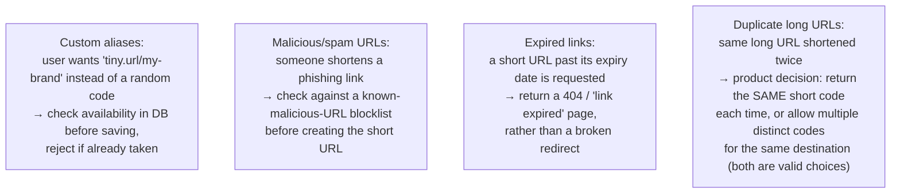

---

## 11. Step 10: Analytics (Bonus Feature)

If the interviewer asks for basic analytics (click counts, geographic breakdown of clicks), a naive approach — incrementing a counter in the main database on every single redirect — would slow down the hot redirect path with a write on every read.

```mermaid
flowchart TB
    Naive["❌ Naive: increment click_count<br/>directly in the DB on every redirect<br/>— adds a write to the hot, latency-critical path"]
    Better["✅ Better: publish a 'link_clicked' event<br/>to a message queue on every redirect,<br/>and process/aggregate analytics<br/>ASYNCHRONOUSLY, separately from the redirect itself"]
```

```mermaid
sequenceDiagram
    participant User
    participant App as App Server
    participant Queue as Message Queue
    participant Analytics as Analytics Service

    User->>App: GET /aZ3xQ
    App->>Queue: Publish "clicked: aZ3xQ" (fire and forget)
    App-->>User: 302 Redirect (immediately — doesn't wait on analytics)
    Queue->>Analytics: Consumed whenever ready
    Analytics->>Analytics: Aggregate click counts, etc.
```

This is a direct, practical application of the Message Queues topic from Phase 1 — decoupling the fast, critical redirect path from the slower, non-critical analytics processing.

---

## 12. Full System, Put Together

```mermaid
flowchart TB
    Client[Client] --> LB{Load Balancer}
    LB --> App1[App Server 1]
    LB --> App2[App Server 2]
    App1 & App2 --> Cache[("Cache<br/>Redis")]
    App1 & App2 --> IDGen[ID Generation Service]
    App1 & App2 --> Queue[("Message Queue")]
    Cache --> DB[(Database<br/>+ Read Replicas)]
    App1 & App2 -.on cache miss.-> DB
    Queue --> Analytics[Analytics Service]
    Analytics --> AnalyticsDB[(Analytics Database)]
```

---

## 13. How to Walk Through This in an Interview

A strong end-to-end summary sounds like this:

> "I'd start by clarifying this is heavily read-skewed — far more redirects than URL creations — which shapes most of my decisions. For the short code, I'd use Base62 encoding of an auto-incrementing ID rather than hashing, since it avoids collision handling entirely; to make ID generation work across multiple app servers, I'd have each server request a batch/range of IDs upfront rather than coordinating on every single request. The redirect path is the hot path, so I'd cache short_code-to-long_url lookups aggressively and use a 302 redirect rather than 301, to preserve the ability to track analytics and change destinations later. I'd keep app servers stateless behind a load balancer so I can scale horizontally, add database read replicas as read load grows, and reach for sharding by short_code only once a single database genuinely becomes the bottleneck. For analytics, I'd avoid writing directly to the database on every redirect — instead I'd publish a click event to a message queue and process analytics asynchronously, so the redirect itself stays fast regardless of what's happening downstream."

That answer shows: you followed a structured process (requirements → estimation → API → core challenge → data model → architecture → scaling → edge cases), you made a **specific, justified** choice for the hardest part of the problem (ID generation), and you connected nearly every earlier Phase 1 topic to a concrete decision in this design — which is exactly what HLD interviews are testing.

---

## 14. Quick Recall Cheat Sheet

```mermaid
mindmap
  root((URL Shortener HLD))
    Key Insight
      Massively read-heavy system
      Almost everything follows from this
    Core Challenge
      Generate unique short codes
      Base62 encode auto-increment ID
      Avoids hash collision handling entirely
      Distributed ID gen via batched ranges
    Data Model
      short_code, long_url, timestamps, click_count
      Simple key-value access pattern
    Architecture
      LB + stateless app servers
      Aggressive caching for redirects
      302 not 301 - preserves analytics
    Scaling Path
      Cache first
      Read replicas next
      Shard by short_code at massive scale
    Analytics
      Never block the hot redirect path
      Publish click events to a queue, process async
```

| If you remember only 5 things |
|---|
| 1. This system is massively read-heavy (redirects >> creations) — that single fact drives most design decisions. |
| 2. Base62-encoding an auto-incrementing ID is the standard way to generate short codes — it avoids collisions entirely, unlike hashing. |
| 3. Cache short_code → long_url lookups aggressively, since redirects are the hot path and need to be fast. |
| 4. Use 302 (not 301) redirects so every click still hits your server, preserving analytics and flexibility. |
| 5. Never let analytics tracking slow down the redirect path — publish click events to a message queue and process them asynchronously. |

---

*This file is written in GitHub-flavored Markdown with Mermaid diagrams — it will render natively on GitHub, GitLab, and most modern Markdown viewers.*
