# HLD: Design a Rate Limiter

*Phase 2 — High-Level Design. A zero-to-mastery, interview-style walkthrough.*

---

## Table of Contents
1. [What Are We Actually Building?](#1-what-are-we-actually-building)
2. [Step 1: Clarify Requirements](#2-step-1-clarify-requirements)
3. [Step 2: Capacity Estimation](#3-step-2-capacity-estimation)
4. [Step 3: API Design (How It's Used)](#4-step-3-api-design-how-its-used)
5. [Step 4: The Core Challenge — Picking the Algorithm](#5-step-4-the-core-challenge--picking-the-algorithm)
6. [Step 5: Where Does the Rate Limiter Live?](#6-step-5-where-does-the-rate-limiter-live)
7. [Step 6: Data Storage — Where Do Counts Live?](#7-step-6-data-storage--where-do-counts-live)
8. [Step 7: High-Level Architecture](#8-step-7-high-level-architecture)
9. [Step 8: The Request Flow in Detail](#9-step-8-the-request-flow-in-detail)
10. [Step 9: Scaling the System](#10-step-9-scaling-the-system)
11. [Step 10: Handling Edge Cases](#11-step-10-handling-edge-cases)
12. [Full System, Put Together](#12-full-system-put-together)
13. [How to Walk Through This in an Interview](#13-how-to-walk-through-this-in-an-interview)
14. [Quick Recall Cheat Sheet](#14-quick-recall-cheat-sheet)

---

## 1. What Are We Actually Building?

A **rate limiter** is a system that tracks how many requests each client has made recently, and blocks any request beyond an allowed threshold — protecting backend services from being overwhelmed, whether by abuse or by accident.

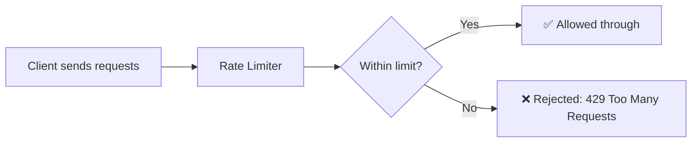

Phase 1 covered *why* rate limiting matters and the algorithms behind it. This HLD walkthrough is about actually **designing the rate limiter as a real system** — where it lives, how it stores counts reliably across many servers, and how it stays fast enough to sit in front of every single request without becoming the bottleneck itself.

---

## 2. Step 1: Clarify Requirements

### Functional Requirements
- Limit the number of requests a client can make within a defined time window (e.g., "100 requests per minute").
- Support **different limits for different rules** — e.g., per-user, per-IP, per-API-endpoint (recall Phase 1's "what to limit by").
- Reject requests that exceed the limit with a clear signal (HTTP 429 + helpful headers).
- Allow limits to be **configured/updated** without redeploying the whole system.

### Non-Functional Requirements
- **Extremely low latency** — the rate limiter sits in front of *every single request* across the whole system, so it must add negligible delay (a rate limiter that's slow defeats its own purpose).
- **High availability** — if the rate limiter itself goes down, does the system fail open (allow all traffic) or fail closed (block all traffic)? This is a real design decision, not an afterthought (covered in Step 10).
- **Accuracy vs performance trade-off** — perfectly precise limiting (recall Sliding Window Log from Phase 1) costs more resources than an approximate but "good enough" approach.
- **Must work correctly across many app servers** — this is the central hard problem, echoing the distributed rate limiting challenge introduced in Phase 1.

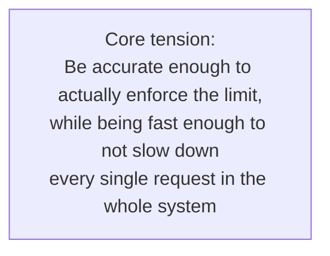

---

## 3. Step 2: Capacity Estimation

### Assumptions (reasonable, made-up numbers for this walkthrough)
- The overall system handles 100,000 requests/second at peak.
- **Every single one of those requests** needs a rate-limit check.

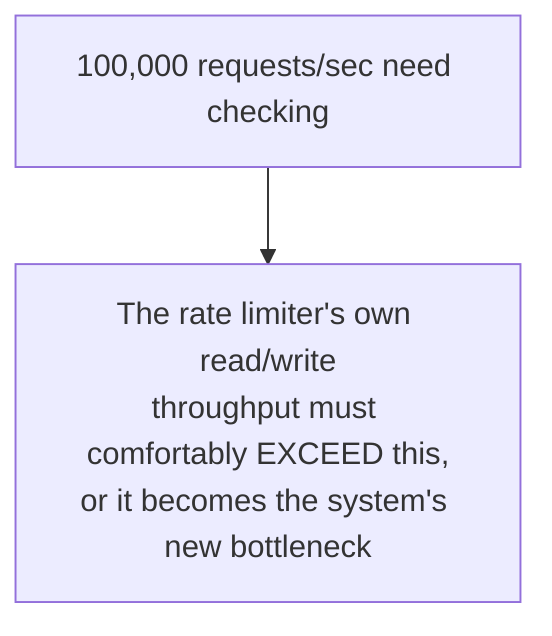

### Storage estimation
- Assume 10 million unique clients (users/IPs) being tracked at any given time.
- Each client's rate-limit state (e.g., a counter + timestamp) is tiny — maybe 50-100 bytes.

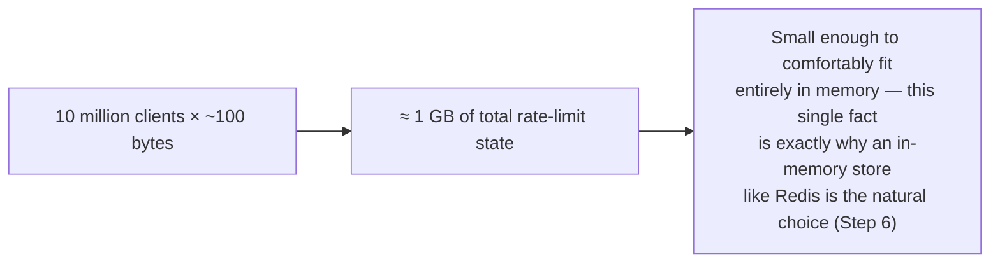

**Why this step matters:** "100,000 checks/second" is precisely why this can't be a regular database query per request (databases, even fast ones, add too much latency at this volume) — it directly justifies the in-memory storage decision made later.

---

## 4. Step 3: API Design (How It's Used)

Unlike the URL Shortener, a rate limiter usually isn't something end-users call directly — it's a piece of internal infrastructure that other services consult. Two common integration shapes:

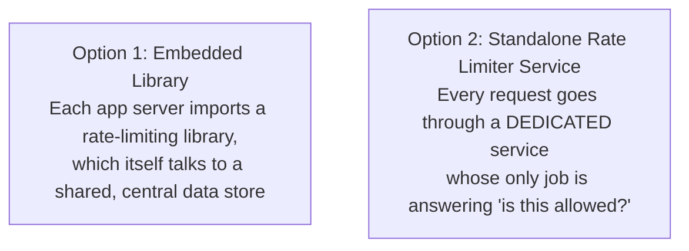

### If built as a standalone internal service
```
POST /rate-limit/check
Body: { client_id: "user_123", rule: "api_general" }

Response: { allowed: true, remaining: 42, reset_at: "2026-07-10T10:31:00Z" }
```

This design walkthrough builds it as a **standalone service** (Option 2), since it's the cleaner architecture to reason about and is exactly what a system design interview typically expects — but it's worth mentioning both options exist, with the embedded-library approach trading a network hop for slightly simpler infrastructure.

---

## 5. Step 4: The Core Challenge — Picking the Algorithm

This directly reuses the algorithms covered in Phase 1's Rate Limiting topic — the HLD-level decision is *which one* fits this system's specific needs.

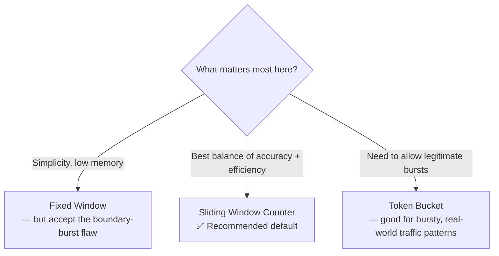

**For this design, Token Bucket is a strong default choice** — real traffic is naturally bursty (a user might fire off 5 requests in a second, then go quiet for a while), and Token Bucket accommodates that without being unnecessarily strict, while still enforcing a steady average rate over time.

### Token Bucket, applied concretely here
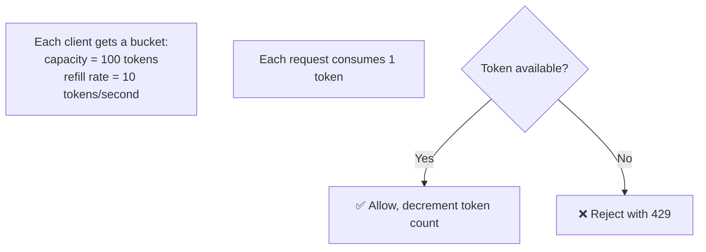

---

## 6. Step 5: Where Does the Rate Limiter Live?

This is an architectural decision with real tradeoffs — where exactly should this check happen?

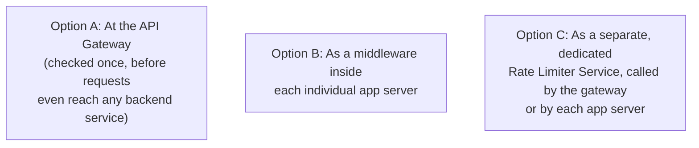

- **API Gateway (recall Phase 1's API Gateway topic):** the natural, preferred place for general-purpose, system-wide limits — it's the earliest point every request passes through, so rejecting there means abusive traffic never even reaches backend services or the database, saving resources across the board.
- **Dedicated Rate Limiter Service:** better when different services need very different, finely-tuned rules, or when you want the rate-limiting logic to evolve independently of the gateway itself.

**For this design, we'll combine both:** the API Gateway enforces it, but delegates the actual "is this allowed?" decision to a dedicated Rate Limiter Service — keeping the gateway itself simple, while centralizing all the rate-limiting logic and state in one purpose-built place.

---

## 7. Step 6: Data Storage — Where Do Counts Live?

This is the true heart of this design — the exact same distributed counting problem flagged in Phase 1's Rate Limiting topic, now being solved properly.

### Why a regular database won't work
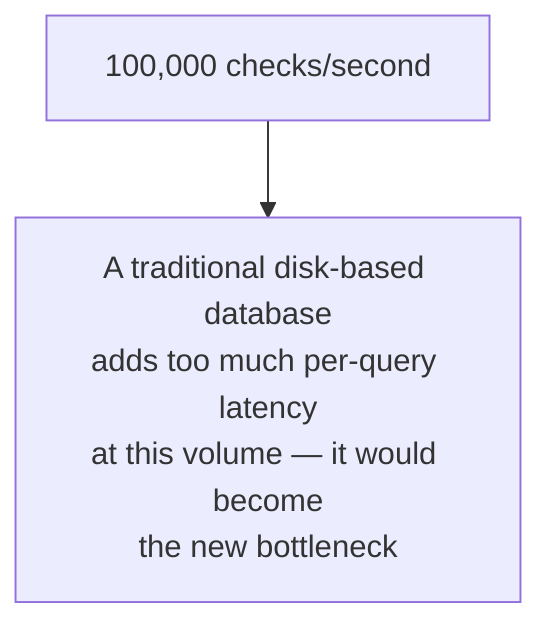

### Why local, per-server memory won't work
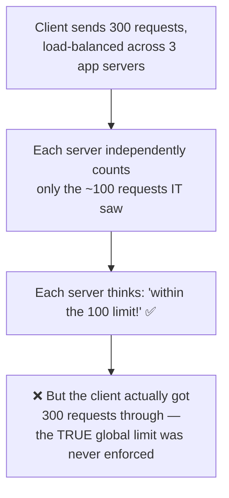

### The solution: a shared, in-memory store (Redis)
Since the total data size is small (≈1 GB, from Step 2) and it needs to support extremely fast reads/writes, an **in-memory key-value store like Redis** is the natural fit — every app server (or the dedicated Rate Limiter Service) reads and writes to the *same* shared counters, so the count is always globally accurate, regardless of which server handled which request.

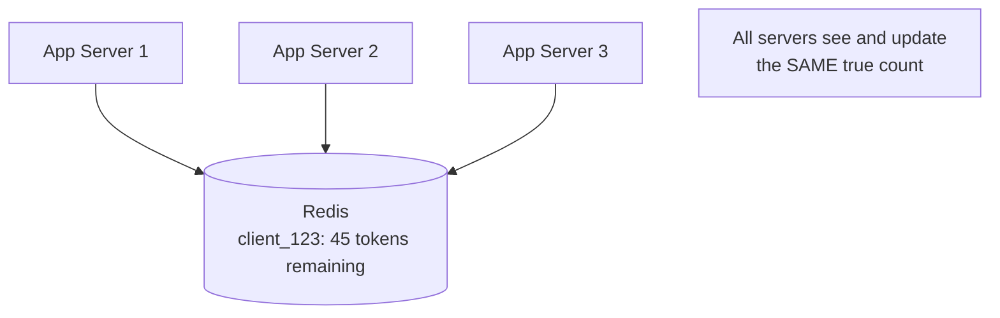

### The concurrency wrinkle: race conditions
Even with a shared store, if two requests for the same client arrive at nearly the same instant, a naive "read count, check it, then write the updated count" sequence can race — both requests might read the count *before* either one writes back the update, letting both slip through even if only one should have.

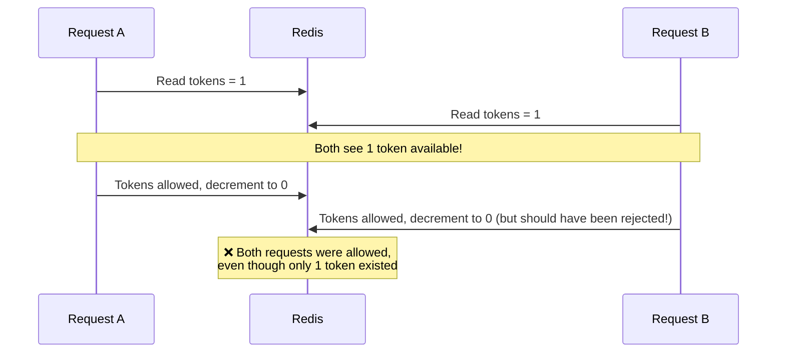

### The fix: atomic operations
Redis supports **atomic increment/decrement operations** — a single, indivisible command that reads and updates the value in one uninterruptible step, so no other request can sneak in between the read and the write.

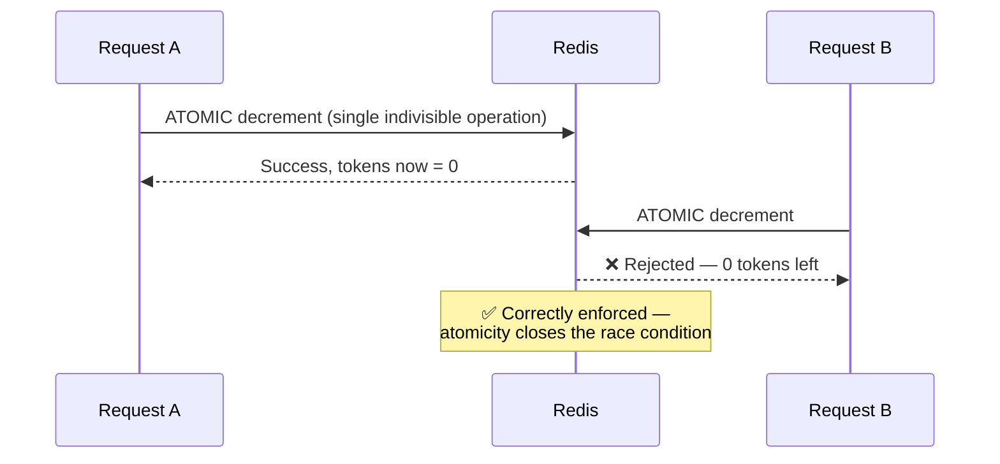

This is the same "shared counter with atomic increments" pattern flagged (without full detail) back in Phase 1's Rate Limiting topic — this is exactly the mechanism that makes it actually work correctly.

---

## 8. Step 7: High-Level Architecture

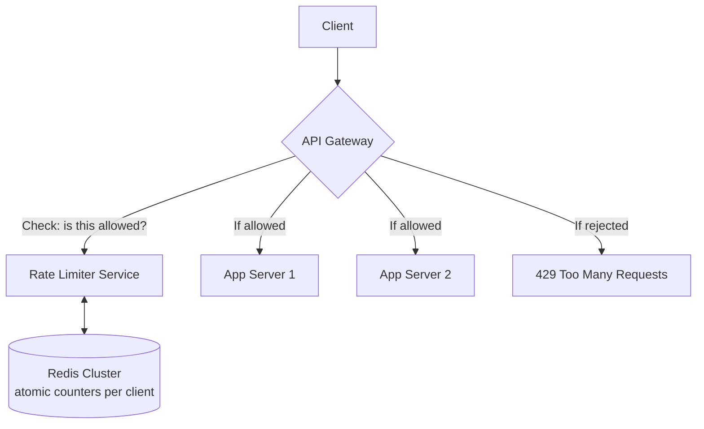

- **API Gateway** — the first thing every request touches; consults the Rate Limiter Service before forwarding anything onward.
- **Rate Limiter Service** — a small, focused, extremely fast service whose only job is running the chosen algorithm (Token Bucket) against Redis and returning allow/reject.
- **Redis Cluster** — the shared source of truth for all rate-limit counters, using atomic operations to stay correct under concurrent access.
- **App Servers** — never see rejected traffic at all; they only receive requests that already passed the check.

---

## 9. Step 8: The Request Flow in Detail

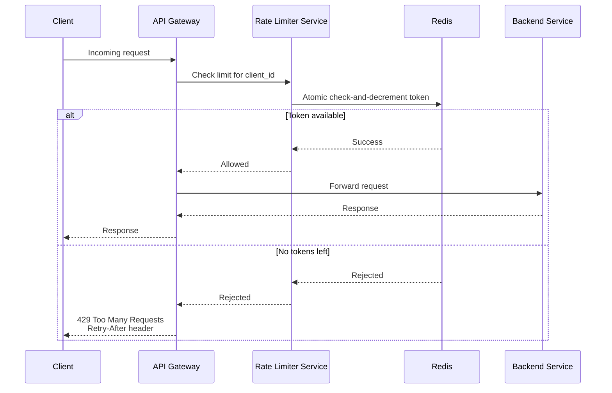

Notice: on rejection, the request **never even reaches the backend App Service** — this is the entire point, protecting downstream resources from ever seeing the excess traffic.

---

## 10. Step 9: Scaling the System

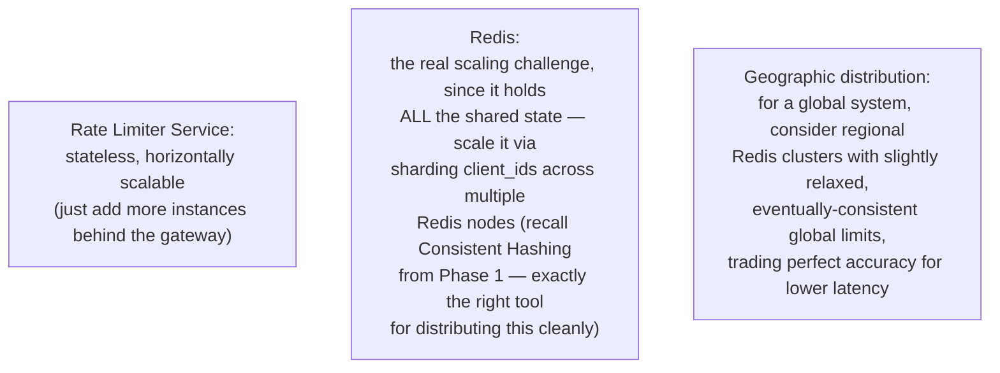

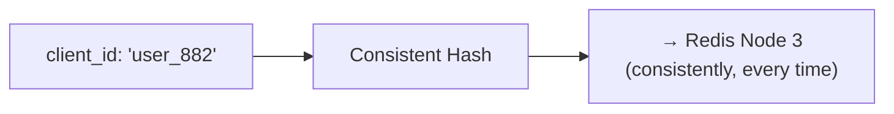

Sharding Redis by `client_id` using consistent hashing means each client's rate-limit state lives predictably on one specific node, keeping lookups fast and simple, while still allowing the overall system to scale out by adding more Redis nodes as the number of tracked clients grows.

---

## 11. Step 10: Handling Edge Cases

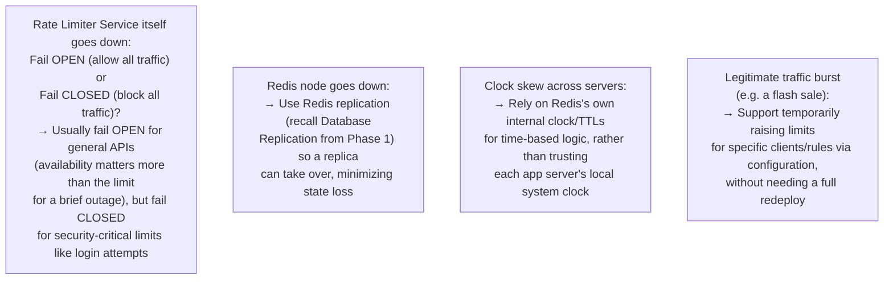

### The fail-open vs fail-closed decision, visualized
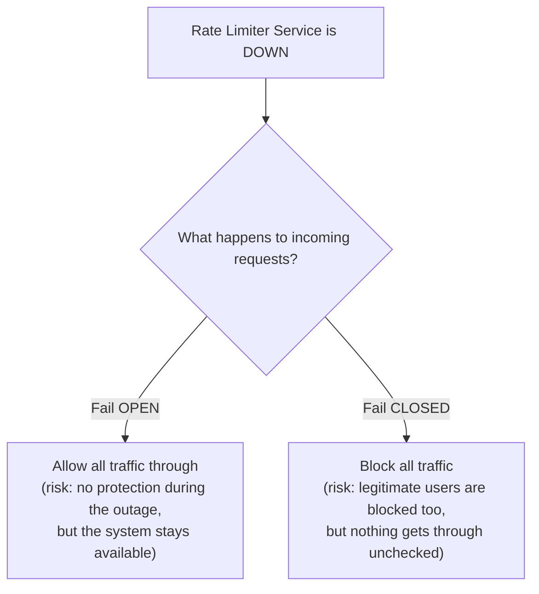

---

## 12. Full System, Put Together

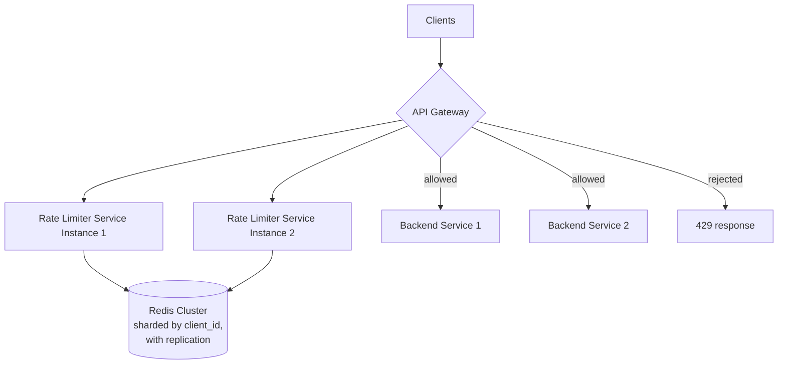

---

## 13. How to Walk Through This in an Interview

A strong end-to-end summary sounds like this:

> "I'd enforce rate limiting at the API Gateway, since it's the earliest point every request passes through — rejecting there means abusive traffic never even reaches backend services. The gateway would delegate the actual decision to a dedicated Rate Limiter Service using Token Bucket, since real traffic is naturally bursty and I want to allow short spikes without being overly strict. The hard part is storage: since this needs to handle around 100,000 checks per second with sub-millisecond latency, a regular database is too slow, and counting locally on each app server silently breaks the global limit — so I'd use a shared, in-memory store like Redis, with atomic increment/decrement operations specifically to avoid race conditions where two near-simultaneous requests both slip through. To scale Redis itself, I'd shard client rate-limit state across multiple Redis nodes using consistent hashing, and use replication so a node failure doesn't wipe out that state. I'd also explicitly decide on fail-open versus fail-closed behavior if the Rate Limiter Service itself goes down — generally fail-open for general API traffic to preserve availability, but fail-closed for something security-sensitive like login attempts, where letting unlimited traffic through during an outage would be dangerous."

That answer shows: you correctly identified the *real* hard problem (distributed, race-condition-safe counting, not the algorithm itself), you justified *where* in the architecture the check happens, you reused Phase 1 concepts (consistent hashing, replication) precisely where they apply, and you made an explicit, reasoned **fail-open vs fail-closed** call — a detail that often separates strong answers from average ones.

---

## 14. Quick Recall Cheat Sheet

```mermaid
mindmap
  root((Rate Limiter HLD))
    Key Insight
      Must be extremely fast - sits in front of every request
      Real hard problem: correct counting across many servers
    Algorithm
      Token Bucket - handles bursty real traffic well
    Where it lives
      API Gateway enforces it
      Delegates to a dedicated Rate Limiter Service
    Storage
      NOT a regular database - too slow
      NOT local per-server memory - breaks global count
      Shared in-memory store - Redis
      MUST use atomic operations to avoid race conditions
    Scaling
      Rate Limiter Service - stateless, horizontally scalable
      Redis - shard by client_id via consistent hashing
      Use replication for Redis fault tolerance
    Edge Cases
      Fail-open vs fail-closed when the limiter itself is down
      Support temporary limit overrides for legitimate bursts
```

| If you remember only 5 things |
|---|
| 1. The rate limiter must be extremely fast since it checks every single request — a regular database is too slow for this. |
| 2. Local, per-server counting silently breaks the limit; use a shared in-memory store like Redis so all servers see the same true count. |
| 3. Race conditions between near-simultaneous requests are the real danger — atomic increment/decrement operations in Redis close this gap. |
| 4. Enforce the check at the API Gateway (earliest point) so rejected traffic never reaches backend services, but delegate the decision logic to a dedicated Rate Limiter Service. |
| 5. Explicitly decide fail-open vs fail-closed if the rate limiter itself goes down — generally fail-open for general traffic, fail-closed for security-sensitive limits like login attempts. |

---

*This file is written in GitHub-flavored Markdown with Mermaid diagrams — it will render natively on GitHub, GitLab, and most modern Markdown viewers.*
