# HLD: Design a Basic Chat/Messaging System

*Phase 2 — High-Level Design. A zero-to-mastery, interview-style walkthrough.*

---

## Table of Contents
1. [What Are We Actually Building?](#1-what-are-we-actually-building)
2. [Step 1: Clarify Requirements](#2-step-1-clarify-requirements)
3. [Step 2: Capacity Estimation](#3-step-2-capacity-estimation)
4. [Step 3: The Core Challenge — Real-Time Delivery](#4-step-3-the-core-challenge--real-time-delivery)
5. [Step 4: How the Server Knows Where to Send a Message](#5-step-4-how-the-server-knows-where-to-send-a-message)
6. [Step 5: Database Design](#6-step-5-database-design)
7. [Step 6: High-Level Architecture](#7-step-6-high-level-architecture)
8. [Step 7: The Message Send Flow, in Detail](#8-step-7-the-message-send-flow-in-detail)
9. [Step 8: Handling Offline Users](#9-step-8-handling-offline-users)
10. [Step 9: Group Chats](#10-step-9-group-chats)
11. [Step 10: Message Ordering & Delivery Guarantees](#11-step-10-message-ordering--delivery-guarantees)
12. [Step 11: Scaling the System](#12-step-11-scaling-the-system)
13. [Step 12: Extra Features (Read Receipts, Typing Indicators)](#13-step-12-extra-features-read-receipts-typing-indicators)
14. [Full System, Put Together](#14-full-system-put-together)
15. [How to Walk Through This in an Interview](#15-how-to-walk-through-this-in-an-interview)
16. [Quick Recall Cheat Sheet](#16-quick-recall-cheat-sheet)

---

## 1. What Are We Actually Building?

A chat system lets users send messages to each other (one-to-one or in groups) and have them delivered **in near real-time** — this "real-time" requirement is what makes this design meaningfully different from everything covered so far. Every previous HLD topic followed a normal request-response pattern (client asks, server answers, done). A chat system needs the **server to push data to the client**, even when the client didn't just ask for anything — this single difference drives most of this design.

```mermaid
flowchart LR
    A[User A types "Hi!"] --> B[Server] --> C[User B's phone,<br/>instantly, without refreshing]
```

---

## 2. Step 1: Clarify Requirements

### Functional Requirements
- Send and receive **one-to-one** messages in near real-time.
- Support **group chats** (multiple participants).
- Messages should be **persisted** — a user can close the app and see message history later.
- Show whether a message was delivered / read (bonus).
- Show whether a user is currently online (bonus).

### Non-Functional Requirements
- **Low latency** — a message should arrive in well under a second for a good user experience.
- **High availability** — a chat app being down, even briefly, is highly visible and disruptive to users.
- **Consistency of message order** — messages within a single conversation should appear in the same order for everyone (recall the Concurrency Control topic's isolation concepts, applied conceptually here to message ordering).
- **Durability** — a message, once sent, must not be lost, even if the recipient is offline or a server crashes mid-delivery.

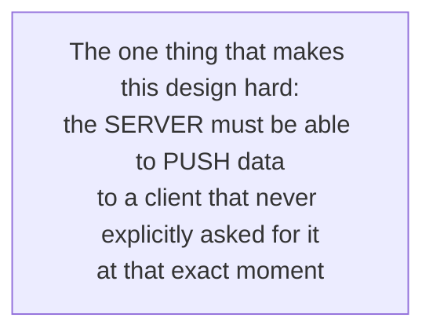

---

## 3. Step 2: Capacity Estimation

### Assumptions (reasonable, made-up numbers for this walkthrough)
- 50 million daily active users.
- Each user sends an average of 40 messages/day.

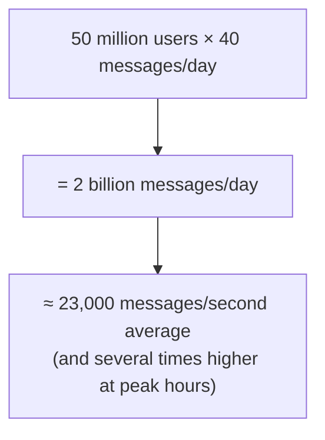

### Storage estimation
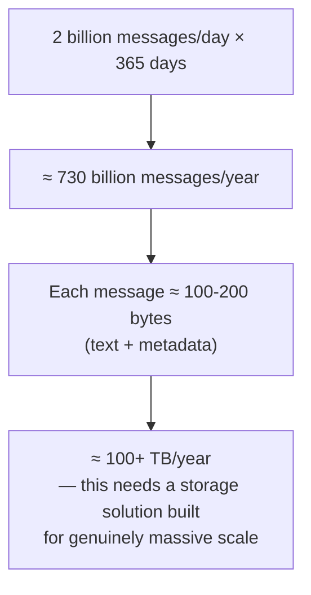

### Concurrent connections
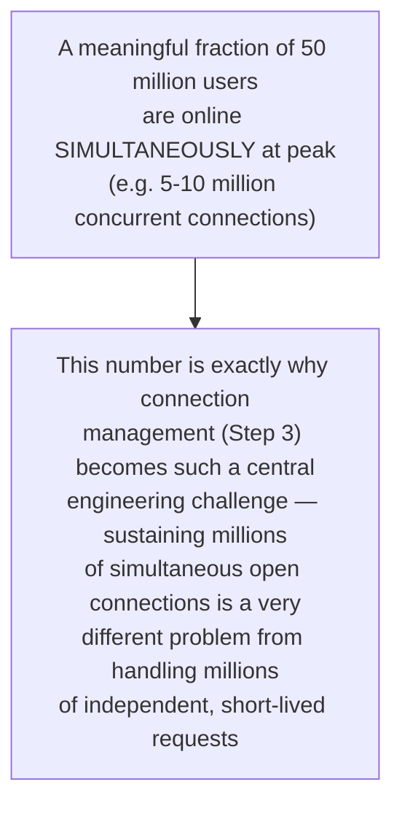

---

## 4. Step 3: The Core Challenge — Real-Time Delivery

Every previous system in this series worked on a simple request-response model: client asks, server responds, connection closes. A chat system breaks that model — the server needs to notify User B **the instant** User A sends a message, without User B's device having to constantly ask "any new messages? any new messages? any new messages?"

### Approach 1: Polling (the naive starting point)
The client repeatedly asks the server "anything new?" every few seconds.

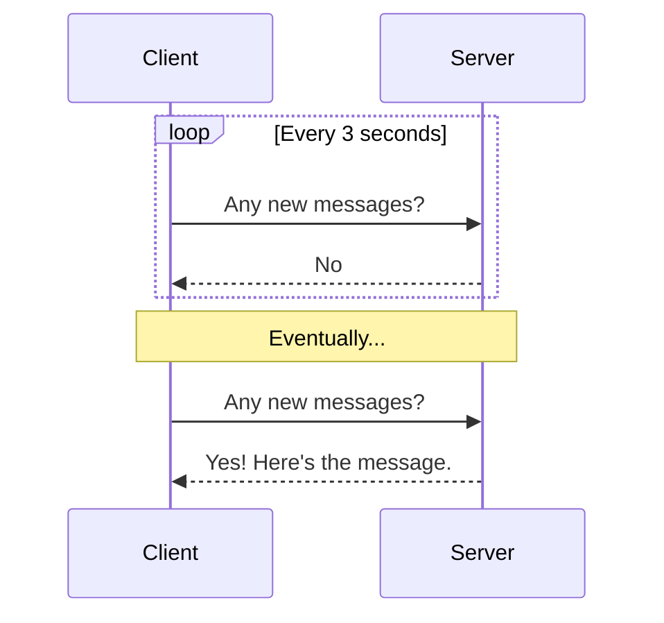
- **Problem:** wastes massive resources on empty "no, nothing new" responses, and messages are delayed by up to the polling interval — not truly real-time, and doesn't scale well with millions of users all polling constantly.

### Approach 2: Long Polling (an improvement)
The client asks the server, but the server **holds the request open** without responding until a new message actually arrives (or a timeout is reached), then the client immediately re-opens a new request.

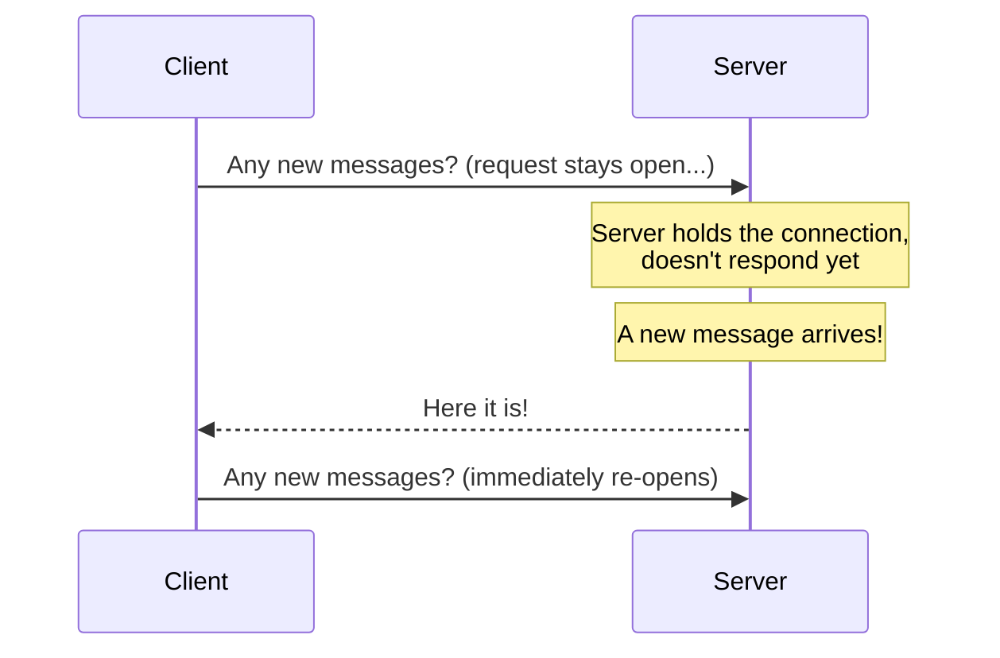
- **Better:** far less wasted "no" traffic, and lower delivery latency. **Still not ideal:** each request/response cycle carries HTTP overhead, and the client must constantly reconnect.

### Approach 3: WebSockets (the standard solution)
A **WebSocket** is a persistent, two-way connection between client and server, established once and kept open — either side can send data to the other **at any time**, without needing to ask permission or re-establish the connection.

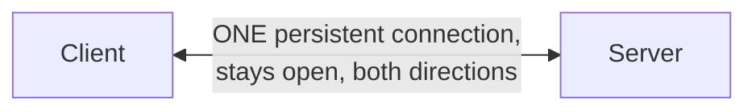

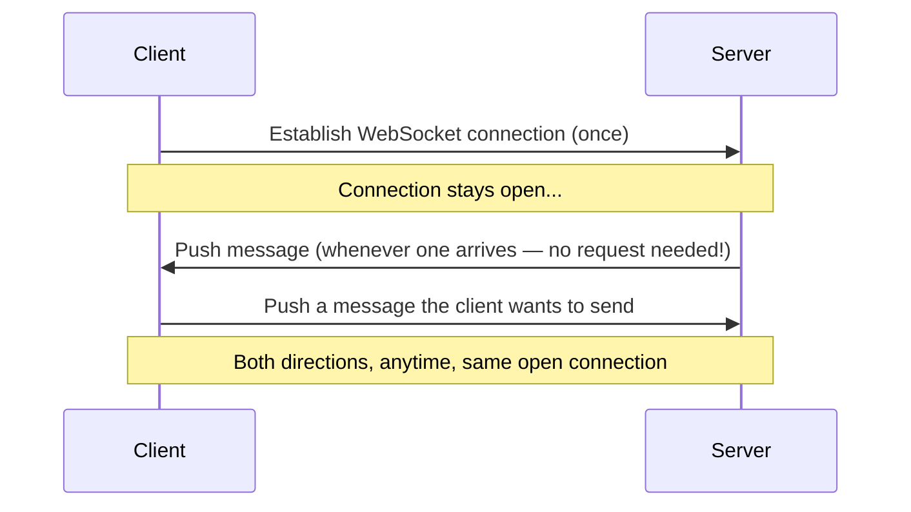
- **This is the standard, correct approach for real-time chat** — it eliminates the polling overhead entirely and delivers messages the instant they're available, since the server can push directly rather than waiting to be asked.

### Comparison

| Approach | Latency | Server Load | Real-time? |
|---|---|---|---|
| Polling | High (up to poll interval) | Very high (many empty checks) | No |
| Long Polling | Medium | Medium | Mostly |
| WebSockets | Very low | Low (no repeated re-connecting) | Yes |

---

## 5. Step 4: How the Server Knows Where to Send a Message

Here's the crucial architectural wrinkle: with millions of users and multiple app servers (recall horizontal scaling), User A's WebSocket connection might be held open on **Server 1**, while User B's is held open on **Server 3**. When User A sends a message for User B, Server 1 has no direct way of knowing which server User B is even connected to.

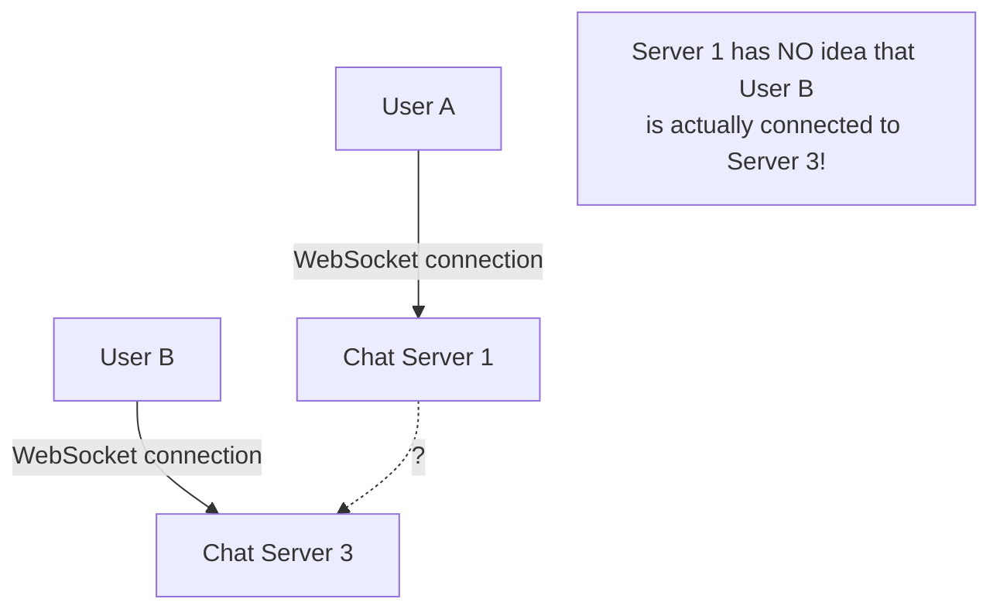

### The fix: a connection registry
A shared, fast lookup service (built on the same in-memory-store principle as the Rate Limiter's Redis usage) tracks **which server each user is currently connected to**.

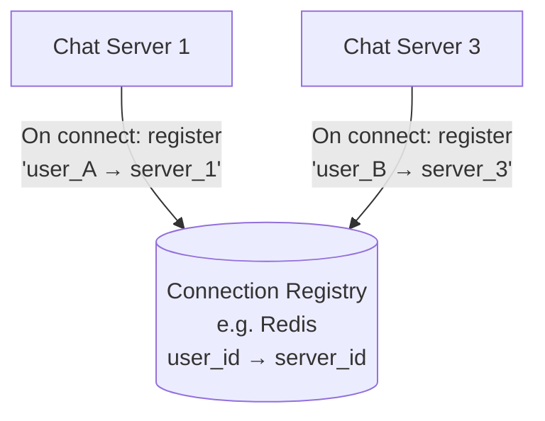

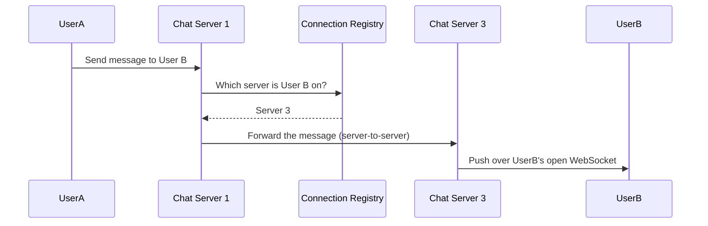

This registry lookup, plus a server-to-server forwarding hop, is exactly what solves the "how does Server 1 reach a user connected to a completely different server" problem — without it, this system simply couldn't work once it's scaled beyond a single server.

---

## 6. Step 5: Database Design

### Two main entities

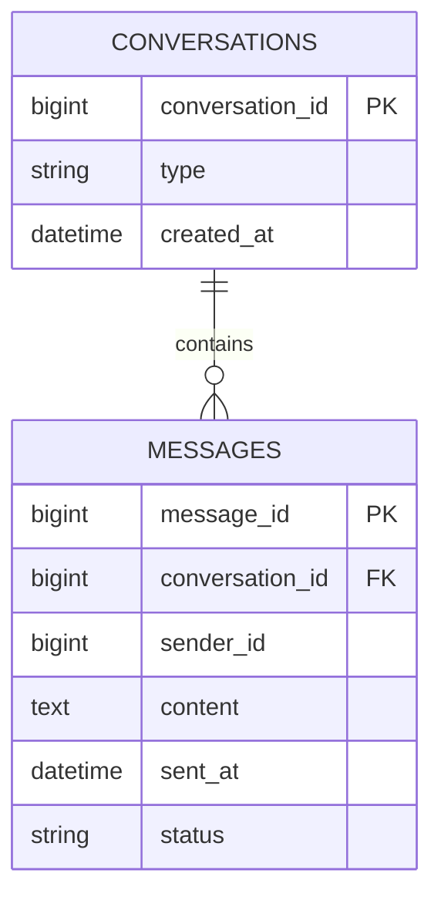

- **conversations** — represents a 1:1 chat or a group; `type` distinguishes between them.
- **messages** — every individual message, linked to its conversation.

### Which type of database?
The access pattern here is heavily: **"give me the last N messages for conversation X, in order."** This is a read pattern that benefits enormously from data being naturally grouped and sorted by conversation — a classic fit for a **wide-column NoSQL store** (recalling the SQL vs NoSQL topic), where messages for one conversation are stored physically together and pre-sorted by time.

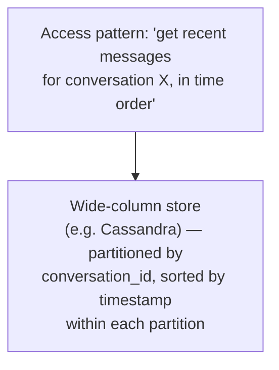

- **Partition key:** `conversation_id` — ensures all messages for one conversation live together, physically.
- **Sort key:** `sent_at` (or a similar time-ordered ID) — keeps messages pre-sorted, so "get the last 50 messages" is a fast, sequential read rather than a search.

---

## 7. Step 6: High-Level Architecture

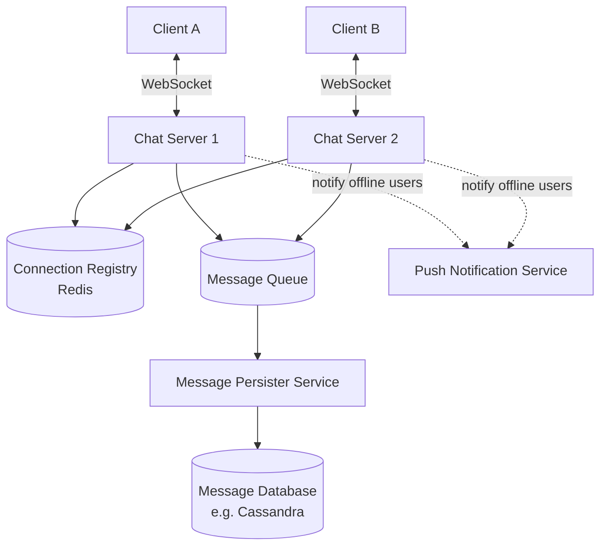

- **Chat Servers** — each holds many open WebSocket connections; forwards messages using the Connection Registry.
- **Connection Registry** — the "which user is on which server" lookup from Step 4.
- **Message Queue** — decouples the fast, real-time delivery path from the (slightly slower) job of durably saving every message to the database — directly reusing the Message Queues topic's core idea.
- **Message Persister Service** — consumes from the queue and writes messages to the database, ensuring durability without slowing down real-time delivery.
- **Push Notification Service** — handles offline delivery (Step 8).

---

## 8. Step 7: The Message Send Flow, in Detail

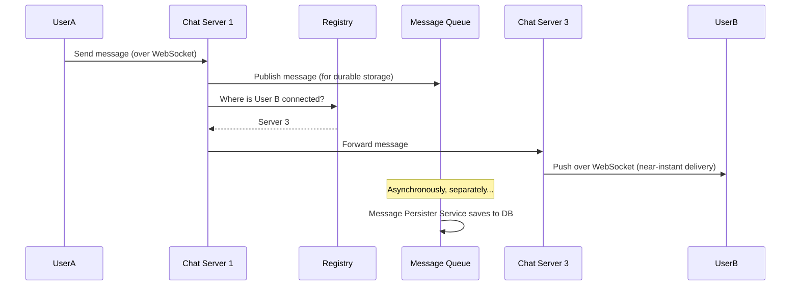

Notice the **delivery path and the durability path happen in parallel**, not one-after-the-other — User B gets the message immediately, while saving it to the database for permanent history happens independently, exactly mirroring the "don't block the hot path on non-critical work" pattern from the URL Shortener's analytics design.

---

## 9. Step 8: Handling Offline Users

What if User B isn't currently connected at all (app closed, phone off)?

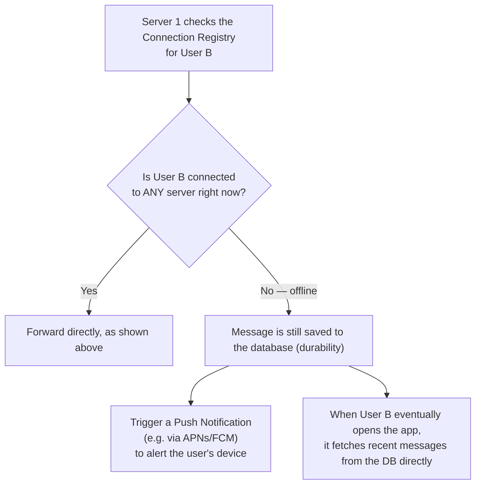

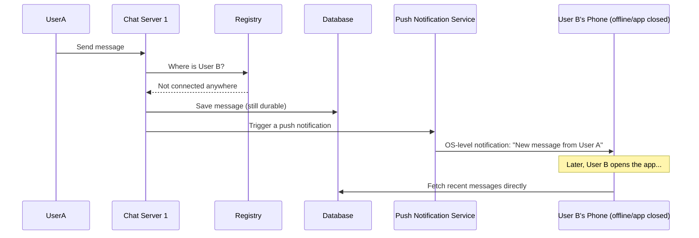

This is precisely why **durability (saving to the database) happens regardless of whether the recipient is currently online** — the real-time WebSocket push is just an optimization for the common case; the database is the actual, reliable source of truth.

---

## 10. Step 9: Group Chats

Group chats extend the same core design, with one key difference: a single message needs to reach **multiple** recipients, not just one.

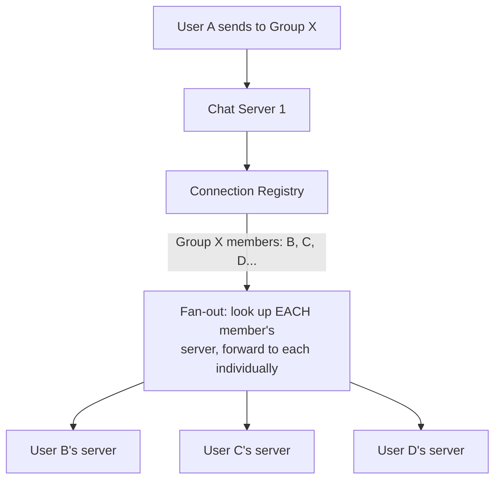

- The database's `conversations` table (Step 5) already supports this — a group conversation simply has more than 2 participants linked to it.
- **The fan-out itself is the new cost:** a message to a 500-person group needs to be delivered 500 times, not once — for very large groups (e.g., broadcast channels with millions of subscribers), this fan-out step becomes its own scaling challenge, sometimes handled by a dedicated fan-out service or by having recipients "pull" from a shared feed rather than every single message being individually pushed.

---

## 11. Step 10: Message Ordering & Delivery Guarantees

### Ordering
Messages within a single conversation must appear in the same order for every participant. Using a **time-ordered ID** (e.g., a Snowflake-style ID, or simply the database's own naturally increasing sort key from Step 5) as the sort key ensures a consistent, agreed-upon order, even if messages arrive at the server in a very slightly different sequence than they were sent.

### Delivery guarantees
This directly reuses the Delivery Guarantees concept from the Message Queues topic:

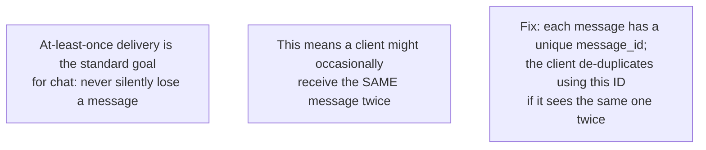

- **Message status tracking** (sent → delivered → read) uses the `status` field from the `messages` table, updated as acknowledgments come back from the recipient's client — this is also how read receipts (Step 12) are implemented.

---

## 12. Step 11: Scaling the System

```mermaid
flowchart TB
    A["Chat Servers:<br/>horizontally scalable, but each server<br/>has a practical LIMIT on how many<br/>concurrent WebSocket connections<br/>it can hold open at once — this caps<br/>how many users one instance can serve"]
    B["Connection Registry (Redis):<br/>shard by user_id (consistent hashing)<br/>as the number of concurrent users grows"]
    C["Message Database:<br/>shard by conversation_id, so all of one<br/>conversation's messages stay together<br/>on one shard — directly reusing the<br/>Sharding topic's strategy selection logic"]
    D["Message Queue:<br/>partition by conversation_id too, to preserve<br/>ordering guarantees within each conversation<br/>while still processing many conversations<br/>in parallel across queue partitions"]
```

```mermaid
flowchart LR
    Small["Small scale:<br/>a handful of chat servers,<br/>single DB"] --> Medium["Medium scale:<br/>+ connection registry,<br/>+ message queue for durability"] --> Large["Massive scale:<br/>+ sharded DB by conversation_id,<br/>+ sharded connection registry,<br/>+ dedicated fan-out handling for large groups"]
```

---

## 13. Step 12: Extra Features (Read Receipts, Typing Indicators)

These are lightweight, ephemeral signals — worth designing differently from actual messages, since they don't need the same durability guarantees.

```mermaid
flowchart TB
    A["Typing indicators:<br/>'User A is typing...'<br/>→ sent directly over the WebSocket,<br/>NOT persisted to the database at all<br/>(it's meaningless a few seconds later)"]
    B["Read receipts:<br/>'User B has read this message'<br/>→ sent as a lightweight event over<br/>the WebSocket, and DOES update the<br/>message's status field in the database<br/>(since this state should persist)"]
```

The key distinction: typing indicators are pure, throwaway, real-time signals (no database write needed at all), while read receipts are a small but genuine state change that's worth persisting — this is a useful general principle: not everything flowing through a real-time system needs the same durability treatment.

---

## 14. Full System, Put Together

```mermaid
flowchart TB
    ClientA[Client A] <-->|WebSocket| CS1[Chat Server 1]
    ClientB[Client B] <-->|WebSocket| CS2[Chat Server 2]
    CS1 & CS2 --> Registry[("Connection Registry<br/>sharded Redis")]
    CS1 & CS2 --> Queue[("Message Queue<br/>partitioned by conversation_id")]
    Queue --> Persister[Message Persister]
    Persister --> DB[(Message DB<br/>sharded by conversation_id)]
    CS1 & CS2 -.offline user.-> Push[Push Notification Service]
    Push --> Mobile[User's Mobile OS<br/>Notification]
```

---

## 15. How to Walk Through This in an Interview

A strong end-to-end summary sounds like this:

> "The core challenge here is that this needs real-time, server-initiated delivery, unlike a typical request-response system — so I'd use WebSockets to maintain a persistent, two-way connection with each connected client, rather than polling. Since users connect to different chat servers behind a load balancer, I'd maintain a shared Connection Registry in Redis mapping each user to the specific server they're currently connected to, so when User A sends a message, that server can look up where User B actually is and forward it there. For durability, I wouldn't write directly to the database on the hot delivery path — I'd publish to a message queue and have a separate persister service save messages asynchronously, so delivery stays fast regardless of database load. If the recipient is offline, the message still gets saved to the database as the source of truth, and I'd trigger a push notification instead of a WebSocket push. For storage, since the main access pattern is 'get recent messages for a conversation in order,' I'd use a wide-column store partitioned by conversation_id and sorted by timestamp, which fits that pattern much better than a relational table would. For group chats, sending a message means fanning it out to each member's respective server individually, which becomes its own scaling concern for very large groups. And I'd design for at-least-once delivery with client-side deduplication by message ID, rather than chasing a perfect exactly-once guarantee."

That answer shows: you correctly identified *why* this problem is fundamentally different (server push, not request-response), you solved the *actual* hard distributed-systems problem (routing a message to the right server), and you reused concepts from Message Queues, Sharding, and Delivery Guarantees precisely where they fit — rather than treating this as an entirely new set of ideas.

---

## 16. Quick Recall Cheat Sheet

```mermaid
mindmap
  root((Chat System HLD))
    Key Insight
      Server must PUSH data, not just respond
      This breaks the normal request-response model
    Real-time Delivery
      Polling - wasteful, slow
      Long Polling - better, still overhead
      WebSockets - the standard solution
    The Hard Problem
      Users on DIFFERENT chat servers
      Connection Registry maps user_id to server_id
      Server-to-server forwarding to reach the right user
    Storage
      Wide-column store, partitioned by conversation_id
      Sorted by timestamp within each partition
    Durability
      Message Queue decouples delivery from persistence
      Offline users: still saved to DB + push notification
    Group Chats
      Fan-out to each member's server
      Large groups = its own scaling challenge
    Delivery
      At-least-once + client-side dedup by message_id
```

| If you remember only 5 things |
|---|
| 1. Chat systems need the server to PUSH messages to clients — WebSockets are the standard solution, replacing inefficient polling. |
| 2. The core hard problem: users connect to different chat servers, so a shared Connection Registry (Redis) maps each user to their current server for message routing. |
| 3. Don't write messages to the database on the real-time delivery path — use a message queue to decouple fast delivery from durable persistence. |
| 4. Offline users still get their message saved to the database (source of truth) and receive a push notification instead of a WebSocket push. |
| 5. Message storage fits a wide-column NoSQL store partitioned by conversation_id and sorted by time — matching the "get recent messages in order" access pattern much better than a relational table. |

---

*This file is written in GitHub-flavored Markdown with Mermaid diagrams — it will render natively on GitHub, GitLab, and most modern Markdown viewers.*
