# HLD: Design a Pastebin

*Phase 2 — High-Level Design. A zero-to-mastery, interview-style walkthrough.*

---

## Table of Contents
1. [What Are We Actually Building?](#1-what-are-we-actually-building)
2. [Step 1: Clarify Requirements](#2-step-1-clarify-requirements)
3. [Step 2: Capacity Estimation](#3-step-2-capacity-estimation)
4. [Step 3: API Design](#4-step-3-api-design)
5. [Step 4: The Core Challenge — Where Does the Actual Text Live?](#5-step-4-the-core-challenge--where-does-the-actual-text-live)
6. [Step 5: Generating the Paste ID](#6-step-5-generating-the-paste-id)
7. [Step 6: Database & Storage Design](#7-step-6-database--storage-design)
8. [Step 7: High-Level Architecture](#8-step-7-high-level-architecture)
9. [Step 8: The Read & Write Flows in Detail](#9-step-8-the-read--write-flows-in-detail)
10. [Step 9: Handling Expiration](#10-step-9-handling-expiration)
11. [Step 10: Scaling the System](#11-step-10-scaling-the-system)
12. [Step 11: Handling Edge Cases](#12-step-11-handling-edge-cases)
13. [Full System, Put Together](#13-full-system-put-together)
14. [How to Walk Through This in an Interview](#14-how-to-walk-through-this-in-an-interview)
15. [Quick Recall Cheat Sheet](#15-quick-recall-cheat-sheet)

---

## 1. What Are We Actually Building?

A **Pastebin** lets a user paste a block of text (code, logs, notes), and get back a short, shareable link that anyone can visit to view that exact text later.

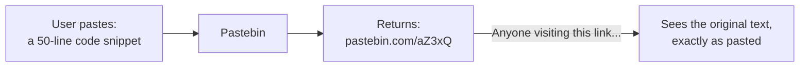

At first glance, this looks almost identical to the URL Shortener design — and structurally, it genuinely is very similar (short-code generation, redirect-style lookup). The one meaningful difference, and the reason this deserves its own design walkthrough, is captured in one sentence: **a URL shortener stores a tiny string (a URL); a pastebin stores an arbitrarily large blob of text.** That single difference — data *size* — changes several real decisions, especially around storage (Step 4).

---

## 2. Step 1: Clarify Requirements

### Functional Requirements
- Given a block of text, generate a **unique, shareable link**.
- Given that link, **retrieve and display** the original text.
- Support an **expiration time** for pastes (e.g., "delete after 7 days," or "burn after reading").
- (Optional/bonus) Support **syntax highlighting** for code (a client-side/rendering concern, not really a backend design challenge).
- (Optional/bonus) Allow **private pastes** (only accessible with the link, never listed publicly) vs fully public/listed pastes.

### Non-Functional Requirements
- **Read-heavy**, similar to the URL Shortener — a paste is created once but can be viewed many times (e.g., a shared error log viewed by an entire team).
- **Durability** — a paste, once created, shouldn't just vanish (barring explicit expiration).
- **Handle a wide range of paste sizes** — from a one-line snippet to potentially a multi-megabyte log dump; the design needs to comfortably support both without one extreme breaking the system.
- **Low latency reads**, especially for popular/frequently-shared pastes.

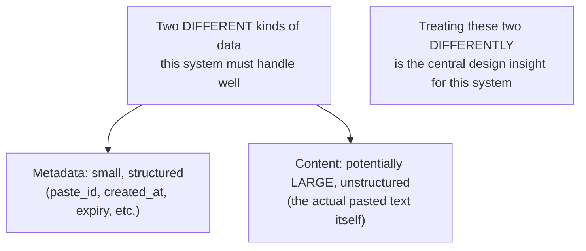

---

## 3. Step 2: Capacity Estimation

### Assumptions (reasonable, made-up numbers for this walkthrough)
- 1 million new pastes created per day.
- Average paste size: 10 KB (ranging from tiny snippets to much larger logs).
- Read:Write ratio of 10:1 (pastes are shared and viewed several times, though less viral than a typical shortened URL).

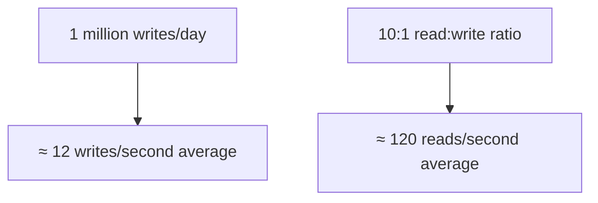

### Storage estimation
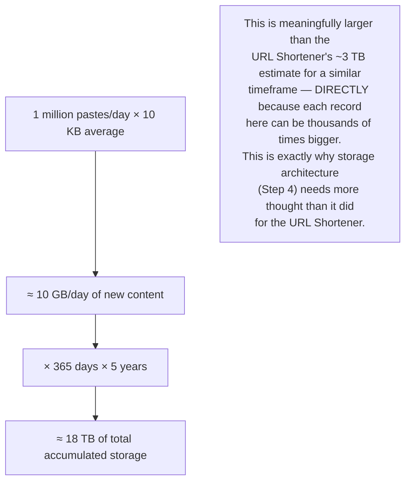

---

## 4. Step 3: API Design

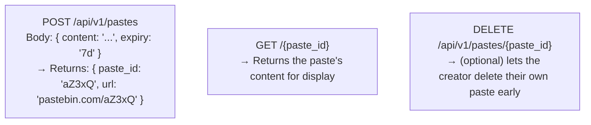

Following the REST principles from Phase 1: `POST` for creation (not idempotent — resubmitting creates a new paste), `GET` for retrieval (safe, doesn't modify anything), `DELETE` for removal.

---

## 5. Step 4: The Core Challenge — Where Does the Actual Text Live?

This is the one genuinely new problem this design introduces, compared to the URL Shortener. Recall the Database Indexing topic's principle: databases are optimized for structured, relatively small rows — cramming a multi-megabyte text blob directly into a regular database row causes real problems.

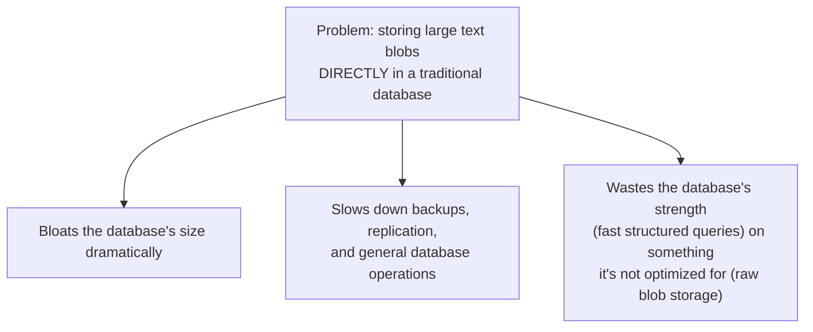

### The solution: separate metadata from content
Split the data into two categories, each stored in the system best suited for it — directly echoing the **Vertical Partitioning** idea from the Sharding/Partitioning topic (splitting by *what kind* of data it is, not just spreading the same kind of data across servers).

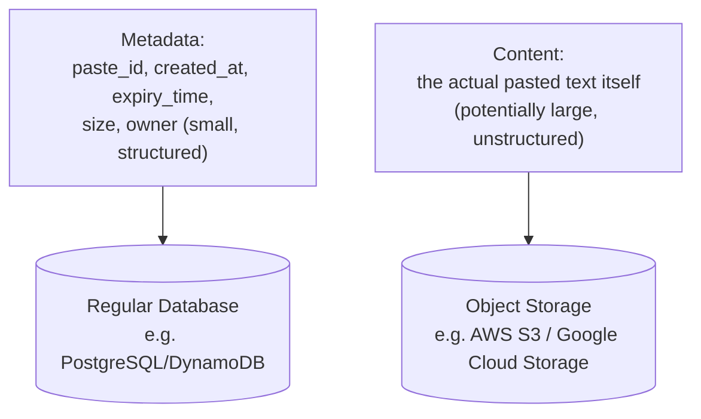

- **Metadata** (small, structured, frequently queried) → a regular database, exactly like the URL Shortener's approach.
- **Content** (the actual text, which can be large) → **object storage** (like S3), which is specifically built to store and serve large blobs of data efficiently and cheaply, at virtually unlimited scale.

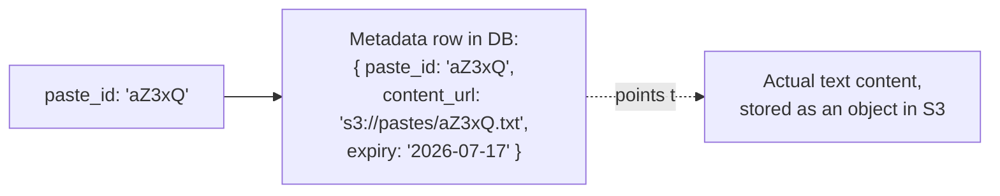

This pattern — small structured metadata in a database, large raw content in object storage, with the database row simply holding a **reference/pointer** to the object — is extremely common in real-world system design whenever content size varies widely (this same idea applies to systems storing images, videos, or file uploads too).

---

## 6. Step 5: Generating the Paste ID

This part is functionally identical to the URL Shortener's core challenge — reusing that solution directly rather than reinventing it.

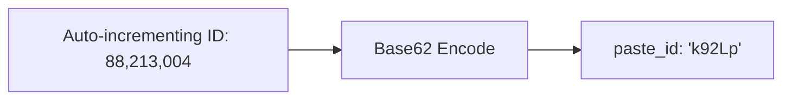

- **Base62 encoding of an auto-incrementing ID** — same reasoning as before: no collision-handling needed (every ID is unique by construction), and a 6-7 character code comfortably covers billions of possible pastes.
- **Distributed ID generation** — same solution as before too: app servers request pre-allocated ID ranges, rather than coordinating on every single paste creation.

*(Full reasoning for why this approach beats hashing is covered in the URL Shortener HLD — worth a quick re-read if you want the deeper "why," since it applies identically here.)*

---

## 7. Step 6: Database & Storage Design

### Metadata table

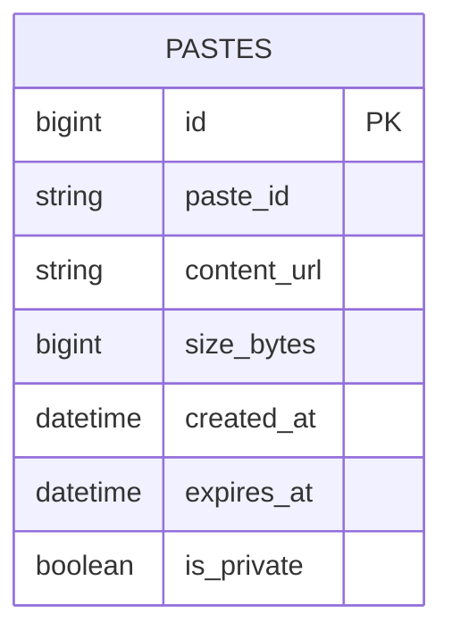

| Column | Purpose |
|---|---|
| `paste_id` | The short, public-facing ID (indexed for fast lookup) |
| `content_url` | Pointer to where the actual text lives in object storage |
| `size_bytes` | Useful for enforcing size limits and capacity planning |
| `expires_at` | When this paste should be deleted (Step 9) |
| `is_private` | Whether this paste is discoverable/listed, or link-only |

### Why object storage specifically for the content
Object storage (like S3) is purpose-built for exactly this kind of data: it's cheap at scale, handles arbitrarily large files well, and importantly, many object storage services can **serve content directly to users** (sometimes via a CDN in front of them, recalling the CDN Basics topic) — meaning the app server doesn't even need to be the one streaming a large paste's content back to the client; it can just redirect to the object storage URL directly.

---

## 8. Step 7: High-Level Architecture

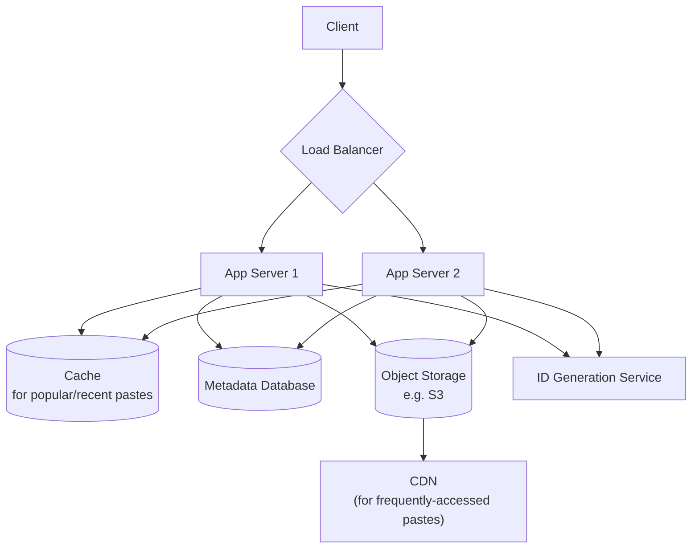

- **App Servers** — handle create/read requests, coordinate between the metadata DB and object storage.
- **Metadata Database** — stores the small, structured record per paste.
- **Object Storage** — stores the actual pasted content.
- **Cache** — caches metadata *and* frequently-accessed small-to-medium paste content, to avoid repeated object storage round-trips for popular pastes.
- **CDN** — for very popular, publicly-shared pastes (e.g., a widely-circulated error log), a CDN caches the content close to users globally, exactly as covered in the CDN Basics topic.

---

## 9. Step 8: The Read & Write Flows in Detail

### Write (creating a paste)

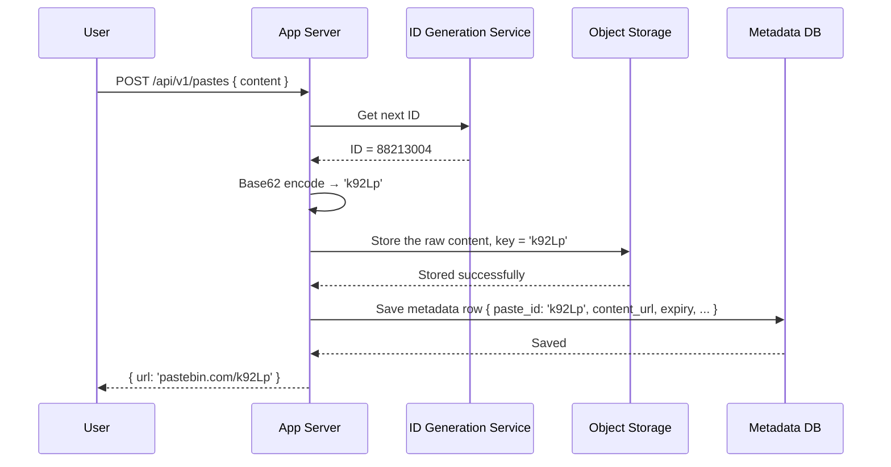

### Read (viewing a paste)

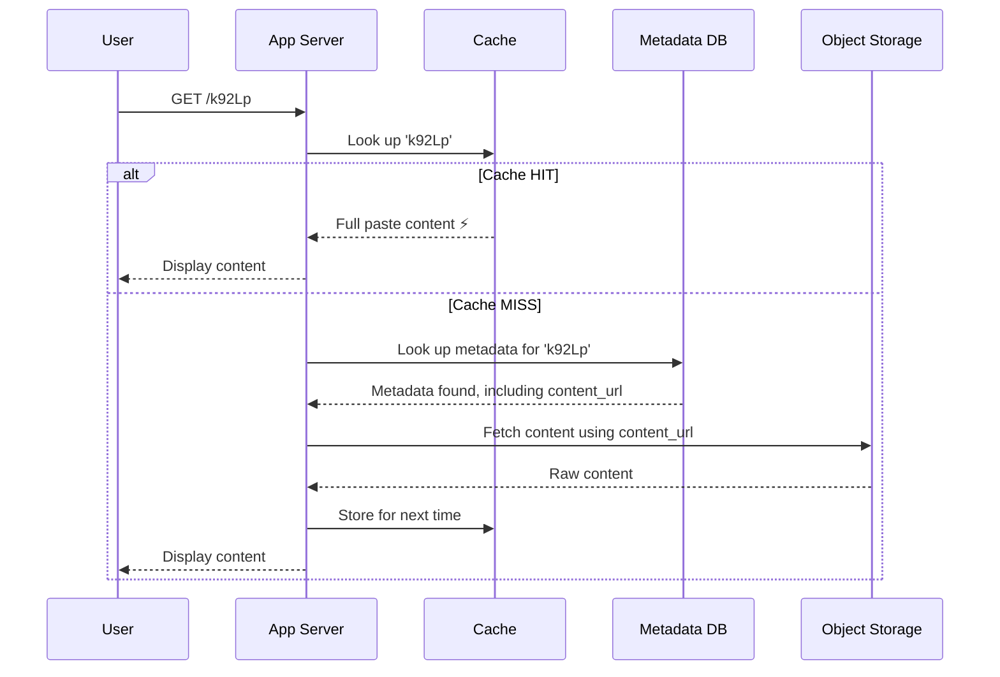

Notice the read flow requires **two lookups on a cache miss** (metadata DB, then object storage) — this two-hop cost is precisely why caching matters so much here, and why very popular pastes specifically benefit from a CDN sitting in front of the object storage layer entirely, bypassing the app server for those hits altogether.

---

## 10. Step 9: Handling Expiration

Recall: a paste can have an expiry time (e.g., "delete after 7 days," or the more extreme "burn after reading" — delete immediately after the first view).

### Approach 1: Lazy deletion (check on read)
When a paste is requested, check if it's expired before returning it.

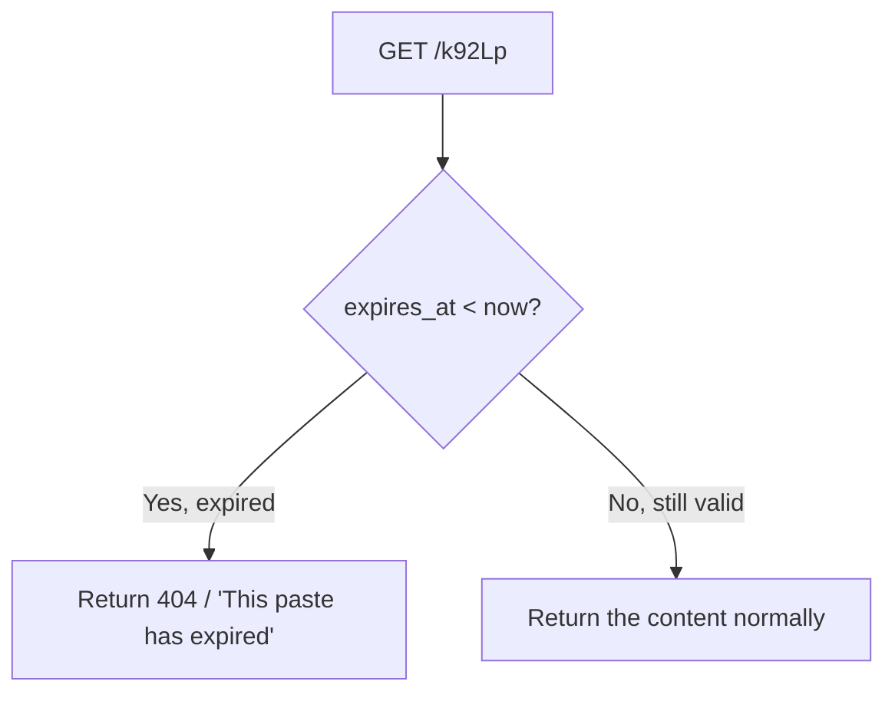
- **Problem:** an expired paste's data still sits in storage indefinitely, wasting space, unless something else eventually cleans it up.

### Approach 2: Active/background deletion (a cleanup job)
A separate background process periodically scans for expired pastes and deletes both the metadata row and the actual content from object storage.

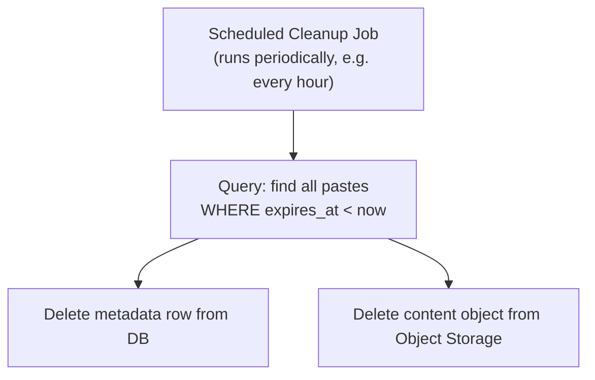

**Best practice: use both together** — lazy deletion ensures an expired paste is never accidentally served even if the cleanup job hasn't run yet, while the background job ensures storage is actually reclaimed over time, rather than accumulating forever.

### "Burn after reading" — a special case
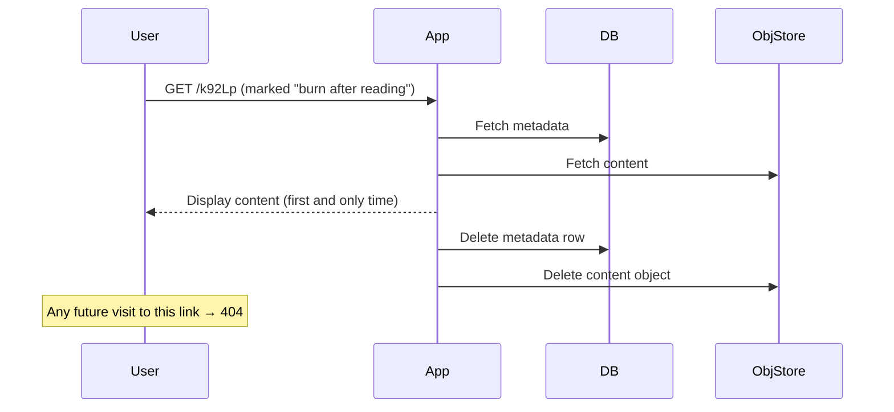

---

## 11. Step 10: Scaling the System

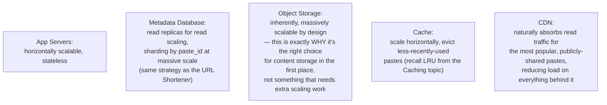

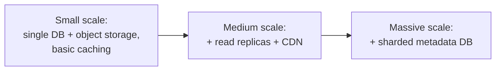

---

## 12. Step 11: Handling Edge Cases

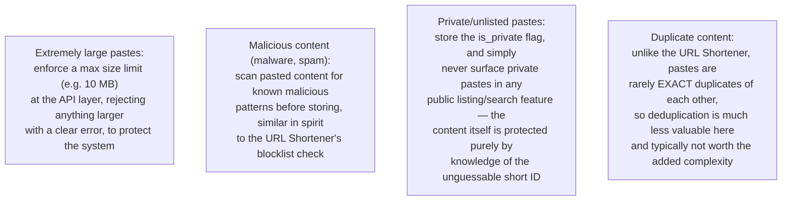

---

## 13. Full System, Put Together

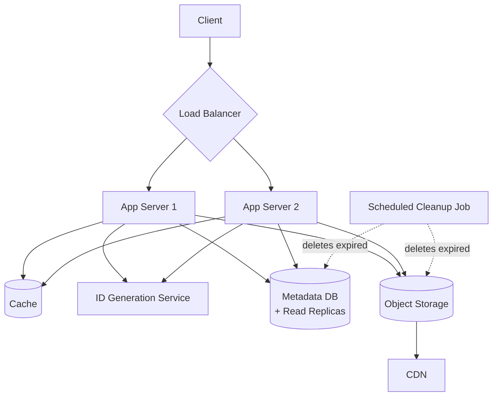

---

## 14. How to Walk Through This in an Interview

A strong end-to-end summary sounds like this:

> "This is structurally similar to a URL Shortener — I'd reuse the same approach for generating a short paste ID: Base62-encoding an auto-incrementing ID, with pre-allocated ID ranges across app servers to avoid coordination overhead. The key difference is data size — a paste can be a large text blob, not a tiny URL string, so I wouldn't store the actual content directly in the database. I'd split the data: a small metadata row in a regular database, referencing the actual content stored in object storage like S3, which is built specifically to handle large blobs efficiently and cheaply at scale. For reads, I'd cache aggressively, especially for popular pastes, and put a CDN in front of object storage so heavily-shared pastes can be served without even hitting my app servers. For expiration, I'd combine lazy deletion — checking the expiry timestamp on every read so an expired paste is never served even slightly late — with a scheduled background cleanup job that actually deletes expired metadata and content, reclaiming storage over time rather than letting it grow indefinitely. And for 'burn after reading' pastes, I'd delete both the metadata and the content immediately after the first successful read."

That answer shows: you recognize this design *reuses* a solved problem (short ID generation) rather than re-deriving it, you correctly identify the *one genuinely new challenge* (large content storage) and solve it with the right tool (object storage), and you handle expiration with a **combined** lazy + active approach rather than picking just one.

---

## 15. Quick Recall Cheat Sheet

```mermaid
mindmap
  root((Pastebin HLD))
    Key Insight
      Similar to URL Shortener structurally
      BUT content size varies widely - the real new challenge
    ID Generation
      Same as URL Shortener
      Base62 encode auto-increment ID
    Storage Split
      Metadata - small, structured - regular DB
      Content - large, unstructured - Object Storage e.g. S3
      DB row holds a POINTER to the object
    Reads
      Cache popular pastes
      CDN in front of object storage for viral pastes
      Two-hop read on cache miss: metadata then content
    Expiration
      Lazy deletion - check on read
      Active cleanup job - reclaim storage
      Burn after reading - delete after first view
    Scaling
      Object storage scales inherently
      DB - replicas then sharding by paste_id
```

| If you remember only 5 things |
|---|
| 1. Pastebin reuses the URL Shortener's short-ID generation approach (Base62 + auto-increment) almost directly. |
| 2. The real new challenge is data size — split metadata (small, structured, in a DB) from content (large, in object storage like S3), with the DB row holding a pointer. |
| 3. Object storage is inherently built for large-scale blob storage — it's the right tool specifically because databases aren't optimized for large text/file blobs. |
| 4. Combine lazy deletion (check expiry on every read) with a scheduled cleanup job (actually reclaims storage) for expiration — don't rely on just one. |
| 5. A CDN in front of object storage lets very popular, publicly-shared pastes be served without hitting your app servers at all. |

---

*This file is written in GitHub-flavored Markdown with Mermaid diagrams — it will render natively on GitHub, GitLab, and most modern Markdown viewers.*
