# HLD: Design a Notification System + Design a Basic E-commerce Order Flow

*Phase 2 — High-Level Design. A zero-to-mastery, interview-style walkthrough.*

---

## Table of Contents
**Part 1: Notification System**
1. [What Are We Actually Building?](#1-what-are-we-actually-building)
2. [Step 1: Clarify Requirements](#2-step-1-clarify-requirements)
3. [Step 2: Capacity Estimation](#3-step-2-capacity-estimation)
4. [Step 3: The Core Challenge — Many Channels, Many Providers](#4-step-3-the-core-challenge--many-channels-many-providers)
5. [Step 4: High-Level Architecture](#5-step-4-high-level-architecture)
6. [Step 5: The Notification Flow in Detail](#6-step-5-the-notification-flow-in-detail)
7. [Step 6: User Preferences & Rate Limiting Notifications](#7-step-6-user-preferences--rate-limiting-notifications)
8. [Step 7: Retries & Failure Handling](#8-step-7-retries--failure-handling)
9. [Step 8: Scaling the System](#9-step-8-scaling-the-system)

**Part 2: E-commerce Order Flow**
10. [What Are We Actually Building?](#10-what-are-we-actually-building)
11. [Step 1: Clarify Requirements](#11-step-1-clarify-requirements)
12. [Step 2: The Core Challenge — Not Overselling Inventory](#12-step-2-the-core-challenge--not-overselling-inventory)
13. [Step 3: The Order Flow, Service by Service](#13-step-3-the-order-flow-service-by-service)
14. [Step 4: The Distributed Transaction Problem](#14-step-4-the-distributed-transaction-problem)
15. [Step 5: The Saga Pattern](#15-step-5-the-saga-pattern)
16. [Step 6: High-Level Architecture](#16-step-6-high-level-architecture)
17. [Step 7: Handling Payment Failures & Timeouts](#17-step-7-handling-payment-failures--timeouts)
18. [Step 8: Scaling the System](#18-step-8-scaling-the-system)

**Wrap-up**
19. [How to Walk Through These in an Interview](#19-how-to-walk-through-these-in-an-interview)
20. [Quick Recall Cheat Sheet](#20-quick-recall-cheat-sheet)

---

# Part 1: Notification System

## 1. What Are We Actually Building?

A **notification system** sends alerts to users through multiple channels — push notifications, email, SMS — triggered by events happening elsewhere in a larger platform (e.g., "order shipped," "someone liked your post," "password reset requested").

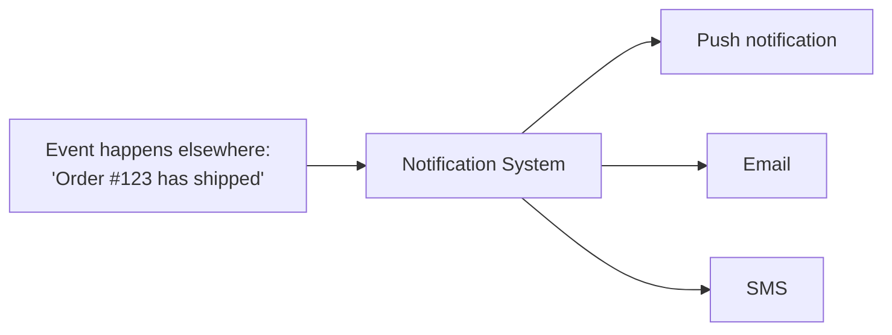

The core insight: this system is rarely the thing that *decides* something happened — it's a **downstream consumer** of events from many other services, whose entire job is reliably formatting and delivering that news to a user through whichever channel(s) make sense.

---

## 2. Step 1: Clarify Requirements

### Functional Requirements
- Accept notification requests from many different internal services (Order Service, Social Service, Auth Service, etc.).
- Deliver via multiple **channels**: push, email, SMS (and possibly in-app).
- Respect **user preferences** (e.g., "don't email me for likes, only push").
- Support both **immediate** notifications (e.g., "your OTP code") and **batched/digest** notifications (e.g., "you have 5 new likes today," sent as one summary rather than five separate pings).

### Non-Functional Requirements
- **High throughput** — a single event (e.g., a viral post) can trigger notifications to millions of users nearly simultaneously.
- **At-least-once delivery** — better to occasionally send a duplicate than to silently drop a notification (recall the Delivery Guarantees concept from the Message Queues topic).
- **Decoupled from the services that trigger notifications** — the Order Service shouldn't need to know *how* email delivery actually works; it should just say "notify this user" and move on.
- **Should not become a bottleneck** for the services that call it — this directly echoes the "don't block the hot path" principle from earlier HLD topics.

---

## 3. Step 2: Capacity Estimation

### Assumptions (reasonable, made-up numbers for this walkthrough)
- 200 million notification events/day across the whole platform.
- Occasional massive spikes (e.g., a breaking-news push to 50 million users within a few minutes).

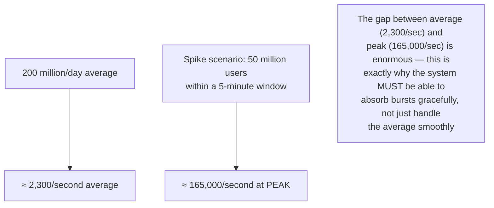

This burst-vs-average gap is the single number that most shapes this design — it's precisely why a message queue (Step 4) sits at the center of the architecture.

---

## 4. Step 3: The Core Challenge — Many Channels, Many Providers

A naive design has every service that wants to send a notification directly call each channel's provider (e.g., calling Twilio for SMS, calling a push provider like FCM/APNs, calling an email provider like SendGrid) — this duplicates logic everywhere and tightly couples every service to every notification provider's specific API.

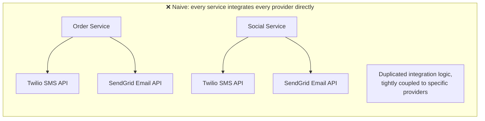

### The fix: a centralized Notification Service
Every other service simply publishes "please notify user X about Y" — the Notification Service owns all the actual channel-specific delivery logic.

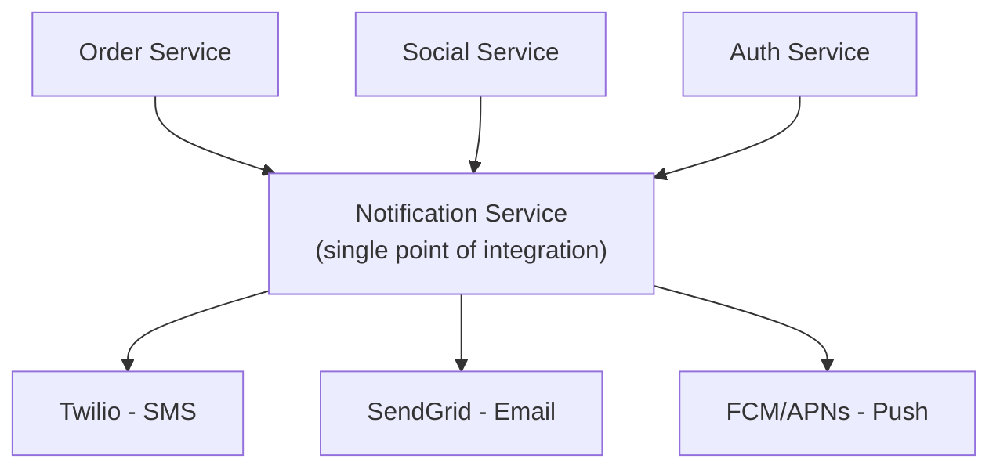

- This is a direct application of the **decoupling** principle from the Microservices topic — other services depend on one simple internal contract, not on N different third-party APIs each.
- If you ever switch email providers, only the Notification Service needs to change — every calling service is completely unaffected.

---

## 5. Step 4: High-Level Architecture

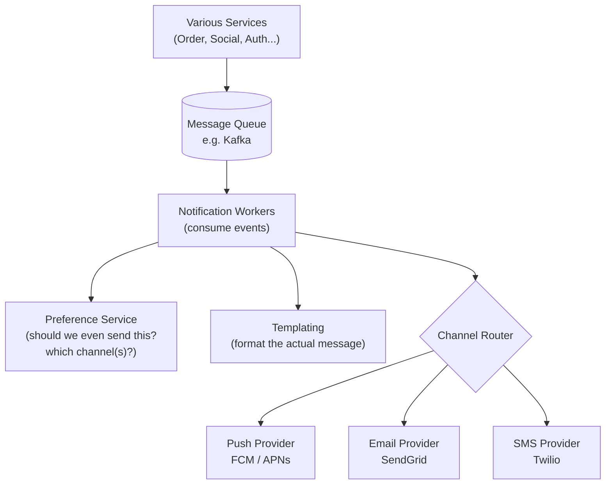

- **Message Queue** — every triggering service simply publishes an event and moves on immediately; this is exactly what absorbs the massive burst-vs-average gap from Step 2, since the queue can hold a huge backlog and let workers drain it steadily, rather than the system needing to process 165,000/second instantly the moment a spike hits.
- **Notification Workers** — pull events off the queue and handle the actual processing, and can be scaled horizontally (recall Phase 1) simply by adding more worker instances during a spike.
- **Preference Service** — checks the user's notification settings before sending anything.
- **Templating** — formats the raw event data into an actual human-readable message ("Your order has shipped!").
- **Channel Router** — decides which specific provider(s) to call, based on the chosen channel(s).

---

## 6. Step 5: The Notification Flow in Detail

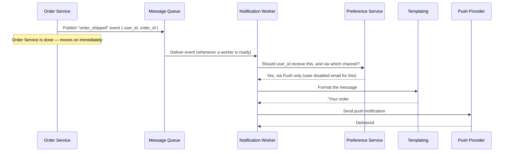

Notice the Order Service's involvement ends at "publish the event" — everything else happens completely asynchronously, decoupled from the original request, exactly mirroring the analytics pattern from the URL Shortener HLD.

---

## 7. Step 6: User Preferences & Rate Limiting Notifications

### Preferences
A simple table mapping `(user_id, notification_type)` → allowed channels, checked before every send.

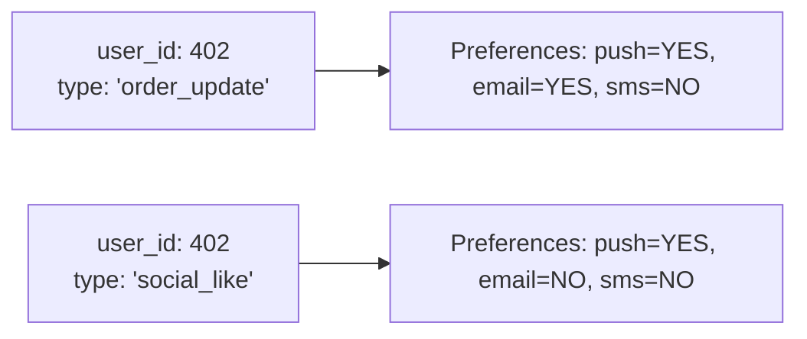

### Rate limiting / batching notifications
Without limits, a very active user (e.g., a popular post getting hundreds of likes in an hour) could get flooded with individual notifications — a poor experience, and wasted sending cost.

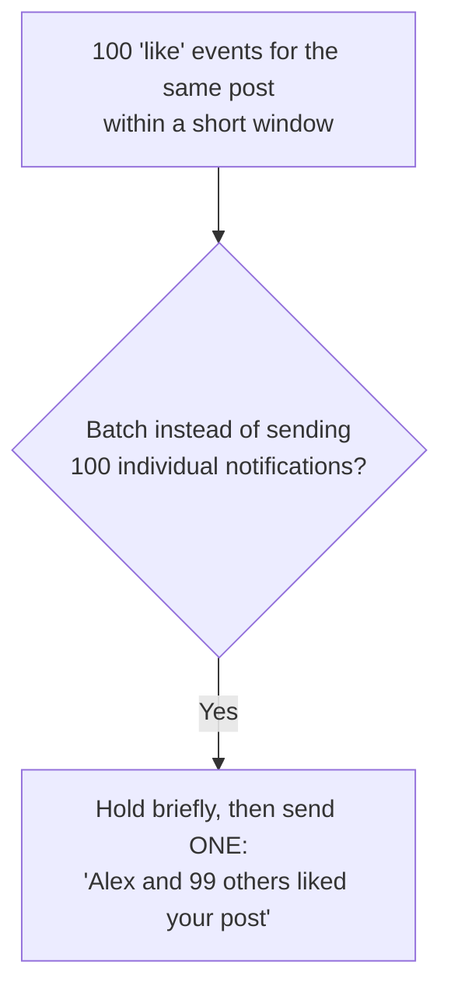
- This directly reuses the same "batching improves efficiency at the cost of a little latency" tradeoff covered in the Performance Metrics topic — a short delay to combine notifications trades a small amount of latency for a much better user experience and a much lower total send volume.

---

## 8. Step 7: Retries & Failure Handling

Sending to an external provider (Twilio, SendGrid, FCM) can fail transiently — the provider might be briefly down, or rate-limit the request. Recall the Circuit Breaker topic: wrapping calls to each provider protects the Notification Service from wasting resources hammering an already-struggling provider.

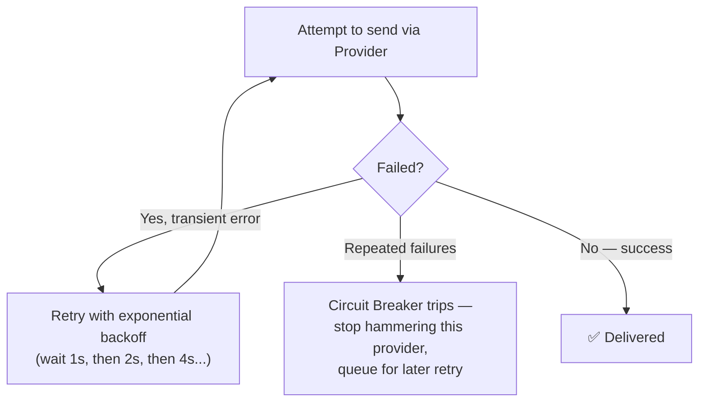

- **Exponential backoff** — waiting progressively longer between retries avoids overwhelming an already-struggling provider further.
- **Dead-letter queue** — after exhausting retries, a failed notification is moved to a separate queue for manual inspection or a later, slower retry pass, rather than being silently lost or endlessly retried forever.

---

## 9. Step 8: Scaling the System

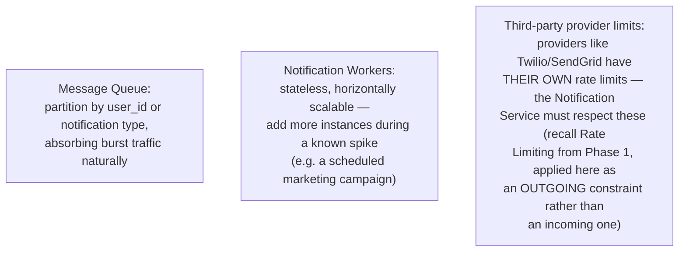

---

# Part 2: E-commerce Order Flow

## 10. What Are We Actually Building?

The core flow that happens the moment a user clicks "Place Order" — checking inventory, charging payment, and confirming the order — coordinated correctly across multiple backend services.

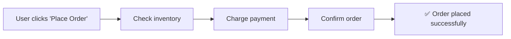

This flow looks simple on paper, but it's a genuinely hard distributed systems problem the moment these steps live in **separate microservices** (recall the Microservices topic) — which is exactly what makes this a rich system design question.

---

## 11. Step 1: Clarify Requirements

### Functional Requirements
- Verify the ordered item(s) are actually **in stock**.
- **Reserve** inventory so it can't be sold to someone else while this order is being processed.
- **Charge** the customer's payment method.
- **Confirm** the order only once payment genuinely succeeds.
- **Roll back** cleanly if any step fails (e.g., payment declined after inventory was reserved).

### Non-Functional Requirements
- **Never oversell** — two customers should never successfully buy the last unit of the same item.
- **Never double-charge** a customer, even if a request is retried due to a network hiccup.
- **Reasonable latency** — checkout should feel fast, not sluggish, despite coordinating multiple services.

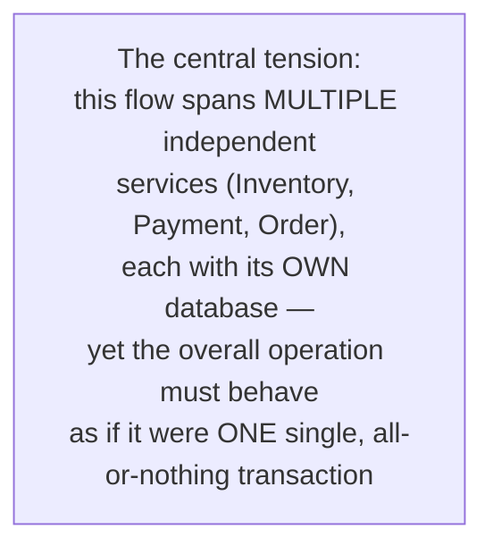

---

## 12. Step 2: The Core Challenge — Not Overselling Inventory

This is the exact **lost update** problem from the Concurrency Control topic, applied directly to a real product scenario.

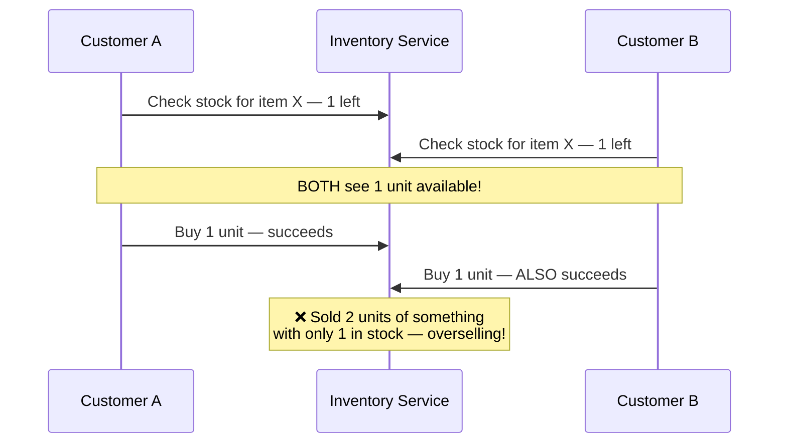

### The fix: atomic, conditional decrement
Exactly like the Rate Limiter's atomic Redis operations, the inventory decrement needs to be a single, indivisible database operation that checks and decrements together, not two separate steps.

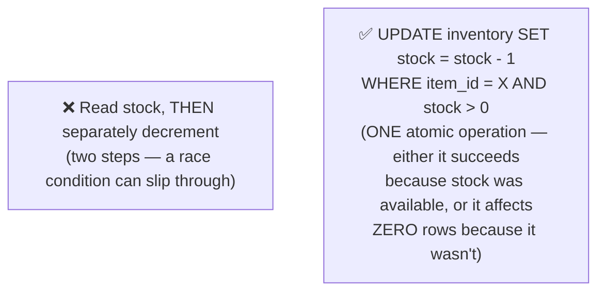

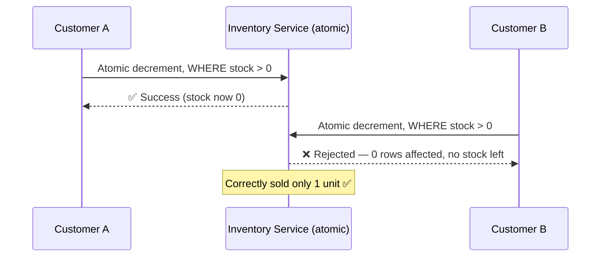

---

## 13. Step 3: The Order Flow, Service by Service

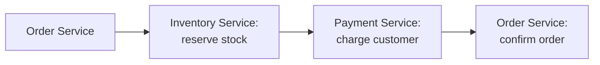

Each of these is a **separate microservice with its own database** (recall the Microservices topic's key trait: independent services, independent data) — meaning there's no single database transaction that can wrap all three steps together the way a single-service operation could.

---

## 14. Step 4: The Distributed Transaction Problem

Here's the hard question this design must answer: what happens if inventory is successfully reserved, but the payment charge then **fails**?

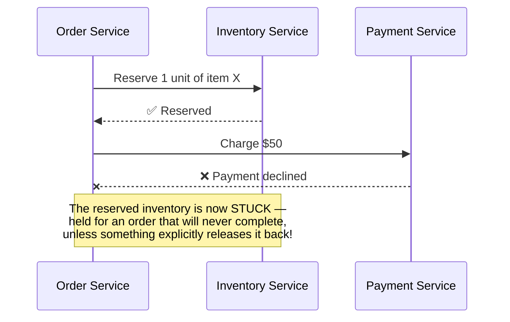

In a single database, this would just be `ROLLBACK` (recall ACID/Atomicity from the SQL vs NoSQL and Concurrency Control topics) — one command, and everything reverts cleanly. But across **separate services with separate databases**, there's no single command that can undo both steps at once — this needs to be handled explicitly, in application logic.

---

## 15. Step 5: The Saga Pattern

A **Saga** is a sequence of local transactions across multiple services, where each step publishes an event that triggers the next step — and critically, **every step that changes data also defines a compensating action** to undo it if a later step fails.

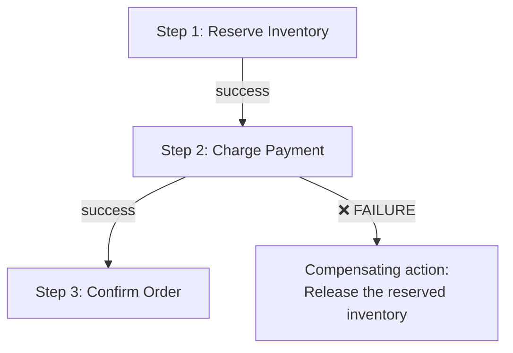

### Walking through the failure case with compensation

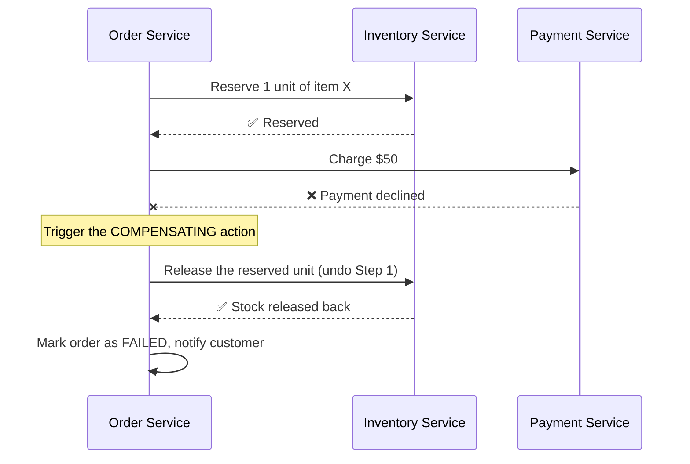

- This is exactly the practical, real-world alternative to a traditional ACID transaction when data spans multiple services — instead of one atomic operation, you get a **sequence of steps, each individually reversible**, giving you the same end result (either everything succeeded, or everything was cleanly undone) without requiring a single, all-encompassing database transaction.

### Choreography vs Orchestration
Two ways to actually coordinate a saga:

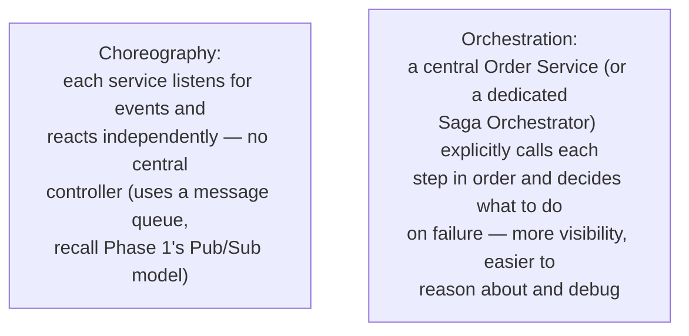

For an order flow specifically, **orchestration** (a central Order Service directing each step) is usually easier to reason about and debug than choreography, since the entire sequence and its failure logic lives in one place rather than being scattered implicitly across multiple services' event listeners.

---

## 16. Step 6: High-Level Architecture

```mermaid
flowchart TB
    Client[Client] --> OrderSvc["Order Service<br/>(Saga Orchestrator)"]
    OrderSvc --> InvSvc[Inventory Service]
    OrderSvc --> PaySvc[Payment Service]
    InvSvc --> InvDB[(Inventory DB)]
    PaySvc --> PayDB[(Payment DB)]
    OrderSvc --> OrderDB[(Order DB)]
    OrderSvc --> Queue[("Message Queue")]
    Queue --> NotifSvc["Notification Service<br/>(from Part 1!)"]
```

Notice the **Notification Service from Part 1 plugs in naturally here** — once the Order Service confirms (or fails) an order, it simply publishes an event, and the Notification Service handles telling the customer, completely decoupled from the order flow's own logic.

---

## 17. Step 7: Handling Payment Failures & Timeouts

### Payment declined (a clean, known failure)
Handled directly by the saga's compensating action, as shown in Step 5.

### Payment Service times out (an ambiguous failure — did it charge or not?)
This is the trickiest real-world case: the Order Service made a request to charge the customer, but never got a clear response — the charge might have actually succeeded on Payment Service's end, or it might not have.

```mermaid
flowchart TB
    A["Payment request times out —<br/>Order Service genuinely doesn't know<br/>if the charge succeeded or not"] --> B{"What NOT to do:<br/>Just retry blindly"}
    B --> C["❌ Risk: if the original charge<br/>actually DID succeed, a blind retry<br/>could charge the customer TWICE"]
```

### The fix: idempotency keys
The Order Service generates a unique key for this specific charge attempt and sends it along with the request. If it needs to retry, it sends the **same key** — the Payment Service recognizes it's already processed that exact key and returns the original result instead of charging again.

```mermaid
sequenceDiagram
    participant OrderSvc as Order Service
    participant PaySvc as Payment Service

    OrderSvc->>PaySvc: Charge $50, idempotency_key = "order_882_attempt1"
    Note over OrderSvc,PaySvc: Request times out — no response received
    OrderSvc->>PaySvc: RETRY: Charge $50, idempotency_key = "order_882_attempt1" (same key!)
    alt Payment Service already processed this key
        PaySvc-->>OrderSvc: Here's the ORIGINAL result (no new charge created)
    else Payment Service never actually got the first request
        PaySvc-->>OrderSvc: Processes it now, for the first and only time
    end
```

This directly reuses the **idempotency** concept introduced in the API Design Basics topic (PUT being naturally idempotent) and the Message Queues topic (idempotent consumers for at-least-once delivery) — same underlying principle, applied here to solve the "did my payment actually go through?" ambiguity safely.

---

## 18. Step 8: Scaling the System

```mermaid
flowchart TB
    A["Each service (Order, Inventory, Payment)<br/>scales independently — recall this is<br/>exactly the core benefit of microservices<br/>from Phase 1's Microservices topic"]
    B["Inventory Service is often the hottest<br/>bottleneck during high-demand events<br/>(e.g. a flash sale) — since every single<br/>order for a popular item contends on the<br/>SAME row's atomic decrement"]
    C["Mitigation for hot inventory rows:<br/>split a single item's stock count across<br/>multiple smaller counters/shards internally,<br/>reducing contention on any one row,<br/>then reconcile the total periodically"]
```

---

## 19. How to Walk Through These in an Interview

### Notification System
> "The key realization is that this system is a downstream consumer of events, not a decision-maker — so I'd have other services simply publish events to a message queue rather than calling notification providers directly. This decouples every service from the specifics of Twilio, SendGrid, or FCM, and critically, it absorbs the huge gap between average and peak load, since a burst of events can queue up and drain steadily through horizontally-scaled workers, rather than needing to handle 165,000 notifications a second instantly. I'd check user preferences before sending, batch high-frequency notifications like likes into a single digest to avoid spamming users, and wrap each external provider call in retry logic with exponential backoff and a circuit breaker, so a struggling provider doesn't get hammered further."

### E-commerce Order Flow
> "The core challenge is that this flow spans multiple services, each with its own database, so there's no single transaction that can atomically cover inventory, payment, and order confirmation together. I'd use the Saga pattern: each step is a local transaction with a defined compensating action, so if payment fails after inventory was reserved, the Order Service — acting as the orchestrator — explicitly triggers releasing that inventory back. For inventory specifically, I'd use an atomic, conditional decrement — `UPDATE ... WHERE stock > 0` — rather than a separate read-then-write, to prevent overselling under concurrent orders. And for payment specifically, since a timeout leaves real ambiguity about whether the charge actually went through, I'd use an idempotency key on every payment attempt, so a safe retry never risks double-charging the customer."

---

## 20. Quick Recall Cheat Sheet

```mermaid
mindmap
  root((Notifications + Order Flow))
    Notification System
      Downstream consumer of events
      Message queue absorbs burst vs average gap
      Centralized service - decouples from providers
      Batch high-frequency notifications
      Retries + circuit breaker per provider
    E-commerce Order Flow
      Core challenge - no single cross-service transaction
      Overselling - fix with atomic conditional decrement
      Saga Pattern - local transactions + compensating actions
      Orchestration - central coordinator, easier to debug
      Payment timeouts - fix with idempotency keys
```

| If you remember only 5 things (combined) |
|---|
| 1. A notification system is a downstream event consumer — decouple it from triggering services using a message queue, which also absorbs huge burst-vs-average load gaps. |
| 2. Batch high-frequency notifications (e.g., many likes) into a digest rather than sending each individually. |
| 3. Preventing overselling requires an atomic, conditional inventory decrement (`WHERE stock > 0`), not a separate read-then-write. |
| 4. Across multiple services/databases, use the Saga pattern — each step has a compensating action to undo it if a later step fails, since no single transaction can span services. |
| 5. Payment timeouts create genuine ambiguity about whether a charge succeeded — idempotency keys make retries safe without risking a double charge. |

---

*This file is written in GitHub-flavored Markdown with Mermaid diagrams — it will render natively on GitHub, GitLab, and most modern Markdown viewers.*
