# HLD: Design an Instagram/Twitter-like Feed + Design a File Storage/Sharing App

*Phase 2 — High-Level Design. A zero-to-mastery, interview-style walkthrough.*

---

## Table of Contents
**Part 1: Social Media Feed**
1. [What Are We Actually Building?](#1-what-are-we-actually-building)
2. [Step 1: Clarify Requirements](#2-step-1-clarify-requirements)
3. [Step 2: Capacity Estimation](#3-step-2-capacity-estimation)
4. [Step 3: The Core Challenge — How Is a Feed Actually Built?](#4-step-3-the-core-challenge--how-is-a-feed-actually-built)
5. [Step 4: Fan-out on Write vs Fan-out on Read](#5-step-4-fan-out-on-write-vs-fan-out-on-read)
6. [Step 5: The Celebrity Problem](#6-step-5-the-celebrity-problem)
7. [Step 6: Database Design](#7-step-6-database-design)
8. [Step 7: High-Level Architecture](#8-step-7-high-level-architecture)
9. [Step 8: The Post & Feed-Read Flows in Detail](#9-step-8-the-post--feed-read-flows-in-detail)
10. [Step 9: Scaling the System](#10-step-9-scaling-the-system)

**Part 2: File Storage/Sharing App**
11. [What Are We Actually Building?](#11-what-are-we-actually-building)
12. [Step 1: Clarify Requirements](#12-step-1-clarify-requirements)
13. [Step 2: The Core Challenge — Uploading Large Files Reliably](#13-step-2-the-core-challenge--uploading-large-files-reliably)
14. [Step 3: Chunking Large Files](#14-step-3-chunking-large-files)
15. [Step 4: Deduplication — Don't Store the Same File Twice](#15-step-4-deduplication--dont-store-the-same-file-twice)
16. [Step 5: Database Design](#16-step-5-database-design)
17. [Step 6: High-Level Architecture](#17-step-6-high-level-architecture)
18. [Step 7: Sync Across Devices](#18-step-7-sync-across-devices)
19. [Step 8: Sharing & Permissions](#19-step-8-sharing--permissions)
20. [Step 9: Scaling the System](#20-step-9-scaling-the-system)

**Wrap-up**
21. [How to Walk Through These in an Interview](#21-how-to-walk-through-these-in-an-interview)
22. [Quick Recall Cheat Sheet](#22-quick-recall-cheat-sheet)

---

# Part 1: Social Media Feed

## 1. What Are We Actually Building?

A **feed** is the personalized, scrollable stream of posts a user sees when they open the app — made up of content from the people they follow, ideally ordered so the newest (or most relevant) posts appear first.

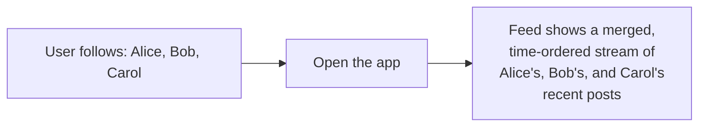

The deceptively hard question this design centers on: **when a user opens their feed, where does that merged, ordered list of posts actually come from — computed at that exact moment, or prepared ahead of time?** The answer to that single question shapes almost the entire architecture.

---

## 2. Step 1: Clarify Requirements

### Functional Requirements
- Users can **post** content (text, image, etc.).
- Users can **follow** other users.
- A user's **feed** shows recent posts from everyone they follow, roughly in reverse-chronological order.
- (Simplification, per the prompt) We're skipping complex ranking/relevance algorithms — just recency-based ordering, to keep the core distributed-systems challenge front and center.

### Non-Functional Requirements
- **Feed reads must be fast** — this is the single most frequent action in the entire app; a user might open it dozens of times a day, and it needs to feel instant every single time.
- **High write volume** — many users post simultaneously; the system needs to handle post creation smoothly too, though reads still dominate.
- **Eventual consistency is acceptable** — recall the CAP Theorem topic: it's fine if a brand new post takes a few seconds to appear in all your followers' feeds; it's not fine if the feed is slow or unavailable.

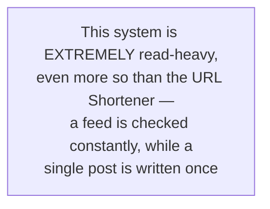

---

## 3. Step 2: Capacity Estimation

### Assumptions (reasonable, made-up numbers for this walkthrough)
- 100 million daily active users.
- Average user follows 200 people, and checks their feed 10 times/day.
- 5 million new posts created per day.

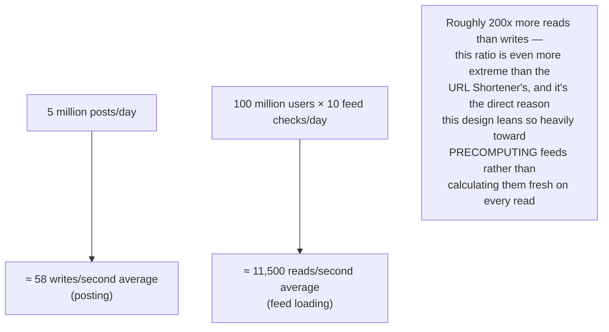

---

## 4. Step 3: The Core Challenge — How Is a Feed Actually Built?

### Approach 1: Compute the feed on-demand ("pull" / fan-out on read)
When a user opens their feed, query for recent posts from everyone they follow, merge the results, and sort by time — right at that moment.

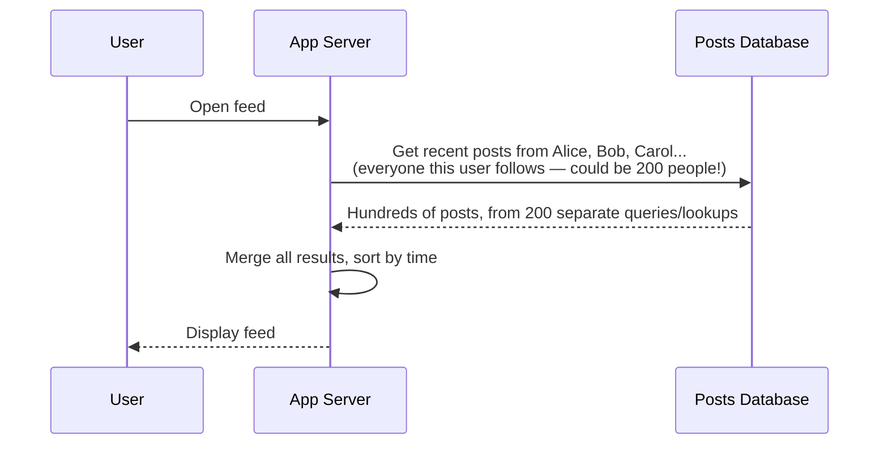
- **Problem:** if a user follows 200 people, loading their feed means fetching and merging data from 200 different sources, **every single time** they open the app — this is expensive and slow, especially given how often feeds are checked (Step 2).

### Approach 2: Precompute the feed ahead of time ("push" / fan-out on write)
When a user **posts** something, immediately deliver a copy of that post into the precomputed feed of every one of their followers — so by the time a follower opens their feed, it's already sitting there, ready to read instantly.

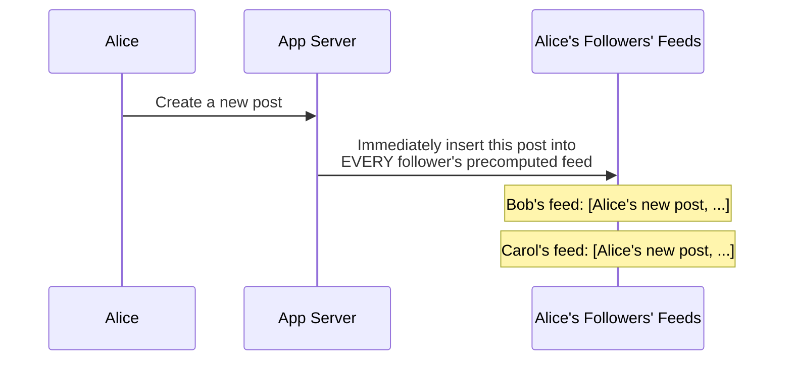
- **Massive read speedup:** a user's feed is now just "look up my own precomputed feed list" — one fast lookup, not 200 separate queries merged on the fly.
- **Cost shifts to write time:** posting now means writing to potentially thousands (or millions) of followers' feeds, not just one row.

---

## 5. Step 4: Fan-out on Write vs Fan-out on Read

Given the read-heavy nature established in Step 2 (200x more reads than writes), doing the expensive work at **write time** (when a post is created, which happens far less often) makes the **much more frequent** read operation dramatically faster — this is a direct, practical application of the Latency vs Throughput trade-off from the Performance Metrics topic: shifting cost from the frequent operation to the infrequent one.

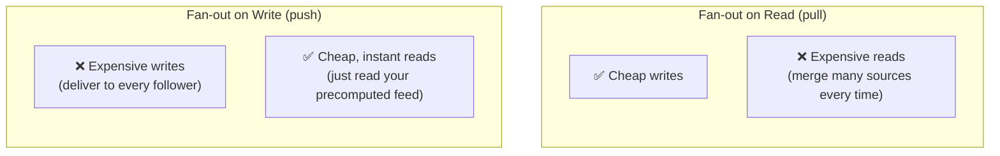

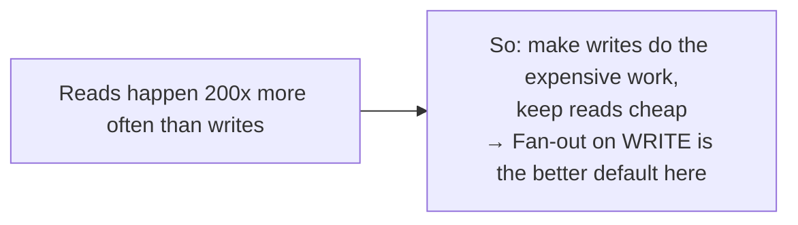

### Implementation: precomputed feed storage
Each user gets their own precomputed feed, implemented as a simple, time-ordered list of post IDs, stored in a fast key-value/cache store.

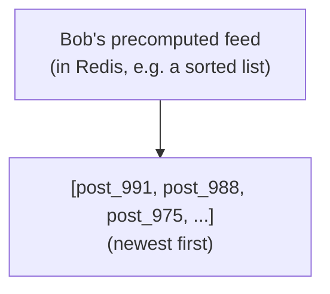

When Bob opens his feed, the app fetches this list, then fetches the actual post content for each ID (likely from a cache, recall the Caching topic) — fast, because there's no merging or querying across 200 different users happening at read time anymore.

---

## 6. Step 5: The Celebrity Problem

Fan-out on write has one serious weakness: what happens when someone with **50 million followers** posts something?

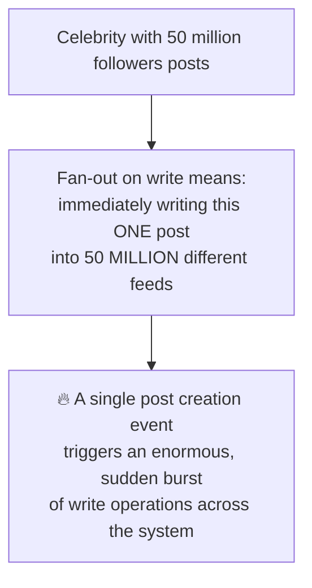

### The fix: a hybrid approach
Use fan-out on write for regular users (with a normal follower count), but fan-out on **read** specifically for celebrities/high-follower accounts — merging their posts into a follower's feed only at read time, rather than pre-delivering to millions of feeds on every post.

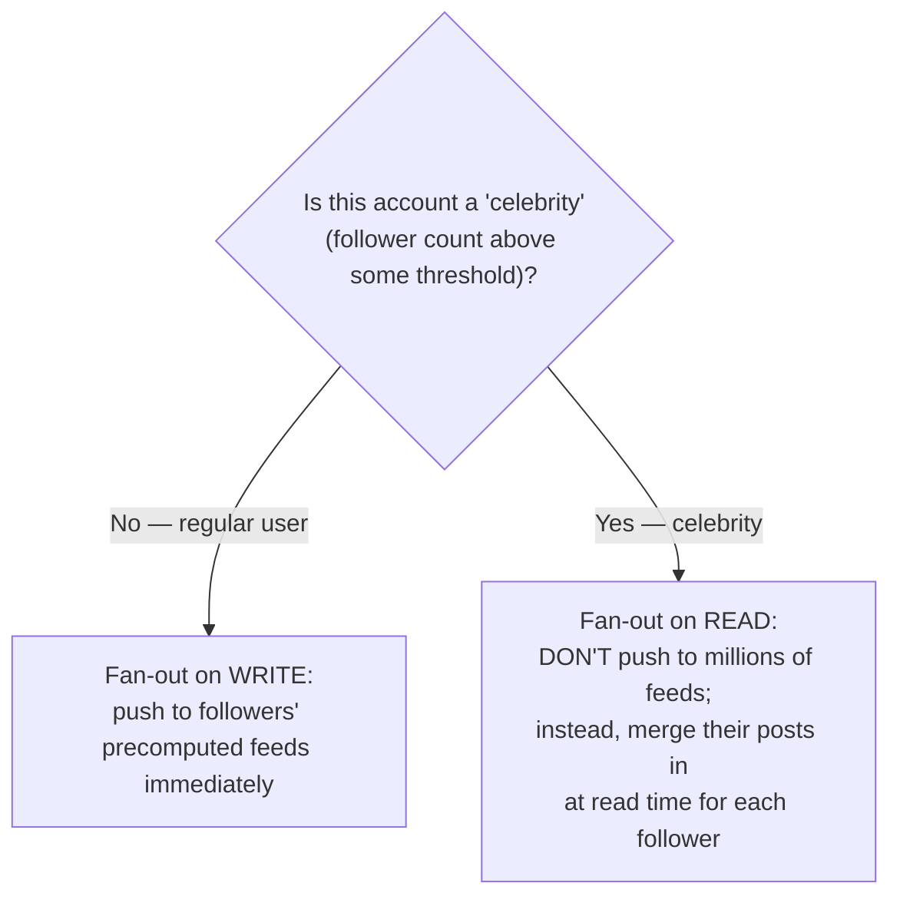

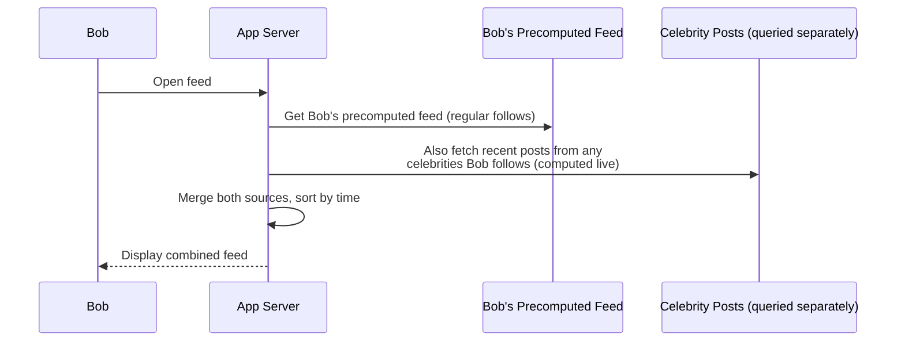

This hybrid design is a great example of a recurring system design principle: **the "best" architecture often isn't one clean, uniform approach — it's picking the right strategy per case**, based on where the actual bottleneck lives (here: it's specifically the extreme outlier accounts, not typical users, that break the simple approach).

---

## 7. Step 6: Database Design

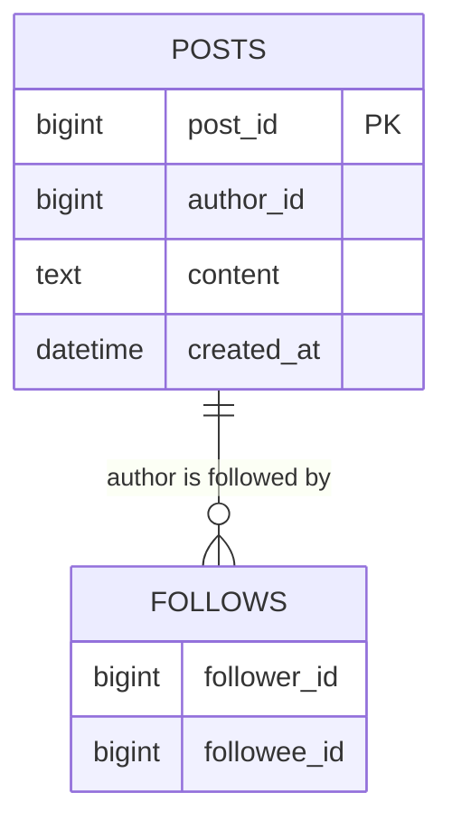

- **Posts table** — the actual post content and metadata; a good fit for a wide-column store (similar reasoning to the Chat System's message storage — partition by `author_id`, sorted by time).
- **Follows table** — a simple graph-like relationship (who follows whom) — this specific access pattern ("who does Bob follow" / "who follows Alice") is exactly the kind of relationship-heavy query a Graph Database can also handle well, though a simple relational or key-value table works fine at moderate scale too.
- **Precomputed feeds** — stored separately, in a fast cache/key-value store (Redis), as covered in Step 4 — this is *not* the same as the durable Posts table; it's a derived, rebuildable view optimized purely for fast reads.

---

## 8. Step 7: High-Level Architecture

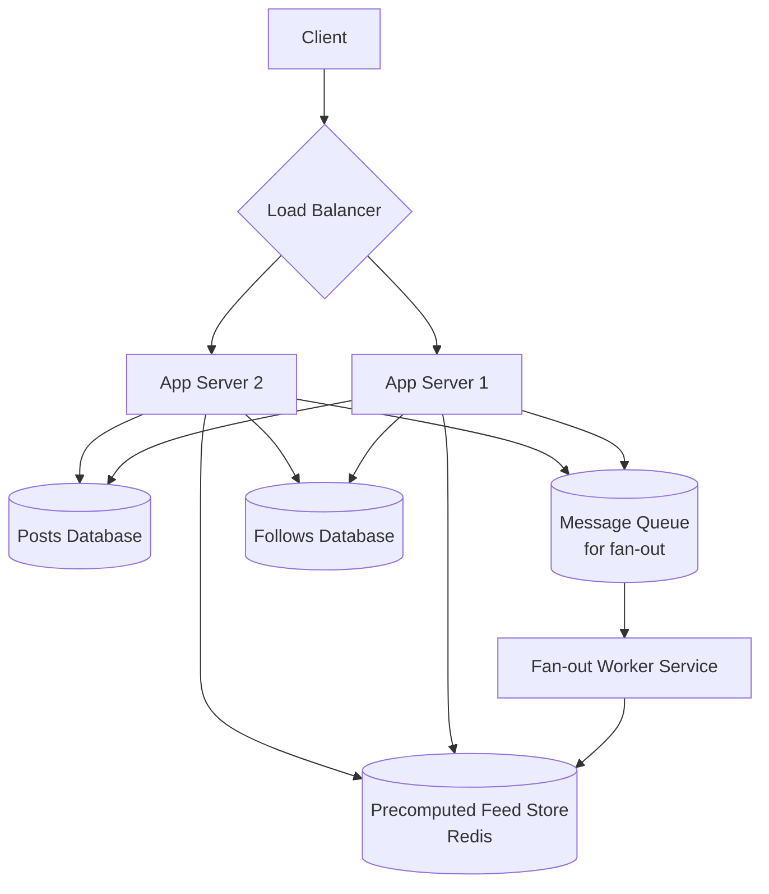

Notice the fan-out itself happens **asynchronously**, through a message queue and dedicated workers, rather than blocking the original "create post" request — directly reusing the "don't block the hot/critical path" principle seen throughout this series (e.g., the URL Shortener's analytics, the Chat System's message persistence).

---

## 9. Step 8: The Post & Feed-Read Flows in Detail

### Creating a post (with async fan-out)

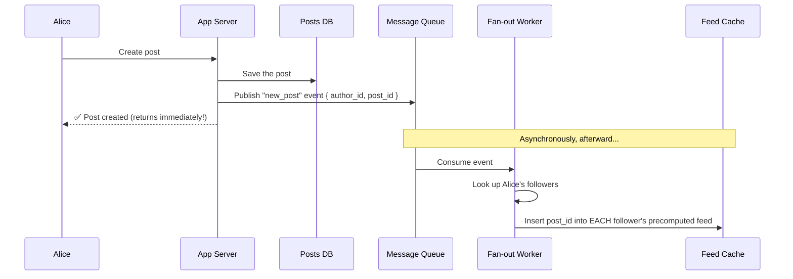

### Reading a feed

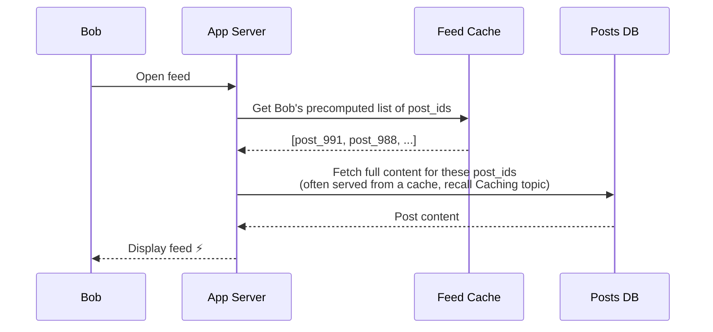

---

## 10. Step 9: Scaling the System

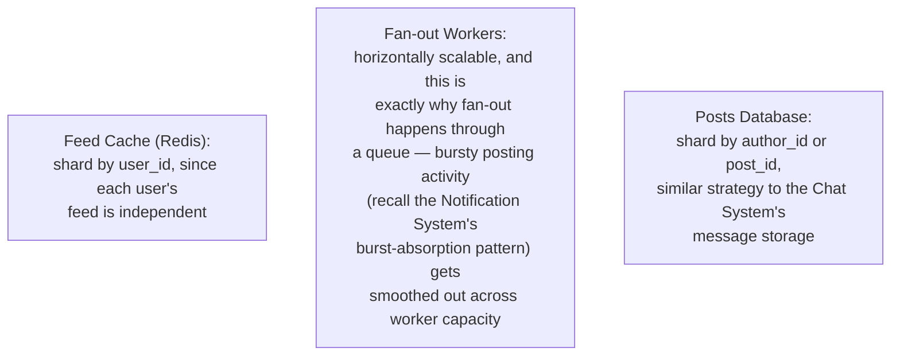

---

# Part 2: File Storage/Sharing App

## 11. What Are We Actually Building?

A system like Dropbox or Google Drive — users upload files, which are stored durably, can be accessed from multiple devices, and can be shared with other users.

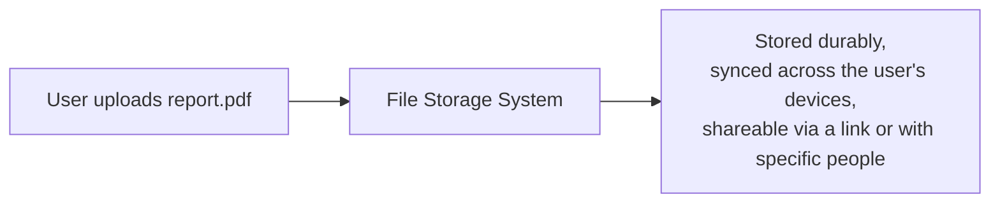

---

## 12. Step 1: Clarify Requirements

### Functional Requirements
- **Upload** files (of varying, potentially large sizes).
- **Download** files.
- **Sync** — a file added/changed on one device should show up on the user's other devices.
- **Share** a file/folder with other users, or via a public link.
- **Versioning** (bonus) — keep track of previous versions of an edited file.

### Non-Functional Requirements
- **Durability** — files must never be lost; this is arguably the single most important guarantee for a storage product (losing a user's files is close to the worst possible failure mode).
- **Support large files** — potentially gigabytes in size, which introduces real challenges a small record (like a URL or a chat message) never faces.
- **Reasonable upload/download speed**, even on unreliable network connections.
- **Storage efficiency** — avoid wasting space storing the same content redundantly.

---

## 13. Step 2: The Core Challenge — Uploading Large Files Reliably

Unlike every previous system in this series, this one must comfortably handle files that could be **gigabytes** in size — and mobile/unreliable networks make a single, giant upload attempt fragile.

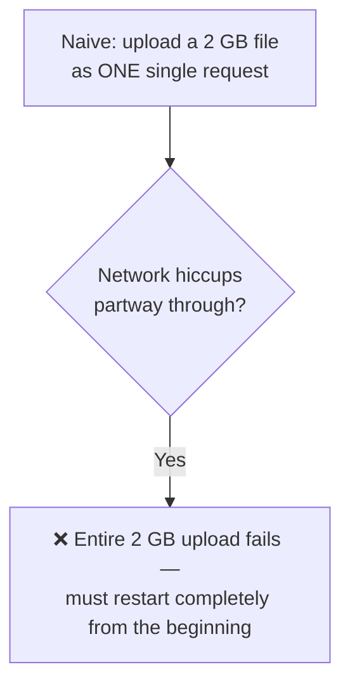

This single problem — reliably getting large files onto the server despite unreliable networks — is this design's equivalent of the URL Shortener's "generate a unique short code" or the Chat System's "route to the right server": the one genuinely hard, defining challenge of the whole system.

---

## 14. Step 3: Chunking Large Files

### The idea
Split a large file into smaller, fixed-size **chunks** (e.g., 4 MB each) before uploading, and upload each chunk somewhat independently.

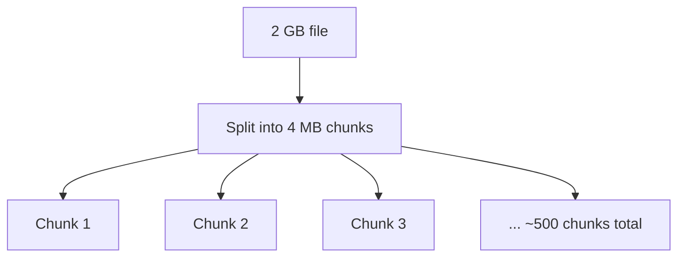

### Why this solves the reliability problem
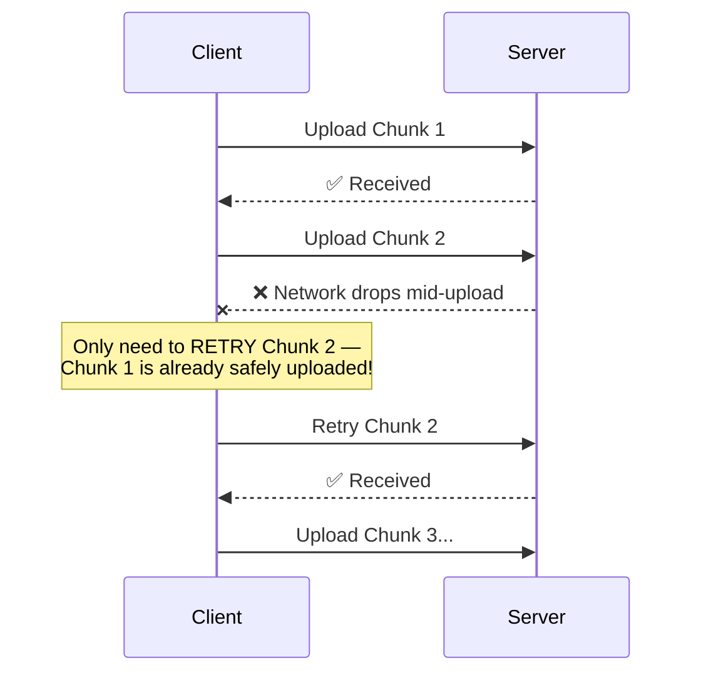

- **Resumability:** if the upload is interrupted, only the failed/remaining chunks need to be retried — not the entire file from scratch.
- **Parallelism:** multiple chunks can potentially be uploaded simultaneously, speeding up the overall upload for large files.
- Once all chunks arrive, the server reassembles them into the complete file (or, more commonly, stores them as-is and reads them back in sequence — object storage systems are often designed to handle this reassembly transparently).

---

## 15. Step 4: Deduplication — Don't Store the Same File Twice

A very common real-world scenario: many different users upload the exact same file (a popular PDF, a common company logo, a viral meme image). Storing separate physical copies for every single user wastes enormous amounts of storage.

### The fix: content-based hashing
Compute a hash (e.g., SHA-256) of the file's content. If a file with that exact same hash already exists in storage, **don't store it again** — just create a new reference/pointer to the existing stored content for this user.

```mermaid
flowchart TB
    A["User B uploads report.pdf"] --> B["Compute SHA-256 hash of content"] --> C{"Does a file with this<br/>EXACT hash already exist in storage?"}
    C -->|"Yes — identical content already stored"| D["✅ Just create a new reference for User B,<br/>pointing to the EXISTING stored file<br/>— no duplicate storage needed"]
    C -->|"No — genuinely new content"| E["Store it as a new object"]
```

```mermaid
flowchart LR
    UserA["User A's file record"] --> SharedContent[("Shared stored content<br/>(one physical copy)")]
    UserB["User B's file record<br/>(identical content)"] --> SharedContent
```

- **Important nuance:** this applies to *content*, not filenames — two different users can each have a file named `report.pdf` with completely different content (different hashes, stored separately), while two users with differently-*named* but identically-*content* files can safely share one stored copy.
- This is precisely why chunking (Step 3) and deduplication (Step 4) pair naturally — deduplication can even happen at the **chunk level**, not just the whole-file level, so if only part of a large file changes between two versions, only the changed chunks need new storage (this is very close to how real tools like Dropbox and Git actually work).

---

## 16. Step 5: Database Design

```mermaid
erDiagram
    FILES {
        bigint file_id PK
        string filename
        bigint owner_id
        string content_hash
        bigint size_bytes
        datetime created_at
    }
    FILE_CONTENT {
        string content_hash PK
        string storage_url
        bigint reference_count
    }
    FILES }o--|| FILE_CONTENT : "points to"
```

- **files** — one row per user-facing file (filename, owner, when created) — this is the *metadata*, similar in spirit to the Pastebin's metadata/content split.
- **file_content** — one row per **unique** piece of content, referenced by its hash; `reference_count` tracks how many `files` rows point to it, so the actual stored object is only deleted once nothing references it anymore.

This directly mirrors the Pastebin's metadata-vs-content separation pattern, with deduplication layered on top via the shared `file_content` table.

---

## 17. Step 6: High-Level Architecture

```mermaid
flowchart TB
    Client[Client / Desktop App] --> LB{Load Balancer}
    LB --> App1[App Server 1]
    App1 --> MetaDB[(Metadata DB<br/>files table)]
    App1 --> ContentDB[(Content Reference DB<br/>file_content table)]
    App1 --> ObjStore[("Object Storage<br/>e.g. S3, chunked files")]
    App1 --> SyncSvc["Sync Service"]
    SyncSvc --> Notif["Push notification to<br/>user's other devices:<br/>'a file changed, re-sync'"]
```

- **Object Storage** — same reasoning as the Pastebin's content storage: purpose-built for large blobs, here storing the actual file chunks.
- **Sync Service** — notifies a user's other connected devices when a file changes, so they know to pull the update (this connects back to the Chat System's real-time push concepts — a similar "notify connected clients immediately" pattern).

---

## 18. Step 7: Sync Across Devices

When a file changes on Device A, Device B needs to find out and download the update.

```mermaid
sequenceDiagram
    participant DeviceA
    participant Server
    participant SyncSvc as Sync Service
    participant DeviceB

    DeviceA->>Server: Upload changed file (chunked)
    Server->>Server: Store new/changed chunks, update metadata
    Server->>SyncSvc: Notify: "file X changed for user_1"
    SyncSvc->>DeviceB: Push notification: "file X was updated"
    DeviceB->>Server: Request the updated chunks
    Server-->>DeviceB: Send only the CHANGED chunks<br/>(not the whole file again!)
    Note over DeviceB: File is now in sync
```

- **Only syncing changed chunks** (not the entire file) is a direct, practical benefit of the chunking design from Step 3 — this is exactly how real sync tools avoid re-transferring gigabytes for a one-line text edit in a large document.
- This same push-based "notify connected devices immediately" mechanism is conceptually identical to the Chat System's WebSocket-based delivery — a persistent connection (or a push notification, for a closed app) alerts the device that something changed.

---

## 19. Step 8: Sharing & Permissions

```mermaid
erDiagram
    FILE_SHARES {
        bigint file_id FK
        bigint shared_with_user_id
        string permission_level
    }
```

- A simple `file_shares` table records who a file has been shared with, and their permission level (view-only vs edit).
- **Public link sharing:** generates a unique, unguessable link (recall the Base62-encoded short-ID pattern from both the URL Shortener and Pastebin designs — directly reused here) that grants access without requiring the visitor to be a registered, explicitly-added user.

---

## 20. Step 9: Scaling the System

```mermaid
flowchart TB
    A["Object Storage:<br/>inherently scalable, same as the<br/>Pastebin's approach"]
    B["Metadata DB:<br/>shard by owner_id or file_id<br/>as the user base grows"]
    C["Deduplication check:<br/>the content_hash lookup needs to be<br/>FAST even with billions of unique files —<br/>index it properly (recall the Indexing<br/>topic), or use a dedicated fast<br/>key-value store just for hash lookups"]
    D["Large file uploads:<br/>chunk upload endpoints can be<br/>horizontally scaled independently,<br/>since each chunk upload is a small,<br/>independent, stateless operation"]
```

---

## 21. How to Walk Through These in an Interview

### Social Media Feed
> "The key insight is that this system is extremely read-heavy — feeds get checked far more often than posts get created — so I'd precompute each user's feed ahead of time rather than merging data from everyone they follow on every single read. When a user posts, I'd fan that post out asynchronously, via a message queue and worker pool, into each follower's precomputed feed stored in a fast cache like Redis, so reading a feed becomes a single fast lookup instead of an expensive merge across hundreds of sources. The one major exception is celebrity accounts with millions of followers — fanning out a single post to millions of feeds instantly would create a massive write spike, so I'd switch to fan-out on read specifically for high-follower accounts, merging their recent posts in at read time instead, and combine both sources into the final feed a user sees."

### File Storage/Sharing App
> "The core challenge is reliably handling large files over potentially unreliable networks, so I'd chunk files into smaller fixed-size pieces on upload — this makes uploads resumable, since a network drop only requires retrying the failed chunk, not the whole file. I'd also deduplicate at the content level, hashing each chunk or file and only storing genuinely new content, since many users often upload identical files, and this saves significant storage cost at scale. I'd split the data model the same way I did for the Pastebin: small, structured metadata in a regular database, with the actual file chunks in object storage. For sync across devices, I'd use a push-based notification, similar to how the Chat System alerts connected clients, so other devices know to pull just the changed chunks rather than re-downloading the entire file."

---

## 22. Quick Recall Cheat Sheet

```mermaid
mindmap
  root((Feed + File Storage))
    Social Feed
      Extremely read-heavy
      Fan-out on Write - precompute feeds
      Fan-out on Read - for celebrities specifically
      Async fan-out via message queue + workers
      Precomputed feed = list of post_ids in a cache
    File Storage
      Core challenge - large, unreliable uploads
      Chunking - resumable, parallel uploads
      Deduplication - hash content, avoid duplicate storage
      Metadata vs Content split - same as Pastebin
      Sync - push notification, transfer only changed chunks
```

| If you remember only 5 things (combined) |
|---|
| 1. Social feeds are extremely read-heavy — precompute each user's feed at post-time (fan-out on write) rather than merging sources on every read. |
| 2. For celebrities/high-follower accounts, switch to fan-out on read to avoid a single post triggering millions of instant writes. |
| 3. Chunk large file uploads into smaller pieces — this makes uploads resumable (only retry the failed chunk) and enables parallel uploads. |
| 4. Deduplicate files by content hash, not filename — identical content across different users should share one physical stored copy. |
| 5. Both systems reuse the same "small structured metadata in a DB, large content in object storage" pattern first introduced in the Pastebin design. |

---

*This file is written in GitHub-flavored Markdown with Mermaid diagrams — it will render natively on GitHub, GitLab, and most modern Markdown viewers.*
