# OOP Fundamentals: Encapsulation, Abstraction, Inheritance, Polymorphism

*Phase 3 — Low-Level Design (LLD) / OOD. A zero-to-mastery guide, with C++ code.*

---

## Table of Contents
1. [Why LLD Needs OOP](#1-why-lld-needs-oop)
2. [Classes & Objects — The Absolute Basics](#2-classes--objects--the-absolute-basics)
3. [Encapsulation](#3-encapsulation)
4. [Abstraction](#4-abstraction)
5. [Inheritance](#5-inheritance)
6. [Polymorphism](#6-polymorphism)
7. [How All Four Pillars Work Together](#7-how-all-four-pillars-work-together)
8. [How to Reason About This in an Interview](#8-how-to-reason-about-this-in-an-interview)
9. [Quick Recall Cheat Sheet](#9-quick-recall-cheat-sheet)

---

## 1. Why LLD Needs OOP

Phase 2 (HLD) was about **big-picture architecture** — how services, databases, and servers fit together across a whole system. Phase 3 (LLD) zooms all the way in: given *one* piece of that system, how do you actually structure the **code** — the classes, their responsibilities, and how they interact — so it's clean, maintainable, and extensible?

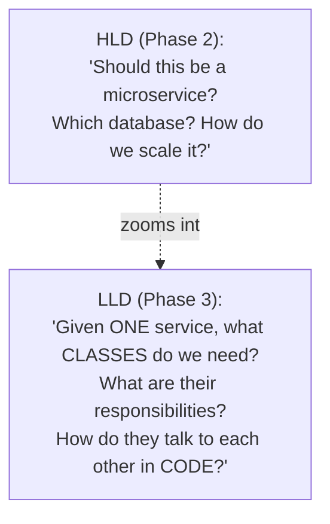

**Object-Oriented Programming (OOP)** is the dominant toolkit for answering LLD questions — it's a way of organizing code around **objects** (bundles of data and behavior) that model real-world (or system) entities, like a `Vehicle`, a `ParkingSpot`, or a `Player`. The four pillars covered here — Encapsulation, Abstraction, Inheritance, Polymorphism — are the foundational vocabulary every LLD interview question builds on.

---

## 2. Classes & Objects — The Absolute Basics

Before the four pillars, two terms need to be rock solid:

- **Class** — a blueprint/template that defines what data (attributes) and behavior (methods) something has, without being an actual "thing" yet.
- **Object** — a concrete **instance** created from that blueprint — the actual "thing" that exists in memory, with its own specific values.

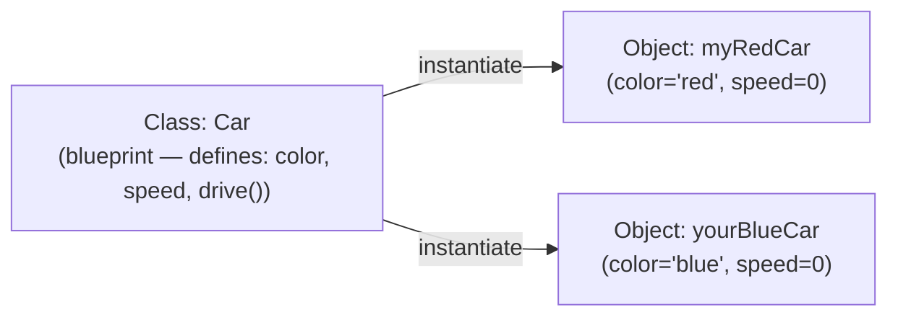

```cpp
// The CLASS — a blueprint, not a real thing yet
class Car {
public:
    std::string color;
    int speed;

    void drive() {
        std::cout << color << " car is now driving at " << speed << " km/h\n";
    }
};

int main() {
    // OBJECTS — actual instances, created from the blueprint
    Car myRedCar;
    myRedCar.color = "red";
    myRedCar.speed = 60;

    Car yourBlueCar;
    yourBlueCar.color = "blue";
    yourBlueCar.speed = 40;

    myRedCar.drive();     // "red car is now driving at 60 km/h"
    yourBlueCar.drive();  // "blue car is now driving at 40 km/h"
}
```

Every object created from the `Car` class shares the same *structure* (it will always have a `color` and a `speed`), but each object holds its **own, independent values** for that structure.

---

## 3. Encapsulation

### The idea
**Encapsulation** means bundling data (attributes) and the methods that operate on that data together **inside one class**, and **restricting direct outside access** to that data — forcing other code to interact with it only through a controlled, well-defined interface (public methods), rather than reaching in and modifying it directly.

Think of it like a car's engine: you interact with it through the pedals and steering wheel (the public interface) — you don't reach in and manually adjust the fuel injectors yourself. The complexity is hidden and protected inside, and you're only given safe, controlled ways to affect it.

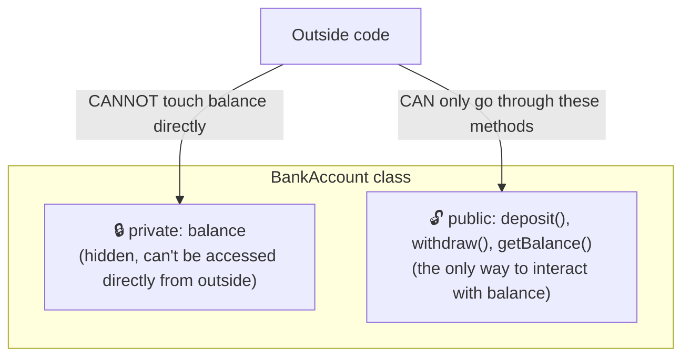

### Why it matters
Without encapsulation, any part of the codebase could directly set `balance = -500`, bypassing any validation — encapsulation forces every change to go through methods that can enforce rules (e.g., "you can't withdraw more than your balance").

```cpp
class BankAccount {
private:
    double balance;  // 🔒 hidden — no outside code can touch this directly

public:
    BankAccount(double initialBalance) : balance(initialBalance) {}

    void deposit(double amount) {
        if (amount <= 0) {
            std::cout << "Deposit amount must be positive.\n";
            return;
        }
        balance += amount;
    }

    void withdraw(double amount) {
        if (amount > balance) {
            std::cout << "Insufficient funds!\n";  // rule enforced HERE, in one place
            return;
        }
        balance -= amount;
    }

    double getBalance() const {
        return balance;  // controlled, read-only access
    }
};

int main() {
    BankAccount account(100.0);
    account.deposit(50.0);
    account.withdraw(30.0);
    std::cout << "Balance: " << account.getBalance() << "\n";  // 120

    // account.balance = -9999;  // ❌ COMPILE ERROR — balance is private,
                                  //    this direct access simply isn't allowed
}
```

**The key benefit:** the *rule* that balance can never go negative lives in exactly **one place** (`withdraw()`), so it can never accidentally be bypassed elsewhere in a large codebase — this is a huge win for correctness and maintainability as a system grows.

---

## 4. Abstraction

### The idea
**Abstraction** means exposing only the **essential, relevant details** to the outside world, while hiding the internal complexity of *how* something actually works.

This sounds similar to encapsulation, and they're closely related, but they solve **different problems** — this distinction is a very common interview point of confusion.

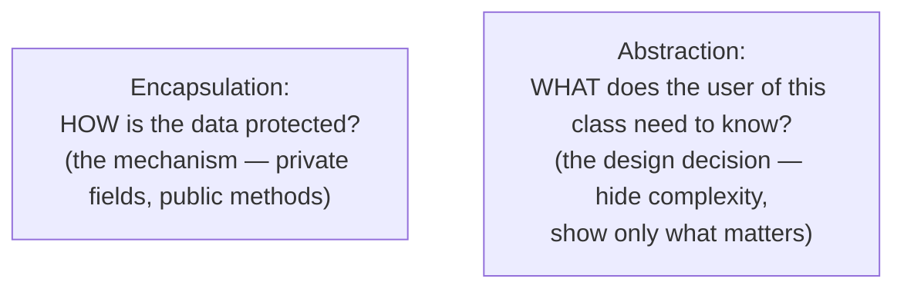

Think of driving a car again: **abstraction** is the fact that you only need to know "press the accelerator to go faster" — you don't need to understand the internal combustion process, the fuel injection timing, or the transmission's gear ratios at all. All of that complexity is abstracted away behind one simple action.

### Achieving abstraction in C++: abstract classes / interfaces
A common way to implement abstraction is through an **abstract class** — a class that defines *what* operations exist (the interface), without specifying *how* each one is implemented. In C++, this is done with **pure virtual functions**.

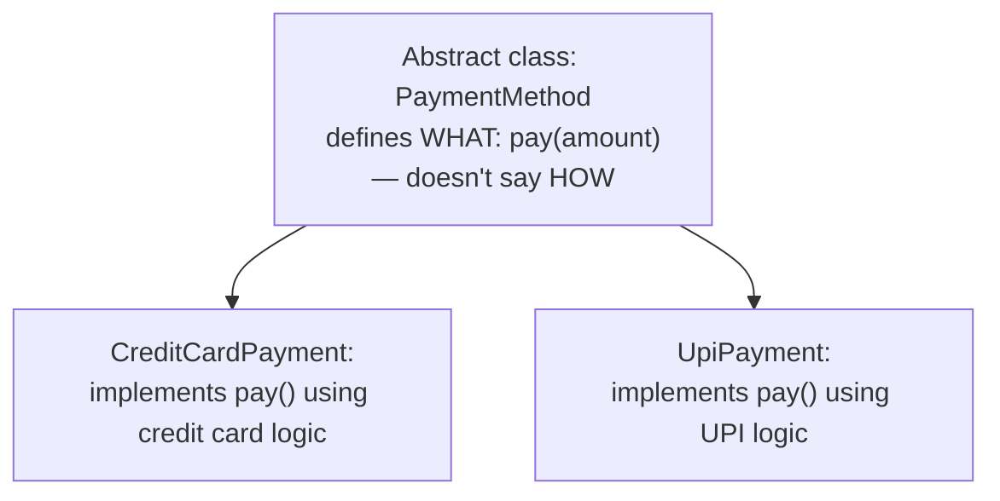

```cpp
// The ABSTRACTION — defines WHAT a payment method must be able to do,
// without saying HOW any specific method actually works
class PaymentMethod {
public:
    virtual void pay(double amount) = 0;  // "= 0" makes this a PURE virtual function
    virtual ~PaymentMethod() {}            // virtual destructor (good practice, see Inheritance)
};

// Concrete implementations provide the actual "HOW"
class CreditCardPayment : public PaymentMethod {
public:
    void pay(double amount) override {
        std::cout << "Paid " << amount << " using Credit Card (internal: contacting bank API...)\n";
    }
};

class UpiPayment : public PaymentMethod {
public:
    void pay(double amount) override {
        std::cout << "Paid " << amount << " using UPI (internal: generating QR code...)\n";
    }
};

void checkout(PaymentMethod& method, double amount) {
    // This function only knows the ABSTRACTION: "it can pay()"
    // It has ZERO idea whether it's a credit card, UPI, or anything else internally
    method.pay(amount);
}

int main() {
    CreditCardPayment card;
    UpiPayment upi;

    checkout(card, 500.0);  // "Paid 500 using Credit Card..."
    checkout(upi, 200.0);   // "Paid 200 using UPI..."
}
```

The `checkout()` function is a great example of abstraction in action: it works with *any* `PaymentMethod`, completely unaware of (and uninterested in) how each one actually processes a payment internally — it only needs to know that `pay()` exists.

---

## 5. Inheritance

### The idea
**Inheritance** lets one class (the **child**/**derived** class) reuse the attributes and methods of another class (the **parent**/**base** class), while adding or overriding its own specific behavior — modeling an "is-a" relationship (a `Dog` **is a** kind of `Animal`).

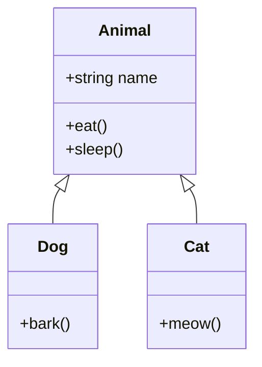

```cpp
class Animal {
protected:  // accessible to child classes, but not to outside code
    std::string name;

public:
    Animal(std::string n) : name(n) {}

    void eat() {
        std::cout << name << " is eating.\n";
    }

    void sleep() {
        std::cout << name << " is sleeping.\n";
    }
};

class Dog : public Animal {  // Dog INHERITS from Animal
public:
    Dog(std::string n) : Animal(n) {}  // calls the parent's constructor

    void bark() {  // Dog's OWN, additional behavior
        std::cout << name << " says: Woof!\n";
    }
};

int main() {
    Dog myDog("Rex");
    myDog.eat();   // ✅ inherited from Animal — Dog didn't need to redefine this
    myDog.sleep(); // ✅ inherited from Animal
    myDog.bark();  // ✅ Dog's own, specific behavior
}
```

- **Why it matters:** avoids duplicating `eat()` and `sleep()` in every single animal subclass — write shared behavior **once**, in the base class, and every derived class gets it for free.

### The pitfall: overusing inheritance
A very common LLD mistake is reaching for inheritance when the relationship isn't genuinely "is-a." A frequently cited example: should a `Car` class inherit from an `Engine` class? A car **has** an engine — it **isn't** a type of engine. This is exactly the distinction between inheritance and a different, often-preferable relationship called **composition**.

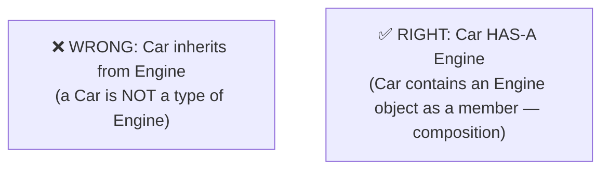

```cpp
// Composition: "HAS-A" relationship — Car contains an Engine, doesn't inherit from it
class Engine {
public:
    void start() { std::cout << "Engine starting...\n"; }
};

class Car {
private:
    Engine engine;  // Car HAS an Engine (composition, not inheritance)

public:
    void start() {
        engine.start();  // Car delegates to its Engine
        std::cout << "Car is ready to drive.\n";
    }
};
```

**A widely-repeated LLD design principle:** *"favor composition over inheritance"* — composition tends to produce more flexible, less tightly-coupled designs, and should generally be your default choice unless there's a genuine, clear "is-a" relationship.

---

## 6. Polymorphism

### The idea
**Polymorphism** ("many forms") means the **same method call** can behave **differently** depending on the actual underlying object it's called on — this is what makes the abstraction example in Section 4 actually work at runtime.

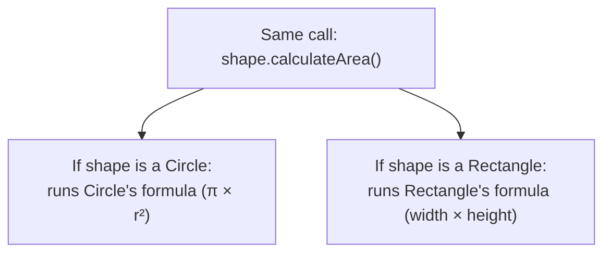

### Two kinds of polymorphism

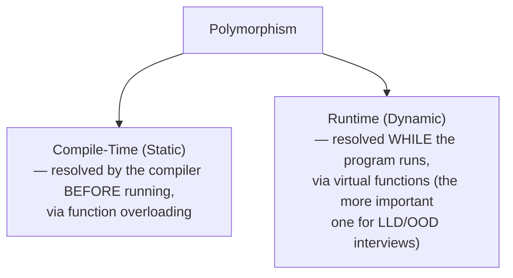

### Compile-Time Polymorphism: Function Overloading
Multiple functions with the **same name** but **different parameters** — the compiler decides which one to call based on the arguments provided, at compile time.

```cpp
class Calculator {
public:
    int add(int a, int b) {
        return a + b;
    }
    double add(double a, double b) {  // SAME name, DIFFERENT parameter types
        return a + b;
    }
};

int main() {
    Calculator calc;
    std::cout << calc.add(2, 3) << "\n";       // calls the int version → 5
    std::cout << calc.add(2.5, 3.5) << "\n";   // calls the double version → 6.0
}
```

### Runtime Polymorphism: Virtual Functions (the important one for LLD)
A base class pointer/reference can point to **any** derived class object, and calling a virtual method on it runs the **derived class's specific version** — decided at runtime, based on the object's actual type, not the pointer's declared type.

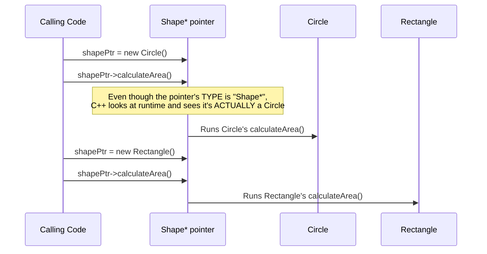

```cpp
class Shape {
public:
    virtual double calculateArea() = 0;  // pure virtual — makes Shape abstract too
    virtual ~Shape() {}                   // virtual destructor — IMPORTANT, see below
};

class Circle : public Shape {
private:
    double radius;
public:
    Circle(double r) : radius(r) {}
    double calculateArea() override {
        return 3.14159 * radius * radius;
    }
};

class Rectangle : public Shape {
private:
    double width, height;
public:
    Rectangle(double w, double h) : width(w), height(h) {}
    double calculateArea() override {
        return width * height;
    }
};

void printArea(Shape* shape) {
    // This function only knows it has a "Shape*" —
    // it doesn't know or care if it's ACTUALLY a Circle or a Rectangle
    std::cout << "Area: " << shape->calculateArea() << "\n";
}

int main() {
    Shape* shapes[2];
    shapes[0] = new Circle(5.0);
    shapes[1] = new Rectangle(4.0, 6.0);

    for (Shape* s : shapes) {
        printArea(s);  // SAME call, DIFFERENT behavior, decided at runtime
    }
    // Output:
    // Area: 78.5397  (Circle's formula ran)
    // Area: 24        (Rectangle's formula ran)

    for (Shape* s : shapes) delete s;  // cleanup
}
```

### Why the destructor must be `virtual` — a critical, commonly-tested detail
If `~Shape()` were **not** declared `virtual`, then `delete shapePtr` (where `shapePtr` is a `Shape*` actually pointing to a `Circle`) would only call `~Shape()`'s destructor, **not** `~Circle()`'s — silently skipping any cleanup specific to `Circle`, causing a memory leak or resource leak.

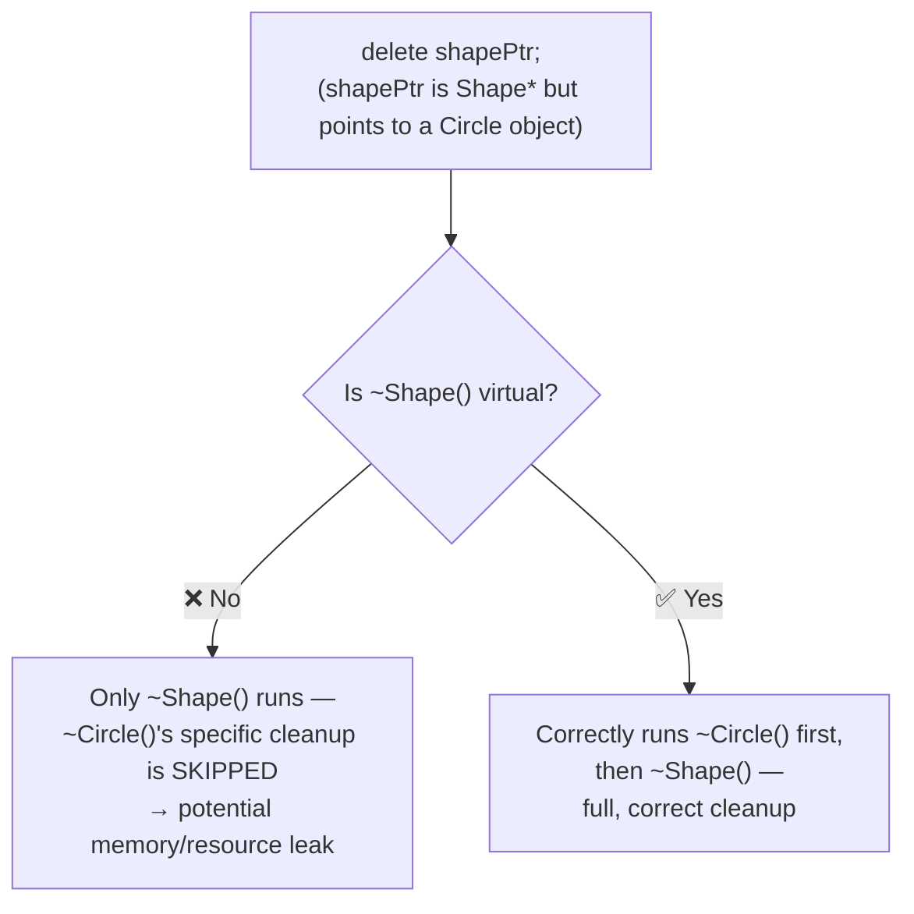

**Rule of thumb:** any class intended to be used **polymorphically** (accessed through a base class pointer, like `Shape*`) should almost always declare its destructor `virtual` — this is one of the most commonly tested "gotcha" details in C++ LLD interviews.

---

## 7. How All Four Pillars Work Together

These four ideas aren't independent, isolated concepts — a well-designed class typically uses all of them together, each solving a different piece of the puzzle.

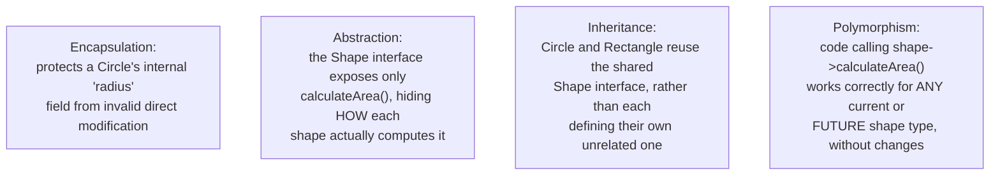

### The real payoff: extensibility
The single biggest practical benefit of combining these four pillars well: adding a brand new shape (say, `Triangle`) requires **zero changes** to the existing `printArea()` function or any other code that already works with `Shape*` — you just write the new class, and everything built on the abstraction continues to work automatically.

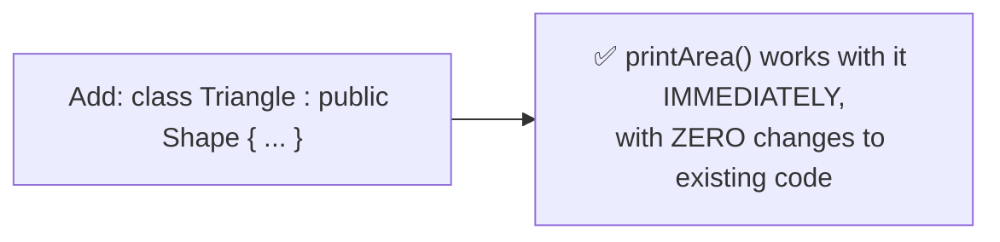

This property — being able to **extend** a system's behavior without **modifying** its existing, already-tested code — is such a core, valuable idea in good object-oriented design that it has its own name: the **Open/Closed Principle** (open for extension, closed for modification), which is one of the five SOLID principles typically covered next in an LLD learning path.

---

## 8. How to Reason About This in an Interview

If asked to explain these concepts, or asked *"why did you design your classes this way?"* during an LLD interview, a strong answer sounds like this:

> "I used encapsulation to keep each class's internal state private, only exposing controlled methods — for example, a `BankAccount`'s balance can only change through `deposit()` and `withdraw()`, which lets me enforce rules like 'never go negative' in exactly one place. I used abstraction by defining a `PaymentMethod` interface with a pure virtual `pay()` method, so any code that processes a payment only depends on that interface, not on the specific details of credit cards versus UPI. I used inheritance where there's a genuine is-a relationship — like `CreditCardPayment` is a `PaymentMethod` — but I was careful not to overuse it; where the relationship is really has-a, like a `Car` having an `Engine`, I used composition instead. And this all comes together through polymorphism: code that accepts a `PaymentMethod*` works correctly with any current or future payment type, without needing any changes — which means the design is open for extension but closed for modification, a property that makes it much easier to add new payment methods later without touching or re-testing existing code."

That answer shows: you understand each pillar *individually*, you know the classic encapsulation-vs-abstraction distinction, you know *when not* to use inheritance (composition over inheritance), and you connect the whole thing to *why* it actually matters in practice (extensibility) — not just reciting definitions.

---

## 9. Quick Recall Cheat Sheet

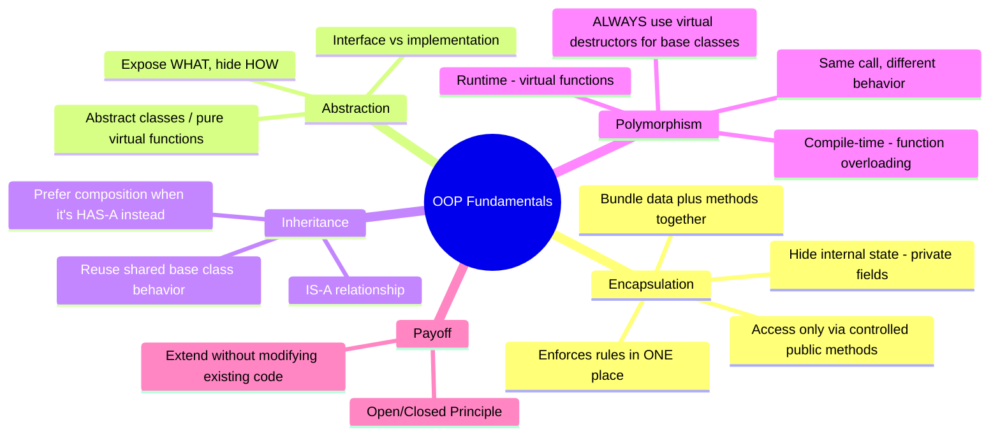

| If you remember only 5 things |
|---|
| 1. Encapsulation hides internal data behind private fields, exposing only controlled public methods — enforcing rules in one place. |
| 2. Abstraction exposes WHAT a class can do (the interface) while hiding HOW it actually does it (the implementation) — achieved in C++ via pure virtual functions. |
| 3. Inheritance models genuine "is-a" relationships; prefer composition ("has-a") when the relationship isn't truly inheritance — "favor composition over inheritance." |
| 4. Polymorphism lets the same method call behave differently based on the actual object's type at runtime — this is what makes abstractions like `Shape*` genuinely useful in practice. |
| 5. Always declare a base class's destructor `virtual` if it will be used polymorphically, or derived class cleanup can be silently skipped, causing leaks. |

---

*This file is written in GitHub-flavored Markdown with Mermaid diagrams and C++ code — it will render natively on GitHub, GitLab, and most modern Markdown viewers.*
