# SOLID Principles

*Phase 3 — Low-Level Design (LLD) / OOD. A zero-to-mastery guide, with C++ code.*

---

## Table of Contents
1. [What Is SOLID, and Why Does It Matter?](#1-what-is-solid-and-why-does-it-matter)
2. [S — Single Responsibility Principle](#2-s--single-responsibility-principle)
3. [O — Open/Closed Principle](#3-o--openclosed-principle)
4. [L — Liskov Substitution Principle](#4-l--liskov-substitution-principle)
5. [I — Interface Segregation Principle](#5-i--interface-segregation-principle)
6. [D — Dependency Inversion Principle](#6-d--dependency-inversion-principle)
7. [How All Five Work Together](#7-how-all-five-work-together)
8. [How to Reason About This in an Interview](#8-how-to-reason-about-this-in-an-interview)
9. [Quick Recall Cheat Sheet](#9-quick-recall-cheat-sheet)

---

## 1. What Is SOLID, and Why Does It Matter?

**SOLID** is a set of five design principles that, together, help produce code that's easier to **understand, extend, and maintain** — especially as a codebase grows and requirements inevitably change over time. Each letter stands for one principle:

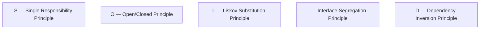

These directly build on the OOP Fundamentals topic — SOLID is essentially a set of hard-won, practical rules for **how to actually use** encapsulation, abstraction, inheritance, and polymorphism well, rather than just knowing what they are. Every LLD interview question — parking lots, elevators, chess engines — gets evaluated significantly on whether your class design respects these principles.

---

## 2. S — Single Responsibility Principle

### The idea
**A class should have only one reason to change** — meaning it should be responsible for exactly **one** well-defined piece of functionality, not several unrelated things bundled together.

Think of it like a job description: a "chef" should cook — if the same person is also expected to be the accountant, the marketer, and the delivery driver, any change to *any* of those responsibilities risks disrupting all the others, and it's unclear who to even ask about a given problem.

### A violation

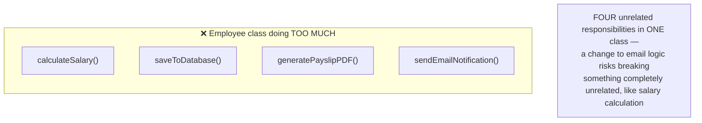

```cpp
// ❌ VIOLATES Single Responsibility — this class has FOUR reasons to change:
// salary rules changing, DB schema changing, PDF format changing, email provider changing
class Employee {
public:
    std::string name;
    double baseSalary;

    double calculateSalary() {
        return baseSalary * 1.1;  // e.g. some bonus calculation
    }

    void saveToDatabase() {
        // database logic mixed in here...
    }

    void generatePayslipPDF() {
        // PDF generation logic mixed in here...
    }

    void sendEmailNotification() {
        // email sending logic mixed in here...
    }
};
```

### Following the principle

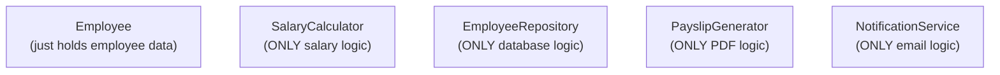

```cpp
// ✅ Each class has exactly ONE responsibility
class Employee {
public:
    std::string name;
    double baseSalary;
};

class SalaryCalculator {
public:
    double calculate(const Employee& emp) {
        return emp.baseSalary * 1.1;
    }
};

class EmployeeRepository {
public:
    void save(const Employee& emp) {
        // ONLY database logic lives here
    }
};

class PayslipGenerator {
public:
    void generatePDF(const Employee& emp, double salary) {
        // ONLY PDF logic lives here
    }
};

class NotificationService {
public:
    void sendEmail(const Employee& emp) {
        // ONLY email logic lives here
    }
};
```

**Why it matters:** if the email provider changes, only `NotificationService` needs to be touched — `Employee`, `SalaryCalculator`, and everything else remain completely untouched and unaffected, meaning far less risk of accidentally breaking unrelated functionality.

---

## 3. O — Open/Closed Principle

### The idea
**A class should be open for extension, but closed for modification** — you should be able to add new behavior **without changing existing, already-tested code**. This was already introduced as the "payoff" at the end of the OOP Fundamentals topic — this section covers exactly how to *achieve* it deliberately.

### A violation

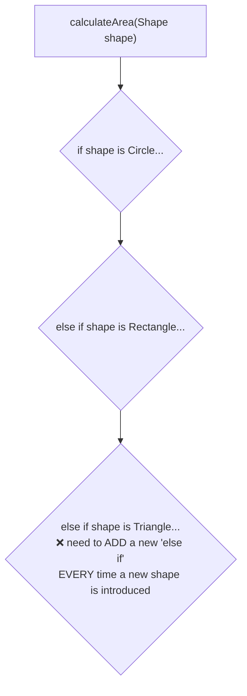

```cpp
// ❌ VIOLATES Open/Closed — adding a new shape means MODIFYING this function
enum class ShapeType { CIRCLE, RECTANGLE };

class Shape {
public:
    ShapeType type;
    double radius, width, height;
};

double calculateArea(const Shape& shape) {
    if (shape.type == ShapeType::CIRCLE) {
        return 3.14159 * shape.radius * shape.radius;
    } else if (shape.type == ShapeType::RECTANGLE) {
        return shape.width * shape.height;
    }
    // Adding a Triangle means coming back here and adding another "else if" —
    // risking breaking the EXISTING, already-tested Circle/Rectangle logic
    return 0;
}
```

### Following the principle (using polymorphism, as covered in OOP Fundamentals)

```cpp
// ✅ FOLLOWS Open/Closed — uses the abstraction + polymorphism from OOP Fundamentals
class Shape {
public:
    virtual double calculateArea() const = 0;
    virtual ~Shape() {}
};

class Circle : public Shape {
    double radius;
public:
    Circle(double r) : radius(r) {}
    double calculateArea() const override {
        return 3.14159 * radius * radius;
    }
};

class Rectangle : public Shape {
    double width, height;
public:
    Rectangle(double w, double h) : width(w), height(h) {}
    double calculateArea() const override {
        return width * height;
    }
};

// ✅ Adding a Triangle later requires ZERO changes here:
class Triangle : public Shape {
    double base, height;
public:
    Triangle(double b, double h) : base(b), height(h) {}
    double calculateArea() const override {
        return 0.5 * base * height;
    }
};

double printArea(const Shape& shape) {
    return shape.calculateArea();  // works for ANY shape, existing or future, unchanged
}
```

**Why it matters:** the more a system grows, the more dangerous it becomes to modify old, working code (recall: it's already tested, other things may depend on its exact current behavior) — designing for extension instead means new features are **added**, not **inserted into** fragile existing logic.

---

## 4. L — Liskov Substitution Principle

### The idea
**Objects of a derived class should be substitutable for objects of the base class, without breaking correctness.** In other words: anywhere your code expects a `Base*`, it should work correctly even if it's actually handed a `Derived*` — the derived class shouldn't secretly change or violate the behavior the base class promised.

This is a *stricter*, more precise version of the "is-a" relationship discussed in the Inheritance section of OOP Fundamentals — the derived class doesn't just need to conceptually "be a" base class, it needs to genuinely **behave like one**, honoring all its promises.

### The classic violation: Square inheriting from Rectangle
This is the single most commonly cited LLD example for this principle — it looks correct at first glance, which is exactly why it's such a good teaching example.

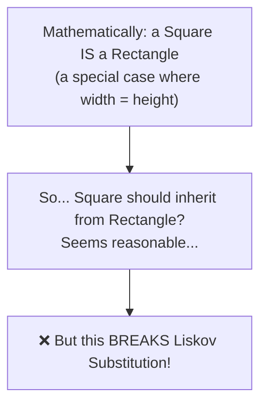

```cpp
class Rectangle {
protected:
    double width, height;
public:
    virtual void setWidth(double w) { width = w; }
    virtual void setHeight(double h) { height = h; }
    double getArea() const { return width * height; }
};

class Square : public Rectangle {
public:
    // A Square must keep width == height, so it OVERRIDES the setters
    // to force both dimensions to change together:
    void setWidth(double w) override {
        width = w;
        height = w;  // forces height to match, to maintain "squareness"
    }
    void setHeight(double h) override {
        width = h;
        height = h;
    }
};

// Code written to work with ANY Rectangle:
void testRectangle(Rectangle& rect) {
    rect.setWidth(5);
    rect.setHeight(4);
    // A caller REASONABLY expects area = 5 * 4 = 20 here, based on Rectangle's behavior
    std::cout << "Expected area: 20, Actual area: " << rect.getArea() << "\n";
}

int main() {
    Rectangle rect;
    testRectangle(rect);  // ✅ Actual area: 20 — works as expected

    Square sq;
    testRectangle(sq);    // ❌ Actual area: 16 — WRONG! setHeight(4) silently
                           //    also changed width to 4, breaking the caller's
                           //    reasonable expectation based on Rectangle's contract
}
```

- **What went wrong:** `testRectangle()` was written correctly, assuming standard `Rectangle` behavior. But substituting a `Square` in its place produced an incorrect, surprising result — this is *exactly* what Liskov Substitution forbids. The `Square` technically "is a" `Rectangle` conceptually, but it doesn't **behave** like one from the caller's perspective.

### The fix
Don't force this relationship through inheritance at all — `Square` and `Rectangle` can both separately implement a common `Shape` interface (recall Open/Closed's approach) instead of one inheriting from the other, avoiding the broken behavioral contract entirely.

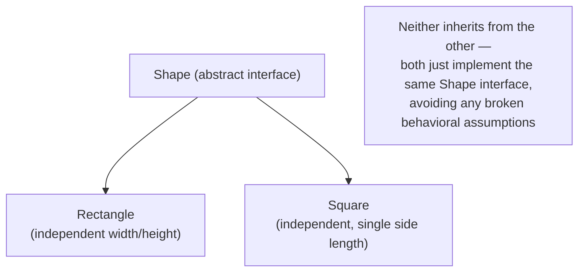

**Why it matters:** violating this principle means code that works perfectly with a base class can silently break when handed a derived class instead — exactly the kind of bug that's hard to catch, because each class *looks* correct in isolation.

---

## 5. I — Interface Segregation Principle

### The idea
**Don't force a class to implement methods it doesn't actually need.** Prefer several small, focused interfaces over one large, "do everything" interface — a class should only need to know about the specific methods that are actually relevant to it.

### A violation

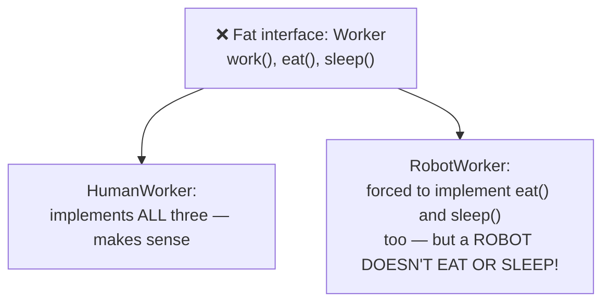

```cpp
// ❌ VIOLATES Interface Segregation — forces EVERY implementer
// to define ALL three methods, even ones that make no sense for them
class Worker {
public:
    virtual void work() = 0;
    virtual void eat() = 0;
    virtual void sleep() = 0;
};

class RobotWorker : public Worker {
public:
    void work() override {
        std::cout << "Robot is working.\n";
    }
    void eat() override {
        // ❌ This makes no sense for a robot — forced to write SOMETHING here anyway
        throw std::logic_error("Robots don't eat!");
    }
    void sleep() override {
        // ❌ Same problem
        throw std::logic_error("Robots don't sleep!");
    }
};
```

### Following the principle

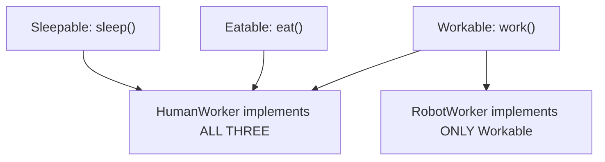

```cpp
// ✅ Small, focused interfaces — implement ONLY what's actually relevant
class Workable {
public:
    virtual void work() = 0;
};

class Eatable {
public:
    virtual void eat() = 0;
};

class Sleepable {
public:
    virtual void sleep() = 0;
};

class HumanWorker : public Workable, public Eatable, public Sleepable {
public:
    void work() override { std::cout << "Human is working.\n"; }
    void eat() override { std::cout << "Human is eating.\n"; }
    void sleep() override { std::cout << "Human is sleeping.\n"; }
};

class RobotWorker : public Workable {  // ONLY implements what's relevant
public:
    void work() override { std::cout << "Robot is working.\n"; }
    // No forced eat()/sleep() — they were never relevant to begin with
};
```

**Why it matters:** forcing irrelevant methods onto a class leads to either dead/meaningless implementations, or worse, implementations that throw errors or silently do nothing — both are confusing traps for anyone using that class later, since the interface *claims* the capability exists.

---

## 6. D — Dependency Inversion Principle

### The idea
**High-level modules shouldn't depend directly on low-level modules — both should depend on abstractions (interfaces).** This sounds abstract, so a concrete example makes it click immediately.

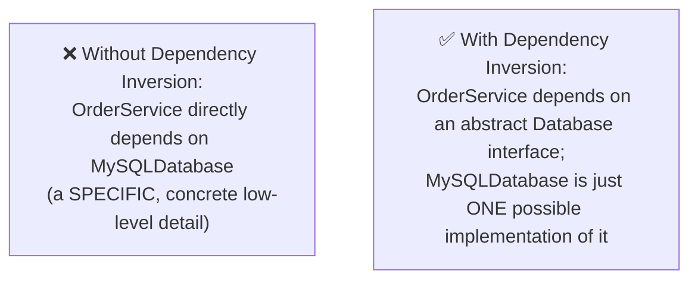

### A violation

```cpp
// ❌ VIOLATES Dependency Inversion — OrderService is tightly coupled
// to one SPECIFIC database implementation
class MySQLDatabase {
public:
    void save(const std::string& data) {
        std::cout << "Saved to MySQL: " << data << "\n";
    }
};

class OrderService {
private:
    MySQLDatabase db;  // ❌ directly depends on a CONCRETE class
public:
    void placeOrder(const std::string& orderData) {
        db.save(orderData);
    }
};
// Problem: switching to PostgreSQL, or writing a test with a fake database,
// requires actually MODIFYING OrderService's code
```

### Following the principle

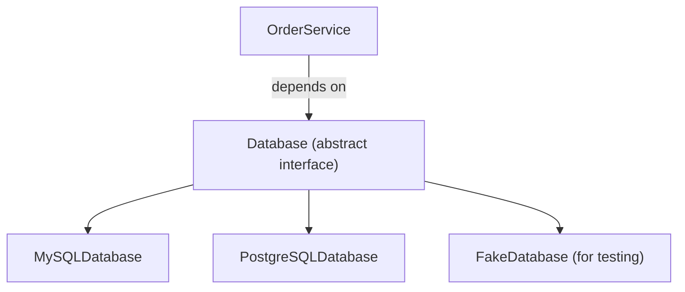

```cpp
// ✅ FOLLOWS Dependency Inversion — depend on the ABSTRACTION, not a specific class
class Database {  // the abstraction
public:
    virtual void save(const std::string& data) = 0;
    virtual ~Database() {}
};

class MySQLDatabase : public Database {
public:
    void save(const std::string& data) override {
        std::cout << "Saved to MySQL: " << data << "\n";
    }
};

class PostgreSQLDatabase : public Database {
public:
    void save(const std::string& data) override {
        std::cout << "Saved to PostgreSQL: " << data << "\n";
    }
};

class OrderService {
private:
    Database& db;  // ✅ depends on the ABSTRACTION, not a specific implementation
public:
    OrderService(Database& database) : db(database) {}  // "injected" from outside

    void placeOrder(const std::string& orderData) {
        db.save(orderData);
    }
};

int main() {
    MySQLDatabase mysql;
    OrderService serviceA(mysql);   // works with MySQL...
    serviceA.placeOrder("Order #1");

    PostgreSQLDatabase postgres;
    OrderService serviceB(postgres); // ...or PostgreSQL, with ZERO changes to OrderService
    serviceB.placeOrder("Order #2");
}
```

- This pattern — passing in a dependency from the outside, rather than a class creating its own concrete dependency internally — is called **Dependency Injection**, and it's the primary mechanism used to actually achieve Dependency Inversion in real code.
- **Why it matters:** `OrderService` can now work with *any* database implementation, including a `FakeDatabase` used purely for fast, isolated unit testing — without touching `OrderService`'s code at all. This is also a huge, practical win for testability, which is often the single biggest real-world motivation for this principle.

---

## 7. How All Five Work Together

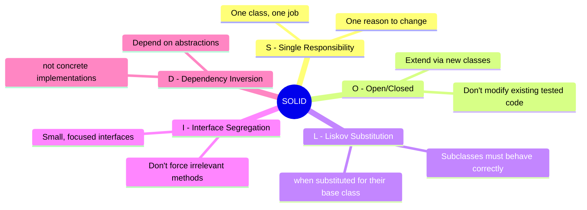

These five principles reinforce each other in practice:
- **S** keeps classes small and focused, which naturally makes **I** (small interfaces) easier to achieve.
- **O** is achieved specifically *through* polymorphism, which only works correctly if **L** is respected (a substituted subclass must actually behave correctly).
- **D** often *requires* **O** and **L** — depending on an abstraction only pays off if any concrete implementation can be substituted in safely and extended without modifying existing code.

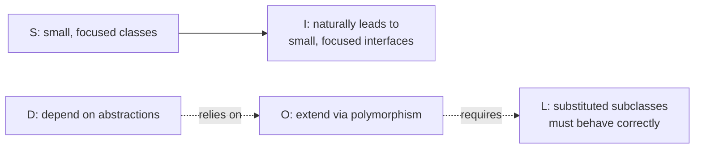

---

## 8. How to Reason About This in an Interview

If asked to review or design a class structure in an LLD interview, weaving in SOLID naturally sounds like this:

> "I'd start by making sure each class has a single, clear responsibility — for example, keeping order data separate from persistence logic, so a change to how we store orders doesn't risk touching order business rules. For extensibility, I'd design around interfaces and polymorphism rather than conditional logic checking types, so adding a new payment method or a new shape later doesn't require modifying existing, already-tested code — that's the Open/Closed principle in action. When using inheritance, I'd specifically check that a subclass genuinely behaves like its base class in every case a caller might reasonably expect, not just that it conceptually 'is a' type of it — the classic Square-inheriting-from-Rectangle example is a good reminder that inheritance can look correct on paper while still violating Liskov Substitution. I'd keep interfaces small and focused, so implementing classes are never forced to define irrelevant methods. And for dependencies like a database or a payment gateway, I'd depend on an abstract interface rather than a specific concrete class, and inject the actual implementation from outside — this makes the code both more flexible if requirements change, and much easier to unit test with fakes or mocks."

That answer shows: you can apply each principle to a *concrete* example rather than reciting definitions, you know the classic Liskov counter-example, and you connect Dependency Inversion to its most common real-world payoff — testability.

---

## 9. Quick Recall Cheat Sheet

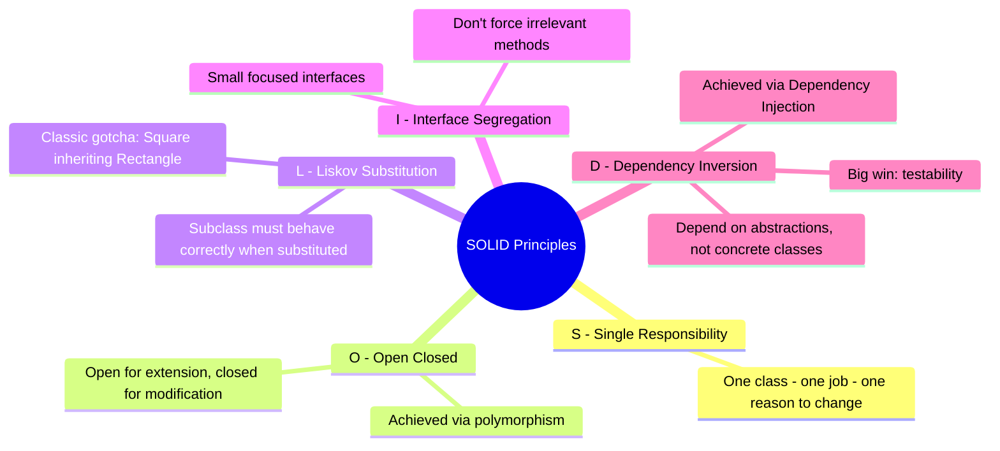

| If you remember only 5 things |
|---|
| 1. Single Responsibility: a class should have one job and one reason to change — split unrelated responsibilities into separate classes. |
| 2. Open/Closed: design so new behavior can be added via new classes (polymorphism), without modifying existing, already-tested code. |
| 3. Liskov Substitution: a subclass must behave correctly wherever its base class is expected — "is-a" isn't enough if the behavior breaks caller expectations (see: Square/Rectangle). |
| 4. Interface Segregation: keep interfaces small and focused — don't force a class to implement methods that don't apply to it. |
| 5. Dependency Inversion: depend on abstractions (interfaces), not concrete implementations — inject dependencies from outside for flexibility and testability. |

---

*This file is written in GitHub-flavored Markdown with Mermaid diagrams and C++ code — it will render natively on GitHub, GitLab, and most modern Markdown viewers.*
