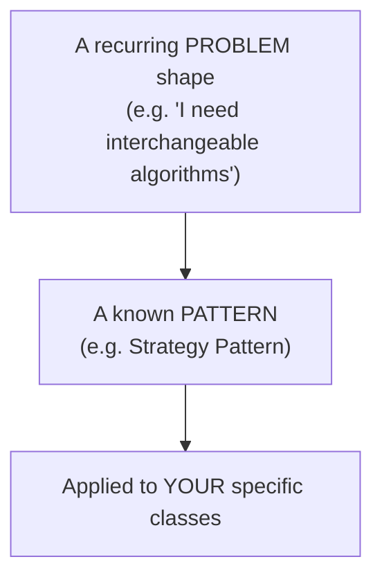
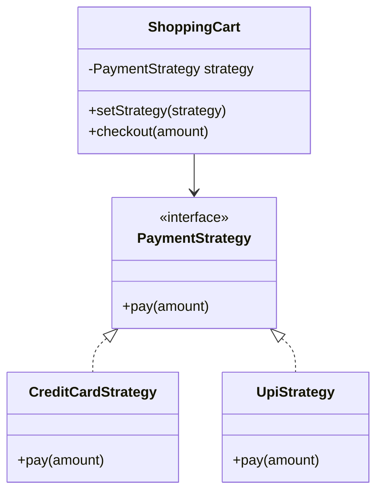
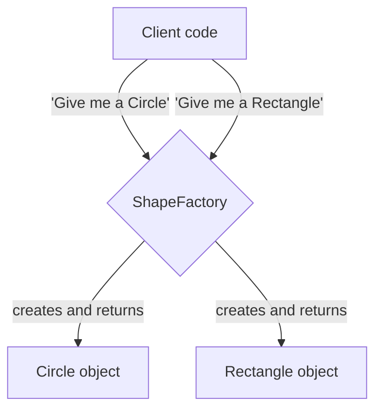
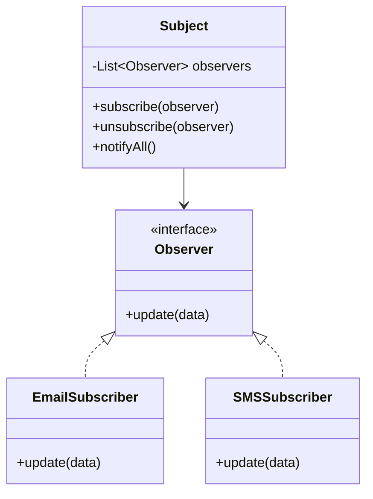
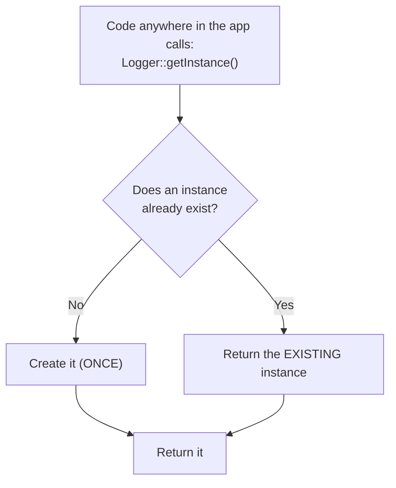
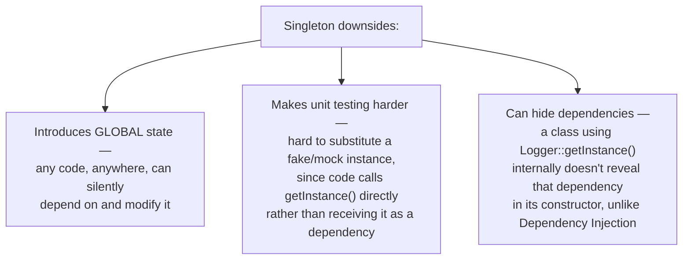
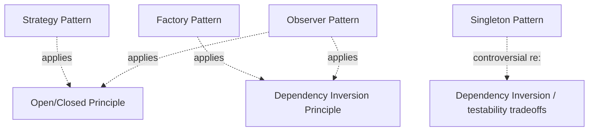

# Common Design Patterns: Strategy, Factory, Observer, Singleton

*Phase 3 — Low-Level Design (LLD) / OOD. A zero-to-mastery guide, with C++ code.*

---

## Table of Contents
1. [What Is a Design Pattern?](#1-what-is-a-design-pattern)
2. [Strategy Pattern](#2-strategy-pattern)
3. [Factory Pattern](#3-factory-pattern)
4. [Observer Pattern](#4-observer-pattern)
5. [Singleton Pattern](#5-singleton-pattern)
6. [How These Patterns Connect to SOLID](#6-how-these-patterns-connect-to-solid)
7. [How to Reason About This in an Interview](#7-how-to-reason-about-this-in-an-interview)
8. [Quick Recall Cheat Sheet](#8-quick-recall-cheat-sheet)

---

## 1. What Is a Design Pattern?

A **design pattern** is a reusable, well-tested **solution template** for a problem that comes up repeatedly in software design — not a specific piece of code you copy-paste, but a general **approach** you adapt to your specific situation.

Think of it like a recipe technique (e.g., "how to properly sear a steak") rather than one exact recipe — once you know the technique, you can apply it to many different specific dishes. Design patterns work the same way: once you recognize "oh, this is a Strategy problem," you know the general shape of a good solution, even though the exact classes involved will differ every time.



These four patterns directly build on the SOLID principles topic — each pattern is essentially a concrete, named way of **applying** one or more SOLID principles to solve a specific, common problem shape.

---

## 2. Strategy Pattern

### The problem it solves
You have a task that can be done in **multiple different ways**, and you want to be able to swap between those ways easily — without a tangle of `if/else` statements, and without the class doing the task needing to know the details of each way.

### The idea
Define a common **interface** for "a way of doing the task," implement each specific approach as its own class, and let the main class hold a reference to whichever strategy it's currently using — swappable at any time.



This is precisely the `PaymentMethod` example already introduced in the Abstraction section of OOP Fundamentals — the Strategy Pattern is just the **formal name** for that exact structure, specifically applied to interchangeable algorithms/behaviors.

### C++ implementation

```cpp
// The STRATEGY interface — defines the interchangeable behavior
class PaymentStrategy {
public:
    virtual void pay(double amount) = 0;
    virtual ~PaymentStrategy() {}
};

// Concrete strategies — each a different "way" of paying
class CreditCardStrategy : public PaymentStrategy {
public:
    void pay(double amount) override {
        std::cout << "Paid " << amount << " via Credit Card.\n";
    }
};

class UpiStrategy : public PaymentStrategy {
public:
    void pay(double amount) override {
        std::cout << "Paid " << amount << " via UPI.\n";
    }
};

// The CONTEXT class — uses a strategy, without caring which specific one
class ShoppingCart {
private:
    PaymentStrategy* strategy;  // holds a reference to the CURRENT strategy
public:
    void setStrategy(PaymentStrategy* newStrategy) {
        strategy = newStrategy;  // can be SWAPPED at any time
    }

    void checkout(double amount) {
        strategy->pay(amount);  // delegates to whichever strategy is currently set
    }
};

int main() {
    ShoppingCart cart;
    CreditCardStrategy card;
    UpiStrategy upi;

    cart.setStrategy(&card);
    cart.checkout(500.0);   // "Paid 500 via Credit Card."

    cart.setStrategy(&upi);  // ✅ swapped at RUNTIME, no changes to ShoppingCart's code
    cart.checkout(200.0);   // "Paid 200 via UPI."
}
```

### Why it matters
- Adding a new payment method (e.g., `NetBankingStrategy`) requires **zero changes** to `ShoppingCart` — directly the **Open/Closed Principle** from the SOLID topic, applied specifically to swappable algorithms.
- `ShoppingCart` doesn't need a giant `if (type == "credit_card") ... else if (type == "upi") ...` chain — the decision of *which* strategy to use is made once, elsewhere, and `ShoppingCart` just uses whatever it's handed.

---

## 3. Factory Pattern

### The problem it solves
Object creation logic can get messy and repetitive if scattered throughout a codebase — especially when *which* class to instantiate depends on some condition, and that condition-checking logic would otherwise be duplicated everywhere an object needs to be created.

### The idea
Centralize object creation into a single, dedicated method/class (a "factory") — the rest of the code asks the factory for an object, without needing to know exactly which concrete class gets created or how.



### C++ implementation

```cpp
// The product hierarchy (same Shape interface from earlier topics)
class Shape {
public:
    virtual void draw() = 0;
    virtual ~Shape() {}
};

class Circle : public Shape {
public:
    void draw() override { std::cout << "Drawing a Circle\n"; }
};

class Rectangle : public Shape {
public:
    void draw() override { std::cout << "Drawing a Rectangle\n"; }
};

// The FACTORY — centralizes the "which class to instantiate" decision
class ShapeFactory {
public:
    static Shape* createShape(const std::string& type) {
        if (type == "circle") {
            return new Circle();
        } else if (type == "rectangle") {
            return new Rectangle();
        }
        return nullptr;  // unknown type
    }
};

int main() {
    // Client code doesn't need to know Circle or Rectangle's constructors directly —
    // it just asks the factory for what it needs, by a simple description
    Shape* shape1 = ShapeFactory::createShape("circle");
    shape1->draw();  // "Drawing a Circle"

    Shape* shape2 = ShapeFactory::createShape("rectangle");
    shape2->draw();  // "Drawing a Rectangle"

    delete shape1;
    delete shape2;
}
```

### Why it matters
- **Without a factory:** if `Circle`'s constructor logic ever changes (e.g., it now needs an extra setup step), every single place in the codebase that does `new Circle(...)` needs to be found and updated.
- **With a factory:** only `ShapeFactory::createShape()` needs to change — every caller is shielded from that detail, directly applying the **Dependency Inversion Principle**: client code depends on the abstract `Shape` interface and the factory, never on concrete classes like `Circle` directly.

### A quick note on "Factory Method" vs "Abstract Factory"
This example shows the simpler, commonly-asked **Factory Method** style (one method, decides which concrete class to build). A more advanced variant, **Abstract Factory**, involves a *family* of related factories (e.g., a `UIFactory` that creates matching buttons, checkboxes, and menus for either a "Windows style" or "Mac style" look) — worth knowing the name exists, though the simpler Factory Method shown here covers the vast majority of LLD interview needs.

---

## 4. Observer Pattern

### The problem it solves
You need certain objects (**subscribers**) to be automatically notified whenever something changes in another object (the **subject**) — without the subject needing to know exactly who's listening, or hard-coding calls to every specific subscriber.

Think of it like subscribing to a YouTube channel: the channel (subject) doesn't need to know your name or personally message you — it just publishes a new video, and everyone currently subscribed (observers) automatically gets notified.



### C++ implementation

```cpp
#include <vector>
#include <string>

// The OBSERVER interface — anything that wants to be notified implements this
class Observer {
public:
    virtual void update(const std::string& newPrice) = 0;
    virtual ~Observer() {}
};

// The SUBJECT — holds a list of observers, notifies them all on change
class StockTicker {
private:
    std::vector<Observer*> observers;
    std::string currentPrice;

public:
    void subscribe(Observer* obs) {
        observers.push_back(obs);
    }

    void unsubscribe(Observer* obs) {
        observers.erase(std::remove(observers.begin(), observers.end(), obs), observers.end());
    }

    void setPrice(const std::string& newPrice) {
        currentPrice = newPrice;
        notifyAll();  // automatically tells EVERY current subscriber
    }

private:
    void notifyAll() {
        for (Observer* obs : observers) {
            obs->update(currentPrice);
        }
    }
};

// Concrete observers — each reacts to updates in its own way
class MobileAppDisplay : public Observer {
public:
    void update(const std::string& newPrice) override {
        std::cout << "Mobile App: price updated to " << newPrice << "\n";
    }
};

class EmailAlert : public Observer {
public:
    void update(const std::string& newPrice) override {
        std::cout << "Email Alert: price is now " << newPrice << "\n";
    }
};

int main() {
    StockTicker ticker;
    MobileAppDisplay app;
    EmailAlert email;

    ticker.subscribe(&app);
    ticker.subscribe(&email);

    ticker.setPrice("$150.25");
    // Output:
    // Mobile App: price updated to $150.25
    // Email Alert: price is now $150.25

    ticker.unsubscribe(&email);  // email stops receiving updates
    ticker.setPrice("$151.00");
    // Output (only the app, since email unsubscribed):
    // Mobile App: price updated to $151.00
}
```

### Why it matters
- `StockTicker` has **zero knowledge** of `MobileAppDisplay` or `EmailAlert` specifically — it only knows about the generic `Observer` interface, again applying **Dependency Inversion**.
- New observer types (e.g., a `PushNotificationAlert`) can subscribe **without any changes to `StockTicker`** — the **Open/Closed Principle** again, this time applied to "who gets notified" rather than "which algorithm runs."
- This is conceptually the same pattern underlying real-world pub/sub systems (recall the **Pub/Sub model** from the Message Queues topic in Phase 1) — the Observer Pattern is essentially pub/sub, implemented in-process within a single application, rather than across distributed services with a message broker.

---

## 5. Singleton Pattern

### The problem it solves
Sometimes you genuinely need **exactly one** instance of a class to exist throughout the entire application's lifetime — e.g., a single configuration manager, a single logging service, or a single connection pool manager — and you need a reliable way to access that one instance from anywhere in the code.

### The idea
The class itself controls its own instantiation, ensuring only one instance is ever created, and provides a single, well-known way (usually a static method) to access that one instance.



### C++ implementation

```cpp
class Logger {
private:
    // Private constructor — NO other code can call "new Logger()" directly
    Logger() {
        std::cout << "Logger instance created.\n";
    }

    static Logger* instance;  // holds the single instance

public:
    // Delete copy constructor and assignment — prevents accidental duplication
    Logger(const Logger&) = delete;
    Logger& operator=(const Logger&) = delete;

    static Logger* getInstance() {
        if (instance == nullptr) {
            instance = new Logger();  // created only ONCE, the first time it's needed
        }
        return instance;
    }

    void log(const std::string& message) {
        std::cout << "[LOG]: " << message << "\n";
    }
};

Logger* Logger::instance = nullptr;  // initialize the static member

int main() {
    Logger* logger1 = Logger::getInstance();
    logger1->log("First message");

    Logger* logger2 = Logger::getInstance();  // returns the SAME existing instance
    logger2->log("Second message");

    std::cout << "Same instance? " << (logger1 == logger2) << "\n";  // 1 (true)
}
```

### A modern, thread-safe C++ approach
The classic version above has a subtle problem in multi-threaded programs: two threads could both check `instance == nullptr` at the same time and both create separate instances (a race condition, echoing the Concurrency Control topic from Phase 1). Modern C++ (C++11 and later) offers a cleaner, automatically thread-safe way using a static local variable:

```cpp
class Logger {
private:
    Logger() {}

public:
    Logger(const Logger&) = delete;
    Logger& operator=(const Logger&) = delete;

    static Logger& getInstance() {
        static Logger instance;  // ✅ C++11 guarantees this is created EXACTLY once,
        return instance;          //    even under concurrent access — no manual locking needed
    }

    void log(const std::string& message) {
        std::cout << "[LOG]: " << message << "\n";
    }
};

int main() {
    Logger::getInstance().log("Hello from a thread-safe Singleton");
}
```

### An important caution: Singleton is a somewhat controversial pattern
Unlike Strategy, Factory, and Observer, Singleton is frequently **criticized** in real-world software design, and it's worth knowing why — this nuance itself is a strong signal of depth in an interview.



**A common, more testable alternative:** instead of a class reaching out and grabbing the singleton itself (`Logger::getInstance()`), pass the single shared instance in from outside via **Dependency Injection** (recall the Dependency Inversion Principle from SOLID) — the class still only ever receives *one* shared `Logger`, but it's far easier to substitute a fake logger during testing, and the dependency is visible and explicit.

---

## 6. How These Patterns Connect to SOLID



None of these four patterns are new *ideas* beyond what SOLID already established — they're **named, recognized shapes** that specific SOLID-driven solutions tend to take, over and over, across countless different problems. Recognizing "this is a Strategy problem" or "this is an Observer problem" quickly, during an interview, lets you skip straight to a proven, well-understood structure instead of designing one from scratch under time pressure.

---

## 7. How to Reason About This in an Interview

If asked to design something and a familiar pattern shape emerges, naming and applying it explicitly sounds like this:

> "Since this system needs to support multiple interchangeable ways of calculating shipping cost, I'd use the Strategy pattern — a common `ShippingStrategy` interface, with concrete classes like `StandardShipping` and `ExpressShipping`, so the `Order` class doesn't need conditional logic and new shipping methods can be added without touching existing code. For creating the right kind of notification object based on a type string, I'd use a Factory, centralizing that decision in one place rather than scattering type-checking logic throughout the codebase. If multiple parts of the system need to react whenever an order's status changes — updating the UI, sending an email, logging an audit trail — I'd use the Observer pattern, so the `Order` class just notifies its subscribers generically, without knowing or caring what each one specifically does in response. And if I need exactly one shared instance of something like a configuration manager, I'd consider a Singleton, but I'd lean toward passing it in via dependency injection rather than having classes call `getInstance()` directly, specifically to keep the code easier to unit test."

That answer shows: you recognize *which* pattern fits *which* problem shape, you can name and correctly implement each one, and — importantly for Singleton specifically — you show awareness of its real-world downsides rather than treating it as a default good choice.

---

## 8. Quick Recall Cheat Sheet

```mermaid
mindmap
  root((Design Patterns))
    Strategy
      Interchangeable algorithms/behaviors
      Common interface, swappable implementations
      Avoids if-else chains
      Applies Open-Closed Principle
    Factory
      Centralizes object creation
      Client depends on abstraction, not concrete class
      Applies Dependency Inversion
    Observer
      Subject notifies subscribed observers automatically
      Subject doesn't know specific observer details
      Same idea as Pub/Sub, in-process
    Singleton
      Exactly ONE instance, globally accessible
      Modern C++: static local variable, thread-safe
      Controversial - global state, harder to test
      Prefer Dependency Injection over getInstance() calls
```

| If you remember only 5 things |
|---|
| 1. Strategy Pattern: define a common interface for interchangeable algorithms/behaviors, swappable at runtime — avoids messy if/else chains. |
| 2. Factory Pattern: centralize object creation logic in one place, so client code depends on an abstraction rather than specific concrete classes. |
| 3. Observer Pattern: a subject automatically notifies all subscribed observers on a change, without knowing their specific details — the in-process version of pub/sub. |
| 4. Singleton Pattern: ensures exactly one instance of a class exists — in modern C++, use a static local variable inside `getInstance()` for automatic thread safety. |
| 5. Singleton is genuinely controversial — it introduces global state and hurts testability; prefer passing the single instance via dependency injection where practical. |

---

*This file is written in GitHub-flavored Markdown with Mermaid diagrams and C++ code — it will render natively on GitHub, GitLab, and most modern Markdown viewers.*
