# Class Diagrams / UML Basics

*Phase 3 — Low-Level Design (LLD) / OOD. A zero-to-mastery guide, with C++ code.*

---

## Table of Contents
1. [What Is UML, and Why Does LLD Need It?](#1-what-is-uml-and-why-does-lld-need-it)
2. [Anatomy of a Single Class Box](#2-anatomy-of-a-single-class-box)
3. [Visibility Symbols](#3-visibility-symbols)
4. [Relationship 1: Association](#4-relationship-1-association)
5. [Relationship 2: Aggregation](#5-relationship-2-aggregation)
6. [Relationship 3: Composition](#6-relationship-3-composition)
7. [Aggregation vs Composition — Side by Side](#7-aggregation-vs-composition--side-by-side)
8. [Relationship 4: Inheritance (Generalization)](#8-relationship-4-inheritance-generalization)
9. [Relationship 5: Realization (Implementing an Interface)](#9-relationship-5-realization-implementing-an-interface)
10. [Multiplicity (Cardinality)](#10-multiplicity-cardinality)
11. [Putting It All Together: A Full Class Diagram](#11-putting-it-all-together-a-full-class-diagram)
12. [How to Reason About This in an Interview](#12-how-to-reason-about-this-in-an-interview)
13. [Quick Recall Cheat Sheet](#13-quick-recall-cheat-sheet)

---

## 1. What Is UML, and Why Does LLD Need It?

**UML (Unified Modeling Language)** is a standardized set of diagram notations for visually representing software design. **Class diagrams** specifically are the UML tool most relevant to LLD — they show what classes exist, what each one contains, and **how they relate to each other**, all before writing a single line of actual code.

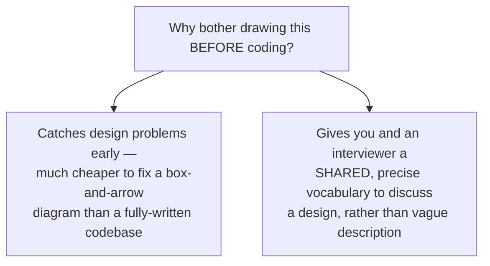

Every LLD interview essentially asks you to produce something equivalent to a class diagram (even if you're describing it verbally or sketching it) before, or alongside, writing actual code — this notation is the direct bridge between the OOP/SOLID/Patterns concepts already covered and an actual class design for a real problem (Parking Lot, Elevator, etc.).

---

## 2. Anatomy of a Single Class Box

A UML class is drawn as a box with **three compartments**: the class name, its attributes (data), and its methods (behavior) — directly mirroring the Encapsulation idea from OOP Fundamentals.

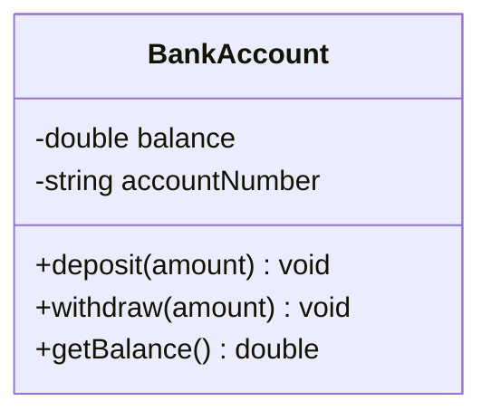

| Compartment | Contains |
|---|---|
| Top | Class name |
| Middle | Attributes (fields), with their types |
| Bottom | Methods, with parameters and return types |

### Mapped directly to C++

```cpp
class BankAccount {
private:
    double balance;          // matches "-double balance" in the diagram
    std::string accountNumber; // matches "-string accountNumber"

public:
    void deposit(double amount);     // matches "+deposit(amount) void"
    void withdraw(double amount);    // matches "+withdraw(amount) void"
    double getBalance();             // matches "+getBalance() double"
};
```

The diagram and the code are meant to be **directly, mechanically translatable** in both directions — this is exactly why class diagrams are useful for LLD: they're precise enough to code from directly, not just a loose sketch.

---

## 3. Visibility Symbols

The `+` and `-` symbols seen above aren't arbitrary — they're a standardized shorthand for **access modifiers**, directly corresponding to the Encapsulation concepts from OOP Fundamentals.

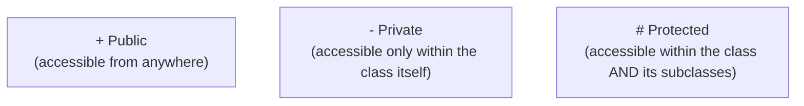

| Symbol | Meaning | C++ Equivalent |
|---|---|---|
| `+` | Public | `public:` |
| `-` | Private | `private:` |
| `#` | Protected | `protected:` |

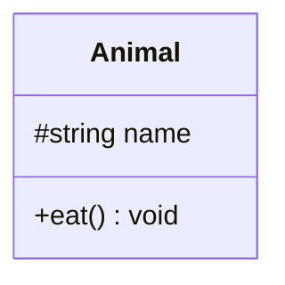
```cpp
class Animal {
protected:            // matches "#string name"
    std::string name;
public:                // matches "+eat() void"
    void eat();
};
```

---

## 4. Relationship 1: Association

### The idea
**Association** is the most general, loosest kind of relationship: one class simply **uses or knows about** another, typically shown as a plain line, often with an arrow indicating direction.

Think of it like a `Student` and a `Course` — a student is associated with the courses they're enrolled in, but neither one "owns" or is "made of" the other; they're just connected, independent entities that reference each other.

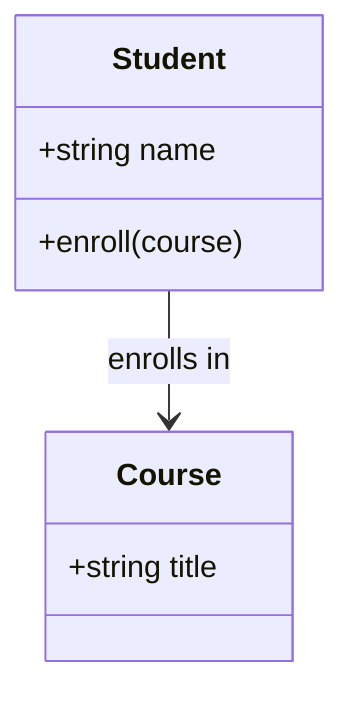

```cpp
class Course {
public:
    std::string title;
};

class Student {
public:
    std::string name;
    void enroll(Course* course) {
        // Student KNOWS ABOUT a Course here, but doesn't own or contain it —
        // the Course object exists independently, elsewhere
        std::cout << name << " enrolled in " << course->title << "\n";
    }
};
```

---

## 5. Relationship 2: Aggregation

### The idea
**Aggregation** is a **"has-a"** relationship (recall this term from the Inheritance section of OOP Fundamentals) where one class contains references to others, but those contained objects can **exist independently** — if the containing object is destroyed, the contained objects live on just fine.

Shown as a line with a **hollow/empty diamond** on the "whole" side.

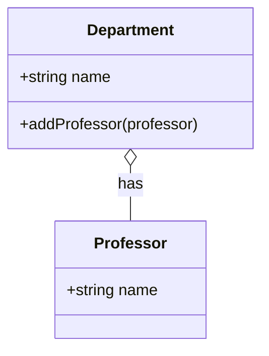

Think of it like a `Department` and its `Professor`s: a professor can exist, get hired, and be associated with a department — but if the department is dissolved, the professor doesn't cease to exist; they can simply move to a different department.

```cpp
class Professor {
public:
    std::string name;
};

class Department {
public:
    std::string name;
    std::vector<Professor*> professors;  // holds POINTERS/REFERENCES —
                                           // Professors exist independently elsewhere;
                                           // Department doesn't OWN their lifetime

    void addProfessor(Professor* prof) {
        professors.push_back(prof);
    }
};

int main() {
    Professor drSmith;
    Department cs;
    cs.addProfessor(&drSmith);
    // If 'cs' (the Department) were destroyed, drSmith (the Professor)
    // would still exist perfectly fine elsewhere in the program
}
```

---

## 6. Relationship 3: Composition

### The idea
**Composition** is a **stronger** "has-a" relationship: one class **owns** the other, and the contained object's lifetime is **tied to** the containing object — if the "whole" is destroyed, its "parts" are destroyed along with it.

Shown as a line with a **filled/solid diamond** on the "whole" side.

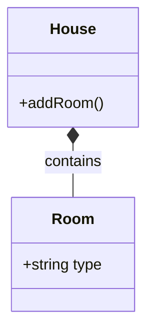

Think of it like a `House` and its `Room`s: a room doesn't meaningfully exist independently of the specific house it's part of — if the house is torn down, its rooms are gone too, not left standing on their own somewhere else.

```cpp
class Room {
public:
    std::string type;
    Room(std::string t) : type(t) {}
};

class House {
private:
    std::vector<Room> rooms;  // holds ACTUAL OBJECTS (not pointers) —
                                // Rooms are CREATED and DESTROYED
                                // together with the House itself
public:
    void addRoom(std::string type) {
        rooms.emplace_back(type);  // Room objects are constructed INSIDE House
    }
    // When a House object is destroyed, its 'rooms' vector — and every
    // Room object inside it — is automatically destroyed too. Their
    // lifetimes are fundamentally tied together.
};
```

---

## 7. Aggregation vs Composition — Side by Side

This distinction is one of the most frequently tested UML details in LLD interviews, precisely because the visual difference (hollow vs filled diamond) is subtle, but the *design implication* is significant.

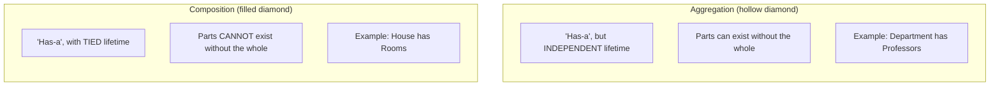

| | Aggregation | Composition |
|---|---|---|
| Diamond | Hollow ◇ | Filled ◆ |
| Lifetime | Independent | Tied together |
| Typical C++ implementation | Pointers/references to externally-created objects | Objects created and owned directly inside the class |
| Example | `Department` ↔ `Professor` | `House` ↔ `Room` |

**The practical test to ask yourself:** *"if I destroy the whole object, does it make sense for the part to keep existing on its own?"* If yes → Aggregation. If no → Composition.

---

## 8. Relationship 4: Inheritance (Generalization)

### The idea
Already covered functionally in OOP Fundamentals — UML represents inheritance ("is-a") with a line and a **hollow/empty triangle arrowhead**, pointing toward the parent/base class.

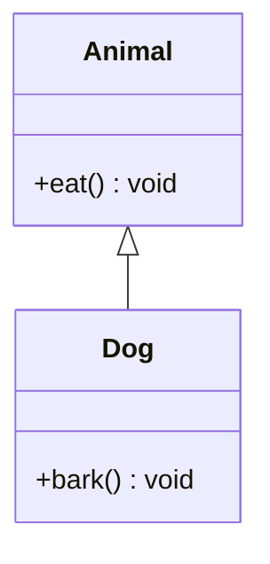

```cpp
class Animal {
public:
    void eat() { std::cout << "eating\n"; }
};

class Dog : public Animal {  // the ": public Animal" IS this inheritance arrow, in code
public:
    void bark() { std::cout << "Woof!\n"; }
};
```

---

## 9. Relationship 5: Realization (Implementing an Interface)

### The idea
Very similar-looking to inheritance, but specifically used when a class **implements an abstract interface** (recall the Abstraction section of OOP Fundamentals) rather than inheriting from a concrete base class. Shown with a **dashed line** and a hollow triangle arrowhead (vs inheritance's **solid** line).

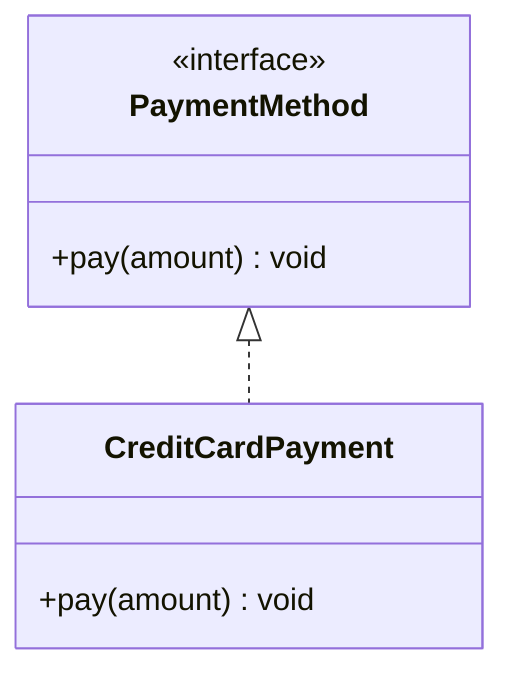

```cpp
class PaymentMethod {  // the <<interface>> — pure virtual, no implementation
public:
    virtual void pay(double amount) = 0;
    virtual ~PaymentMethod() {}
};

class CreditCardPayment : public PaymentMethod {  // this IS the dashed "realization" arrow
public:
    void pay(double amount) override {
        std::cout << "Paid via Credit Card\n";
    }
};
```

**The subtle but meaningful distinction:** inheritance (solid line) says "I am a specialized version of you, reusing your actual implementation." Realization (dashed line) says "I promise to implement the behavior you've defined, but you gave me no implementation to reuse — I'm building it entirely myself." In C++, both happen to use the same `: public` syntax, but the *intent* differs — inheriting from a concrete class vs implementing a pure-virtual interface.

---

## 10. Multiplicity (Cardinality)

Relationships often need to express **how many** of one thing relate to **how many** of another — this is shown as numbers near each end of a relationship line.

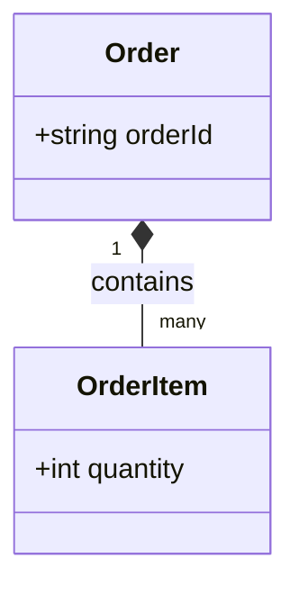

| Notation | Meaning |
|---|---|
| `1` | Exactly one |
| `0..1` | Zero or one (optional) |
| `many` or `*` | Zero or more |
| `1..*` | One or more (at least one) |
| `3..5` | Between 3 and 5, specifically |

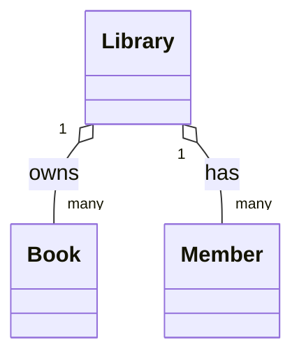

Reading this: "one `Library` has many `Book`s, and one `Library` has many `Member`s" — multiplicity makes relationships precise enough to directly inform your actual data structures (e.g., "many" strongly suggests `std::vector<Book>` in the `Library` class).

---

## 11. Putting It All Together: A Full Class Diagram

A small worked example combining everything covered — a simplified library system.

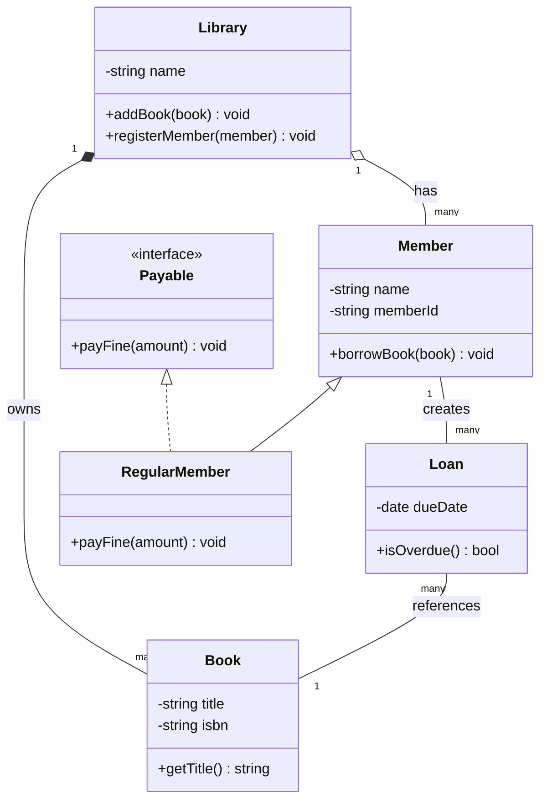

Reading this diagram top to bottom, without writing any code yet, already tells a clear story:
- A `Library` **owns** its `Book`s (Composition — books don't meaningfully exist as library assets outside a library's catalog) but merely **has** `Member`s (Aggregation — members exist as people independent of any one library).
- A `Member` creates `Loan`s, and each `Loan` references exactly one `Book` (Association, with multiplicity showing one member can have many loans).
- `RegularMember` **is-a** `Member` (Inheritance, solid line) and also **implements** `Payable` (Realization, dashed line) — showing a class can both inherit from a base class *and* separately promise to fulfill an interface.

This single diagram — before a single line of C++ is written — already surfaces the key classes, their responsibilities, and exactly how they connect, which is the entire point of doing this step first in an LLD interview.

---

## 12. How to Reason About This in an Interview

When walking through a design in an LLD interview, using this vocabulary precisely (out loud, or while sketching) sounds like this:

> "I'll model this as a `Library` class that has a composition relationship with `Book` — books are owned by the library's catalog and don't exist independently of it — but only an aggregation relationship with `Member`, since members are people who exist whether or not they're currently registered with this specific library. I'll create a `Loan` class to represent the association between a member and a book they've currently borrowed, with a one-to-many relationship from `Member` to `Loan`, since one member can have multiple active loans. For payment handling, I'll define a `Payable` interface — shown as a realization relationship, not inheritance, since I'm not reusing any existing implementation — and have `RegularMember` both inherit from `Member` and implement `Payable`."

That answer shows: you use the **precise, correct terms** (association, aggregation, composition, realization) rather than vaguely saying "relationship" for everything, and — critically — you can justify **why** you chose aggregation over composition (or vice versa) based on actual lifetime reasoning, not just guessing at the diamond style.

---

## 13. Quick Recall Cheat Sheet

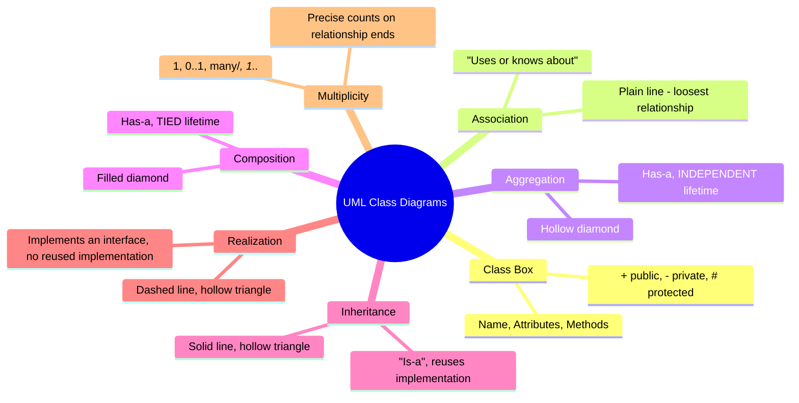

| If you remember only 5 things |
|---|
| 1. A class box has three compartments: name, attributes, methods — with `+`/`-`/`#` marking public/private/protected, directly mirroring encapsulation. |
| 2. Aggregation (hollow diamond) is "has-a" with independent lifetimes; Composition (filled diamond) is "has-a" with tied lifetimes — ask "does the part outlive the whole?" to decide which. |
| 3. Inheritance (solid line + hollow triangle) means "is-a, reusing implementation"; Realization (dashed line + hollow triangle) means "implements an interface, with no implementation to reuse." |
| 4. Multiplicity (1, 0..1, many, 1..*) makes relationships precise enough to directly inform your actual data structure choices (e.g., "many" often means a vector/list). |
| 5. Drawing the class diagram before writing code catches design problems early and gives you precise, standard vocabulary to justify your design decisions in an interview. |

---

*This file is written in GitHub-flavored Markdown with Mermaid diagrams (which natively render UML class diagrams) and C++ code — it will render natively on GitHub, GitLab, and most modern Markdown viewers.*
