# LLD: Design a Parking Lot System

*Phase 3 — Low-Level Design (LLD) / OOD. A zero-to-mastery, interview-style walkthrough, with C++ code.*

---

## Table of Contents
1. [What Are We Actually Building?](#1-what-are-we-actually-building)
2. [Step 1: Clarify Requirements](#2-step-1-clarify-requirements)
3. [Step 2: Identify the Core Entities (Nouns)](#3-step-2-identify-the-core-entities-nouns)
4. [Step 3: Modeling Vehicles — Where Does Inheritance Fit?](#4-step-3-modeling-vehicles--where-does-inheritance-fit)
5. [Step 4: Modeling Parking Spots](#5-step-4-modeling-parking-spots)
6. [Step 5: The Core Challenge — Finding an Available Spot](#6-step-5-the-core-challenge--finding-an-available-spot)
7. [Step 6: The ParkingLot Class — Tying It Together](#7-step-6-the-parkinglot-class--tying-it-together)
8. [Step 7: Ticketing — Tracking an Active Parking Session](#8-step-7-ticketing--tracking-an-active-parking-session)
9. [Step 8: Pricing — Applying the Strategy Pattern](#9-step-8-pricing--applying-the-strategy-pattern)
10. [Step 9: The Full Class Diagram](#10-step-9-the-full-class-diagram)
11. [Step 10: Putting It All Together — a Working Example](#11-step-10-putting-it-all-together--a-working-example)
12. [Step 11: Extending the Design](#12-step-11-extending-the-design)
13. [How to Walk Through This in an Interview](#13-how-to-walk-through-this-in-an-interview)
14. [Quick Recall Cheat Sheet](#14-quick-recall-cheat-sheet)

---

## 1. What Are We Actually Building?

A system that manages a parking lot: vehicles enter, get assigned an available spot appropriate for their size, receive a ticket, and later exit, paying based on how long they parked.

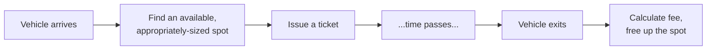

This is the classic "first real LLD problem" for good reason: it's simple enough to fully design in an interview's time limit, yet it naturally exercises **every** concept covered so far — inheritance (different vehicle/spot types), the Strategy pattern (pricing), the Factory pattern (spot allocation), and SOLID principles throughout.

---

## 2. Step 1: Clarify Requirements

Just like HLD, a strong LLD answer starts by clarifying scope — jumping straight to code without this is the most common LLD interview mistake.

### Functional Requirements
- Support **multiple vehicle types**: motorcycles, cars, trucks/buses.
- Support **multiple spot sizes**: small, medium, large — a vehicle can only park in a spot that's appropriately sized (or larger, per business rules).
- **Assign** an available, appropriately-sized spot when a vehicle enters.
- **Issue a ticket** on entry, recording the vehicle and entry time.
- **Calculate a fee** on exit, based on the duration parked.
- **Free up** the spot once the vehicle exits.
- Support **multiple floors/levels** within the lot.

### Non-Functional / Design Requirements
- Should be **easy to extend** with new vehicle types or spot types (recall the Open/Closed Principle) without rewriting existing logic.
- Should be **thread-safe** if multiple entry/exit gates operate simultaneously (recall Concurrency Control from Phase 1 — this is the same fundamental problem, applied here: two vehicles shouldn't both be assigned the *same* single spot).

---

## 3. Step 2: Identify the Core Entities (Nouns)

A reliable first step in any LLD problem: pull out the **nouns** from the requirements — these usually become your core classes.


| Entity | Responsibility |
|---|---|
| `Vehicle` | Represents a car/motorcycle/truck, with its size/type |
| `ParkingSpot` | Represents one physical spot, its size, and whether it's occupied |
| `ParkingFloor` | A collection of spots on one level |
| `ParkingLot` | The overall system — coordinates floors, entry, and exit |
| `Ticket` | Represents one active parking session |
| `PricingStrategy` | Calculates the fee for a completed session |

---

## 4. Step 3: Modeling Vehicles — Where Does Inheritance Fit?

Different vehicle types share common attributes (license plate) but differ in one key way relevant to this system: **size**, which determines which spots they can use.

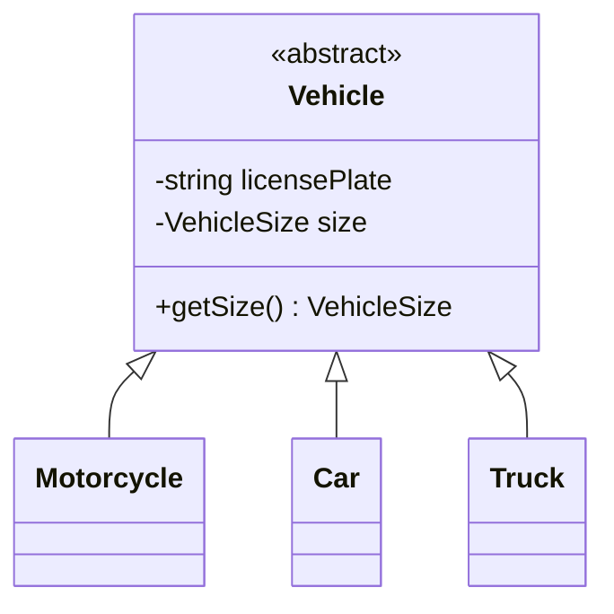

This is a genuine **"is-a"** relationship (recall the Liskov Substitution discussion from SOLID) — a `Car` really is a kind of `Vehicle`, and any code written to handle a generic `Vehicle*` will behave correctly regardless of which specific subclass it's actually handed, since none of them override behavior in a way that breaks the base class's contract.

```cpp
enum class VehicleSize { SMALL, MEDIUM, LARGE };

class Vehicle {
protected:
    std::string licensePlate;
    VehicleSize size;

public:
    Vehicle(std::string plate, VehicleSize s) : licensePlate(plate), size(s) {}
    virtual ~Vehicle() {}

    VehicleSize getSize() const { return size; }
    std::string getLicensePlate() const { return licensePlate; }
};

class Motorcycle : public Vehicle {
public:
    Motorcycle(std::string plate) : Vehicle(plate, VehicleSize::SMALL) {}
};

class Car : public Vehicle {
public:
    Car(std::string plate) : Vehicle(plate, VehicleSize::MEDIUM) {}
};

class Truck : public Vehicle {
public:
    Truck(std::string plate) : Vehicle(plate, VehicleSize::LARGE) {}
};
```

---

## 5. Step 4: Modeling Parking Spots

Similarly, spots come in different sizes, and each spot needs to track whether it's currently occupied.

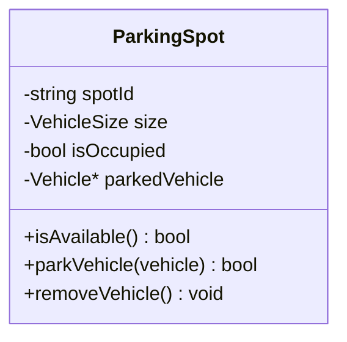

```cpp
class ParkingSpot {
private:
    std::string spotId;
    VehicleSize size;
    bool occupied;
    Vehicle* parkedVehicle;

public:
    ParkingSpot(std::string id, VehicleSize s)
        : spotId(id), size(s), occupied(false), parkedVehicle(nullptr) {}

    bool isAvailable() const {
        return !occupied;
    }

    bool canFitVehicle(const Vehicle& vehicle) const {
        // A vehicle can park here if the spot is AT LEAST as big as it needs
        // (a small vehicle CAN use a large spot, just not the reverse)
        return isAvailable() && static_cast<int>(size) >= static_cast<int>(vehicle.getSize());
    }

    bool parkVehicle(Vehicle* vehicle) {
        if (!canFitVehicle(*vehicle)) return false;
        parkedVehicle = vehicle;
        occupied = true;
        return true;
    }

    void removeVehicle() {
        parkedVehicle = nullptr;
        occupied = false;
    }

    std::string getSpotId() const { return spotId; }
    VehicleSize getSize() const { return size; }
};
```

- **Encapsulation in action:** `occupied` is private — the only ways to change it are through `parkVehicle()` and `removeVehicle()`, which enforce the rule that a spot can never be double-booked or hold an invalid state, exactly the same principle demonstrated with `BankAccount` in the OOP Fundamentals topic.

---

## 6. Step 5: The Core Challenge — Finding an Available Spot

This is the one genuinely interesting algorithmic decision in this design: given an incoming vehicle, how do we efficiently find a suitable, available spot — without scanning every single spot in a large, multi-floor lot every single time (recall: this is exactly the kind of inefficiency the Database Indexing topic warned against for large datasets)?

### Naive approach: linear scan
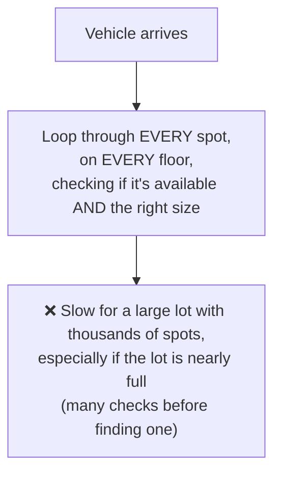

### Better approach: maintain available spots per size, per floor
Keep a separate collection (e.g., a set or list) of currently-available spot IDs, **bucketed by size**, so finding a spot of the right size is a fast lookup rather than a full scan.

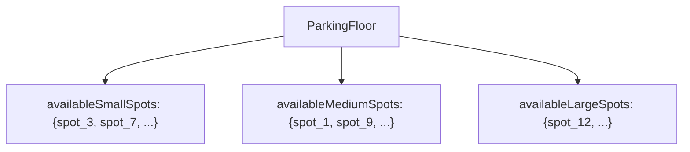

```cpp
#include <unordered_map>
#include <set>

class ParkingFloor {
private:
    int floorNumber;
    std::unordered_map<std::string, ParkingSpot> allSpots;  // spotId -> ParkingSpot
    // Bucketed by size for FAST lookup, instead of scanning every spot:
    std::unordered_map<VehicleSize, std::set<std::string>> availableSpotsBySize;

public:
    ParkingFloor(int num) : floorNumber(num) {}

    void addSpot(const ParkingSpot& spot) {
        allSpots[spot.getSpotId()] = spot;
        availableSpotsBySize[spot.getSize()].insert(spot.getSpotId());
    }

    // Finds an available spot that fits the vehicle, checking from the
    // vehicle's exact size UP to larger sizes (a small vehicle CAN use
    // a bigger spot if nothing smaller is free)
    ParkingSpot* findAvailableSpot(const Vehicle& vehicle) {
        for (int s = static_cast<int>(vehicle.getSize()); s <= static_cast<int>(VehicleSize::LARGE); s++) {
            VehicleSize trySize = static_cast<VehicleSize>(s);
            auto& spotsOfThisSize = availableSpotsBySize[trySize];
            if (!spotsOfThisSize.empty()) {
                std::string spotId = *spotsOfThisSize.begin();
                return &allSpots[spotId];
            }
        }
        return nullptr;  // no available spot on this floor at all
    }

    void markSpotOccupied(const std::string& spotId, VehicleSize size) {
        availableSpotsBySize[size].erase(spotId);
    }

    void markSpotAvailable(const std::string& spotId, VehicleSize size) {
        availableSpotsBySize[size].insert(spotId);
    }
};
```

**Why this matters:** this directly mirrors the exact same "avoid a full scan" principle behind Database Indexing from Phase 1 — bucketing available spots by size turns "find any available spot of size X" from an O(n) full scan into a much faster, near-constant-time lookup.

---

## 7. Step 6: The ParkingLot Class — Tying It Together

The `ParkingLot` coordinates multiple `ParkingFloor`s, and is the main entry point for the two core operations: a vehicle entering and exiting.

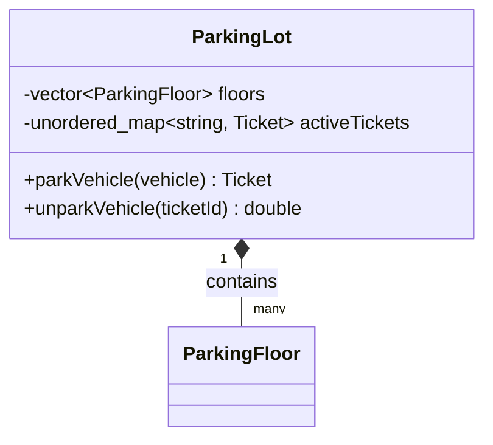

Notice `ParkingLot` **owns** its `ParkingFloor`s — a Composition relationship (recall the UML topic), since floors don't meaningfully exist outside the specific lot they're part of.

```cpp
class ParkingLot {
private:
    std::vector<ParkingFloor> floors;
    std::unordered_map<std::string, Ticket> activeTickets;  // ticketId -> Ticket
    PricingStrategy* pricingStrategy;

public:
    ParkingLot(PricingStrategy* pricing) : pricingStrategy(pricing) {}

    void addFloor(const ParkingFloor& floor) {
        floors.push_back(floor);
    }

    // Covered in full in Step 7 & 10, once Ticket is defined
};
```

---

## 8. Step 7: Ticketing — Tracking an Active Parking Session

A `Ticket` links a vehicle, its assigned spot, and the entry time — everything needed later to calculate the fee on exit.

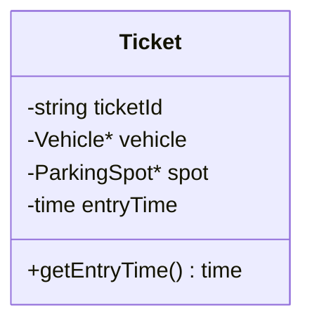

```cpp
#include <chrono>

class Ticket {
private:
    std::string ticketId;
    Vehicle* vehicle;
    ParkingSpot* spot;
    std::chrono::system_clock::time_point entryTime;

public:
    Ticket(std::string id, Vehicle* v, ParkingSpot* s)
        : ticketId(id), vehicle(v), spot(s), entryTime(std::chrono::system_clock::now()) {}

    std::string getTicketId() const { return ticketId; }
    ParkingSpot* getSpot() const { return spot; }
    Vehicle* getVehicle() const { return vehicle; }
    std::chrono::system_clock::time_point getEntryTime() const { return entryTime; }
};
```

---

## 9. Step 8: Pricing — Applying the Strategy Pattern

Different parking lots (or even different vehicle types within the same lot) often need **different pricing rules** — flat rate, hourly rate, or a more complex tiered rate. This is a textbook application of the **Strategy Pattern**, covered in the Design Patterns topic.

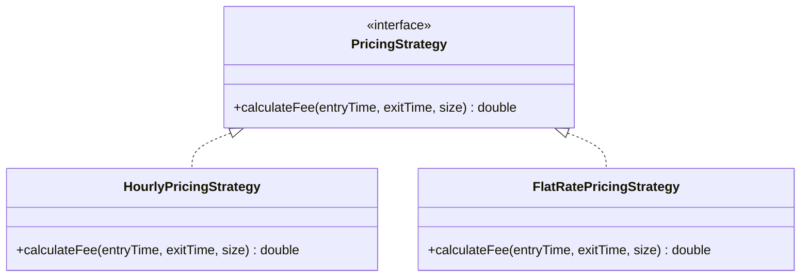

```cpp
class PricingStrategy {
public:
    virtual double calculateFee(std::chrono::system_clock::time_point entryTime,
                                 std::chrono::system_clock::time_point exitTime,
                                 VehicleSize size) = 0;
    virtual ~PricingStrategy() {}
};

class HourlyPricingStrategy : public PricingStrategy {
public:
    double calculateFee(std::chrono::system_clock::time_point entryTime,
                         std::chrono::system_clock::time_point exitTime,
                         VehicleSize size) override {
        auto duration = std::chrono::duration_cast<std::chrono::minutes>(exitTime - entryTime);
        double hours = std::ceil(duration.count() / 60.0);  // round up to the next hour

        // Different rates per vehicle size
        double ratePerHour = (size == VehicleSize::SMALL) ? 10.0 :
                              (size == VehicleSize::MEDIUM) ? 20.0 : 30.0;

        return hours * ratePerHour;
    }
};
```

**Why Strategy fits perfectly here:** exactly as covered in the Design Patterns topic, `ParkingLot` never needs to know or care *how* the fee is calculated — it just calls `pricingStrategy->calculateFee(...)`. Adding a new pricing scheme later (e.g., `WeekendDiscountPricingStrategy`) requires **zero changes** to `ParkingLot` — a direct, practical application of the **Open/Closed Principle**.

---

## 10. Step 9: The Full Class Diagram

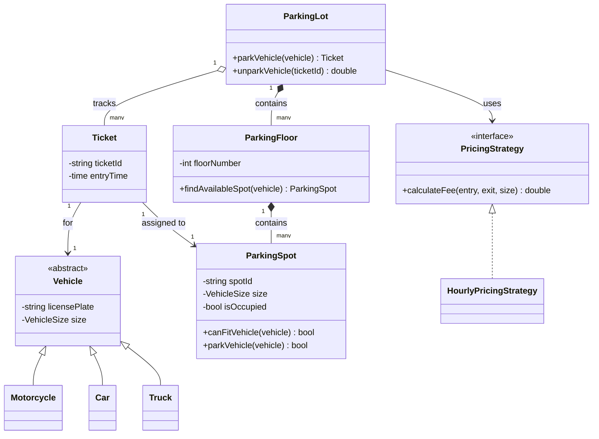

This single diagram captures the entire design: the `Vehicle` inheritance hierarchy, the Composition chain (`ParkingLot` owns `ParkingFloor`s owns `ParkingSpot`s), `Ticket`'s associations, and the Strategy pattern for pricing — exactly the kind of complete picture an interviewer wants to see before or alongside code.

---

## 11. Step 10: Putting It All Together — a Working Example

```cpp
class ParkingLot {
private:
    std::vector<ParkingFloor> floors;
    std::unordered_map<std::string, Ticket> activeTickets;
    PricingStrategy* pricingStrategy;
    int nextTicketId = 1;

public:
    ParkingLot(PricingStrategy* pricing) : pricingStrategy(pricing) {}

    void addFloor(const ParkingFloor& floor) {
        floors.push_back(floor);
    }

    Ticket* parkVehicle(Vehicle* vehicle) {
        for (auto& floor : floors) {
            ParkingSpot* spot = floor.findAvailableSpot(*vehicle);
            if (spot != nullptr) {
                spot->parkVehicle(vehicle);
                floor.markSpotOccupied(spot->getSpotId(), spot->getSize());

                std::string ticketId = "T" + std::to_string(nextTicketId++);
                Ticket ticket(ticketId, vehicle, spot);
                activeTickets[ticketId] = ticket;

                std::cout << "Vehicle " << vehicle->getLicensePlate()
                          << " parked at spot " << spot->getSpotId()
                          << ". Ticket: " << ticketId << "\n";
                return &activeTickets[ticketId];
            }
        }
        std::cout << "No available spot for vehicle " << vehicle->getLicensePlate() << "\n";
        return nullptr;
    }

    double unparkVehicle(const std::string& ticketId) {
        if (activeTickets.find(ticketId) == activeTickets.end()) {
            std::cout << "Invalid ticket.\n";
            return -1;
        }

        Ticket& ticket = activeTickets[ticketId];
        auto exitTime = std::chrono::system_clock::now();
        double fee = pricingStrategy->calculateFee(
            ticket.getEntryTime(), exitTime, ticket.getSpot()->getSize()
        );

        ticket.getSpot()->removeVehicle();
        activeTickets.erase(ticketId);

        std::cout << "Vehicle exited. Fee: $" << fee << "\n";
        return fee;
    }
};

int main() {
    HourlyPricingStrategy pricing;
    ParkingLot lot(&pricing);

    ParkingFloor floor1(1);
    floor1.addSpot(ParkingSpot("S1", VehicleSize::SMALL));
    floor1.addSpot(ParkingSpot("M1", VehicleSize::MEDIUM));
    floor1.addSpot(ParkingSpot("L1", VehicleSize::LARGE));
    lot.addFloor(floor1);

    Car myCar("KA-01-1234");
    Ticket* ticket = lot.parkVehicle(&myCar);
    // ... time passes ...
    if (ticket) {
        lot.unparkVehicle(ticket->getTicketId());
    }
}
```

---

## 12. Step 11: Extending the Design

A strong LLD answer proactively shows how the design **handles change gracefully** — directly demonstrating the Open/Closed Principle rather than just claiming it applies.

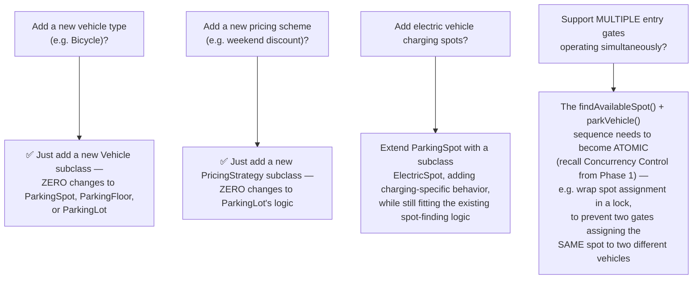

### The concurrency wrinkle, made concrete
```cpp
// ❌ Without protection: two threads could both call findAvailableSpot(),
// both see the SAME spot as available, and both try to park a vehicle there
ParkingSpot* spot = floor.findAvailableSpot(vehicle);
spot->parkVehicle(vehicle);  // race condition between the check and this call!

// ✅ Fix: make the "find and reserve" sequence atomic (e.g. with a mutex)
{
    std::lock_guard<std::mutex> lock(floorMutex);
    ParkingSpot* spot = floor.findAvailableSpot(vehicle);
    if (spot) spot->parkVehicle(vehicle);
}  // lock automatically released here
```

This is precisely the same **lost update** class of problem introduced in Phase 1's Concurrency Control topic, and the E-commerce Order Flow's inventory-overselling example — the exact same underlying principle, just showing up again in a completely different-looking system.

---

## 13. How to Walk Through This in an Interview

A strong end-to-end summary sounds like this:

> "I'd start with the core entities: `Vehicle`, `ParkingSpot`, `ParkingFloor`, `ParkingLot`, `Ticket`, and a `PricingStrategy`. For vehicles and spots, I'd use inheritance for the different sizes/types, since they genuinely share behavior and satisfy the 'is-a' relationship correctly — I'd double check none of the subclasses need to override behavior in a way that would violate Liskov Substitution. For finding an available spot efficiently, rather than scanning every spot, I'd bucket available spots by size within each floor, so lookups stay fast even in a large, nearly-full lot. I'd use the Strategy pattern for pricing, so `ParkingLot` never needs to know the specific fee calculation logic, which means adding new pricing schemes later requires zero changes to existing code — directly the Open/Closed Principle. `ParkingLot` composes `ParkingFloor`s, which compose `ParkingSpot`s, since neither meaningfully exists outside this specific lot. And since multiple entry gates might operate simultaneously in a real deployment, I'd make sure the 'find an available spot and mark it occupied' sequence is atomic, protected by a lock, to avoid two vehicles racing for and being assigned the exact same spot — the same underlying concurrency problem as an inventory oversell in an e-commerce system."

That answer shows: you followed a structured process, you correctly applied inheritance where it genuinely fits, you used a design pattern with a clear justification (not just for its own sake), and — critically — you proactively addressed concurrency, which is exactly the kind of detail that separates a strong LLD answer from a merely functional one.

---

## 14. Quick Recall Cheat Sheet

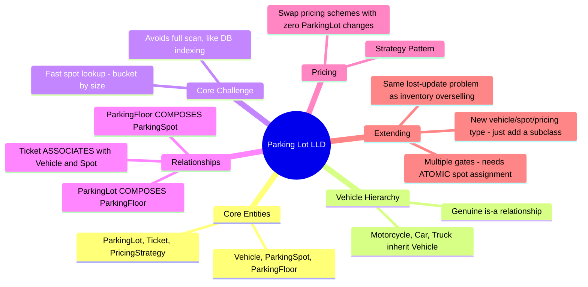

| If you remember only 5 things |
|---|
| 1. Model `Vehicle` and `ParkingSpot` with inheritance for their size/type variants — a genuine "is-a" relationship that satisfies Liskov Substitution. |
| 2. Bucket available spots by size (per floor) rather than scanning every spot, to keep spot-finding fast even in a large, nearly-full lot. |
| 3. Use the Strategy pattern for pricing — `ParkingLot` should never need to know the specific fee calculation logic, enabling new pricing schemes with zero changes elsewhere. |
| 4. `ParkingLot` composes `ParkingFloor`s, which compose `ParkingSpot`s — a chain of Composition relationships, since none of these meaningfully exist independently. |
| 5. With multiple simultaneous entry gates, "find an available spot and mark it occupied" must be atomic (e.g., via a lock) to avoid a race condition where two vehicles get assigned the same spot. |

---

*This file is written in GitHub-flavored Markdown with Mermaid diagrams and C++ code — it will render natively on GitHub, GitLab, and most modern Markdown viewers.*
