# LLD: Design an Elevator System

*Phase 3 — Low-Level Design (LLD) / OOD. A zero-to-mastery, interview-style walkthrough, with C++ code.*

---

## Table of Contents
1. [What Are We Actually Building?](#1-what-are-we-actually-building)
2. [Step 1: Clarify Requirements](#2-step-1-clarify-requirements)
3. [Step 2: Identify the Core Entities](#3-step-2-identify-the-core-entities)
4. [Step 3: The Elevator's State Machine](#4-step-3-the-elevators-state-machine)
5. [Step 4: Modeling Requests](#5-step-4-modeling-requests)
6. [Step 5: The Core Challenge — Deciding Which Elevator Responds](#6-step-5-the-core-challenge--deciding-which-elevator-responds)
7. [Step 6: The Core Challenge — How One Elevator Processes Its Requests](#7-step-6-the-core-challenge--how-one-elevator-processes-its-requests)
8. [Step 7: The Elevator Class](#8-step-7-the-elevator-class)
9. [Step 8: The ElevatorController — Tying It Together](#9-step-8-the-elevatorcontroller--tying-it-together)
10. [Step 9: The Full Class Diagram](#10-step-9-the-full-class-diagram)
11. [Step 10: Putting It All Together — a Working Example](#11-step-10-putting-it-all-together--a-working-example)
12. [Step 11: Extending the Design](#12-step-11-extending-the-design)
13. [How to Walk Through This in an Interview](#13-how-to-walk-through-this-in-an-interview)
14. [Quick Recall Cheat Sheet](#14-quick-recall-cheat-sheet)

---

## 1. What Are We Actually Building?

A system controlling **multiple elevators** in a building: people press buttons (inside a car, or on a floor to call one), and the system decides which elevator responds, in what order, and how each elevator moves and stops along the way.

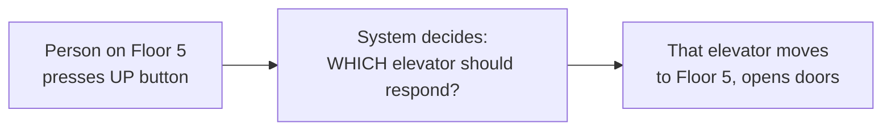

This problem is a notch harder than the Parking Lot — it isn't just "manage a static collection of resources," it involves genuine **stateful behavior over time** (an elevator is always in some state — moving, idle, doors open) and a real **scheduling/optimization decision** (which elevator should take this request, and in what order should one elevator serve multiple requests). This makes it an excellent vehicle for practicing the **State Pattern** and multi-step algorithmic thinking within LLD.

---

## 2. Step 1: Clarify Requirements

### Functional Requirements
- Support **multiple elevators** in a building with **N floors**.
- A person can request an elevator from a floor (specifying **direction**: up or down).
- A person inside an elevator can select a **destination floor**.
- The system must decide **which elevator** should service each external request.
- Each elevator must process its assigned requests in a **sensible order** (not just first-come-first-served, which could cause a lot of unnecessary back-and-forth travel).
- Doors open/close at each stop.

### Non-Functional / Design Requirements
- **Extensible dispatch/scheduling logic** — the algorithm for choosing which elevator responds should be swappable (recall the Strategy pattern from the Design Patterns topic) without changing the rest of the system.
- **Thread-safety** — multiple floor/car button presses can happen simultaneously from different physical locations (echoing the same concurrency theme from the Parking Lot topic).

---

## 3. Step 2: Identify the Core Entities

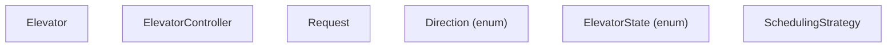

| Entity | Responsibility |
|---|---|
| `Elevator` | Represents one physical elevator car — its current floor, state, and the requests it needs to serve |
| `ElevatorController` | The overall system — receives all requests, decides which elevator handles each |
| `Request` | Represents one pending stop an elevator needs to make |
| `SchedulingStrategy` | Decides which elevator should be assigned a given external request |

---

## 4. Step 3: The Elevator's State Machine

An elevator is always in exactly one of a small number of well-defined states, and it transitions between them based on events — this is a textbook fit for explicitly modeling a **state machine**, which the UML topic's notation can represent directly.

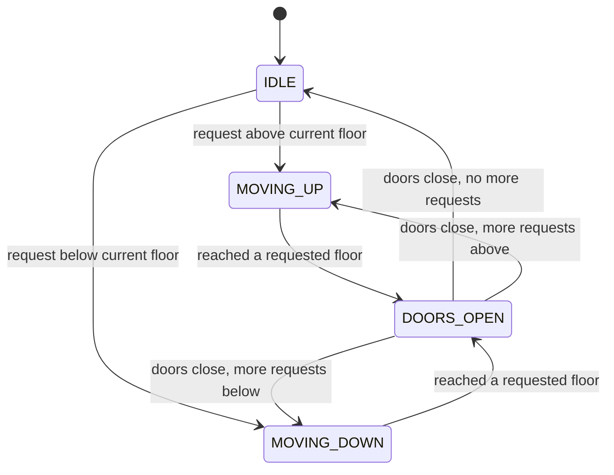

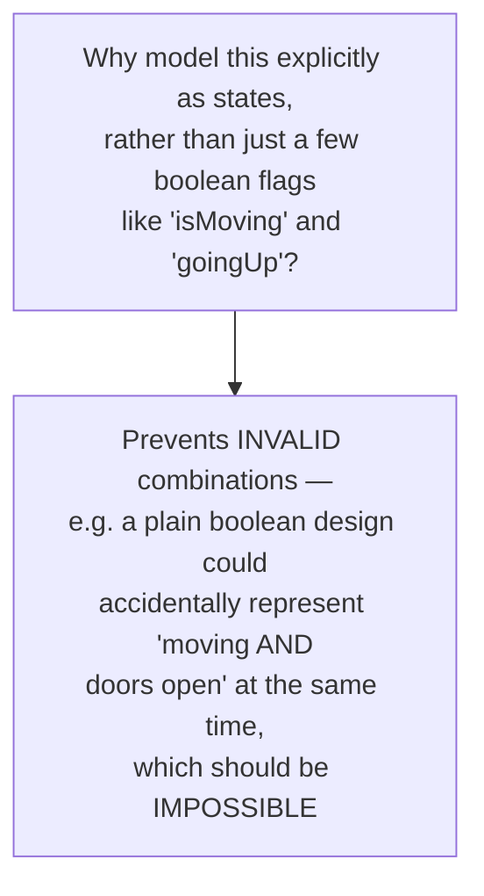

```cpp
enum class ElevatorState { IDLE, MOVING_UP, MOVING_DOWN, DOORS_OPEN };
```

**Why an explicit state enum matters:** using distinct, named states (rather than several independent boolean flags) makes **invalid states structurally impossible to represent** — you literally cannot accidentally set the elevator to "moving" and "doors open" simultaneously, because it's always in exactly *one* named state at a time. This is a small but genuinely valuable design habit worth calling out explicitly in an interview.

---

## 5. Step 4: Modeling Requests

Two distinct kinds of requests exist in a real elevator system, and it's worth being precise about the difference:

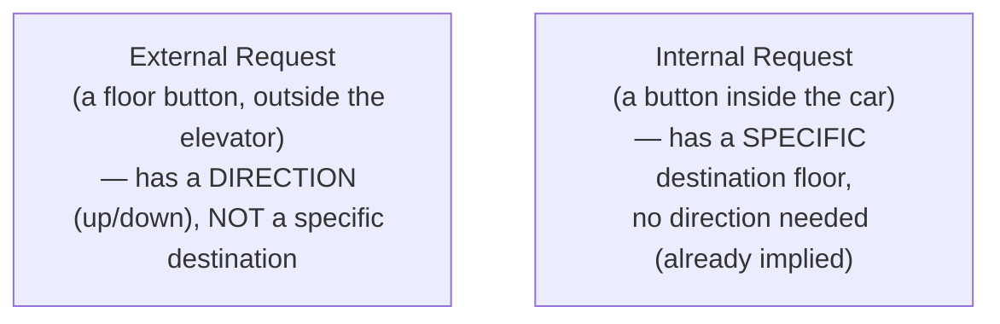

```cpp
enum class Direction { UP, DOWN, NONE };

class Request {
public:
    int floor;
    Direction direction;  // relevant for EXTERNAL requests; NONE for internal ones

    Request(int f, Direction d = Direction::NONE) : floor(f), direction(d) {}
};
```

---

## 6. Step 5: The Core Challenge — Deciding Which Elevator Responds

This is the first of two genuinely hard problems in this design. When someone on Floor 5 presses "up," which of the building's N elevators should actually respond?

### A naive approach: nearest elevator
Simply pick whichever elevator is physically closest to the requesting floor.

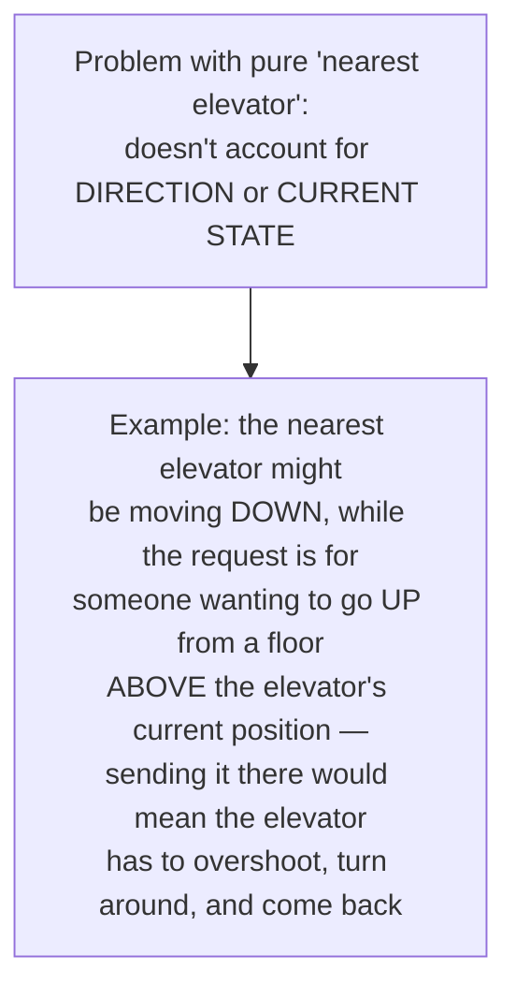

### A better approach: scoring/ranking each elevator
Consider each elevator's current floor, direction, and state, and pick whichever one can serve the request with the **least additional travel/deviation**.

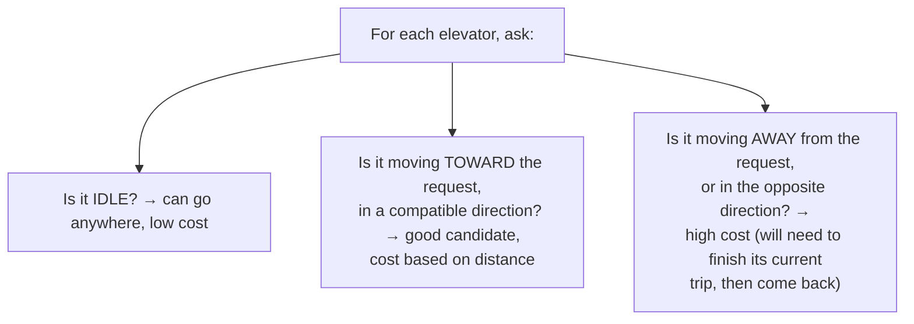

This is precisely where the **Strategy Pattern** (Design Patterns topic) applies directly: define a `SchedulingStrategy` interface, and let the specific algorithm (nearest-elevator, load-balanced, zone-based, etc.) be swapped without changing the `ElevatorController`.

```cpp
class SchedulingStrategy {
public:
    virtual Elevator* selectElevator(std::vector<Elevator*>& elevators, const Request& request) = 0;
    virtual ~SchedulingStrategy() {}
};

class NearestElevatorStrategy : public SchedulingStrategy {
public:
    Elevator* selectElevator(std::vector<Elevator*>& elevators, const Request& request) override {
        Elevator* best = nullptr;
        int bestScore = INT_MAX;

        for (Elevator* elevator : elevators) {
            int score = computeCost(*elevator, request);
            if (score < bestScore) {
                bestScore = score;
                best = elevator;
            }
        }
        return best;
    }

private:
    int computeCost(const Elevator& elevator, const Request& request) {
        int distance = std::abs(elevator.getCurrentFloor() - request.floor);

        // IDLE elevators are cheap/flexible — can go anywhere
        if (elevator.getState() == ElevatorState::IDLE) {
            return distance;
        }

        // Moving in a COMPATIBLE direction, toward the request → still reasonable
        bool movingToward =
            (elevator.getState() == ElevatorState::MOVING_UP && request.floor >= elevator.getCurrentFloor()) ||
            (elevator.getState() == ElevatorState::MOVING_DOWN && request.floor <= elevator.getCurrentFloor());

        if (movingToward) {
            return distance;
        }

        // Moving AWAY or in the wrong direction → penalize heavily,
        // since it will have to finish its current trip before backtracking
        return distance + 1000;
    }
};
```

**Why Strategy fits perfectly here:** exactly as with the Parking Lot's pricing logic, `ElevatorController` never needs to know the specific scoring algorithm — it just calls `strategy->selectElevator(...)`. A building could swap in a more sophisticated strategy (e.g., one that also considers current passenger load) with **zero changes** to the controller itself.

---

## 7. Step 6: The Core Challenge — How One Elevator Processes Its Requests

The second hard problem: once an elevator has multiple pending stops (say, floors 3, 7, and 2, requested in that arrival order), in what order should it actually visit them?

### Naive: FIFO (first requested, first served)
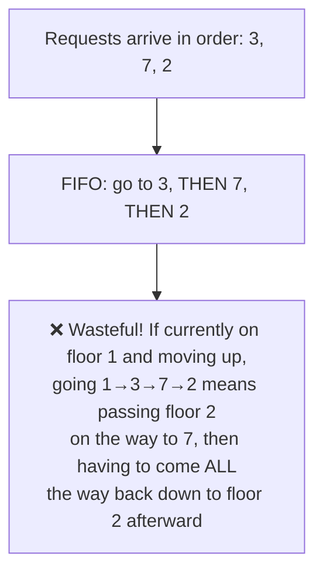

### Better: the SCAN algorithm (a.k.a. the "elevator algorithm")
Continue moving in the **current direction**, serving every pending request along the way, until there are no more requests in that direction — **then** reverse direction.

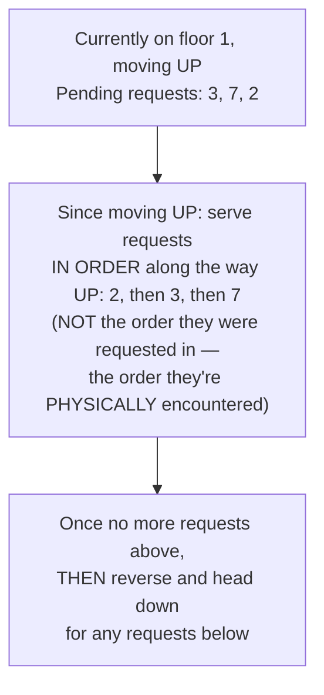

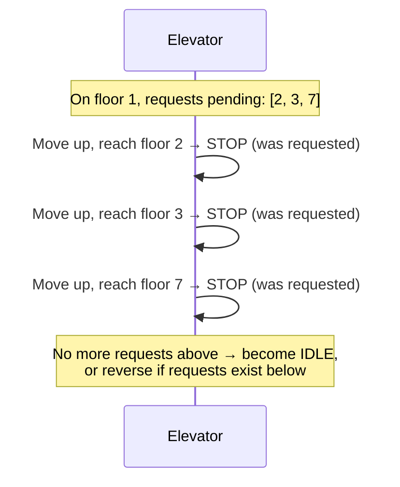

This algorithm — always finishing all requests in the current direction before reversing — is exactly why it's literally named the **elevator algorithm** in computer science; it's also used more broadly for disk scheduling, since the underlying problem (minimize wasted travel while visiting a set of points along a line) is structurally identical.

```cpp
#include <set>

class Elevator {
private:
    int currentFloor;
    ElevatorState state;
    std::set<int> upRequests;    // pending stops while moving up, kept SORTED
    std::set<int> downRequests;  // pending stops while moving down, kept SORTED

public:
    Elevator(int startFloor) : currentFloor(startFloor), state(ElevatorState::IDLE) {}

    void addRequest(int floor) {
        if (floor > currentFloor) {
            upRequests.insert(floor);
        } else if (floor < currentFloor) {
            downRequests.insert(floor);
        }
        if (state == ElevatorState::IDLE) {
            state = (floor > currentFloor) ? ElevatorState::MOVING_UP : ElevatorState::MOVING_DOWN;
        }
    }

    // Called repeatedly (e.g. once per "tick") to advance the elevator by one floor/step
    void step() {
        if (state == ElevatorState::MOVING_UP) {
            if (!upRequests.empty()) {
                currentFloor++;
                if (upRequests.count(currentFloor)) {
                    openDoors();
                    upRequests.erase(currentFloor);
                }
            }
            if (upRequests.empty()) {
                state = downRequests.empty() ? ElevatorState::IDLE : ElevatorState::MOVING_DOWN;
            }
        } else if (state == ElevatorState::MOVING_DOWN) {
            if (!downRequests.empty()) {
                currentFloor--;
                if (downRequests.count(currentFloor)) {
                    openDoors();
                    downRequests.erase(currentFloor);
                }
            }
            if (downRequests.empty()) {
                state = upRequests.empty() ? ElevatorState::IDLE : ElevatorState::MOVING_UP;
            }
        }
    }

    void openDoors() {
        state = ElevatorState::DOORS_OPEN;
        std::cout << "Elevator doors open at floor " << currentFloor << "\n";
        // (doors would close again after a delay, resuming MOVING_UP/DOWN)
    }

    int getCurrentFloor() const { return currentFloor; }
    ElevatorState getState() const { return state; }
};
```

- **Why `std::set` specifically:** it keeps pending requests automatically **sorted**, which is exactly what the SCAN algorithm needs — the elevator always serves the *nearest* pending stop in its current direction next, and a sorted set gives that for free (`*upRequests.begin()` is always the next stop while moving up).

---

## 8. Step 7: The Elevator Class

(Already shown in full above — `Elevator` bundles its state, position, and pending requests, encapsulating exactly how it decides its next move via `step()`, without external code needing to understand the SCAN logic itself.)

---

## 9. Step 8: The ElevatorController — Tying It Together

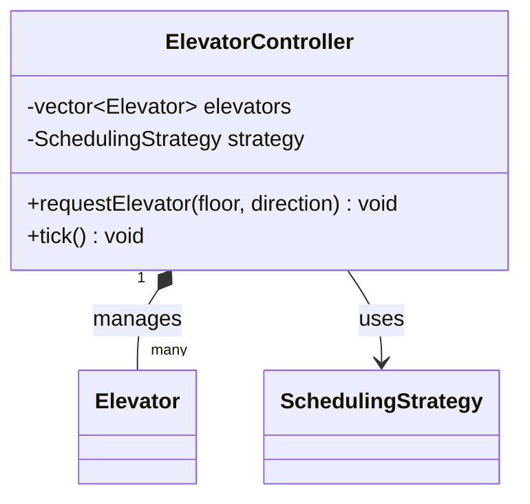

```cpp
class ElevatorController {
private:
    std::vector<Elevator*> elevators;
    SchedulingStrategy* strategy;

public:
    ElevatorController(SchedulingStrategy* s) : strategy(s) {}

    void addElevator(Elevator* elevator) {
        elevators.push_back(elevator);
    }

    // Called when someone presses an UP/DOWN button on a FLOOR (external request)
    void requestElevator(int floor, Direction direction) {
        Request request(floor, direction);
        Elevator* chosen = strategy->selectElevator(elevators, request);
        if (chosen) {
            chosen->addRequest(floor);
            std::cout << "Assigned floor " << floor << " request to an elevator.\n";
        }
    }

    // Called when someone presses a DESTINATION button INSIDE a specific elevator
    void selectFloor(Elevator* elevator, int floor) {
        elevator->addRequest(floor);
    }

    // Advances every elevator by one step (simulating time passing)
    void tick() {
        for (Elevator* elevator : elevators) {
            elevator->step();
        }
    }
};
```

- `ElevatorController` **composes** many `Elevator`s (they don't exist independently of the specific building's system) and **uses** a `SchedulingStrategy` (a separate, swappable dependency — recall Dependency Inversion from SOLID: the controller depends on the abstract `SchedulingStrategy` interface, not a specific concrete algorithm).

---

## 10. Step 9: The Full Class Diagram

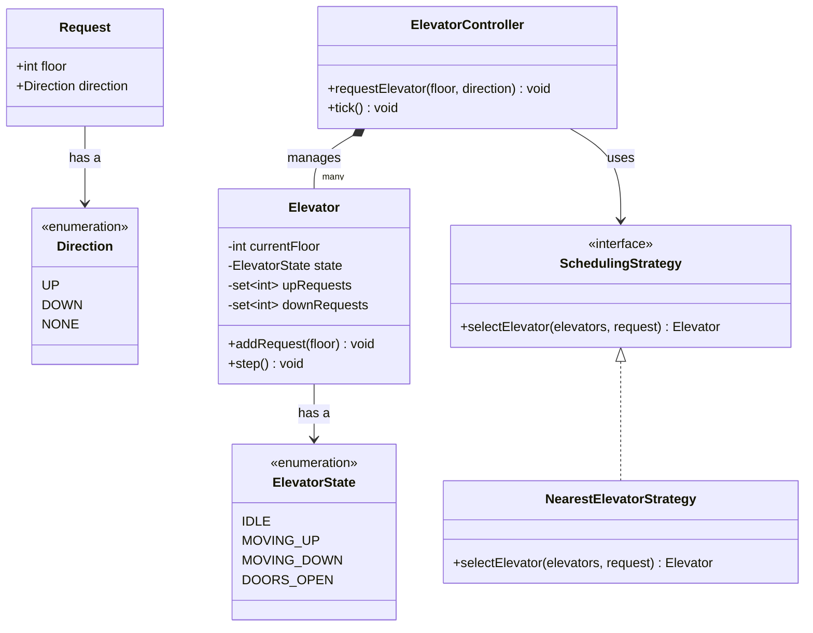

---

## 11. Step 10: Putting It All Together — a Working Example

```cpp
int main() {
    NearestElevatorStrategy strategy;
    ElevatorController controller(&strategy);

    Elevator elevator1(1);  // starts at floor 1
    Elevator elevator2(10); // starts at floor 10
    controller.addElevator(&elevator1);
    controller.addElevator(&elevator2);

    // Someone on floor 5 wants to go UP
    controller.requestElevator(5, Direction::UP);
    // The NearestElevatorStrategy will likely assign elevator1 (closer, at floor 1)

    // Simulate time passing, one "tick" at a time
    for (int i = 0; i < 10; i++) {
        controller.tick();
    }
}
```

---

## 12. Step 11: Extending the Design

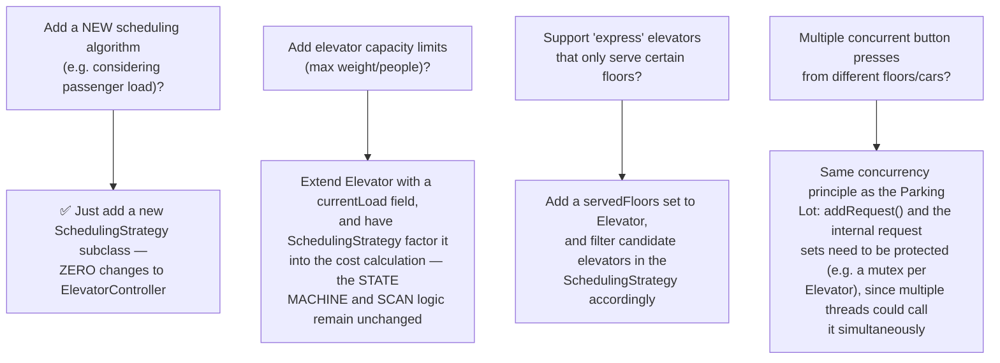

**Notice the recurring theme:** nearly every extension is absorbed by adding a new class or modifying one isolated piece (a new `SchedulingStrategy`, a new field on `Elevator`) — not by rewriting the core state machine or SCAN logic. This is the practical, demonstrated payoff of the Open/Closed Principle, exactly as it was for the Parking Lot's pricing extensibility.

---

## 13. How to Walk Through This in an Interview

A strong end-to-end summary sounds like this:

> "I'd model the elevator's behavior as an explicit state machine — Idle, Moving Up, Moving Down, Doors Open — rather than a handful of boolean flags, since that makes invalid combinations, like 'moving' and 'doors open' at once, structurally impossible to represent. There are two genuinely hard problems here: first, which elevator should respond to an external floor request, and second, in what order should one elevator serve its own pending stops. For the first, I'd use the Strategy pattern with a `SchedulingStrategy` interface, scoring each elevator based on distance and whether it's already moving toward the request in a compatible direction — this keeps the assignment algorithm swappable without touching the controller. For the second, I'd use the SCAN algorithm — the elevator keeps moving in its current direction, serving every pending stop it encounters along the way, and only reverses once there's nothing left in that direction — which avoids the wasted back-and-forth travel a naive first-come-first-served approach would cause. I'd store pending stops in a sorted set per direction, so the next stop is always readily available without needing to search. And since button presses can happen concurrently from different floors and cars, I'd protect each elevator's request-handling with a lock to avoid race conditions."

That answer shows: you modeled state explicitly and can justify why, you identified **two separate hard problems** rather than treating this as one simple task, you named and correctly applied a known algorithm (SCAN) rather than inventing an ad-hoc one, and you proactively addressed concurrency.

---

## 14. Quick Recall Cheat Sheet

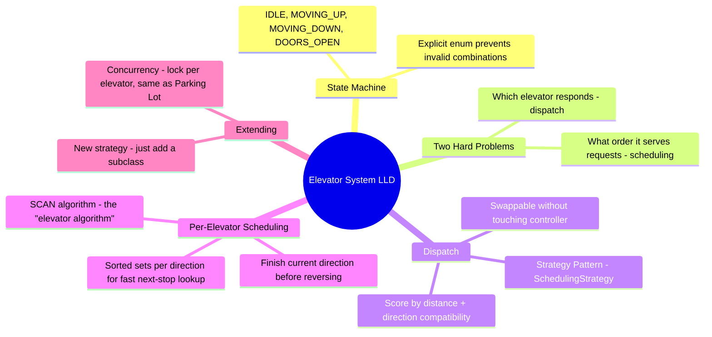

| If you remember only 5 things |
|---|
| 1. Model the elevator's behavior as an explicit state machine (Idle, Moving Up, Moving Down, Doors Open) rather than boolean flags — this makes invalid states impossible to represent. |
| 2. There are two separate hard problems: which elevator responds to a request (dispatch), and in what order one elevator serves its own stops (scheduling) — solve them independently. |
| 3. Use the Strategy pattern for dispatch, scoring elevators by distance and direction compatibility, so the algorithm is swappable without touching the controller. |
| 4. Use the SCAN algorithm for per-elevator scheduling — keep moving in the current direction, serving every stop along the way, only reversing once nothing remains in that direction. |
| 5. Store pending requests in sorted sets, split by direction, so the next stop is always immediately available without needing to search or sort at request time. |

---

*This file is written in GitHub-flavored Markdown with Mermaid diagrams and C++ code — it will render natively on GitHub, GitLab, and most modern Markdown viewers.*
