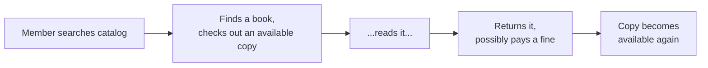
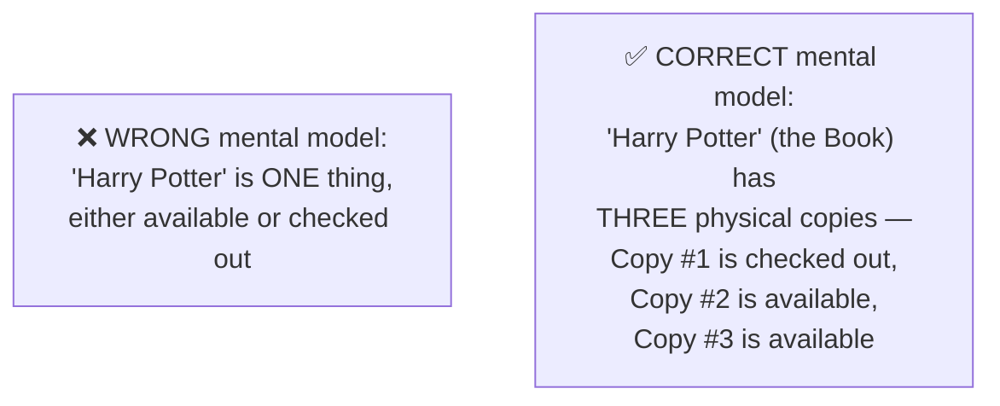
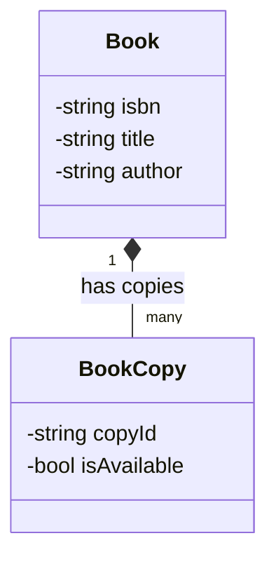
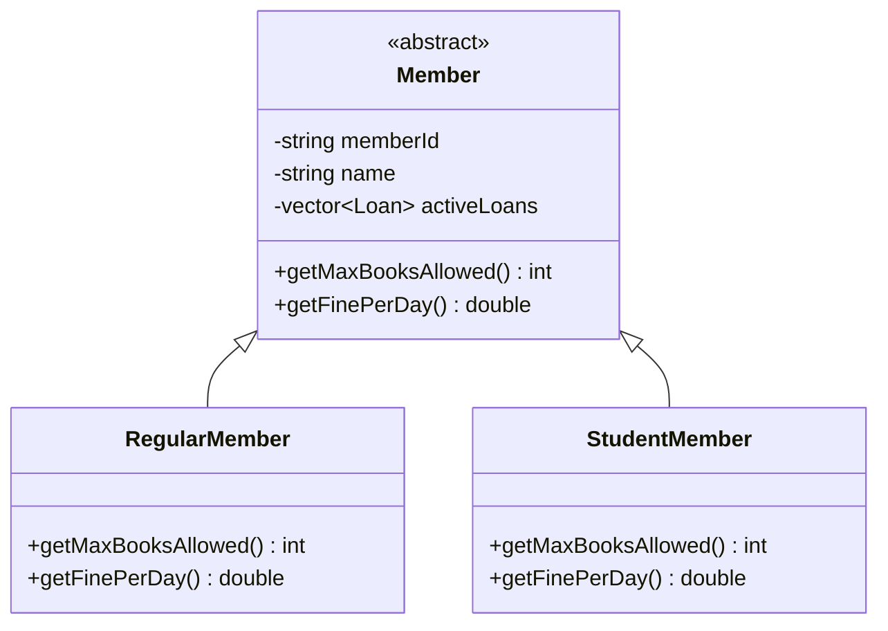
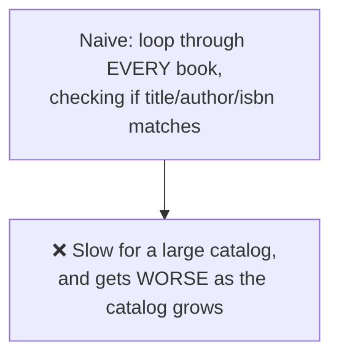
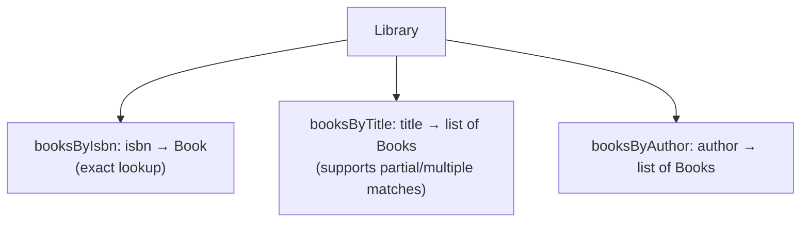
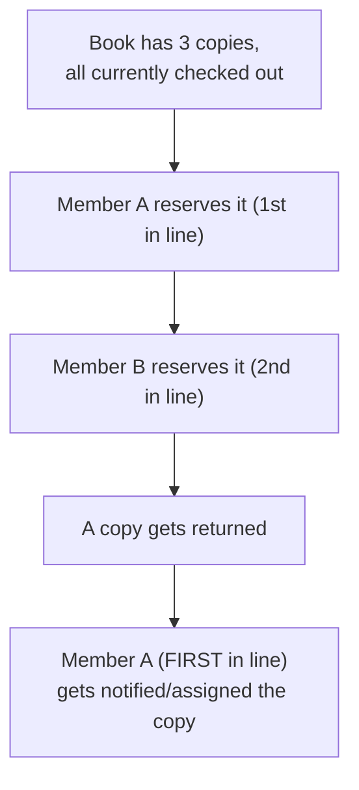
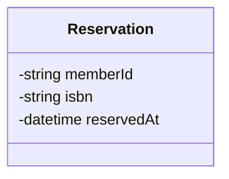
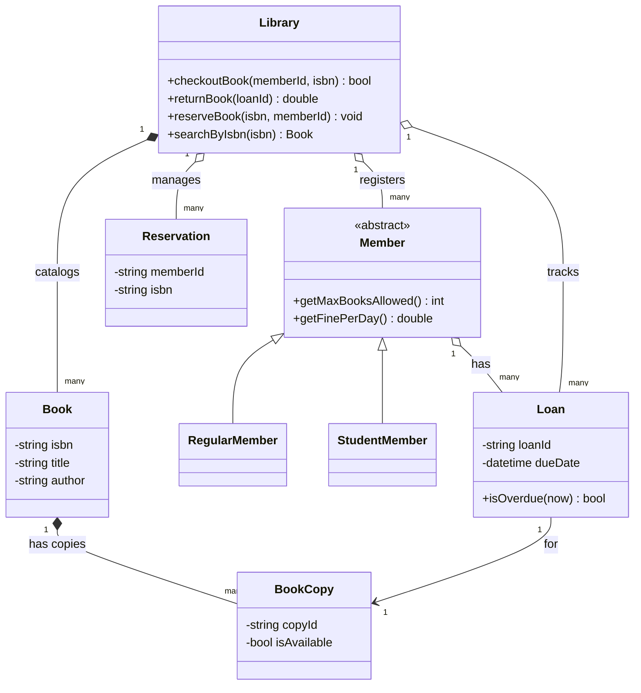
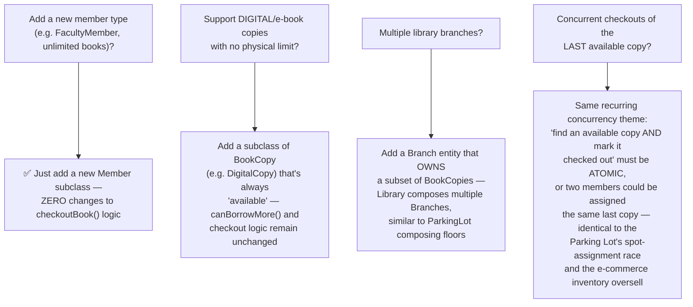

# LLD: Design a Library Management System

*Phase 3 — Low-Level Design (LLD) / OOD. A zero-to-mastery, interview-style walkthrough, with C++ code.*

---

## Table of Contents
1. [What Are We Actually Building?](#1-what-are-we-actually-building)
2. [Step 1: Clarify Requirements](#2-step-1-clarify-requirements)
3. [Step 2: Identify the Core Entities](#3-step-2-identify-the-core-entities)
4. [Step 3: Book vs BookCopy — a Subtle but Important Distinction](#4-step-3-book-vs-bookcopy--a-subtle-but-important-distinction)
5. [Step 4: Modeling Members](#5-step-4-modeling-members)
6. [Step 5: The Core Challenge — Search](#6-step-5-the-core-challenge--search)
7. [Step 6: The Core Challenge — Reservations & Holds](#7-step-6-the-core-challenge--reservations--holds)
8. [Step 7: Checkout, Return, and Fines](#8-step-7-checkout-return-and-fines)
9. [Step 8: The Library Class — Tying It Together](#9-step-8-the-library-class--tying-it-together)
10. [Step 9: The Full Class Diagram](#10-step-9-the-full-class-diagram)
11. [Step 10: Putting It All Together — a Working Example](#11-step-10-putting-it-all-together--a-working-example)
12. [Step 11: Extending the Design](#12-step-11-extending-the-design)
13. [How to Walk Through This in an Interview](#13-how-to-walk-through-this-in-an-interview)
14. [Quick Recall Cheat Sheet](#14-quick-recall-cheat-sheet)

---

## 1. What Are We Actually Building?

A system to manage a library's catalog, its members, and the full lifecycle of borrowing and returning books — including searching the catalog, checking out and returning copies, reserving a currently-unavailable book, and handling overdue fines.



Compared to the Parking Lot and Elevator problems, this design's interesting challenges are less about a single hard algorithm and more about getting the **entity relationships right** — specifically, correctly distinguishing a *book* (the abstract work, like "Harry Potter") from a *physical copy* of that book (one specific object on a shelf) — a distinction that trips up many designs that jump straight into code.

---

## 2. Step 1: Clarify Requirements

### Functional Requirements
- **Search** the catalog by title, author, or ISBN.
- Each book title can have **multiple physical copies**, and the system must track each copy's availability individually.
- Members can **check out** an available copy and **return** it later.
- Members can **reserve** a book that's currently fully checked out, and get notified when a copy becomes available.
- Track **due dates** and calculate **fines** for overdue returns.
- Support different **member types** (e.g., a regular member might have a 3-book limit; a student might have a 5-book limit and no fines).

### Non-Functional / Design Requirements
- Search should be reasonably fast even with a large catalog (recall the Database Indexing mindset from Phase 1, applied at the in-memory data-structure level here).
- The design should make it easy to add new member types or borrowing rules without rewriting core logic (Open/Closed Principle, as with every LLD problem so far).

---

## 3. Step 2: Identify the Core Entities


| Entity | Responsibility |
|---|---|
| `Book` | Represents the abstract work — title, author, ISBN (metadata) |
| `BookCopy` | Represents one physical, checkoutable copy of a `Book` |
| `Member` | A library member, with their borrowing rules and current loans |
| `Library` | The overall system — catalog, members, coordinates checkout/return |
| `Loan` | Records that a specific `Member` currently has a specific `BookCopy` |
| `Reservation` | Records that a `Member` is waiting for a copy of a specific `Book` |

---

## 4. Step 3: Book vs BookCopy — a Subtle but Important Distinction

This is the single most important modeling decision in this entire design, and it's a very common LLD interview trap: **conflating "a book" with "a copy of a book."**





Think of it like `Vehicle` vs a specific `ParkingSpot`'s occupant in the Parking Lot design, or `Shape` vs a specific `Circle` instance — `Book` is the **metadata/blueprint** (shared across every copy), while `BookCopy` is the **individual, trackable physical instance**. Getting this distinction right upfront prevents a design where you can't correctly answer "how many copies of this book are currently available?" — a core requirement.

```cpp
class Book {
private:
    std::string isbn;
    std::string title;
    std::string author;
    std::vector<std::string> copyIds;  // which copies exist for this book

public:
    Book(std::string i, std::string t, std::string a) : isbn(i), title(t), author(a) {}

    void addCopyId(const std::string& copyId) {
        copyIds.push_back(copyId);
    }

    std::string getIsbn() const { return isbn; }
    std::string getTitle() const { return title; }
    std::string getAuthor() const { return author; }
    const std::vector<std::string>& getCopyIds() const { return copyIds; }
};

class BookCopy {
private:
    std::string copyId;
    std::string isbn;  // which Book this copy belongs to
    bool available;

public:
    BookCopy(std::string id, std::string bookIsbn)
        : copyId(id), isbn(bookIsbn), available(true) {}

    bool isAvailable() const { return available; }
    void markCheckedOut() { available = false; }
    void markReturned() { available = true; }

    std::string getCopyId() const { return copyId; }
    std::string getIsbn() const { return isbn; }
};
```

---

## 5. Step 4: Modeling Members

Different member types have different borrowing rules — a natural fit for **inheritance**, exactly as with `Vehicle` in the Parking Lot design.



```cpp
class Loan;  // forward declaration

class Member {
protected:
    std::string memberId;
    std::string name;
    std::vector<Loan*> activeLoans;

public:
    Member(std::string id, std::string n) : memberId(id), name(n) {}
    virtual ~Member() {}

    virtual int getMaxBooksAllowed() const = 0;
    virtual double getFinePerDay() const = 0;

    bool canBorrowMore() const {
        return activeLoans.size() < static_cast<size_t>(getMaxBooksAllowed());
    }

    void addLoan(Loan* loan) { activeLoans.push_back(loan); }
    void removeLoan(Loan* loan) {
        activeLoans.erase(std::remove(activeLoans.begin(), activeLoans.end(), loan), activeLoans.end());
    }

    std::string getMemberId() const { return memberId; }
};

class RegularMember : public Member {
public:
    RegularMember(std::string id, std::string n) : Member(id, n) {}
    int getMaxBooksAllowed() const override { return 3; }
    double getFinePerDay() const override { return 0.50; }
};

class StudentMember : public Member {
public:
    StudentMember(std::string id, std::string n) : Member(id, n) {}
    int getMaxBooksAllowed() const override { return 5; }
    double getFinePerDay() const override { return 0.0; }  // students exempt from fines
};
```

- Notice `getMaxBooksAllowed()` and `getFinePerDay()` are **pure virtual** — each concrete member type *must* define its own rule, but `canBorrowMore()` is written **once**, in the base class, and works correctly for any member type — a clean example of combining inheritance with polymorphism, exactly as covered in OOP Fundamentals.

---

## 6. Step 5: The Core Challenge — Search

With a large catalog (recall the capacity-estimation habit from Phase 2 HLD — even a mid-sized library can have tens of thousands of titles), a naive linear scan through every book to find matches by title/author/ISBN doesn't scale well.



### The fix: maintain search indexes
Just like a real database index (Phase 1's Indexing topic) avoids full table scans, maintain separate lookup maps keyed by the fields people actually search by — trading a small amount of extra memory and update complexity for dramatically faster lookups.



```cpp
#include <unordered_map>

class Library {
private:
    std::unordered_map<std::string, Book> booksByIsbn;
    std::unordered_map<std::string, std::vector<std::string>> isbnsByTitle;   // title -> ISBNs
    std::unordered_map<std::string, std::vector<std::string>> isbnsByAuthor;  // author -> ISBNs

public:
    void addBook(const Book& book) {
        booksByIsbn[book.getIsbn()] = book;
        isbnsByTitle[book.getTitle()].push_back(book.getIsbn());
        isbnsByAuthor[book.getAuthor()].push_back(book.getIsbn());
    }

    Book* searchByIsbn(const std::string& isbn) {
        auto it = booksByIsbn.find(isbn);
        return (it != booksByIsbn.end()) ? &it->second : nullptr;
    }

    std::vector<Book*> searchByTitle(const std::string& title) {
        std::vector<Book*> results;
        if (isbnsByTitle.count(title)) {
            for (const auto& isbn : isbnsByTitle[title]) {
                results.push_back(&booksByIsbn[isbn]);
            }
        }
        return results;
    }

    // searchByAuthor follows the exact same pattern
};
```

**Why this matters:** this is the same underlying tradeoff as Database Indexing — extra structures maintained on write, in exchange for dramatically faster reads, which is exactly the right call here given that search happens far more often than adding a brand-new book title to the catalog.

---

## 7. Step 6: The Core Challenge — Reservations & Holds

When a member wants a book that's currently fully checked out, they can place a **reservation** — and when a copy is eventually returned, it should go to the person who's been waiting the **longest** first (fairness).



This is naturally modeled as a **FIFO queue** per book — the first person to reserve is the first person served, exactly matching real-world library etiquette.



```cpp
#include <queue>

class Library {
    // ... (previous members) ...
private:
    std::unordered_map<std::string, std::queue<std::string>> reservationsByIsbn;  // isbn -> queue of memberIds

public:
    void reserveBook(const std::string& isbn, const std::string& memberId) {
        reservationsByIsbn[isbn].push(memberId);
        std::cout << "Member " << memberId << " added to reservation queue for " << isbn << "\n";
    }

    // Called whenever a copy is returned
    void notifyNextInLine(const std::string& isbn) {
        if (reservationsByIsbn.count(isbn) && !reservationsByIsbn[isbn].empty()) {
            std::string nextMemberId = reservationsByIsbn[isbn].front();
            reservationsByIsbn[isbn].pop();
            std::cout << "Notifying member " << nextMemberId << ": a copy of " << isbn << " is now available!\n";
            // (In a real system, this would trigger the Notification System
            //  design from Phase 2 — reusing that architecture directly)
        }
    }
};
```

**Direct reuse from earlier topics:** notice this "notify the next person in line" step is exactly the kind of event a full **Notification System** (Phase 2 HLD) would handle in a production system — this LLD design doesn't need to reimplement notification delivery, it just needs to trigger that event at the right moment.

---

## 8. Step 7: Checkout, Return, and Fines

A `Loan` ties together a `Member`, a `BookCopy`, and the relevant dates — directly mirroring the `Ticket` class's role in the Parking Lot design (both represent "an active session that will later be settled/closed out").

```cpp
#include <chrono>

class Loan {
private:
    std::string loanId;
    std::string memberId;
    BookCopy* copy;
    std::chrono::system_clock::time_point checkoutDate;
    std::chrono::system_clock::time_point dueDate;

public:
    Loan(std::string id, std::string mId, BookCopy* c)
        : loanId(id), memberId(mId), copy(c) {
        checkoutDate = std::chrono::system_clock::now();
        dueDate = checkoutDate + std::chrono::hours(24 * 14);  // 2-week loan period
    }

    bool isOverdue(std::chrono::system_clock::time_point now) const {
        return now > dueDate;
    }

    int daysOverdue(std::chrono::system_clock::time_point returnDate) const {
        if (returnDate <= dueDate) return 0;
        auto diff = std::chrono::duration_cast<std::chrono::hours>(returnDate - dueDate);
        return static_cast<int>(diff.count() / 24) + 1;
    }

    BookCopy* getCopy() const { return copy; }
    std::string getMemberId() const { return memberId; }
};
```

Fine calculation is deliberately kept **separate** from `Loan` itself — following the **Single Responsibility Principle** from SOLID, `Loan` just tracks dates; a member-type-specific `getFinePerDay()` (Step 4) is what actually determines the cost, so `Loan` doesn't need to know anything about member-type-specific business rules.

---

## 9. Step 8: The Library Class — Tying It Together

```cpp
class Library {
    // ... (catalog and reservation structures from earlier) ...
private:
    std::unordered_map<std::string, Member*> members;
    std::unordered_map<std::string, BookCopy> copies;  // copyId -> BookCopy
    std::unordered_map<std::string, Loan> activeLoans; // loanId -> Loan
    int nextLoanId = 1;

public:
    bool checkoutBook(const std::string& memberId, const std::string& isbn) {
        Member* member = members[memberId];
        if (!member->canBorrowMore()) {
            std::cout << "Member has reached their borrowing limit.\n";
            return false;
        }

        Book* book = searchByIsbn(isbn);
        if (!book) return false;

        // Find an available copy
        for (const auto& copyId : book->getCopyIds()) {
            BookCopy& copy = copies[copyId];
            if (copy.isAvailable()) {
                copy.markCheckedOut();
                std::string loanId = "L" + std::to_string(nextLoanId++);
                Loan loan(loanId, memberId, &copy);
                activeLoans.emplace(loanId, loan);
                member->addLoan(&activeLoans.at(loanId));
                std::cout << "Checked out copy " << copyId << " to member " << memberId << "\n";
                return true;
            }
        }

        std::cout << "No available copies. Consider reserving instead.\n";
        return false;
    }

    double returnBook(const std::string& loanId) {
        Loan& loan = activeLoans.at(loanId);
        auto now = std::chrono::system_clock::now();

        Member* member = members[loan.getMemberId()];
        double fine = 0.0;
        if (loan.isOverdue(now)) {
            fine = loan.daysOverdue(now) * member->getFinePerDay();
        }

        loan.getCopy()->markReturned();
        member->removeLoan(&loan);
        notifyNextInLine(loan.getCopy()->getIsbn());  // reservation queue, from Step 6
        activeLoans.erase(loanId);

        std::cout << "Book returned. Fine: $" << fine << "\n";
        return fine;
    }

    Book* searchByIsbn(const std::string& isbn);  // as shown in Step 5
    void notifyNextInLine(const std::string& isbn);  // as shown in Step 6
};
```

---

## 10. Step 9: The Full Class Diagram



Reading this diagram: `Library` **composes** `Book`s (the catalog doesn't make sense without the library owning it) but only **aggregates** `Member`s (people who exist independently) — the exact same Composition-vs-Aggregation reasoning first introduced in the UML Basics topic, applied consistently here too.

---

## 11. Step 10: Putting It All Together — a Working Example

```cpp
int main() {
    Library library;

    Book harryPotter("978-0439", "Harry Potter", "J.K. Rowling");
    library.addBook(harryPotter);
    // (copies would be added to both the Book and the Library's copies map)

    RegularMember alice("M1", "Alice");
    library.registerMember(&alice);

    library.checkoutBook("M1", "978-0439");
    // ... two weeks later ...
    library.returnBook("L1");
}
```

---

## 12. Step 11: Extending the Design



---

## 13. How to Walk Through This in an Interview

A strong end-to-end summary sounds like this:

> "The most important early decision is separating `Book`, which represents the abstract work and its metadata, from `BookCopy`, which represents one specific, trackable physical instance — without this split, it's impossible to correctly answer how many copies are currently available. I'd use inheritance for different member types, since borrowing limits and fine rules genuinely vary by type but the core `canBorrowMore()` logic can be written once in the base class. For search, I'd maintain separate index maps by ISBN, title, and author, rather than scanning the whole catalog on every search, the same tradeoff as a database index. Reservations are naturally a FIFO queue per book, so the longest-waiting member gets notified first when a copy is returned — and that notification event is exactly the kind of thing a full Notification System, as covered in HLD, would actually deliver in production. I'd keep `Loan` focused purely on dates and overdue status, leaving the actual fine amount to each member type's own rate, following Single Responsibility. And since two members could try to check out the very last available copy at the same time, I'd make the 'find an available copy and mark it checked out' sequence atomic, to avoid the same kind of race condition seen in the Parking Lot and e-commerce inventory designs."

That answer shows: you caught the **Book vs BookCopy** distinction upfront (the single biggest trap in this problem), you reused inheritance and indexing patterns correctly, and you explicitly connected this design back to concurrency and notification concepts from earlier phases rather than treating this as an isolated problem.

---

## 14. Quick Recall Cheat Sheet

```mermaid
mindmap
  root((Library System LLD))
    Key Insight
      Book (metadata) vs BookCopy (physical instance)
      Most common trap in this problem
    Member Hierarchy
      Inheritance for borrowing rules
      Base class logic works for any subclass
    Search
      Index maps by ISBN, title, author
      Same tradeoff as Database Indexing
    Reservations
      FIFO queue per book
      Fairness - longest wait served first
      Triggers a Notification System event
    Checkout and Fines
      Loan tracks dates only
      Fine rate lives on Member subclass
      Single Responsibility split
    Concurrency
      Atomic "find copy + mark checked out"
      Same race condition as Parking Lot / inventory
```

| If you remember only 5 things |
|---|
| 1. Separate `Book` (abstract metadata) from `BookCopy` (one trackable physical instance) — this is the single most important modeling decision in the whole problem. |
| 2. Use inheritance for member types with different borrowing rules — write shared logic like `canBorrowMore()` once in the base class. |
| 3. Maintain search index maps (by ISBN, title, author) rather than scanning the full catalog — the same tradeoff as database indexing. |
| 4. Reservations are naturally a FIFO queue per book, ensuring the longest-waiting member is served first when a copy becomes available. |
| 5. Checking out the last available copy needs to be atomic to prevent a race condition — the same underlying problem as the Parking Lot's spot assignment and e-commerce inventory overselling. |

---

*This file is written in GitHub-flavored Markdown with Mermaid diagrams and C++ code — it will render natively on GitHub, GitLab, and most modern Markdown viewers.*
