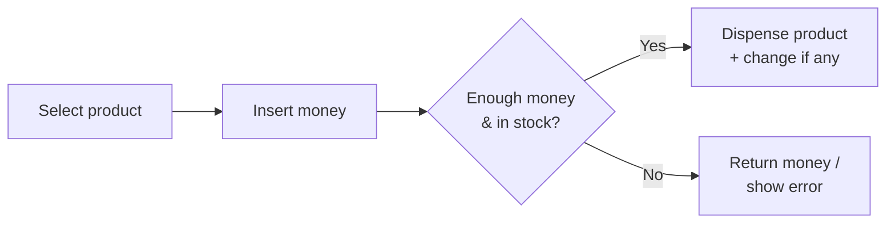
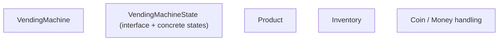
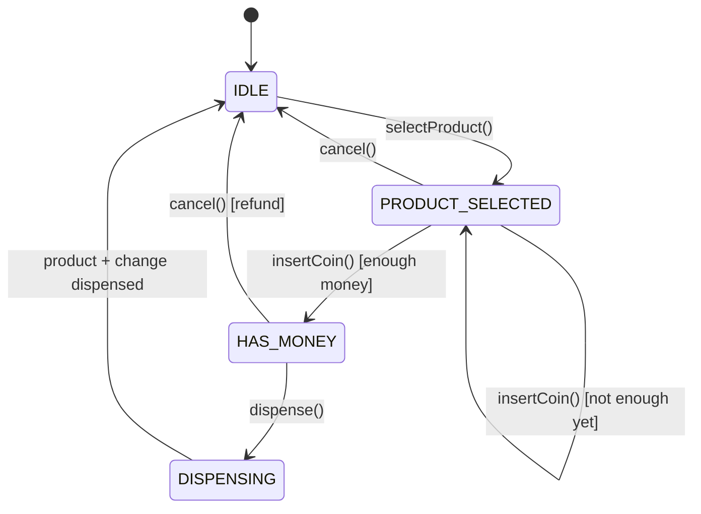
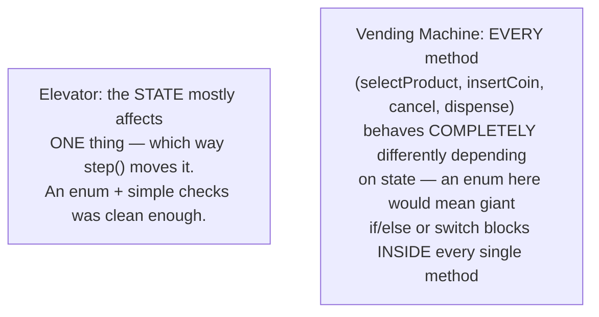
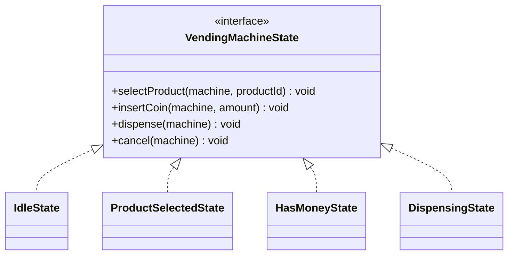
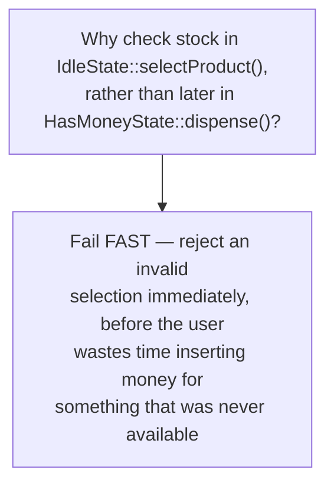
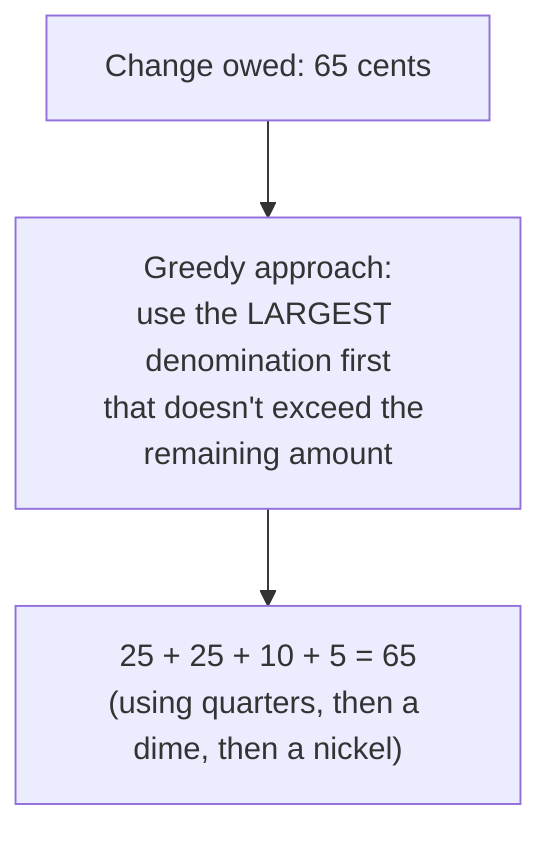
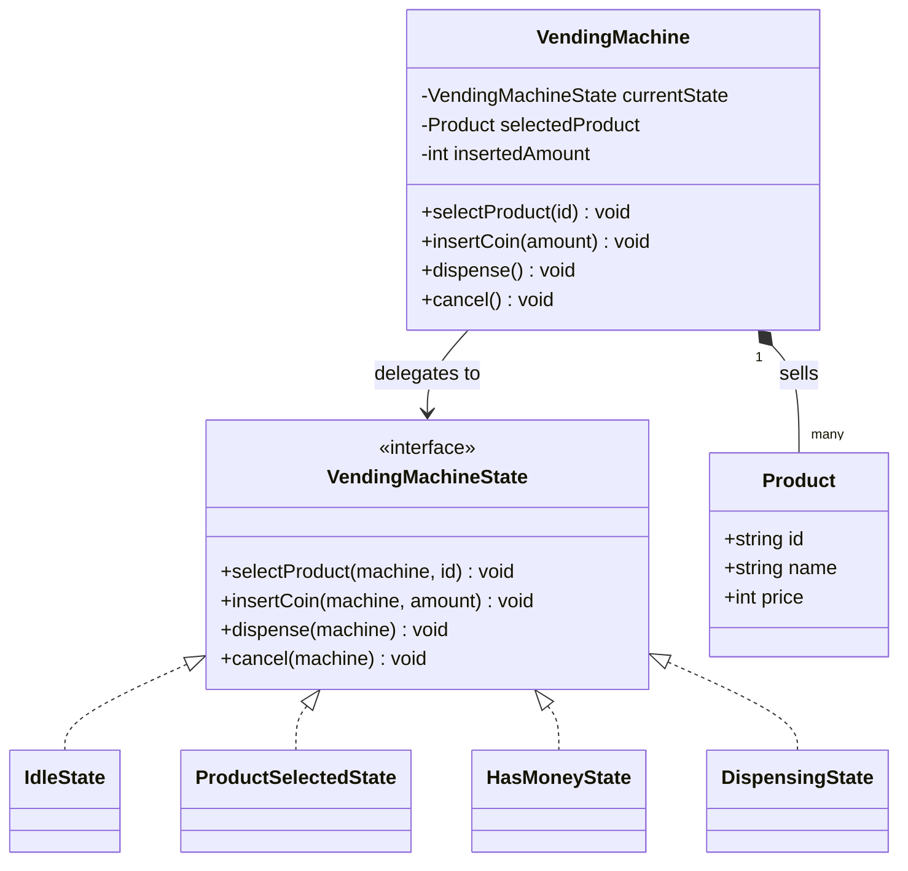
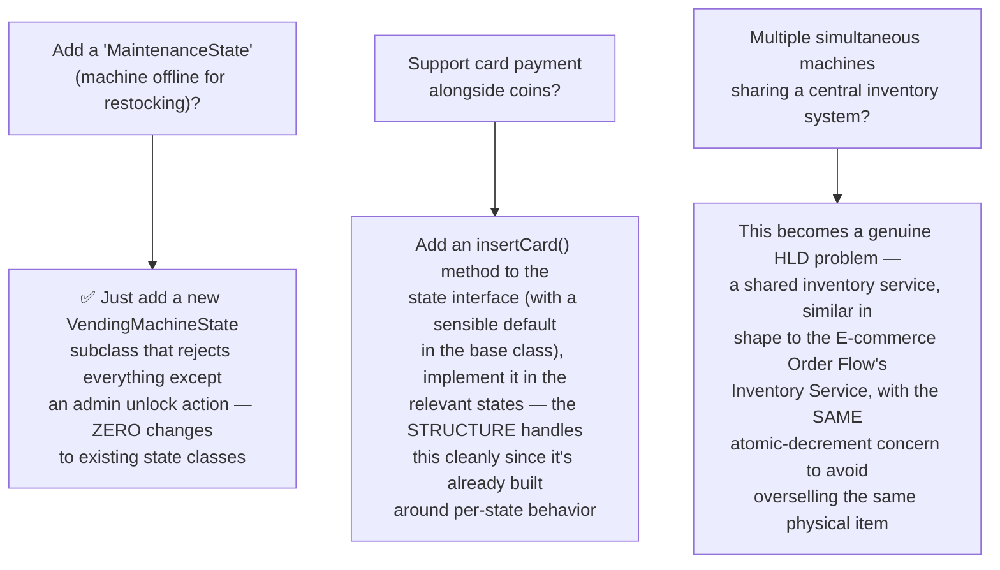
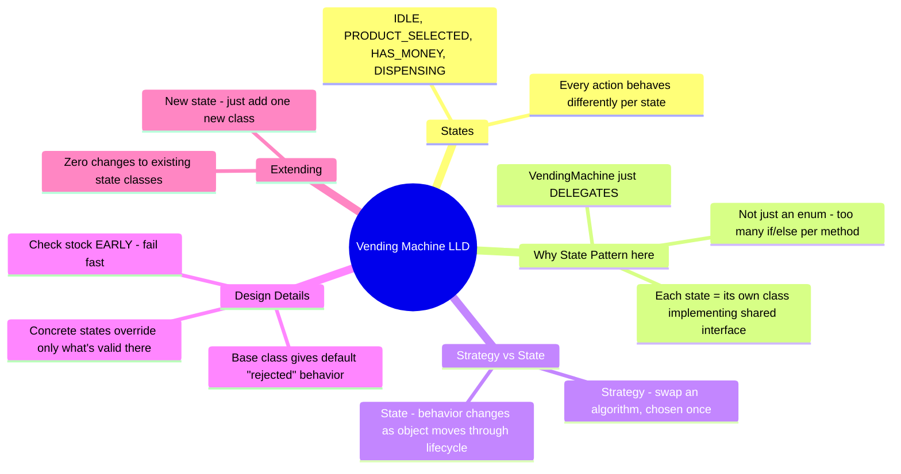

# LLD: Design a Vending Machine

*Phase 3 — Low-Level Design (LLD) / OOD. A zero-to-mastery, interview-style walkthrough, with C++ code.*

---

## Table of Contents
1. [What Are We Actually Building?](#1-what-are-we-actually-building)
2. [Step 1: Clarify Requirements](#2-step-1-clarify-requirements)
3. [Step 2: Identify the Core Entities](#3-step-2-identify-the-core-entities)
4. [Step 3: Mapping Out the State Machine](#4-step-3-mapping-out-the-state-machine)
5. [Step 4: From Enum to the Formal State Pattern](#5-step-4-from-enum-to-the-formal-state-pattern)
6. [Step 5: Implementing Each Concrete State](#6-step-5-implementing-each-concrete-state)
7. [Step 6: The VendingMachine Class — Tying It Together](#7-step-6-the-vendingmachine-class--tying-it-together)
8. [Step 7: Modeling Inventory](#8-step-7-modeling-inventory)
9. [Step 8: Handling Money — Coins, Notes, and Change](#9-step-8-handling-money--coins-notes-and-change)
10. [Step 9: The Full Class Diagram](#10-step-9-the-full-class-diagram)
11. [Step 10: Putting It All Together — a Working Example](#11-step-10-putting-it-all-together--a-working-example)
12. [Step 11: Extending the Design](#12-step-11-extending-the-design)
13. [How to Walk Through This in an Interview](#13-how-to-walk-through-this-in-an-interview)
14. [Quick Recall Cheat Sheet](#14-quick-recall-cheat-sheet)

---

## 1. What Are We Actually Building?

A vending machine: a user selects a product, inserts money, and the machine either dispenses the product (and change, if any) or returns the money if something goes wrong (insufficient funds, out of stock).



This problem is the **quintessential State Pattern example** — while the Elevator System used a simple enum to represent state (which was the right call for that problem's complexity), a Vending Machine is the classic case where the **formal State design pattern** genuinely earns its keep, because the *behavior* of nearly every action (`selectProduct`, `insertCoin`, `dispense`) meaningfully **changes** depending on the current state — not just a status flag being checked here and there.

---

## 2. Step 1: Clarify Requirements

### Functional Requirements
- Display available products and their prices.
- Accept **coins/notes** of different denominations.
- Let the user **select** a product.
- **Dispense** the product if enough money has been inserted and it's in stock.
- Return **change** if the user inserted more than the product's price.
- Allow the user to **cancel** and get their money back before selecting/dispensing.
- Track **inventory** per product slot, and refuse selection if a slot is empty.

### Non-Functional / Design Requirements
- The machine's behavior must be **strictly sequential and state-dependent** — e.g., you can't "dispense" before selecting a product and inserting enough money; the design should make invalid sequences of actions impossible or cleanly rejected, not just "work by convention."
- Easy to **add new states/behaviors** later (e.g., a "maintenance mode") without a tangle of conditionals — a direct callback to the Open/Closed Principle.

---

## 3. Step 2: Identify the Core Entities



| Entity | Responsibility |
|---|---|
| `VendingMachine` | The overall context — holds the current state, inventory, and inserted amount |
| `VendingMachineState` | An interface representing "what can happen in this particular state" |
| `Product` | A product's name and price |
| `Inventory` | Tracks how many units of each product slot remain |

---

## 4. Step 3: Mapping Out the State Machine

Before writing any code, map out every state and the events that move between them — exactly the same first step used for the Elevator's state machine.



| State | What's allowed here |
|---|---|
| `IDLE` | Only `selectProduct()` makes sense |
| `PRODUCT_SELECTED` | `insertCoin()` (possibly multiple times) or `cancel()` |
| `HAS_MONEY` | `dispense()` or `cancel()` (refund) |
| `DISPENSING` | The machine is actively releasing the product; no user input accepted mid-dispense |

---

## 5. Step 4: From Enum to the Formal State Pattern

### Why not just use an enum + if/else, like the Elevator?
It's worth being explicit about *why* this problem calls for something different — this contrast is a genuinely useful thing to articulate in an interview.



### The naive (enum-based) approach, and why it gets messy here

```cpp
// ❌ Works, but every method needs its own switch statement,
// and adding a new state means touching EVERY method
void VendingMachine::insertCoin(int amount) {
    switch (currentState) {
        case State::IDLE:
            std::cout << "Please select a product first.\n";
            break;
        case State::PRODUCT_SELECTED:
            insertedAmount += amount;
            if (insertedAmount >= selectedProduct->getPrice()) {
                currentState = State::HAS_MONEY;
            }
            break;
        case State::HAS_MONEY:
            insertedAmount += amount;  // allow extra money too
            break;
        case State::DISPENSING:
            std::cout << "Please wait, dispensing in progress.\n";
            break;
    }
}
// ...and selectProduct(), cancel(), dispense() would EACH need
// their own similarly-sized switch statement
```

### The State Pattern's fix: each state is its own class
Instead of one method containing logic for every state, **flip the structure**: each *state* becomes a class that knows how to handle every possible action *while in that state* — and the `VendingMachine` simply **delegates** every action to whatever the current state object is.



This directly reuses the same "define an interface, implement it per-concept" shape as the **Strategy Pattern** from the Design Patterns topic — the key difference is that a Strategy is typically chosen once and used; a **State** is expected to **change itself, dynamically, over time**, as the object transitions from one state to the next. This distinction (Strategy = "swap the algorithm," State = "the object's behavior changes as it moves through a lifecycle") is a commonly asked interview follow-up.

---

## 6. Step 5: Implementing Each Concrete State

```cpp
// Forward declaration — VendingMachine and states reference each other
class VendingMachine;

class VendingMachineState {
public:
    virtual void selectProduct(VendingMachine& machine, const std::string& productId) {
        std::cout << "Cannot select a product right now.\n";
    }
    virtual void insertCoin(VendingMachine& machine, int amount) {
        std::cout << "Cannot insert coins right now.\n";
    }
    virtual void dispense(VendingMachine& machine) {
        std::cout << "Cannot dispense right now.\n";
    }
    virtual void cancel(VendingMachine& machine) {
        std::cout << "Nothing to cancel.\n";
    }
    virtual ~VendingMachineState() {}
};
```

Notice the **base class provides sensible default "rejected" behavior** for every action — meaning each concrete state only needs to **override the specific actions that are actually valid** in that state, keeping each concrete class small and focused (a nice practical benefit of combining this with default method implementations).

```cpp
class IdleState : public VendingMachineState {
public:
    void selectProduct(VendingMachine& machine, const std::string& productId) override;
    // insertCoin, dispense, cancel all fall back to the base class's
    // "not allowed right now" behavior — no need to override them here
};

class ProductSelectedState : public VendingMachineState {
public:
    void insertCoin(VendingMachine& machine, int amount) override;
    void cancel(VendingMachine& machine) override;
};

class HasMoneyState : public VendingMachineState {
public:
    void insertCoin(VendingMachine& machine, int amount) override;  // allow extra money
    void dispense(VendingMachine& machine) override;
    void cancel(VendingMachine& machine) override;  // refund
};

class DispensingState : public VendingMachineState {
public:
    // Deliberately overrides NOTHING — while dispensing, EVERY action
    // correctly falls back to the base class's "not allowed" behavior
};
```

The actual logic for each transition (defined next in Step 6, once `VendingMachine` itself exists) lives **inside** these state classes, not inside `VendingMachine` — this is the core inversion the State Pattern introduces.

---

## 7. Step 6: The VendingMachine Class — Tying It Together

```cpp
#include <unordered_map>

class Product {
public:
    std::string id;
    std::string name;
    int price;  // in cents, to avoid floating-point money issues
};

class VendingMachine {
private:
    VendingMachineState* currentState;
    std::unordered_map<std::string, Product> products;
    std::unordered_map<std::string, int> inventory;  // productId -> quantity remaining
    Product* selectedProduct = nullptr;
    int insertedAmount = 0;

    // Pre-created state instances (Singleton-style reuse, recalling
    // the Design Patterns topic — no need for a NEW object each transition)
    IdleState idleState;
    ProductSelectedState productSelectedState;
    HasMoneyState hasMoneyState;
    DispensingState dispensingState;

public:
    VendingMachine() {
        currentState = &idleState;  // starts IDLE
    }

    void setState(VendingMachineState* state) { currentState = state; }
    VendingMachineState* getIdleState() { return &idleState; }
    VendingMachineState* getProductSelectedState() { return &productSelectedState; }
    VendingMachineState* getHasMoneyState() { return &hasMoneyState; }
    VendingMachineState* getDispensingState() { return &dispensingState; }

    // Public actions — each is simply DELEGATED to the current state
    void selectProduct(const std::string& productId) {
        currentState->selectProduct(*this, productId);
    }
    void insertCoin(int amount) {
        currentState->insertCoin(*this, amount);
    }
    void dispense() {
        currentState->dispense(*this);
    }
    void cancel() {
        currentState->cancel(*this);
    }

    // Internal helpers used BY the state classes
    bool isInStock(const std::string& productId) {
        return inventory.count(productId) && inventory[productId] > 0;
    }
    Product* getProduct(const std::string& productId) {
        return products.count(productId) ? &products[productId] : nullptr;
    }
    void setSelectedProduct(Product* p) { selectedProduct = p; }
    Product* getSelectedProduct() { return selectedProduct; }
    void addInsertedAmount(int amount) { insertedAmount += amount; }
    int getInsertedAmount() const { return insertedAmount; }
    void resetInsertedAmount() { insertedAmount = 0; }
    void reduceInventory(const std::string& productId) { inventory[productId]--; }
    void addProduct(const Product& p, int quantity) {
        products[p.id] = p;
        inventory[p.id] = quantity;
    }
};
```

Notice `VendingMachine::selectProduct()` is now **one line** — it just delegates. All the actual "what does selecting a product even mean, given where we currently are" logic lives in the state classes themselves, which is exactly what avoids the giant switch-statement mess from Step 4's naive approach.

### Now the concrete state implementations, in full

```cpp
void IdleState::selectProduct(VendingMachine& machine, const std::string& productId) {
    Product* product = machine.getProduct(productId);
    if (!product) {
        std::cout << "Invalid product.\n";
        return;
    }
    if (!machine.isInStock(productId)) {
        std::cout << "Sorry, out of stock.\n";
        return;
    }
    machine.setSelectedProduct(product);
    std::cout << "Selected " << product->name << ". Price: " << product->price << " cents.\n";
    machine.setState(machine.getProductSelectedState());  // TRANSITION
}

void ProductSelectedState::insertCoin(VendingMachine& machine, int amount) {
    machine.addInsertedAmount(amount);
    std::cout << "Inserted " << amount << " cents. Total: " << machine.getInsertedAmount() << "\n";

    if (machine.getInsertedAmount() >= machine.getSelectedProduct()->price) {
        machine.setState(machine.getHasMoneyState());  // TRANSITION
    }
    // else: stay in ProductSelectedState, waiting for more coins
}

void ProductSelectedState::cancel(VendingMachine& machine) {
    std::cout << "Selection cancelled.\n";
    machine.setSelectedProduct(nullptr);
    machine.setState(machine.getIdleState());  // TRANSITION
}

void HasMoneyState::insertCoin(VendingMachine& machine, int amount) {
    machine.addInsertedAmount(amount);  // allow inserting extra, just accumulates
    std::cout << "Extra coins accepted. Total: " << machine.getInsertedAmount() << "\n";
}

void HasMoneyState::dispense(VendingMachine& machine) {
    machine.setState(machine.getDispensingState());  // TRANSITION (mid-dispense)

    Product* product = machine.getSelectedProduct();
    int change = machine.getInsertedAmount() - product->price;

    machine.reduceInventory(product->id);
    std::cout << "Dispensing " << product->name << "!\n";
    if (change > 0) {
        std::cout << "Returning change: " << change << " cents.\n";
    }

    machine.resetInsertedAmount();
    machine.setSelectedProduct(nullptr);
    machine.setState(machine.getIdleState());  // TRANSITION back to idle, ready for next customer
}

void HasMoneyState::cancel(VendingMachine& machine) {
    std::cout << "Refunding " << machine.getInsertedAmount() << " cents.\n";
    machine.resetInsertedAmount();
    machine.setSelectedProduct(nullptr);
    machine.setState(machine.getIdleState());  // TRANSITION
}
```

---

## 8. Step 7: Modeling Inventory

Inventory is deliberately kept simple here (already shown as part of `VendingMachine` in Step 6: an `unordered_map<productId, quantity>`) — the interesting design decision was really about *where the checks happen* (inside `IdleState::selectProduct()`, before allowing a selection at all), not the data structure itself.



This is a small but real UX/design decision worth calling out: catching an invalid condition as early as possible in the flow (recall this same "fail fast" instinct from the Circuit Breaker topic in Phase 1) is generally better than letting a user proceed further into a doomed transaction.

---

## 9. Step 8: Handling Money — Coins, Notes, and Change

A subtlety worth mentioning even if not fully implemented: **making change correctly** is itself a small, self-contained algorithmic problem — given a machine's available coin/note denominations, how do you return the correct change using the fewest, most available coins?



- A simple **greedy algorithm** (always use the largest available denomination that fits) works correctly for standard currency denominations (like US coins), though it's worth knowing that greedy approaches don't always produce optimal results for arbitrary denomination sets — a detail more relevant to a pure algorithms interview than this LLD design, but worth being aware exists as a real edge case (e.g., if the machine ever ran low on a specific denomination, a pure greedy approach could fail to make correct change even when a valid combination exists).

---

## 10. Step 9: The Full Class Diagram



---

## 11. Step 10: Putting It All Together — a Working Example

```cpp
int main() {
    VendingMachine machine;
    machine.addProduct({"A1", "Soda", 125}, 5);   // 5 units, $1.25 each
    machine.addProduct({"A2", "Chips", 150}, 0);  // 0 units — out of stock

    machine.selectProduct("A1");   // "Selected Soda. Price: 125 cents."
    machine.insertCoin(100);       // "Inserted 100 cents. Total: 100" (stays in ProductSelectedState)
    machine.insertCoin(50);        // "Inserted 50 cents. Total: 150" (transitions to HasMoneyState)
    machine.dispense();            // "Dispensing Soda! Returning change: 25 cents."

    machine.selectProduct("A2");   // "Sorry, out of stock." (rejected immediately, still IDLE)
    machine.dispense();            // "Cannot dispense right now." (base class default — no product selected)
}
```

---

## 12. Step 11: Extending the Design



**The clearest payoff of the State Pattern, demonstrated:** adding `MaintenanceState` requires touching **zero** existing state classes — you write one new class, and the rest of the system is completely unaffected. Compare this to the naive enum + switch-statement approach from Step 4, where adding a new state would mean finding and updating a `case` in **every single method** across the class.

---

## 13. How to Walk Through This in an Interview

A strong end-to-end summary sounds like this:

> "I'd start by mapping out the state machine explicitly — Idle, Product Selected, Has Money, Dispensing — and the valid transitions between them. Unlike a simpler state machine like an elevator, here nearly every action behaves completely differently depending on the current state, so I'd use the formal State design pattern rather than an enum with switch statements — each state becomes its own class implementing a shared interface, and `VendingMachine` just delegates every action to whichever state object is current. This means adding a new state later, like a maintenance mode, only requires writing one new class, with zero changes to existing states — a direct demonstration of the Open/Closed Principle. I'd check stock availability as early as possible, right when a product is selected, rather than waiting until dispense time, to fail fast and avoid wasting the user's time. And I'd distinguish this from the Strategy pattern I used in the Elevator design — Strategy is about swapping an algorithm that's chosen once, while State is specifically about an object's behavior changing as it transitions through a lifecycle, which is exactly what's happening here as the machine moves from idle to selected to funded to dispensing."

That answer shows: you correctly identified *why* this problem specifically calls for the formal State pattern (not just reused the Elevator's enum approach out of habit), you can articulate the **Strategy vs State** distinction precisely, and you demonstrated the Open/Closed payoff concretely rather than just asserting it.

---

## 14. Quick Recall Cheat Sheet



| If you remember only 5 things |
|---|
| 1. Map out the state machine explicitly first — Idle, Product Selected, Has Money, Dispensing — before writing any code. |
| 2. Use the formal State design pattern (not just an enum) when behavior for EVERY action meaningfully changes per state — each state becomes its own class implementing a shared interface. |
| 3. The base state interface should provide sensible default "not allowed" behavior, so concrete states only need to override actions that are actually valid in that state. |
| 4. Strategy and State look structurally similar but differ in intent: Strategy swaps an algorithm chosen once; State represents behavior changing as an object moves through a lifecycle. |
| 5. Check stock/validity as early as possible (at selection, not at dispense) to fail fast, rather than letting a user proceed further into a doomed transaction. |

---

*This file is written in GitHub-flavored Markdown with Mermaid diagrams and C++ code — it will render natively on GitHub, GitLab, and most modern Markdown viewers.*
