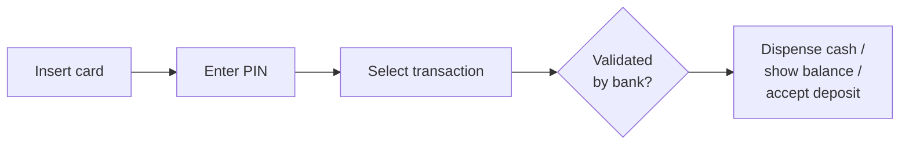
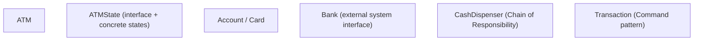
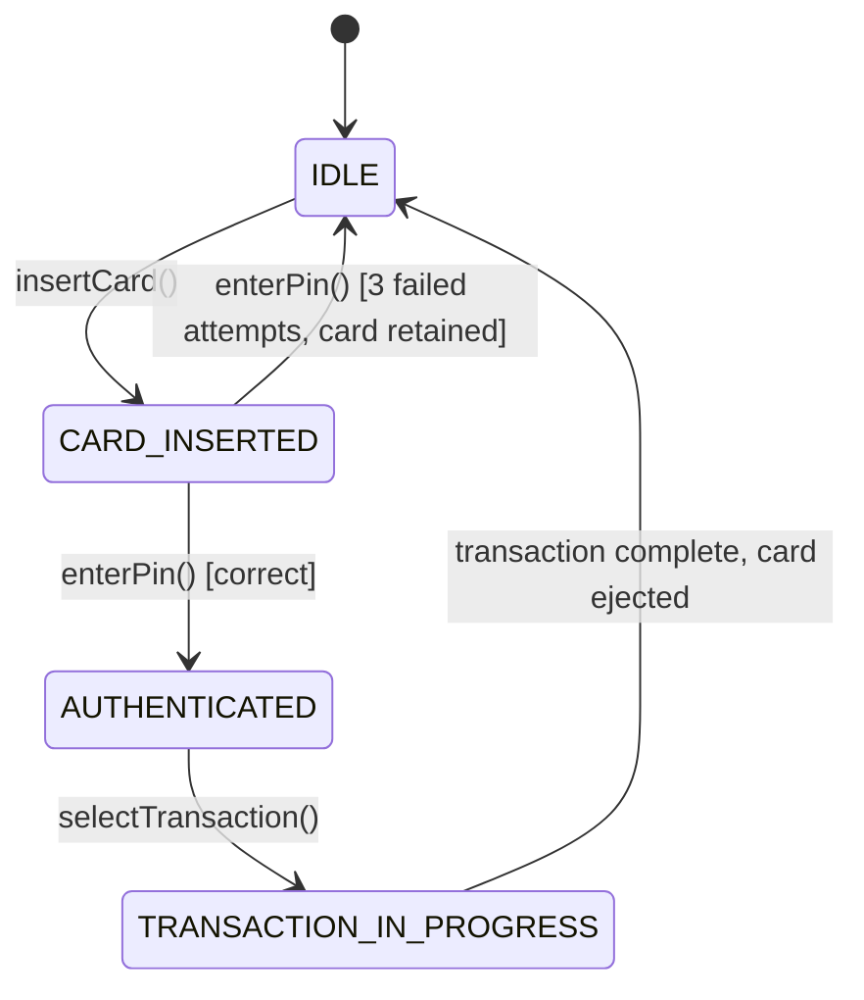
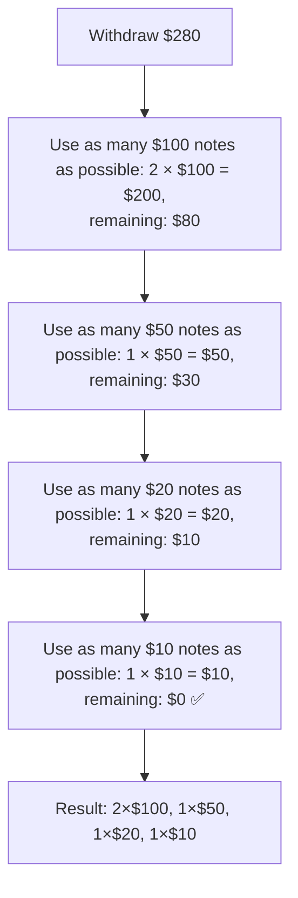
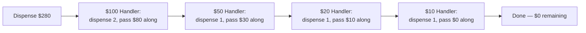
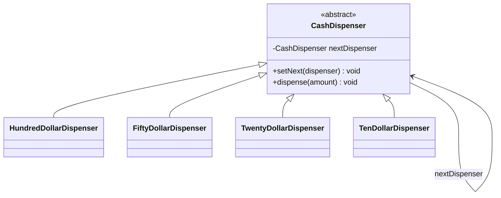
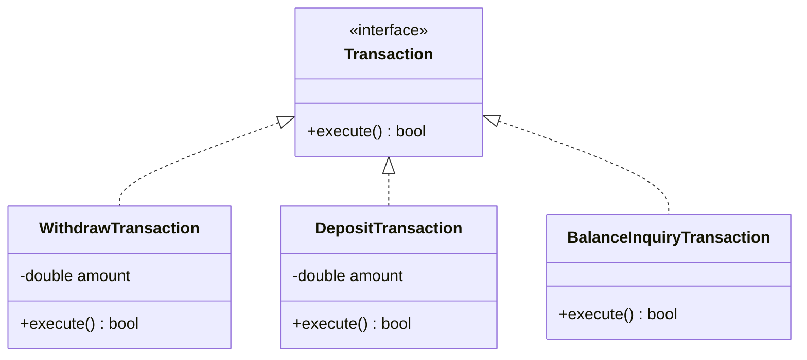
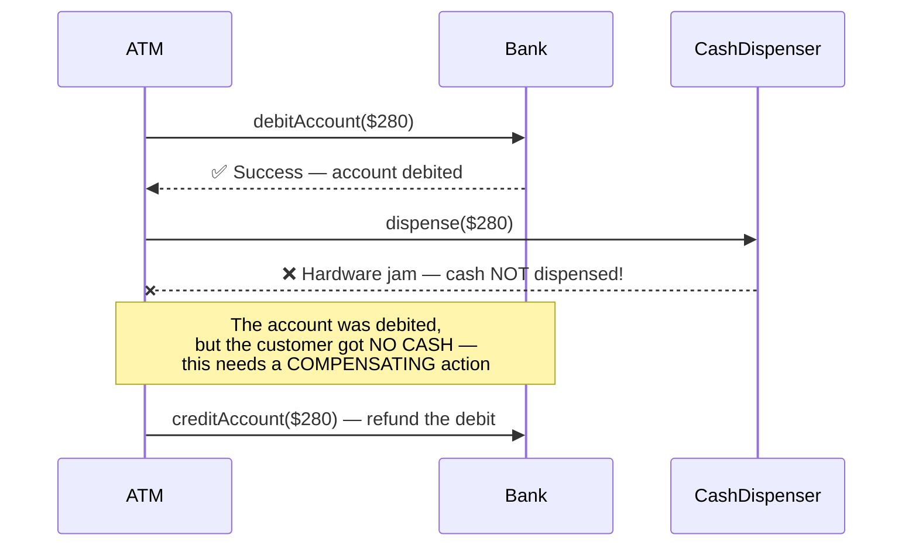
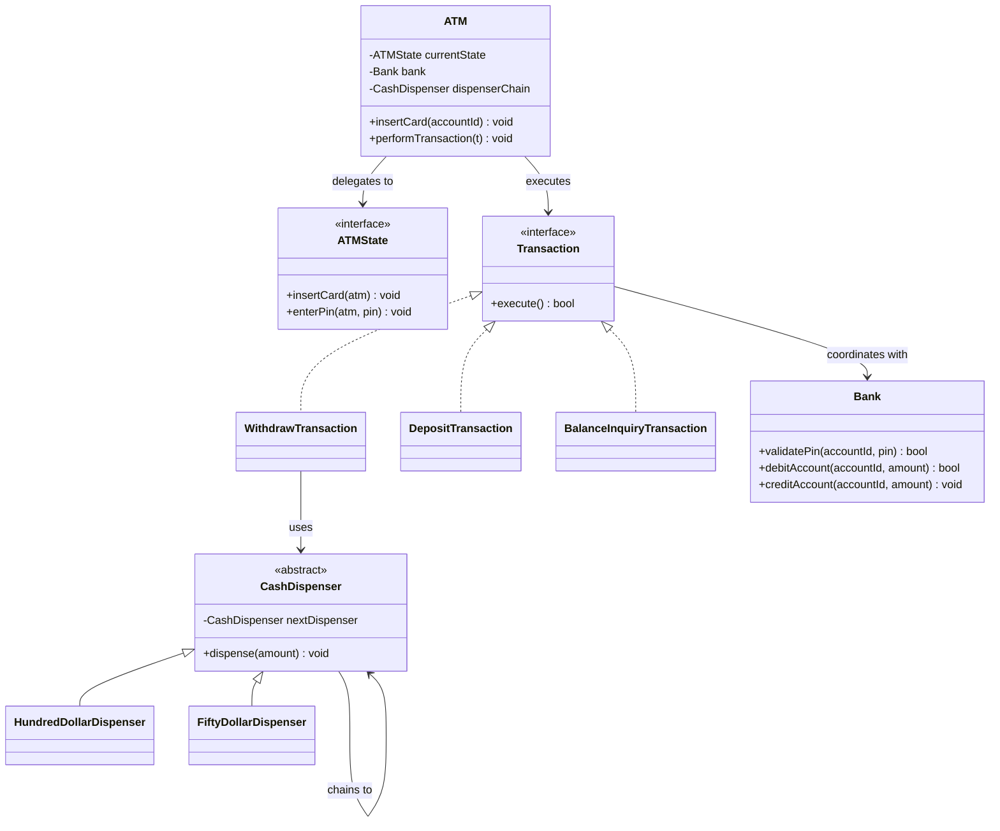
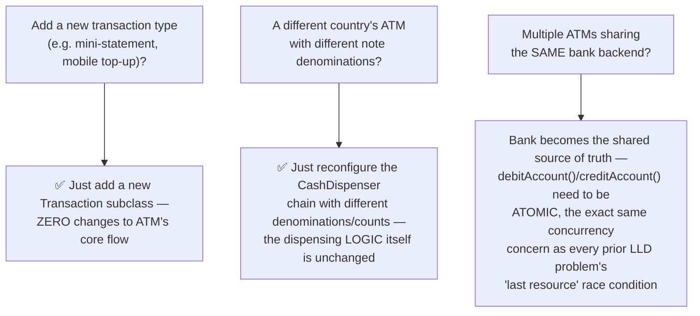

# LLD: Design an ATM System

*Phase 3 — Low-Level Design (LLD) / OOD. A zero-to-mastery, interview-style walkthrough, with C++ code.*

---

## Table of Contents
1. [What Are We Actually Building?](#1-what-are-we-actually-building)
2. [Step 1: Clarify Requirements](#2-step-1-clarify-requirements)
3. [Step 2: Identify the Core Entities](#3-step-2-identify-the-core-entities)
4. [Step 3: The ATM's State Machine](#4-step-3-the-atms-state-machine)
5. [Step 4: The Core Challenge — Dispensing Cash Correctly](#5-step-4-the-core-challenge--dispensing-cash-correctly)
6. [Step 5: The Chain of Responsibility Pattern](#6-step-5-the-chain-of-responsibility-pattern)
7. [Step 6: Modeling Transactions with the Command Pattern](#7-step-6-modeling-transactions-with-the-command-pattern)
8. [Step 7: The Bank — Keeping the ATM Honest](#8-step-7-the-bank--keeping-the-atm-honest)
9. [Step 8: The ATM Class — Tying It Together](#9-step-8-the-atm-class--tying-it-together)
10. [Step 9: The Full Class Diagram](#10-step-9-the-full-class-diagram)
11. [Step 10: Putting It All Together — a Working Example](#11-step-10-putting-it-all-together--a-working-example)
12. [Step 11: Extending the Design](#12-step-11-extending-the-design)
13. [How to Walk Through This in an Interview](#13-how-to-walk-through-this-in-an-interview)
14. [Quick Recall Cheat Sheet](#14-quick-recall-cheat-sheet)

---

## 1. What Are We Actually Building?

A system controlling a physical ATM: a customer inserts a card, authenticates with a PIN, chooses a transaction (withdraw, deposit, check balance), and the machine coordinates with the bank to validate and complete it — including physically dispensing the **correct combination of notes** for a cash withdrawal.



This problem shares some DNA with the Vending Machine (both are physical machines with a clear multi-step flow), but it introduces two genuinely new, interesting challenges worth focusing on: **correctly dispensing cash using the fewest/available notes** (a nice fit for the **Chain of Responsibility** pattern), and cleanly modeling **different transaction types** as interchangeable, undoable operations (a nice fit for the **Command** pattern) — two design patterns not yet covered in this series.

---

## 2. Step 1: Clarify Requirements

### Functional Requirements
- Authenticate a customer via **card + PIN**.
- Support three transaction types: **withdraw**, **deposit**, **check balance**.
- **Dispense physical cash** for a withdrawal, using the machine's available note denominations correctly.
- **Reject** a withdrawal if the requested amount exceeds the account balance, or exceeds the cash currently available in the machine.
- The ATM must coordinate with a **bank system** to validate the PIN and actually debit/credit the account (the ATM itself doesn't "own" the account balance).

### Non-Functional / Design Requirements
- The **cash-dispensing logic** should be easy to extend to different denomination sets (different countries, different machines) without rewriting core logic.
- Transaction types should be added **without modifying** the core ATM flow (Open/Closed, as always).
- The machine must correctly **roll back** a transaction if something fails partway (e.g., the bank confirms a debit, but the cash dispenser then jams) — consistency matters a great deal here, since this deals directly with real money.

---

## 3. Step 2: Identify the Core Entities



| Entity | Responsibility |
|---|---|
| `ATM` | The overall machine — holds current state, card session, and coordinates everything |
| `ATMState` | Represents the current step of the interaction (idle, card inserted, PIN entered...) |
| `Bank` | The external system of record — validates PINs, checks/updates balances |
| `CashDispenser` | Figures out exactly which notes to release for a given withdrawal amount |
| `Transaction` | Represents one specific requested operation (withdraw/deposit/balance check) |

---

## 4. Step 3: The ATM's State Machine

Just like the Vending Machine, mapping the state machine out first is the right starting move — and just like that problem, an ATM's behavior genuinely differs at each step, making it another solid candidate for the **State Pattern** (already covered in full detail in the Vending Machine topic, so this section stays brief and focuses on what's specifically different here).



```cpp
// Reusing the exact same State Pattern structure from the Vending Machine topic —
// the interface and per-state classes follow an identical shape, so this design
// won't re-derive it from scratch here.
class ATMState {
public:
    virtual void insertCard(class ATM& atm) { std::cout << "Cannot insert card now.\n"; }
    virtual void enterPin(class ATM& atm, int pin) { std::cout << "Cannot enter PIN now.\n"; }
    virtual void selectTransaction(class ATM& atm, const std::string& type) { std::cout << "Please authenticate first.\n"; }
    virtual void ejectCard(class ATM& atm) { std::cout << "No card to eject.\n"; }
    virtual ~ATMState() {}
};
```

**A key design decision worth stating explicitly:** the *state* (`IDLE`, `CARD_INSERTED`, etc.) controls **what actions are even possible right now**, while the actual money-moving logic for a transaction lives elsewhere (Step 6) — keeping these concerns separate is important, and is exactly why this design also reaches for the Command pattern rather than cramming transaction logic directly into the state classes.

---

## 5. Step 4: The Core Challenge — Dispensing Cash Correctly

This is the first genuinely new problem in this design: given a withdrawal amount (say, $280) and a set of available note denominations ($100, $50, $20, $10), which physical notes should actually be released?



- This is the same **greedy, largest-denomination-first** approach briefly mentioned for the Vending Machine's change-making — and the same caveat applies: greedy works correctly for standard currency denominations, but isn't guaranteed optimal for arbitrary denomination sets in general.
- A real, important constraint this naive greedy approach misses: **what if the machine has run out of $100 notes**, even though $280 total cash is available across other denominations? The algorithm needs to actually check availability at each step, not just divide blindly.

---

## 6. Step 5: The Chain of Responsibility Pattern

### The problem it solves
The cash-dispensing logic above ("try $100s, then $50s, then $20s, then $10s") is naturally a **sequence of handlers**, each responsible for one denomination, each trying to handle as much of the amount as it can before **passing the remainder along** to the next handler in the chain — this is a fresh design pattern, distinct from the four covered earlier, worth learning here specifically because this exact "sequence of check-and-pass-along" shape shows up often in dispensing/routing problems.





### C++ implementation

```cpp
class CashDispenser {
protected:
    CashDispenser* nextDispenser = nullptr;
    int denomination;
    int availableCount;

public:
    CashDispenser(int denom, int count) : denomination(denom), availableCount(count) {}
    virtual ~CashDispenser() {}

    void setNext(CashDispenser* next) {
        nextDispenser = next;
    }

    void dispense(int amount) {
        int notesNeeded = amount / denomination;
        int notesToUse = std::min(notesNeeded, availableCount);  // respect actual availability!
        int remainder = amount - (notesToUse * denomination);

        if (notesToUse > 0) {
            availableCount -= notesToUse;
            std::cout << "Dispensing " << notesToUse << " x $" << denomination << " notes\n";
        }

        if (remainder > 0) {
            if (nextDispenser != nullptr) {
                nextDispenser->dispense(remainder);  // PASS ALONG the remainder
            } else {
                std::cout << "Cannot dispense remaining $" << remainder
                          << " — no smaller denominations available.\n";
            }
        }
    }
};

int main() {
    CashDispenser hundreds(100, 5);
    CashDispenser fifties(50, 10);
    CashDispenser twenties(20, 20);
    CashDispenser tens(10, 50);

    // Build the CHAIN, in order from largest to smallest denomination
    hundreds.setNext(&fifties);
    fifties.setNext(&twenties);
    twenties.setNext(&tens);

    hundreds.dispense(280);
    // Output:
    // Dispensing 2 x $100 notes
    // Dispensing 1 x $50 notes
    // Dispensing 1 x $20 notes
    // Dispensing 1 x $10 notes
}
```

### Why Chain of Responsibility fits perfectly here
- **Each handler only knows about ONE denomination** — `HundredDollarDispenser` doesn't need to know anything about $50s or $20s exist; it just handles its own piece and passes the rest along. This is a clean application of **Single Responsibility** from SOLID.
- **Extending the chain is trivial:** adding a $5 note handler is just one more link in the chain, with **zero changes** to any existing handler — again, the Open/Closed Principle in action, this time expressed through a brand-new pattern shape.
- This same "pass it along until someone handles it, or it reaches the end unhandled" shape appears in many other real systems too — e.g., middleware pipelines in web frameworks, or approval workflows (a purchase request escalating up a management hierarchy until someone with sufficient authority approves it) — recognizing this shape is broadly useful beyond just ATMs.

---

## 7. Step 6: Modeling Transactions with the Command Pattern

### The problem it solves
The ATM supports several distinct transaction types (withdraw, deposit, check balance), each with its own logic, but the ATM's core flow (authenticate → select transaction → **execute** → eject card) shouldn't need to know the specific details of *how* each transaction type actually works.

### The idea
Wrap each transaction as its own **command object**, with a common `execute()` method — the ATM just calls `execute()` on whatever command the user selected, without needing type-specific conditional logic.



```cpp
class Bank;  // forward declaration, defined fully in Step 7

class Transaction {
public:
    virtual bool execute() = 0;
    virtual ~Transaction() {}
};

class WithdrawTransaction : public Transaction {
private:
    Bank* bank;
    std::string accountId;
    double amount;
    CashDispenser* dispenser;

public:
    WithdrawTransaction(Bank* b, std::string acc, double amt, CashDispenser* d)
        : bank(b), accountId(acc), amount(amt), dispenser(d) {}

    bool execute() override {
        if (!bank->debitAccount(accountId, amount)) {
            std::cout << "Insufficient funds.\n";
            return false;
        }
        dispenser->dispense(static_cast<int>(amount));
        return true;
    }
};

class DepositTransaction : public Transaction {
private:
    Bank* bank;
    std::string accountId;
    double amount;

public:
    DepositTransaction(Bank* b, std::string acc, double amt) : bank(b), accountId(acc), amount(amt) {}

    bool execute() override {
        bank->creditAccount(accountId, amount);
        std::cout << "Deposited $" << amount << "\n";
        return true;
    }
};

class BalanceInquiryTransaction : public Transaction {
private:
    Bank* bank;
    std::string accountId;

public:
    BalanceInquiryTransaction(Bank* b, std::string acc) : bank(b), accountId(acc) {}

    bool execute() override {
        std::cout << "Current balance: $" << bank->getBalance(accountId) << "\n";
        return true;
    }
};
```

### Why Command fits perfectly here
- The ATM's core loop calls `transaction->execute()` **without any `if (type == "withdraw") ... else if ...`** — directly the same Open/Closed benefit seen in the Strategy Pattern (Design Patterns topic), just applied to a *requested action* rather than a *swappable algorithm*.
- **Commands can be logged/queued naturally** — since each transaction is a self-contained object (not just a function call that happens and disappears), it's straightforward to record every executed command for an audit trail — a genuinely important real-world requirement for anything handling money.

---

## 8. Step 7: The Bank — Keeping the ATM Honest

A critical design point: the **ATM does not own the account balance** — it's a client of an external `Bank` system, which is the actual source of truth (directly echoing the HLD principle from the E-commerce Order Flow topic, where the Order Service didn't own inventory or payment state either — it coordinated with separate services that did).

```cpp
class Bank {
private:
    std::unordered_map<std::string, double> balances;   // accountId -> balance
    std::unordered_map<std::string, int> pins;           // accountId -> PIN

public:
    bool validatePin(const std::string& accountId, int pin) {
        return pins.count(accountId) && pins[accountId] == pin;
    }

    bool debitAccount(const std::string& accountId, double amount) {
        if (balances[accountId] < amount) return false;
        balances[accountId] -= amount;
        return true;
    }

    void creditAccount(const std::string& accountId, double amount) {
        balances[accountId] += amount;
    }

    double getBalance(const std::string& accountId) {
        return balances[accountId];
    }
};
```

### The rollback problem: what if the debit succeeds, but dispensing fails?
This is exactly the **distributed transaction problem** first introduced in the E-commerce Order Flow's HLD topic, showing up again here in a completely different-looking system — the same underlying principle applies directly.



```cpp
bool WithdrawTransaction::execute() {
    if (!bank->debitAccount(accountId, amount)) {
        std::cout << "Insufficient funds.\n";
        return false;
    }

    bool dispensedSuccessfully = dispenser->tryDispense(static_cast<int>(amount));  // assume this returns success/failure
    if (!dispensedSuccessfully) {
        bank->creditAccount(accountId, amount);  // COMPENSATING action — same Saga pattern idea from HLD
        std::cout << "Dispensing failed — transaction rolled back, funds returned.\n";
        return false;
    }
    return true;
}
```

This is a direct, practical reuse of the **Saga pattern's compensating-action idea** from the E-commerce Order Flow HLD topic — even in a single-machine LLD context (not a distributed microservices system), the same underlying lesson applies: whenever a multi-step process can partially fail, each step that changes state needs a way to be undone.

---

## 9. Step 8: The ATM Class — Tying It Together

```cpp
class ATM {
private:
    ATMState* currentState;
    Bank* bank;
    CashDispenser* dispenserChain;
    std::string currentAccountId;

public:
    ATM(Bank* b, CashDispenser* dispenser) : bank(b), dispenserChain(dispenser) {
        // currentState initialized to an IdleState, following the same
        // structure fully shown in the Vending Machine topic
    }

    void insertCard(const std::string& accountId) {
        currentAccountId = accountId;
        currentState->insertCard(*this);
    }

    void enterPin(int pin) {
        currentState->enterPin(*this, pin);
    }

    void performTransaction(Transaction* transaction) {
        bool success = transaction->execute();
        if (success) {
            std::cout << "Transaction complete.\n";
        }
        // ejectCard(), reset state to IDLE, etc.
    }
};
```

---

## 10. Step 9: The Full Class Diagram



This diagram shows **three separate patterns cooperating** in one design: State (how the ATM's overall flow progresses), Command (what specific action gets executed), and Chain of Responsibility (how a withdrawal's cash actually gets counted out) — a good demonstration that real designs often combine multiple patterns, each solving a distinct sub-problem, rather than relying on just one.

---

## 11. Step 10: Putting It All Together — a Working Example

```cpp
int main() {
    Bank bank;
    // (assume account "ACC123" is set up with a balance and PIN)

    CashDispenser hundreds(100, 5), fifties(50, 10), twenties(20, 20), tens(10, 50);
    hundreds.setNext(&fifties);
    fifties.setNext(&twenties);
    twenties.setNext(&tens);

    ATM atm(&bank, &hundreds);
    atm.insertCard("ACC123");
    atm.enterPin(1234);

    WithdrawTransaction withdraw(&bank, "ACC123", 280, &hundreds);
    atm.performTransaction(&withdraw);
}
```

---

## 12. Step 11: Extending the Design



---

## 13. How to Walk Through This in an Interview

A strong end-to-end summary sounds like this:

> "I'd model the overall interaction flow — insert card, enter PIN, select transaction — as a State machine, the same structure I'd use for a Vending Machine, since the set of valid actions genuinely changes at each step. For the transactions themselves, I'd use the Command pattern: withdraw, deposit, and balance inquiry each become their own class implementing a shared `execute()` method, so the ATM's core flow never needs type-specific conditional logic, and new transaction types can be added without touching existing code. The most interesting sub-problem is dispensing the correct physical notes for a withdrawal — I'd use Chain of Responsibility, with one handler per denomination, each dispensing as much as it can and passing the remainder to the next smaller denomination, which also cleanly supports different denomination sets for different countries. Critically, the ATM itself doesn't own the account balance — it's a client of an external Bank system, and I'd handle the case where a debit succeeds but the physical cash dispenser then fails by issuing a compensating credit, the same rollback principle as the Saga pattern from the e-commerce order flow design, just applied here within a single machine instead of across microservices."

That answer shows: you correctly reused the State pattern where it fit without redundantly re-deriving it, introduced **two new, well-justified patterns** (Command and Chain of Responsibility) for the genuinely new sub-problems this design presents, and connected the failure-handling logic back to the Saga pattern concept from Phase 2 — showing the same underlying idea recurring across completely different systems.

---

## 14. Quick Recall Cheat Sheet

```mermaid
mindmap
  root((ATM System LLD))
    State Pattern
      Idle, Card Inserted, Authenticated, Transaction In Progress
      Same structure as Vending Machine
    Chain of Responsibility
      One handler per note denomination
      Each dispenses what it can, passes remainder along
      Adding a new denomination = one new link, zero other changes
    Command Pattern
      Withdraw, Deposit, BalanceInquiry each implement execute()
      ATM core flow has NO type-specific conditionals
      Commands are naturally loggable for audit trails
    Bank as source of truth
      ATM does NOT own the balance
      Debit succeeds but dispense fails - COMPENSATING credit
      Same rollback idea as the Saga pattern
    Concurrency
      Multiple ATMs, same account - atomic debit/credit needed
```

| If you remember only 5 things |
|---|
| 1. Model the overall card/PIN/transaction flow as a State machine, the same structure as the Vending Machine — the set of valid actions genuinely differs at each step. |
| 2. Use Chain of Responsibility for cash dispensing — one handler per denomination, each dispensing what it can and passing the remainder along; adding a new denomination is one new link with zero other changes. |
| 3. Use the Command pattern for transaction types (withdraw/deposit/balance inquiry) — the ATM's core flow calls `execute()` with no type-specific conditionals, and commands are naturally loggable for audit trails. |
| 4. The ATM never owns the account balance — it's a client of an external Bank, the actual source of truth, coordinating with it rather than managing money state itself. |
| 5. If a debit succeeds but cash dispensing fails, issue a compensating credit to roll back — the exact same principle as the Saga pattern from the e-commerce order flow HLD, applied within a single machine. |

---

*This file is written in GitHub-flavored Markdown with Mermaid diagrams and C++ code — it will render natively on GitHub, GitLab, and most modern Markdown viewers.*
