# LLD: Design Tic-Tac-Toe / Snake & Ladder / Chess

*Phase 3 — Low-Level Design (LLD) / OOD. A zero-to-mastery, interview-style walkthrough, with C++ code.*

---

## Table of Contents
**Part 1: Tic-Tac-Toe**
1. [What Are We Actually Building?](#1-what-are-we-actually-building)
2. [Core Entities & the Board](#2-core-entities--the-board)
3. [The Core Challenge — Checking for a Winner Efficiently](#3-the-core-challenge--checking-for-a-winner-efficiently)
4. [Supporting an N×N Board Generically](#4-supporting-an-nn-board-generically)
5. [Full Class Diagram & Working Example](#5-full-class-diagram--working-example)

**Part 2: Snake & Ladder**
6. [What Are We Actually Building?](#6-what-are-we-actually-building)
7. [Core Entities](#7-core-entities)
8. [The Core Challenge — Modeling Snakes and Ladders Uniformly](#8-the-core-challenge--modeling-snakes-and-ladders-uniformly)
9. [The Game Loop & Multiple Players](#9-the-game-loop--multiple-players)
10. [Full Class Diagram & Working Example](#10-full-class-diagram--working-example)

**Part 3: Chess**
11. [What Are We Actually Building?](#11-what-are-we-actually-building)
12. [Core Entities](#12-core-entities)
13. [The Core Challenge — Modeling Piece Movement Polymorphically](#13-the-core-challenge--modeling-piece-movement-polymorphically)
14. [Move Validation — Beyond "Can This Piece Reach There?"](#14-move-validation--beyond-can-this-piece-reach-there)
15. [Detecting Check & Checkmate](#15-detecting-check--checkmate)
16. [Full Class Diagram & Working Example](#16-full-class-diagram--working-example)

**Wrap-up**
17. [How These Three Problems Compare](#17-how-these-three-problems-compare)
18. [How to Walk Through These in an Interview](#18-how-to-walk-through-these-in-an-interview)
19. [Quick Recall Cheat Sheet](#19-quick-recall-cheat-sheet)

---

# Part 1: Tic-Tac-Toe

## 1. What Are We Actually Building?

The simplest of the three: two players take turns marking a 3×3 grid with X or O; the first to get three in a row (horizontally, vertically, or diagonally) wins.

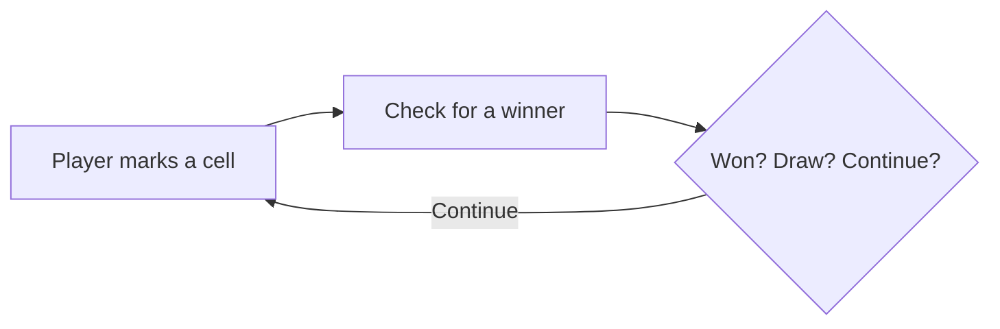

This is deliberately the **simplest** of the three problems — its value in an interview is showing you can move fast through the basics (board, players, turns, win-check) while still making one or two genuinely good design decisions, rather than over-engineering a small problem.

---

## 2. Core Entities & the Board

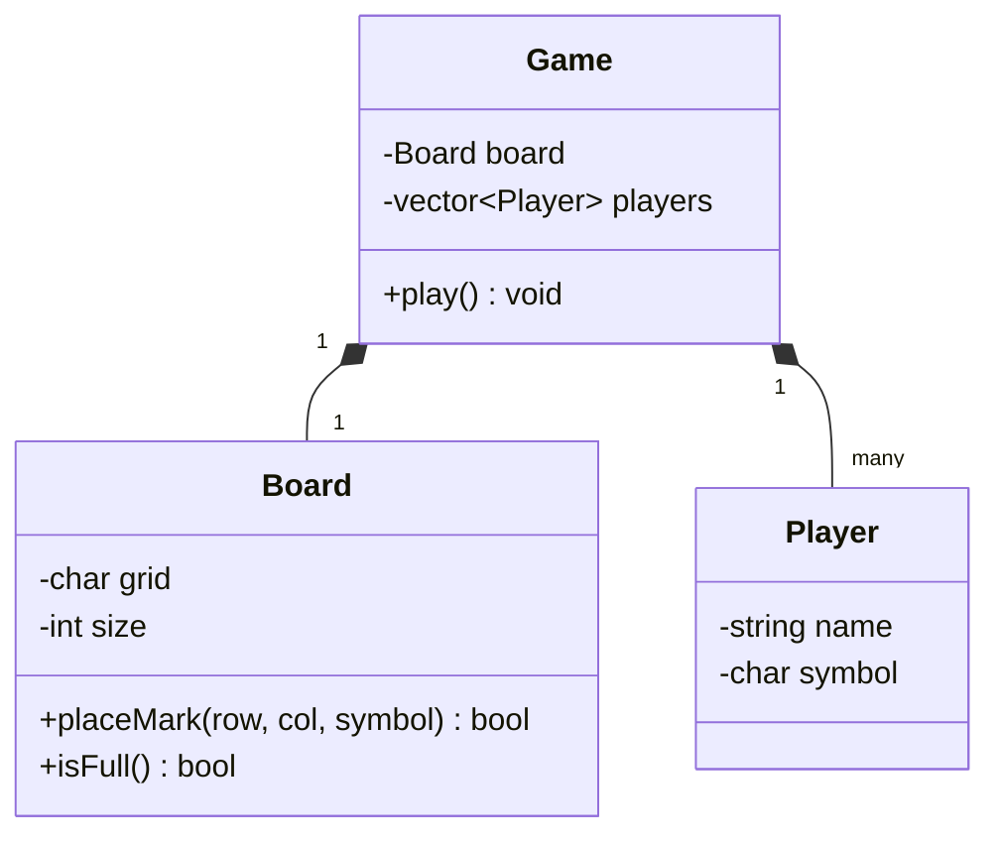

```cpp
class Board {
private:
    std::vector<std::vector<char>> grid;
    int size;

public:
    Board(int n) : size(n), grid(n, std::vector<char>(n, ' ')) {}

    bool placeMark(int row, int col, char symbol) {
        if (row < 0 || row >= size || col < 0 || col >= size || grid[row][col] != ' ') {
            return false;  // invalid or already-occupied cell
        }
        grid[row][col] = symbol;
        return true;
    }

    bool isFull() const {
        for (auto& row : grid)
            for (char c : row)
                if (c == ' ') return false;
        return true;
    }

    char get(int row, int col) const { return grid[row][col]; }
    int getSize() const { return size; }
};

class Player {
public:
    std::string name;
    char symbol;
    Player(std::string n, char s) : name(n), symbol(s) {}
};
```

- **Encapsulation in action, again:** `placeMark()` is the *only* way to modify the grid, and it enforces both bounds-checking and "cell must be empty" — the same pattern seen in every prior LLD problem's core resource class (`ParkingSpot`, `BookCopy`).

---

## 3. The Core Challenge — Checking for a Winner Efficiently

### The naive approach: check every row, column, and both diagonals after every move
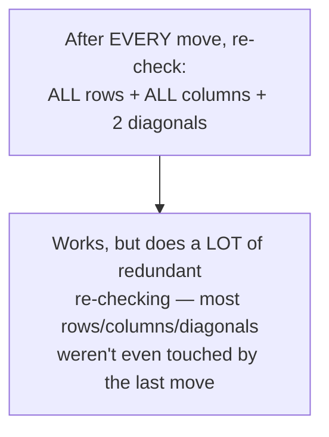

### A better approach: only check the row, column, and diagonal(s) affected by the move just made
Since a single move can only possibly complete a win along the **specific row, column, and (if applicable) diagonal it was placed on**, there's no need to re-check anything else.

```cpp
bool checkWinner(const Board& board, int row, int col, char symbol) {
    int n = board.getSize();

    // Check the ROW the move was placed in
    bool rowWin = true;
    for (int c = 0; c < n; c++) if (board.get(row, c) != symbol) rowWin = false;
    if (rowWin) return true;

    // Check the COLUMN
    bool colWin = true;
    for (int r = 0; r < n; r++) if (board.get(r, col) != symbol) colWin = false;
    if (colWin) return true;

    // Check the main diagonal, ONLY if the move is actually ON it
    if (row == col) {
        bool diagWin = true;
        for (int i = 0; i < n; i++) if (board.get(i, i) != symbol) diagWin = false;
        if (diagWin) return true;
    }

    // Check the anti-diagonal, ONLY if the move is actually ON it
    if (row + col == n - 1) {
        bool antiDiagWin = true;
        for (int i = 0; i < n; i++) if (board.get(i, n - 1 - i) != symbol) antiDiagWin = false;
        if (antiDiagWin) return true;
    }

    return false;
}
```

**Why this matters, generally:** this is the same recurring lesson as Database Indexing (Phase 1) and the Parking Lot's spot lookup (Phase 3) — **only do the work that's actually relevant to what just changed**, rather than redundantly re-checking everything every single time.

---

## 4. Supporting an N×N Board Generically

A nice, low-cost extensibility win: the `Board` and `checkWinner()` above are already written in terms of a general `size`, not hardcoded to 3 — meaning this same code already supports a 4×4 or 5×5 board (with an adjustable win-length rule) without any structural changes, only demonstrating good habits (avoiding magic numbers) rather than needing a deliberate extensibility "feature."

---

## 5. Full Class Diagram & Working Example

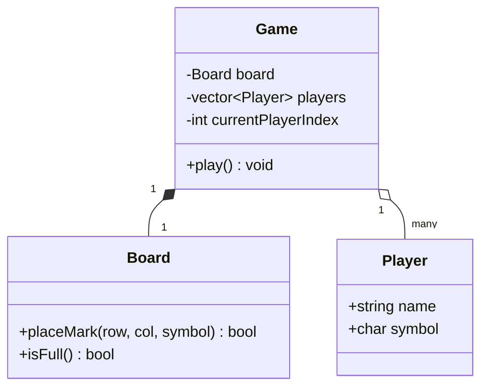

```cpp
class Game {
private:
    Board board;
    std::vector<Player> players;
    int currentPlayerIndex = 0;

public:
    Game(int size) : board(size) {
        players.push_back(Player("Alice", 'X'));
        players.push_back(Player("Bob", 'O'));
    }

    void makeMove(int row, int col) {
        Player& current = players[currentPlayerIndex];
        if (!board.placeMark(row, col, current.symbol)) {
            std::cout << "Invalid move.\n";
            return;
        }
        if (checkWinner(board, row, col, current.symbol)) {
            std::cout << current.name << " wins!\n";
            return;
        }
        if (board.isFull()) {
            std::cout << "It's a draw!\n";
            return;
        }
        currentPlayerIndex = (currentPlayerIndex + 1) % players.size();  // next player's turn
    }
};
```

---

# Part 2: Snake & Ladder

## 6. What Are We Actually Building?

Players take turns rolling a die and moving along a numbered board; landing on a snake's head sends you down to its tail, landing on a ladder's bottom sends you up to its top; first to reach the final square wins.

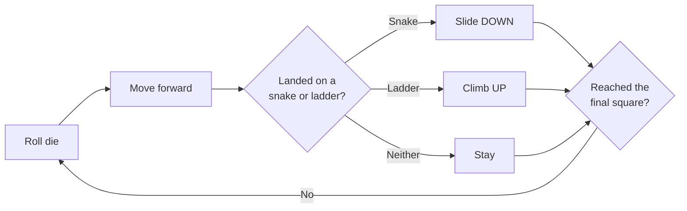

---

## 7. Core Entities

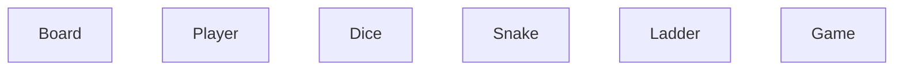

| Entity | Responsibility |
|---|---|
| `Board` | The numbered squares, and where every snake/ladder is located |
| `Player` | Tracks a player's current position |
| `Dice` | Produces a random roll |
| `Snake` / `Ladder` | Represent a "jump" from one square to another |
| `Game` | Runs the turn loop until someone wins |

---

## 8. The Core Challenge — Modeling Snakes and Ladders Uniformly

### The insight worth spotting
A **snake** (jump from a higher square to a lower one) and a **ladder** (jump from a lower square to a higher one) are, structurally, **the exact same concept**: "if you land on square A, you're immediately moved to square B instead." The only difference is the *direction* of the jump — which doesn't actually need to be modeled as a special case at all.

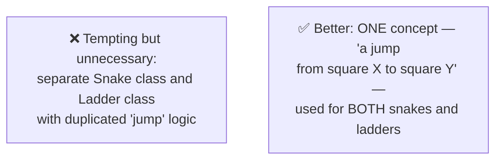

```cpp
#include <unordered_map>

class Board {
private:
    int size;
    std::unordered_map<int, int> jumps;  // square -> destination square
                                           // (used for BOTH snakes and ladders — same structure!)

public:
    Board(int boardSize) : size(boardSize) {}

    void addJump(int from, int to) {
        // If 'to' < 'from', it's conceptually a snake.
        // If 'to' > 'from', it's conceptually a ladder.
        // The BOARD doesn't need to know or care which — it's the same operation either way.
        jumps[from] = to;
    }

    int getFinalPosition(int square) const {
        if (jumps.count(square)) {
            return jumps.at(square);  // landed on a snake head or ladder bottom — jump immediately
        }
        return square;
    }

    int getSize() const { return size; }
};
```

**Why this matters:** recognizing that two seemingly-different game elements are structurally identical, and unifying them into one simple concept, is a genuinely valuable LLD instinct — it avoids duplicated logic (a snake's landing-and-jumping code would otherwise be a near-exact copy of a ladder's) and makes the design simpler to extend (e.g., adding a "teleporter" special square later is just... another entry in the same `jumps` map).

---

## 9. The Game Loop & Multiple Players

```cpp
class Player {
public:
    std::string name;
    int position = 0;
    Player(std::string n) : name(n) {}
};

class Dice {
public:
    int roll() {
        return (rand() % 6) + 1;  // 1 to 6
    }
};

class Game {
private:
    Board board;
    std::vector<Player> players;
    Dice dice;
    int currentPlayerIndex = 0;

public:
    Game(int boardSize) : board(boardSize) {}

    void addPlayer(const std::string& name) {
        players.push_back(Player(name));
    }

    void addSnakeOrLadder(int from, int to) {
        board.addJump(from, to);
    }

    void playTurn() {
        Player& current = players[currentPlayerIndex];
        int roll = dice.roll();
        int newPosition = current.position + roll;

        if (newPosition > board.getSize()) {
            std::cout << current.name << " rolled too high, stays at " << current.position << "\n";
        } else {
            newPosition = board.getFinalPosition(newPosition);  // applies snake/ladder if applicable
            current.position = newPosition;
            std::cout << current.name << " rolled a " << roll << ", now at " << current.position << "\n";
        }

        if (current.position == board.getSize()) {
            std::cout << current.name << " wins!\n";
            return;
        }

        currentPlayerIndex = (currentPlayerIndex + 1) % players.size();
    }
};
```

- **A small but real rule worth calling out:** what happens if a roll would take a player *past* the final square? The implementation above chooses "stay in place, forfeit the move" — a common house rule, but worth explicitly clarifying with an interviewer, since "bounce back" (overshoot and reflect backward) is an equally valid alternative rule some versions use — exactly the kind of ambiguous requirement worth surfacing in Step 1 of a real interview, rather than silently picking one.

---

## 10. Full Class Diagram & Working Example

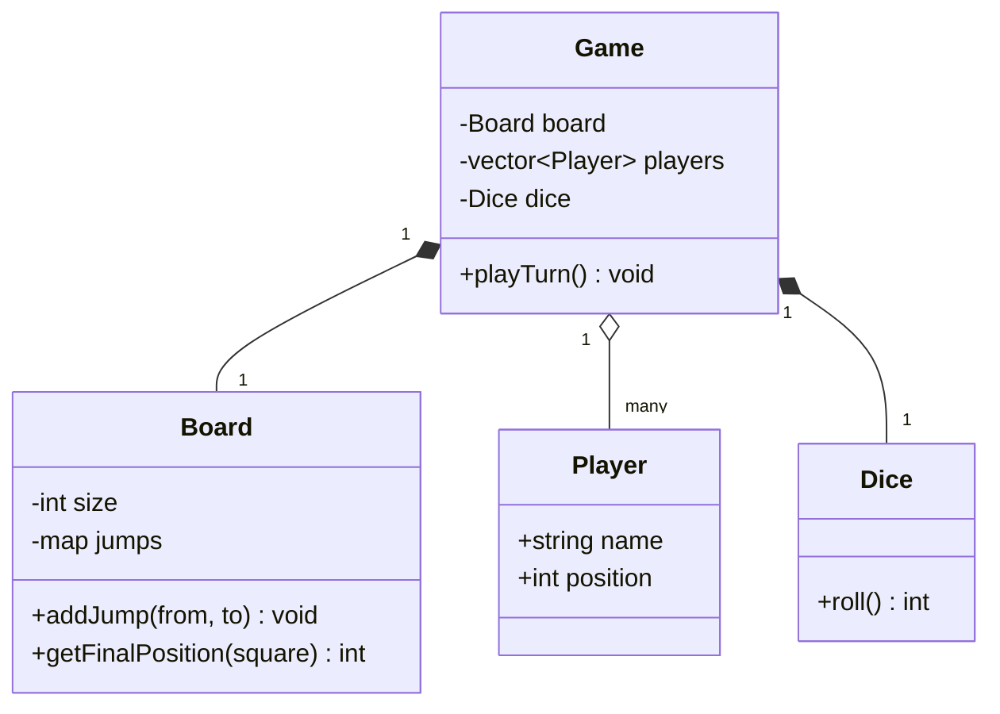

```cpp
int main() {
    Game game(100);
    game.addPlayer("Alice");
    game.addPlayer("Bob");
    game.addSnakeOrLadder(17, 4);   // a snake: 17 -> 4
    game.addSnakeOrLadder(3, 22);   // a ladder: 3 -> 22

    for (int i = 0; i < 20; i++) {
        game.playTurn();
    }
}
```

---

# Part 3: Chess

## 11. What Are We Actually Building?

A full chess game: an 8×8 board, six distinct piece types each with their own movement rules, turn-based play, and detecting check/checkmate.

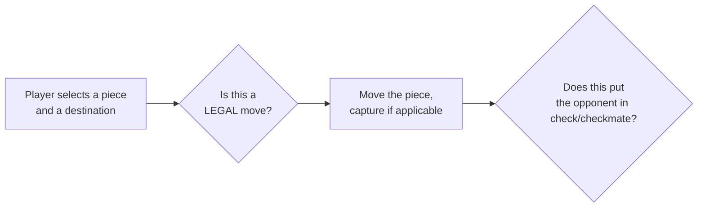

Chess is, by a wide margin, the most complex of these three — the entire point of covering it here isn't to fully solve every chess rule (castling, en passant, and pawn promotion are real but secondary details), but to demonstrate the **one central design decision** that makes or breaks a chess LLD: **modeling six different piece types with a single, clean polymorphic interface.**

---

## 12. Core Entities

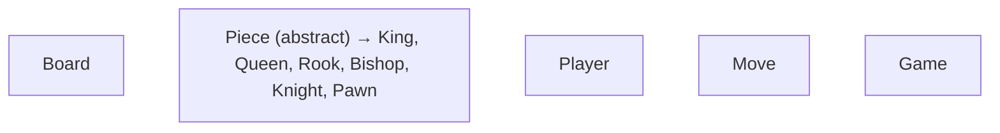

| Entity | Responsibility |
|---|---|
| `Board` | An 8×8 grid, tracking which piece (if any) occupies each square |
| `Piece` | Abstract base — each concrete piece type knows its **own** movement rules |
| `Player` | One of the two players (white/black) |
| `Move` | Represents one requested move: from-square, to-square |
| `Game` | Coordinates turns, validates moves, detects check/checkmate |

---

## 13. The Core Challenge — Modeling Piece Movement Polymorphically

This is a direct, large-scale application of the **exact same idea** as the `Shape`/`calculateArea()` example from OOP Fundamentals and SOLID — a shared interface, with each concrete type providing its own implementation, so calling code never needs to know or care which specific piece it's dealing with.

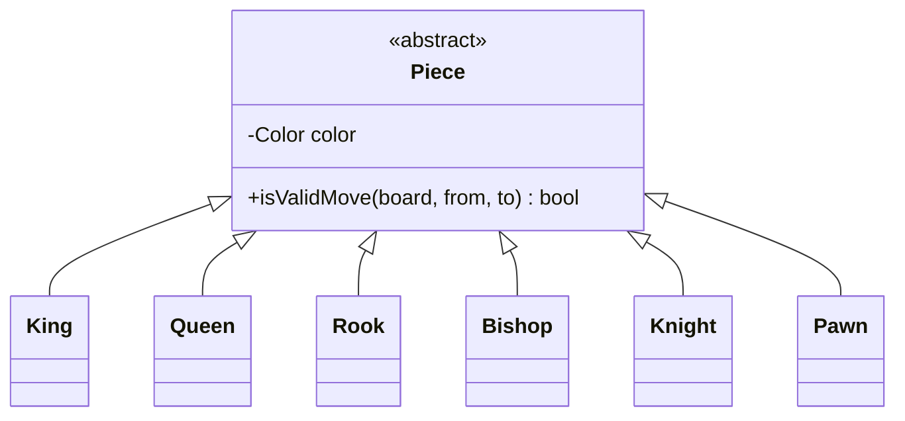

```cpp
enum class Color { WHITE, BLACK };

struct Position {
    int row, col;
};

class Board;  // forward declaration

class Piece {
protected:
    Color color;
public:
    Piece(Color c) : color(c) {}
    virtual bool isValidMove(const Board& board, Position from, Position to) const = 0;
    virtual ~Piece() {}
    Color getColor() const { return color; }
};

class Rook : public Piece {
public:
    Rook(Color c) : Piece(c) {}
    bool isValidMove(const Board& board, Position from, Position to) const override {
        // A Rook moves any number of squares, purely horizontally OR purely vertically
        return (from.row == to.row) || (from.col == to.col);
        // (a full implementation would ALSO check the path is unobstructed — see Step 14)
    }
};

class Bishop : public Piece {
public:
    Bishop(Color c) : Piece(c) {}
    bool isValidMove(const Board& board, Position from, Position to) const override {
        // A Bishop moves any number of squares, purely diagonally
        return std::abs(from.row - to.row) == std::abs(from.col - to.col);
    }
};

class Knight : public Piece {
public:
    Knight(Color c) : Piece(c) {}
    bool isValidMove(const Board& board, Position from, Position to) const override {
        // A Knight moves in an "L" shape: 2+1 in perpendicular directions
        int rowDiff = std::abs(from.row - to.row);
        int colDiff = std::abs(from.col - to.col);
        return (rowDiff == 2 && colDiff == 1) || (rowDiff == 1 && colDiff == 2);
    }
};

// Queen, King, Pawn follow the exact same pattern — each ONLY defines
// the movement rule specific to itself, nothing more
```

### Why this is the right shape for the problem
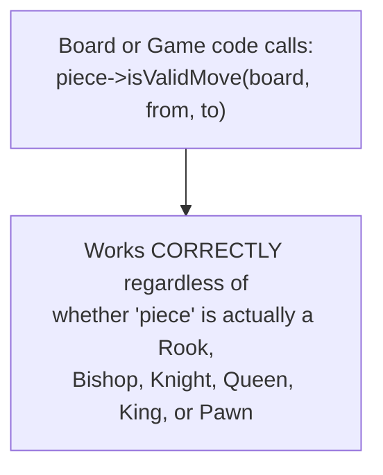

- This is **runtime polymorphism** (OOP Fundamentals) doing exactly the job it's meant for: the calling code (`Game`, `Board`) is written **once**, against the abstract `Piece` interface, and correctly handles all six piece types without a single `if (type == "rook") ... else if ...` anywhere.
- It's also a direct, textbook demonstration of the **Open/Closed Principle**: a genuinely unusual chess variant piece could be added as one new `Piece` subclass, with zero changes to `Board` or `Game`.

---

## 14. Move Validation — Beyond "Can This Piece Reach There?"

A subtlety worth flagging explicitly: `isValidMove()` as shown only checks the piece's **own movement pattern** — real chess move validation needs several additional layers, each best kept as a **separate, composable check** rather than crammed into one giant method (recall Single Responsibility from SOLID).

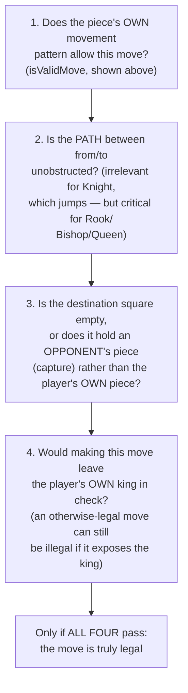

```cpp
class Board {
private:
    std::vector<std::vector<Piece*>> grid;  // 8x8, nullptr = empty square

public:
    Board() : grid(8, std::vector<Piece*>(8, nullptr)) {}

    bool isPathClear(Position from, Position to) const {
        int rowStep = sign(to.row - from.row);
        int colStep = sign(to.col - from.col);
        Position current = {from.row + rowStep, from.col + colStep};

        while (current.row != to.row || current.col != to.col) {
            if (grid[current.row][current.col] != nullptr) return false;  // blocked
            current.row += rowStep;
            current.col += colStep;
        }
        return true;
    }

    bool isLegalMove(Position from, Position to, Color playerColor) const {
        Piece* piece = grid[from.row][from.col];
        if (piece == nullptr || piece->getColor() != playerColor) return false;

        if (!piece->isValidMove(*this, from, to)) return false;

        // Knights jump over pieces, so path-checking doesn't apply to them —
        // every other piece needs a clear path
        // (a real implementation would check the piece's actual type here)
        if (!isPathClear(from, to)) return false;

        Piece* destPiece = grid[to.row][to.col];
        if (destPiece != nullptr && destPiece->getColor() == playerColor) {
            return false;  // can't capture your own piece
        }

        // Check #4 (leaving own king in check) requires SIMULATING the move
        // and checking the resulting board state — covered conceptually in Step 15

        return true;
    }

private:
    int sign(int x) const { return (x > 0) - (x < 0); }
};
```

---

## 15. Detecting Check & Checkmate

- **Check:** the king is currently under attack — determined by checking whether **any** opposing piece has a currently-valid move that lands on the king's square (reusing `isValidMove()` from every piece, exactly the same polymorphic call used for normal moves).
- **Checkmate:** the king is in check, **and** there is no legal move available (for any of the player's pieces) that would get the king out of check — this requires, for every one of the player's pieces, trying every possible destination, tentatively applying it, and checking whether the king would still be in check afterward.

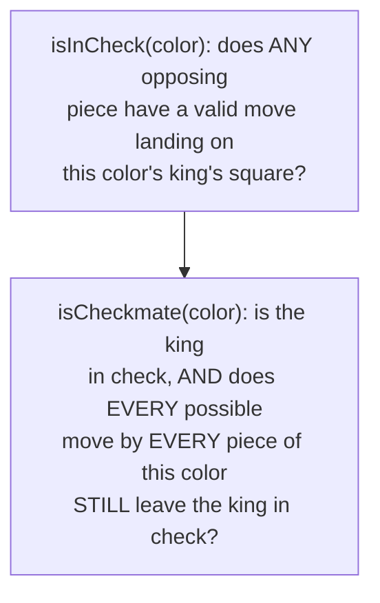

```cpp
bool Game::isInCheck(Color kingColor) {
    Position kingPos = findKingPosition(kingColor);
    Color opponentColor = (kingColor == Color::WHITE) ? Color::BLACK : Color::WHITE;

    // Check every opposing piece — does ANY of them have a valid move to the king's square?
    for (auto& [pos, piece] : board.getAllPieces()) {
        if (piece->getColor() == opponentColor) {
            if (piece->isValidMove(board, pos, kingPos)) {
                return true;  // the king IS under attack
            }
        }
    }
    return false;
}
```

**Why this is naturally expensive, and worth acknowledging in an interview:** checkmate detection requires trying every legal move for every piece a player has, and for each one, checking whether it resolves the check — an interviewer bringing up performance here is a fair, expected follow-up, and simply acknowledging "this is O(pieces × possible moves per piece), and real chess engines use various pruning/caching techniques to speed this up" shows appropriate awareness without needing to solve that optimization problem live.

---

## 16. Full Class Diagram & Working Example

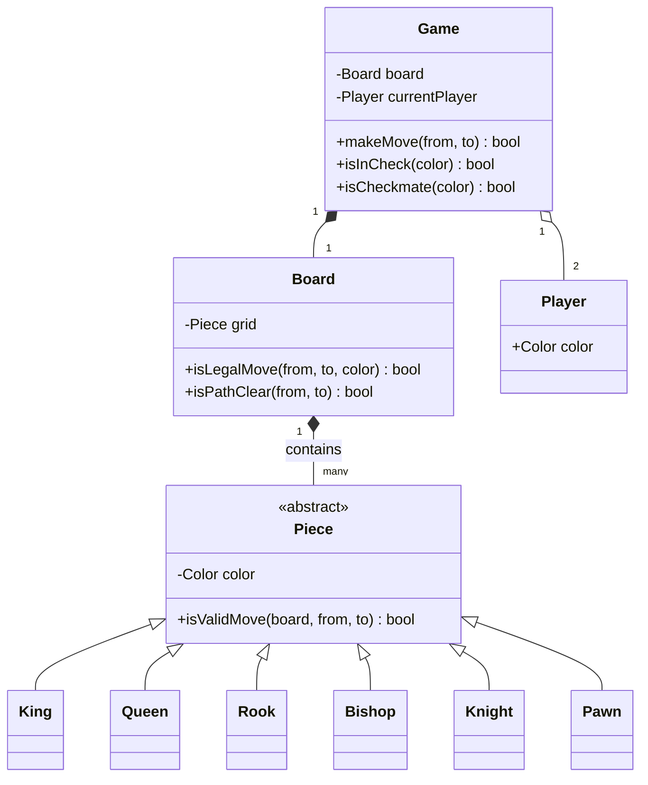

```cpp
int main() {
    Board board;
    // (board setup: placing all 32 pieces in their starting positions omitted for brevity)

    Game game(&board);
    Position from = {6, 4};  // e2
    Position to = {4, 4};    // e4
    game.makeMove(from, to);  // a standard opening pawn move
}
```

---

# Wrap-up

## 17. How These Three Problems Compare

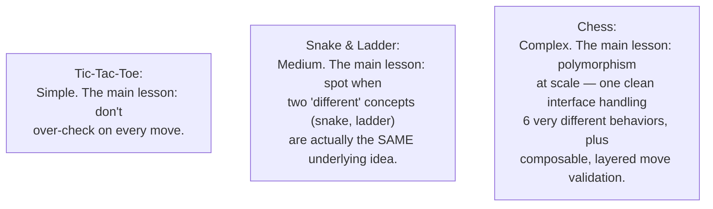

All three share the same underlying LLD skeleton — a `Board`, some notion of `Player`(s), a `Game` loop coordinating turns — which is itself a useful thing to notice: many board/turn-based game LLD questions are fundamentally the **same shape**, just with different rules for "what counts as a valid move" and "what counts as a win," layered on top.

---

## 18. How to Walk Through These in an Interview

### Tic-Tac-Toe
> "I'd keep this deliberately simple — a `Board` that encapsulates placing marks with validation, and a win-check that only examines the specific row, column, and diagonal(s) touched by the move just made, rather than re-scanning the whole board every turn. I'd also avoid hardcoding the size to 3, so the same logic naturally supports larger boards if that's ever needed."

### Snake & Ladder
> "The key insight is that a snake and a ladder are structurally identical — both are just 'land here, get moved there' — so I'd model them with one unified concept rather than two separate classes with duplicated logic. The game loop itself is a straightforward turn-based structure: roll, move, apply any jump, check for a win."

### Chess
> "The whole design hinges on polymorphism: a `Piece` interface with one method, `isValidMove()`, implemented separately by each of the six piece types, so `Board` and `Game` never need type-specific conditionals for movement rules. I'd layer move validation into separate, composable checks — the piece's own movement pattern, path obstruction, capture rules, and finally whether the move would leave the player's own king in check — rather than one large, tangled method. And I'd flag that checkmate detection is inherently expensive, since it requires trying every legal move for every piece, which is a fair thing to acknowledge rather than pretend it's free."

---

## 19. Quick Recall Cheat Sheet

```mermaid
mindmap
  root((3 Board Games LLD))
    Tic-Tac-Toe
      Only check row/col/diagonal touched by the last move
      Avoid hardcoded board size
    Snake and Ladder
      Snakes and Ladders are the SAME concept
      One unified "jump" map, not two classes
      Clarify overshoot rule with interviewer
    Chess
      Piece interface, isValidMove() per subclass
      Runtime polymorphism handles all 6 types
      Layer validation: pattern, path, capture, check
      Checkmate detection is expensive - acknowledge it
    Shared Skeleton
      Board + Player(s) + Game loop
      Same shape across most turn-based games
```

| If you remember only 5 things |
|---|
| 1. Tic-Tac-Toe: only re-check the row/column/diagonal(s) touched by the last move, not the entire board — avoid redundant work. |
| 2. Snake & Ladder: snakes and ladders are the same underlying concept ("land here, jump there") — model them with one unified structure, not two duplicated classes. |
| 3. Chess: use a `Piece` interface with `isValidMove()`, implemented separately by each of the six piece types — this is polymorphism doing exactly the job it's meant for. |
| 4. Chess move validation should be layered into separate checks (movement pattern, path obstruction, capture rules, leaving own king in check) rather than one large tangled method. |
| 5. All three games share the same underlying skeleton: a `Board`, `Player`(s), and a `Game` loop — the differences are entirely in what counts as a valid move and a win condition. |

---

*This file is written in GitHub-flavored Markdown with Mermaid diagrams and C++ code — it will render natively on GitHub, GitLab, and most modern Markdown viewers.*
