# Movie Ticket Booking System + Builder/Command/State Patterns + Thread-Safety Basics + In-Memory File System

*Phase 3 — Low-Level Design (LLD) / OOD. A zero-to-mastery guide, with C++ code.*

---

## Table of Contents
**Part 1: Movie Ticket Booking System**
1. [What Are We Actually Building?](#1-what-are-we-actually-building)
2. [Core Entities](#2-core-entities)
3. [The Core Challenge — Preventing Double-Booking](#3-the-core-challenge--preventing-double-booking)
4. [Seat Locking with a Timeout](#4-seat-locking-with-a-timeout)
5. [Full Class Diagram & Working Example](#5-full-class-diagram--working-example)

**Part 2: Builder, Command & State Patterns**
6. [Builder Pattern](#6-builder-pattern)
7. [Command Pattern — Quick Recap](#7-command-pattern--quick-recap)
8. [State Pattern — Quick Recap](#8-state-pattern--quick-recap)
9. [When to Reach for Which](#9-when-to-reach-for-which)

**Part 3: Thread-Safety Basics**
10. [Why LLD Needs Thread-Safety at All](#10-why-lld-needs-thread-safety-at-all)
11. [Mutex — the Fundamental Tool](#11-mutex--the-fundamental-tool)
12. [RAII Locking — lock_guard and unique_lock](#12-raii-locking--lock_guard-and-unique_lock)
13. [Deadlock — When Locking Goes Wrong](#13-deadlock--when-locking-goes-wrong)
14. [Atomic Variables — a Lighter-Weight Tool](#14-atomic-variables--a-lighter-weight-tool)

**Part 4: In-Memory File System**
15. [What Are We Actually Building?](#15-what-are-we-actually-building)
16. [The Core Challenge — Files and Directories Are Fundamentally Different... or Are They?](#16-the-core-challenge--files-and-directories-are-fundamentally-different-or-are-they)
17. [The Composite Pattern](#17-the-composite-pattern)
18. [Implementing Core Operations](#18-implementing-core-operations)
19. [Full Class Diagram & Working Example](#19-full-class-diagram--working-example)

**Wrap-up**
20. [How to Walk Through These in an Interview](#20-how-to-walk-through-these-in-an-interview)
21. [Quick Recall Cheat Sheet](#21-quick-recall-cheat-sheet)

---

# Part 1: Movie Ticket Booking System

## 1. What Are We Actually Building?

A system where users browse showtimes for a movie, pick seats in a theater, and book them — with the critical guarantee that **two users can never book the same seat**.


This problem's real interest, much like the E-commerce Order Flow from Phase 2, is almost entirely about **correctly handling concurrent access to a shared, limited resource** — here, specific physical seats — rather than any single clever algorithm.

---

## 2. Core Entities

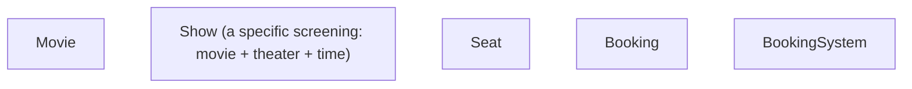

| Entity | Responsibility |
|---|---|
| `Movie` | Title, genre, duration (metadata) |
| `Show` | One specific screening — links a movie to a theater, screen, and time |
| `Seat` | One physical seat within a show, tracking its current status |
| `Booking` | A confirmed reservation of one or more seats for a show |
| `BookingSystem` | Coordinates search, seat locking, and booking confirmation |

```cpp
enum class SeatStatus { AVAILABLE, LOCKED, BOOKED };

class Seat {
private:
    std::string seatId;
    SeatStatus status;
    std::mutex seatMutex;  // protects THIS seat's status specifically

public:
    Seat(std::string id) : seatId(id), status(SeatStatus::AVAILABLE) {}

    bool tryLock() {
        std::lock_guard<std::mutex> lock(seatMutex);  // see Part 3 for full explanation
        if (status != SeatStatus::AVAILABLE) return false;
        status = SeatStatus::LOCKED;
        return true;
    }

    void confirmBooking() {
        std::lock_guard<std::mutex> lock(seatMutex);
        status = SeatStatus::BOOKED;
    }

    void releaseLock() {
        std::lock_guard<std::mutex> lock(seatMutex);
        if (status == SeatStatus::LOCKED) status = SeatStatus::AVAILABLE;
    }

    SeatStatus getStatus() {
        std::lock_guard<std::mutex> lock(seatMutex);
        return status;
    }
};
```

---

## 3. The Core Challenge — Preventing Double-Booking

This is the exact same **lost update** problem seen in the Parking Lot's spot assignment and the E-commerce Order Flow's inventory overselling — showing up here for the third time in this series, in a new costume.

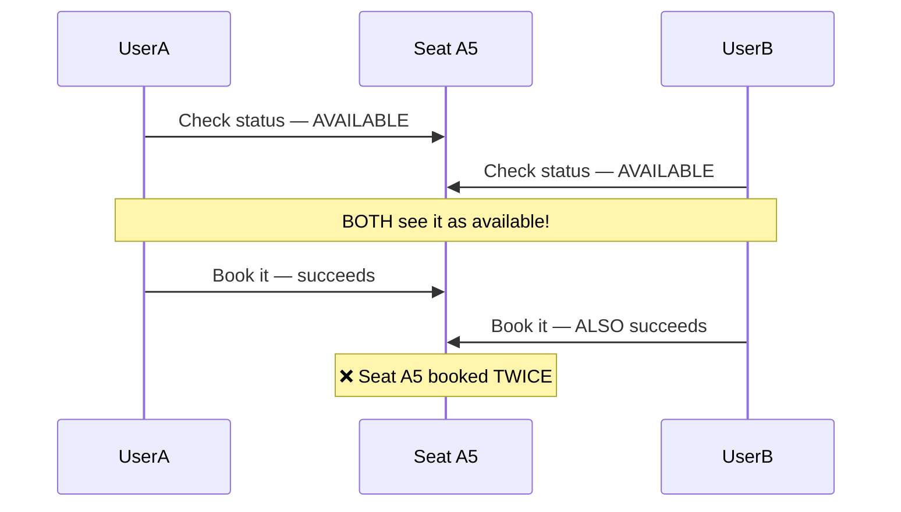

### The fix: the exact same atomic check-and-set pattern, applied here
`tryLock()` (shown above) checks the status **and** changes it, all while holding the seat's own lock — an outside thread can never observe the seat as available and act on that stale information, because the entire check-and-update happens as one indivisible unit, exactly like the Parking Lot's `parkVehicle()` and the ATM's atomic `debitAccount()`.

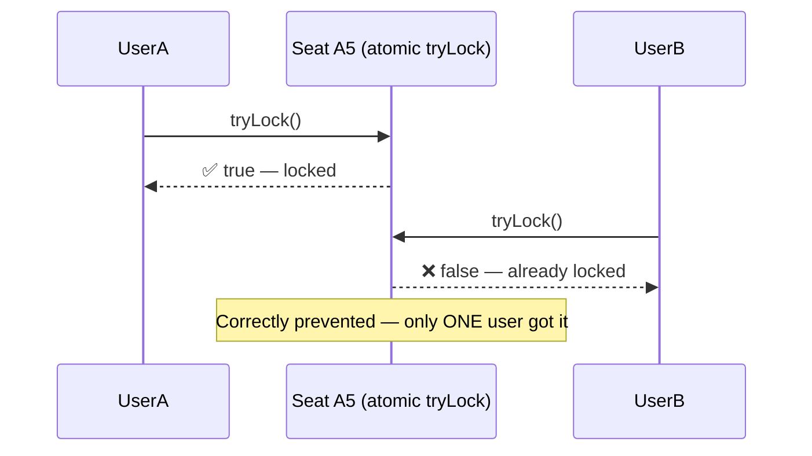

---

## 4. Seat Locking with a Timeout

A crucial real-world detail specific to this problem: a `LOCKED` seat can't stay locked **forever** — if a user selects seats and then abandons the booking (closes the tab), those seats need to become available again after some reasonable time, or the theater's inventory slowly "leaks" into a permanently-unbookable state.

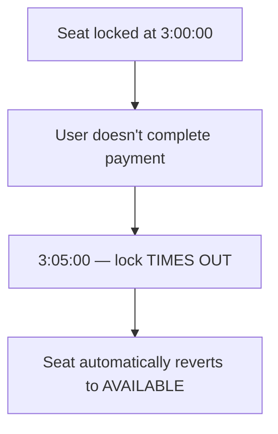

```cpp
#include <chrono>
#include <thread>

class Seat {
    // ... (previous members) ...
private:
    std::chrono::system_clock::time_point lockedAt;
    const int LOCK_TIMEOUT_SECONDS = 300;  // 5 minutes

public:
    bool tryLock() {
        std::lock_guard<std::mutex> lock(seatMutex);

        // If it's LOCKED but the lock has expired, treat it as available again
        if (status == SeatStatus::LOCKED) {
            auto now = std::chrono::system_clock::now();
            auto elapsed = std::chrono::duration_cast<std::chrono::seconds>(now - lockedAt).count();
            if (elapsed > LOCK_TIMEOUT_SECONDS) {
                status = SeatStatus::AVAILABLE;  // expired — release it
            }
        }

        if (status != SeatStatus::AVAILABLE) return false;
        status = SeatStatus::LOCKED;
        lockedAt = std::chrono::system_clock::now();
        return true;
    }
};
```

- **A more production-realistic alternative** worth mentioning in an interview: rather than checking for timeout only when someone else tries to lock the seat (a "lazy" check, similar in spirit to the lazy-deletion approach from the Pastebin's expiration handling in Phase 2), a real system would typically run a **background job** that periodically scans for and releases expired locks — the same "lazy + active" combination introduced for Pastebin expiration applies just as well here.

---

## 5. Full Class Diagram & Working Example

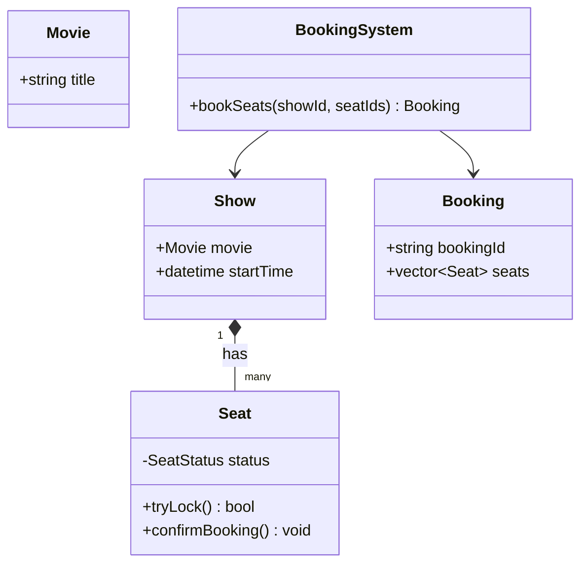

```cpp
class BookingSystem {
public:
    Booking* bookSeats(Show* show, std::vector<std::string> seatIds) {
        std::vector<Seat*> lockedSeats;

        // Try to lock EVERY requested seat
        for (const auto& seatId : seatIds) {
            Seat* seat = show->getSeat(seatId);
            if (!seat->tryLock()) {
                // ❌ Couldn't lock this one — release everything already locked (rollback!)
                for (Seat* s : lockedSeats) s->releaseLock();
                std::cout << "Seat " << seatId << " unavailable. Booking failed.\n";
                return nullptr;
            }
            lockedSeats.push_back(seat);
        }

        // All seats successfully locked — proceed to "payment" (simulated here)
        for (Seat* s : lockedSeats) s->confirmBooking();

        std::cout << "Booking confirmed for " << seatIds.size() << " seat(s).\n";
        return new Booking(lockedSeats);
    }
};
```

**Notice the rollback logic:** if seat 3 of 5 requested seats fails to lock, every seat locked *so far* must be released — otherwise those seats would remain stuck in `LOCKED` limbo even though the overall booking failed. This is the same **compensating-action** principle from the Saga pattern (E-commerce Order Flow, Phase 2; ATM cash dispensing, this file's earlier section) — a partial failure requires explicitly undoing the steps that already succeeded.

---

# Part 2: Builder, Command & State Patterns

## 6. Builder Pattern

### The problem it solves
Some objects have **many optional fields**, and constructing them with a single giant constructor becomes unreadable and error-prone — especially in C++, where constructor arguments are positional, making it easy to accidentally swap two same-typed parameters without any compiler warning.

```cpp
// ❌ Which parameter is which?? Easy to mix up two doubles or two bools by accident.
Show show("Inception", "Screen 3", "18:30", 150, true, false, 12.50);
```

### The idea
Provide a separate `Builder` class with clearly-named methods for setting each optional field, chained together, ending in a `build()` call that produces the final, fully-constructed object.

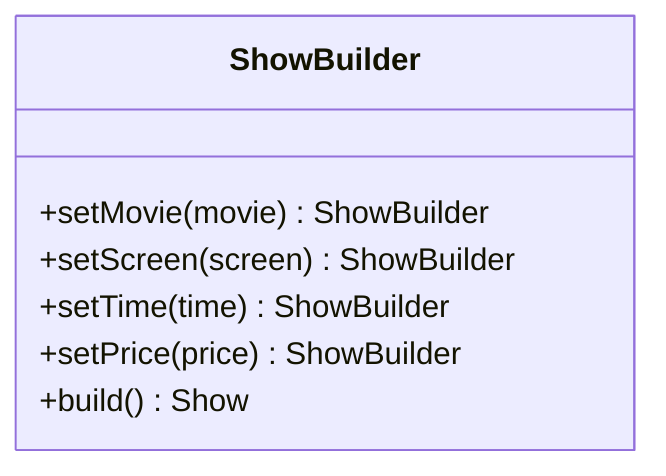

```cpp
class Show {
public:
    std::string movieName;
    std::string screen;
    std::string time;
    double price;
    bool is3D;

private:
    Show() {}  // private — only the Builder can construct one
    friend class ShowBuilder;
};

class ShowBuilder {
private:
    Show show;

public:
    ShowBuilder& setMovie(const std::string& name) {
        show.movieName = name;
        return *this;  // returns a reference to itself, enabling CHAINING
    }
    ShowBuilder& setScreen(const std::string& screen) {
        show.screen = screen;
        return *this;
    }
    ShowBuilder& setTime(const std::string& time) {
        show.time = time;
        return *this;
    }
    ShowBuilder& setPrice(double price) {
        show.price = price;
        return *this;
    }
    ShowBuilder& set3D(bool is3D) {
        show.is3D = is3D;
        return *this;
    }
    Show build() {
        return show;
    }
};

int main() {
    // ✅ Self-documenting, order-independent, hard to misuse:
    Show show = ShowBuilder()
                    .setMovie("Inception")
                    .setScreen("Screen 3")
                    .setTime("18:30")
                    .setPrice(12.50)
                    .set3D(true)
                    .build();
}
```

- **Why it matters:** every field is set through a clearly-named method, so there's no ambiguity about which value means what, fields can be set in **any order**, and optional fields can simply be **skipped** (left at a sensible default) rather than requiring an awkward constructor overload for every possible combination of provided/omitted fields.

---

## 7. Command Pattern — Quick Recap

Already covered in full in the ATM System topic (withdraw/deposit/balance-inquiry as interchangeable, executable objects). The core idea, restated briefly: **wrap a request as an object** with a common `execute()` method, so the caller never needs type-specific conditional logic to invoke different operations.

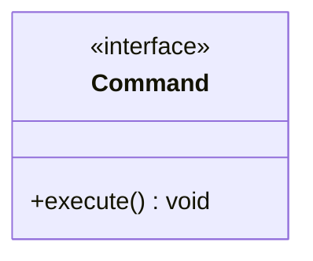

Worth knowing as an extension: Commands can also support an `undo()` method, turning this into a natural fit for **undo/redo functionality** — e.g., a text editor's undo history is a classic real-world application of the Command pattern, storing a stack of executed commands, each capable of reversing itself.

---

## 8. State Pattern — Quick Recap

Already covered in full in the Vending Machine topic (and reused directly for the ATM and this Movie Booking system's seat status, conceptually). The core idea, restated briefly: when an object's **behavior for every action meaningfully changes** depending on its current phase in a lifecycle, model each phase as its own class implementing a shared interface, and let the object **delegate** every action to its current state.

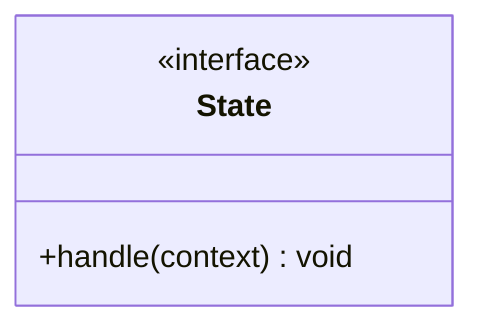

---

## 9. When to Reach for Which

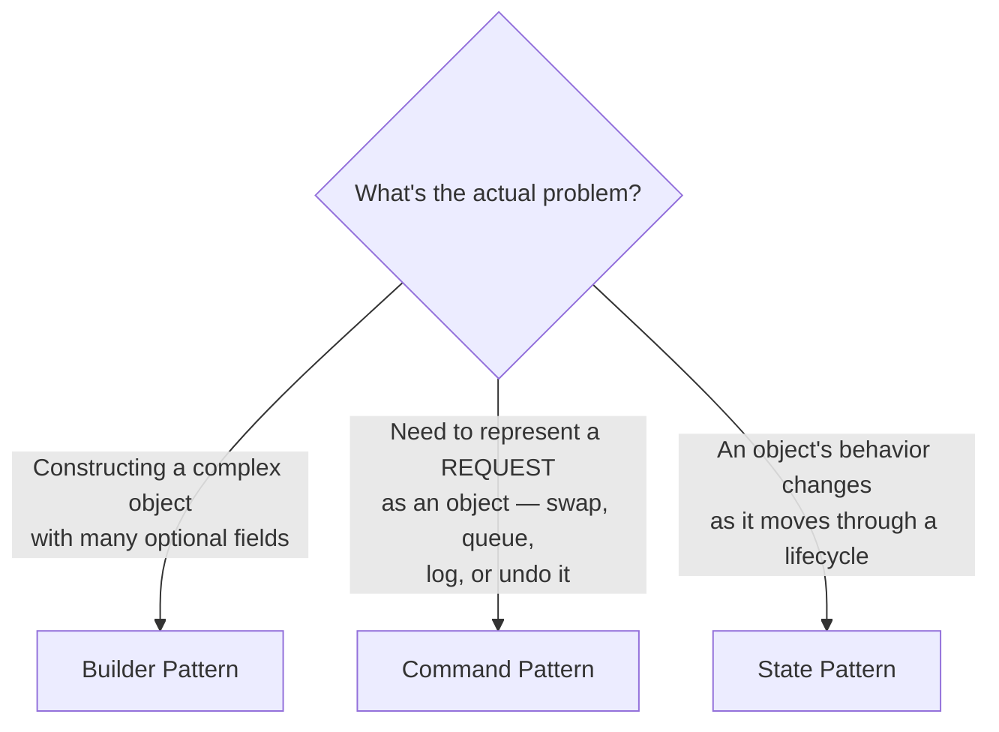

| Pattern | Solves | Seen in this series |
|---|---|---|
| Builder | Complex object construction, many optional fields | This topic — `Show` |
| Command | Representing an action as an object (execute, queue, undo, log) | ATM System — Withdraw/Deposit/BalanceInquiry |
| State | Behavior changing across an object's lifecycle | Vending Machine, ATM, this topic's `Seat` |

---

# Part 3: Thread-Safety Basics

## 10. Why LLD Needs Thread-Safety at All

This entire series has repeatedly surfaced the **same race condition** — the Parking Lot's spot assignment, the E-commerce inventory oversell, the ATM's account debit, and this topic's seat double-booking — precisely because it's the single most common concurrency bug in real systems. This section covers the actual C++ **tools** used to fix it, rather than just naming the problem again.

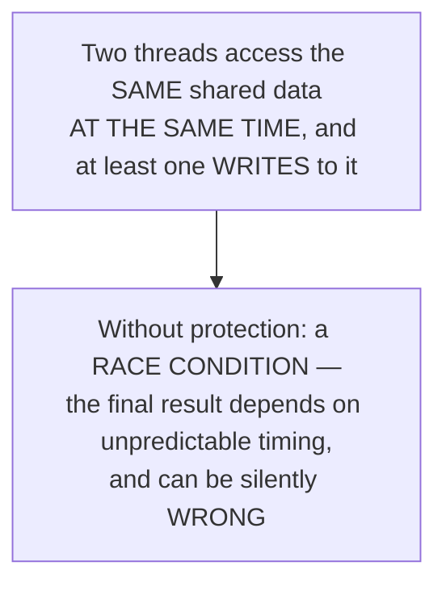

---

## 11. Mutex — the Fundamental Tool

A **mutex** ("mutual exclusion") ensures only **one thread at a time** can execute a given section of code (a "critical section") — any other thread trying to enter must **wait** until the current thread releases it.

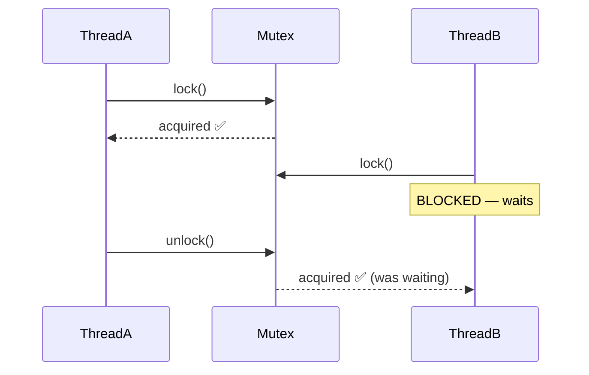

```cpp
#include <mutex>

class Counter {
private:
    int count = 0;
    std::mutex mtx;

public:
    void increment() {
        mtx.lock();
        count++;  // the CRITICAL SECTION — only one thread here at a time
        mtx.unlock();
    }
};
```

**The critical danger with manual `lock()`/`unlock()`:** if an exception is thrown, or if a code path returns early, **between** `lock()` and `unlock()`, the mutex is **never released** — every other thread waiting for it will block **forever**. This is exactly the problem the next section solves.

---

## 12. RAII Locking — lock_guard and unique_lock

C++ solves the "forgot to unlock" problem using **RAII** (Resource Acquisition Is Initialization) — a lock object that automatically releases the mutex when it goes out of scope, **regardless of how** that scope is exited (normal return, early return, or an exception).

```cpp
void Counter::increment() {
    std::lock_guard<std::mutex> lock(mtx);  // locks immediately on construction
    count++;
    // No explicit unlock() needed — the mutex is automatically
    // released when 'lock' goes out of scope, EVEN if an exception
    // is thrown partway through this function
}
```

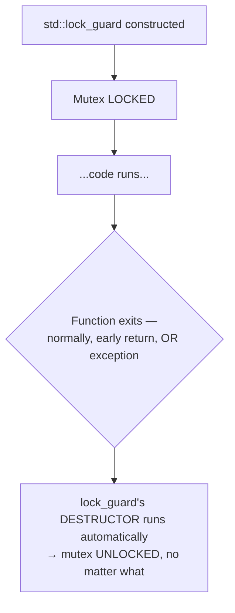

This is exactly the pattern already used silently, without full explanation, throughout this topic's `Seat` class (`std::lock_guard<std::mutex> lock(seatMutex);`) — worth recognizing now that its full mechanism has been explained.

### `unique_lock` — when you need more flexibility
`std::unique_lock` behaves like `lock_guard` but supports additional operations — manually unlocking and re-locking within the same scope, or being used with condition variables (a more advanced synchronization tool, worth knowing exists but beyond this basics-level scope).

```cpp
std::unique_lock<std::mutex> lock(mtx);
// ... some work ...
lock.unlock();  // can manually release EARLY, unlike lock_guard
// ... do something that doesn't need the lock ...
lock.lock();     // and re-acquire it later, still within the same scope
```

**Rule of thumb:** default to `lock_guard` for simple, straightforward locking — reach for `unique_lock` only when you specifically need to unlock early, transfer ownership of the lock, or work with condition variables.

---

## 13. Deadlock — When Locking Goes Wrong

A **deadlock** happens when two (or more) threads each hold a lock the other needs, and neither can proceed — this was already introduced conceptually in Phase 1's Concurrency Control topic; here's what it looks like concretely, with real mutexes.

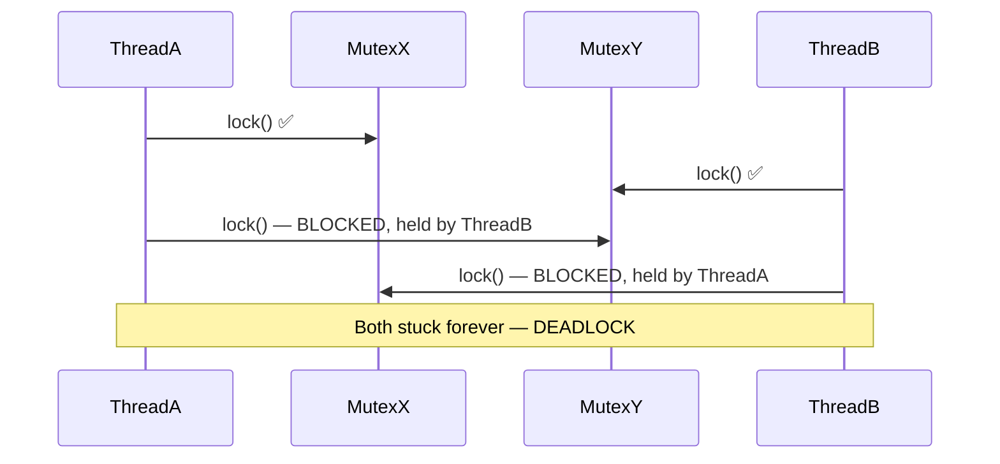

```cpp
// ❌ DEADLOCK RISK: if two threads call this with (accountA, accountB)
// and (accountB, accountA) respectively, they can deadlock
void transfer(Account& from, Account& to, double amount) {
    std::lock_guard<std::mutex> lock1(from.mtx);
    std::lock_guard<std::mutex> lock2(to.mtx);  // could deadlock here
    from.balance -= amount;
    to.balance += amount;
}
```

### The fix: always lock in a consistent, agreed-upon order
```cpp
// ✅ FIX: always lock the mutex belonging to the LOWER account ID first,
// regardless of which parameter position it's passed in — this guarantees
// every thread attempts to acquire locks in the SAME order, making the
// circular-wait scenario above impossible
void transfer(Account& a, Account& b, double amount) {
    Account& first = (a.id < b.id) ? a : b;
    Account& second = (a.id < b.id) ? b : a;

    std::lock_guard<std::mutex> lock1(first.mtx);
    std::lock_guard<std::mutex> lock2(second.mtx);
    // ... perform the transfer ...
}
```

Modern C++ also offers `std::lock()` (or `std::scoped_lock` in C++17+), which can lock multiple mutexes together, **atomically**, specifically to avoid needing to manually reason about ordering:

```cpp
std::scoped_lock lock(first.mtx, second.mtx);  // C++17 — locks BOTH, deadlock-free by design
```

---

## 14. Atomic Variables — a Lighter-Weight Tool

For simple operations on a single variable (like a counter), a full mutex can be unnecessarily heavyweight. `std::atomic` provides lock-free, thread-safe operations on individual variables.

```cpp
#include <atomic>

class Counter {
private:
    std::atomic<int> count{0};

public:
    void increment() {
        count++;  // thread-safe, WITHOUT needing an explicit mutex at all
    }
};
```

**When to use which:** `std::atomic` for simple, single-variable operations (counters, flags); a `mutex` when multiple related pieces of data need to be updated **together, consistently** (like a seat's status *and* its lock timestamp in this topic's `Seat` class) — atomics only protect one variable at a time, not a coordinated group of them.

---

# Part 4: In-Memory File System

## 15. What Are We Actually Building?

A simplified, in-memory model of a file system: directories can contain files and other directories (nested arbitrarily deep), supporting operations like creating, reading, listing, and calculating total size.

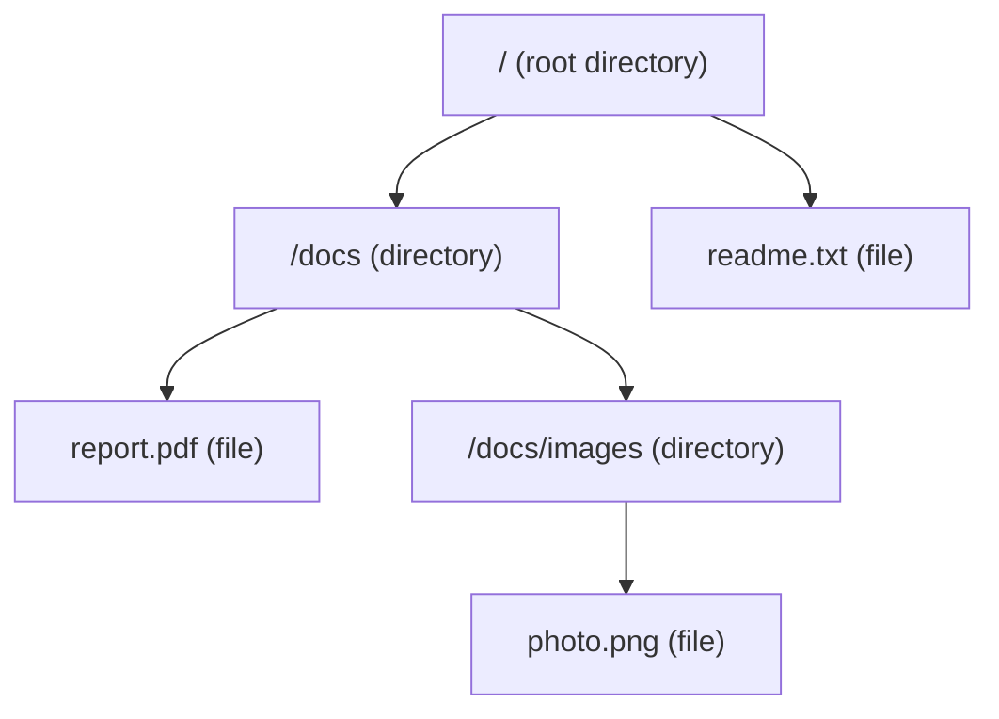

---

## 16. The Core Challenge — Files and Directories Are Fundamentally Different... or Are They?

At first glance, a `File` (has content, a size) and a `Directory` (has children, no content of its own) seem like they need entirely separate handling. But consider a common operation: **"what's the total size of this directory?"** — answering that requires summing the sizes of everything inside it, including files **and** nested subdirectories, uniformly.

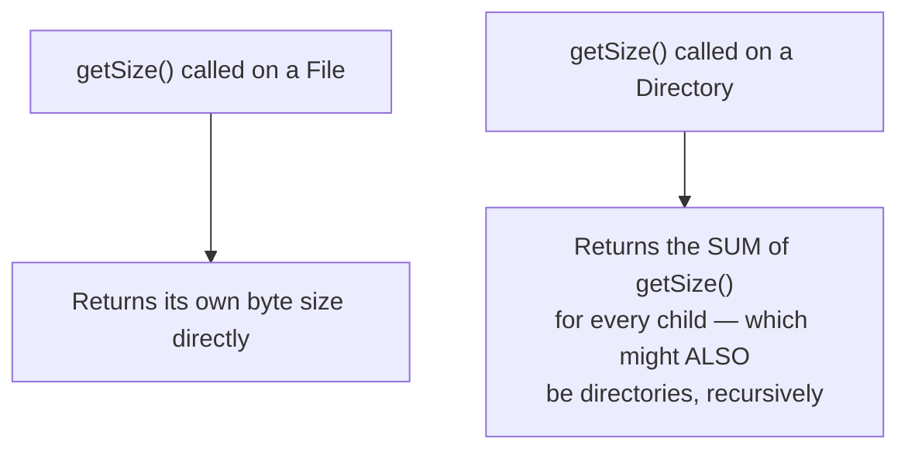

This is the exact same insight as Snake & Ladder's unification of snakes and ladders, applied at a larger scale: **a `File` and a `Directory` can both be treated as "a thing that has a size and a name"** — the interesting design question is how to let `Directory` contain a mix of both `File`s and other `Directory`s **uniformly**, without needing to check "is this a file or a directory?" everywhere in the code.

---

## 17. The Composite Pattern

### The idea
Define a common interface (`FileSystemNode`) that both `File` and `Directory` implement. A `Directory` then simply holds a collection of `FileSystemNode*` — which might individually be `File`s or other `Directory`s, and the calling code **never needs to know or care which**.

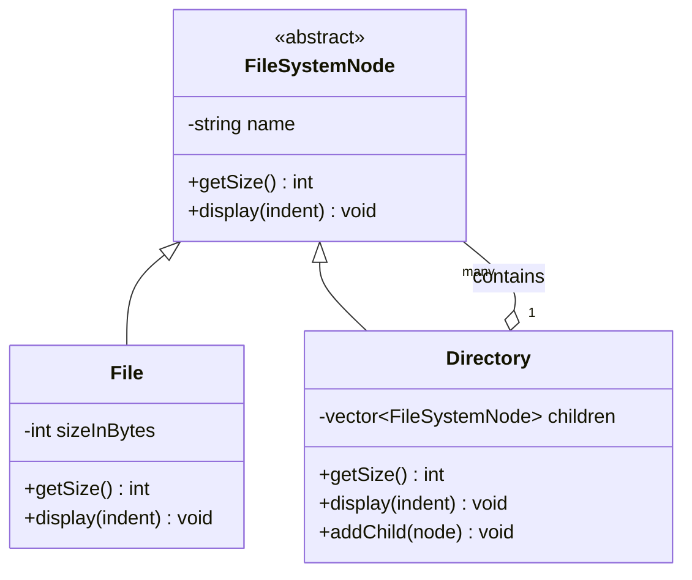

**This is a genuinely new pattern for this series** — worth naming explicitly: this "treat an individual object and a collection of objects uniformly, through the same interface" shape is called the **Composite Pattern**, and it's the standard, textbook solution for any **tree-shaped, part-whole hierarchy** — file systems, UI component trees (a `Panel` containing `Button`s and other `Panel`s), organizational charts, and similar nested structures all fit this same shape.

```cpp
class FileSystemNode {
protected:
    std::string name;
public:
    FileSystemNode(std::string n) : name(n) {}
    virtual int getSize() const = 0;
    virtual void display(int indent) const = 0;
    virtual ~FileSystemNode() {}
    std::string getName() const { return name; }
};

class File : public FileSystemNode {
private:
    int sizeInBytes;
public:
    File(std::string n, int size) : FileSystemNode(n), sizeInBytes(size) {}

    int getSize() const override {
        return sizeInBytes;  // a File's size is just... its own size
    }

    void display(int indent) const override {
        std::cout << std::string(indent, ' ') << name << " (" << sizeInBytes << " bytes)\n";
    }
};

class Directory : public FileSystemNode {
private:
    std::vector<FileSystemNode*> children;
public:
    Directory(std::string n) : FileSystemNode(n) {}

    void addChild(FileSystemNode* node) {
        children.push_back(node);
    }

    int getSize() const override {
        int total = 0;
        for (auto* child : children) {
            total += child->getSize();  // works whether 'child' is a File OR a Directory —
                                          // POLYMORPHISM handles the recursion automatically
        }
        return total;
    }

    void display(int indent) const override {
        std::cout << std::string(indent, ' ') << name << "/\n";
        for (auto* child : children) {
            child->display(indent + 2);  // again, works uniformly for File or Directory
        }
    }
};
```

### Why this is the right shape for the problem
- `Directory::getSize()` doesn't need an `if (child is a File) ... else if (child is a Directory) ...` check anywhere — it just calls `child->getSize()`, and polymorphism (recall OOP Fundamentals) automatically routes to the correct implementation, **recursively**, no matter how deeply nested the structure is.
- Adding a brand-new node type later (e.g., a `SymbolicLink`) is, once again, the same Open/Closed win seen throughout this series: implement `FileSystemNode`, and it slots directly into any existing `Directory` without touching `Directory`'s code at all.

---

## 18. Implementing Core Operations

```cpp
class Directory : public FileSystemNode {
    // ... (previous members) ...
public:
    FileSystemNode* find(const std::string& targetName) {
        for (auto* child : children) {
            if (child->getName() == targetName) return child;

            // If the child is ITSELF a directory, search inside it too (recursive search)
            Directory* subDir = dynamic_cast<Directory*>(child);
            if (subDir != nullptr) {
                FileSystemNode* found = subDir->find(targetName);
                if (found != nullptr) return found;
            }
        }
        return nullptr;
    }
};
```

- **A quick, honest caveat on `dynamic_cast` here:** using it to check "is this specifically a `Directory`?" is a reasonable, common pattern for a recursive search like this, but reaching for `dynamic_cast` frequently throughout a design is often a mild code smell — it suggests the base interface might be missing a method that could handle this more polymorphically. For an in-memory file system specifically, this particular, limited use (only for recursive traversal) is a widely accepted, pragmatic tradeoff.

---

## 19. Full Class Diagram & Working Example

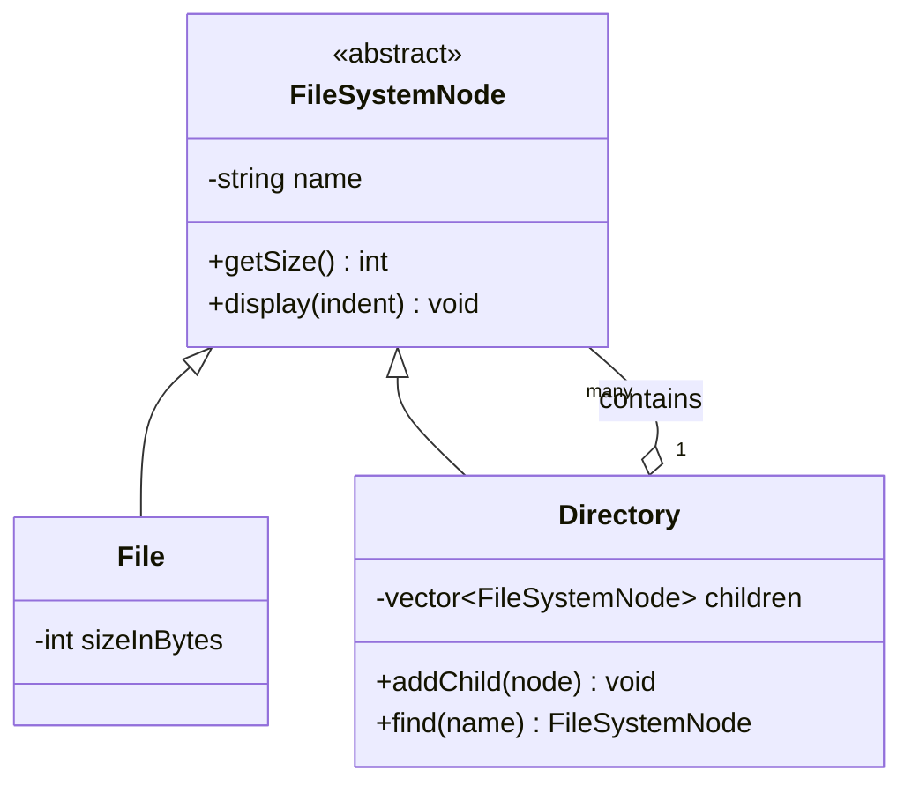

```cpp
int main() {
    Directory* root = new Directory("/");
    Directory* docs = new Directory("docs");
    File* readme = new File("readme.txt", 500);
    File* report = new File("report.pdf", 2000);

    root->addChild(readme);
    root->addChild(docs);
    docs->addChild(report);

    root->display(0);
    // /
    //   readme.txt (500 bytes)
    //   docs/
    //     report.pdf (2000 bytes)

    std::cout << "Total size: " << root->getSize() << " bytes\n";  // 2500 — computed RECURSIVELY
}
```

---

# Wrap-up

## 20. How to Walk Through These in an Interview

### Movie Ticket Booking
> "The core challenge is preventing double-booking under concurrent access — the same lost-update problem seen in the Parking Lot and e-commerce inventory designs — so I'd make each seat's lock-check-and-set an atomic operation, protected by its own mutex. I'd also add a lock timeout, since a user abandoning a booking shouldn't permanently strand seats in a locked state, and if locking multiple seats for one booking partially fails, I'd roll back and release everything already locked, the same compensating-action principle as a Saga."

### Builder/Command/State
> "I'd reach for Builder when constructing an object with many optional fields, since it avoids an unreadable, error-prone constructor with many positional parameters. Command and State solve different problems that can look superficially similar — Command wraps a requested action as an object, useful for queuing, logging, or undo; State represents an object's behavior changing as it progresses through a lifecycle, which is what I used for the Vending Machine and ATM."

### Thread-Safety
> "For simple shared counters, I'd use `std::atomic`; for coordinated updates across multiple related fields, I'd use a mutex, always through RAII wrappers like `lock_guard`, so a lock is never accidentally left held if an exception is thrown. To avoid deadlocks when multiple locks are needed together, I'd either lock them in a consistent, agreed-upon order every time, or use `std::scoped_lock`, which locks multiple mutexes atomically and avoids the ordering problem entirely."

### In-Memory File System
> "Files and directories both need a size and a name, and a directory's size is really just the sum of its children's sizes — whether those children are files or further directories — so I'd use the Composite pattern: a shared `FileSystemNode` interface implemented by both `File` and `Directory`, letting `getSize()` recurse naturally through polymorphism without any type-checking logic anywhere in the traversal."

---

## 21. Quick Recall Cheat Sheet

```mermaid
mindmap
  root((4-Topic Combo))
    Movie Booking
      Same lost-update problem, 3rd time in this series
      Atomic tryLock per seat
      Lock timeout + rollback on partial failure
    Builder
      Many optional fields, chained setters
      Solves unreadable positional constructors
    Command and State recap
      Command - action as an object
      State - behavior changes across lifecycle
    Thread-Safety
      mutex + lock_guard/unique_lock RAII
      Deadlock - fix with consistent lock order or scoped_lock
      atomic for simple single-variable ops
    In-Memory File System
      Composite Pattern
      File and Directory share ONE interface
      getSize() recurses via polymorphism, no type-checks
```

| If you remember only 5 things |
|---|
| 1. Movie seat booking is the same lost-update race condition seen throughout this series — fix with an atomic check-and-lock per seat, plus a timeout and rollback for partial failures. |
| 2. Use the Builder pattern for objects with many optional fields — chained, named setter methods avoid unreadable, error-prone positional constructors. |
| 3. Always prefer RAII locking (`lock_guard`/`unique_lock`) over manual `lock()`/`unlock()` — a mutex left locked due to an early return or exception causes every other thread to block forever. |
| 4. Prevent deadlocks by always acquiring multiple locks in a consistent order, or use `std::scoped_lock`, which locks several mutexes atomically without needing manual ordering. |
| 5. The Composite Pattern lets a `File` and a `Directory` share one interface, so operations like `getSize()` recurse naturally through polymorphism — no `if (is file) else if (is directory)` checks anywhere. |

---

*This file is written in GitHub-flavored Markdown with Mermaid diagrams and C++ code — it will render natively on GitHub, GitLab, and most modern Markdown viewers.*
